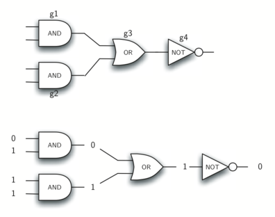
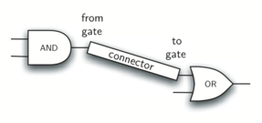

# 1.13. Python中的面向对象编程：定义类

**1.13. Object-Oriented Programming in Python: Defining Classes**

=== "中文"

    我们之前说过Python是一种面向对象的编程语言。 到目前为止，我们已经使用了许多内置类来展示数据和控制结构的示例。 面向对象编程语言中最强大的功能之一是能够允许程序员（问题解决者）创建新类来对解决问题所需的数据进行建模。
    
    请记住，我们使用抽象数据类型来提供数据对象的外观（其状态）及其功能（其**方法**）的逻辑描述。 通过构建实现抽象数据类型的类，程序员可以利用抽象过程，同时提供在程序中实际使用抽象所需的详细信息。 每当我们想要实现抽象数据类型时，我们都会使用一个新类来实现。

=== "英文"

    We stated earlier that Python is an object-oriented programming language. So far, we have used a number of built-in classes to show examples of data and control structures. One of the most powerful features in an object-oriented programming language is the ability to allow a programmer (problem solver) to create new classes that model data that is needed to solve the problem.

    Remember that we use abstract data types to provide the logical description of what a data object looks like (its state) and what it can do (its **methods**). By building a class that implements an abstract data type, a programmer can take advantage of the abstraction process and at the same time provide the details necessary to actually use the abstraction in a program. Whenever we want to implement an abstract data type, we will do so with a new class.

## 1.13.1. 一个分数类

**1.13.1. A Fraction Class**

=== "中文"

    显示实现用户定义类的细节的一个非常常见的示例是构造一个类来实现抽象数据类型“Fraction”。 我们已经看到Python提供了许多数字类供我们使用。 然而，有时最合适的做法是能够创建对用户来说看起来像分数的数据对象。
    
    诸如 $\frac {3}{5}$ 之类的分数由两部分组成。 最上面的值称为分子，可以是任何整数。 底部的值称为分母，可以是任何大于 0 的整数（负分数的分子为负）。 尽管可以为任何分数创建浮点近似值，但在这种情况下，我们希望将分数表示为精确值。
    
    “Fraction” 类型的操作将允许“Fraction” 数据对象的行为与任何其他数值相同。 我们需要能够进行分数的加、减、乘、除运算。 我们还希望能够使用标准的“斜杠”形式显示分数，例如 3/5。 此外，所有分数方法都应以最低项返回结果，以便无论执行什么计算，我们总是会得到最常见的形式。
    
    在Python中，我们通过提供一个名称和一组语法上与函数定义类似的方法定义来定义一个新类。 对于这个例子，
    
    ```python
    class Fraction:
        # the methods go here
    ```
    
    为我们定义方法提供了框架。 所有类都应该提供的第一个方法是构造函数。 构造函数定义了创建数据对象的方式。 要创建“Fraction”对象，我们需要提供两个数据，分子和分母。 在 Python 中，构造函数方法始终称为`__init__`（“init”前后各有两个下划线），如“清单 2”所示。
    
    **清单 2**
    
    ```python
    class Fraction:
        """Class Fraction"""
        def __init__(self, top, bottom):
            """Constructor definition"""
            self.num = top
            self.den = bottom
    ```
    
    请注意，形式参数列表包含三个项目（“self”、“top”、“bottom”）。 “self” 是一个特殊参数，始终用作对象本身的引用。 它必须始终是第一个形式参数； 然而，在调用时永远不会给它一个实际的参数值。 如前所述，分数需要两个状态数据：分子和分母。 构造函数中的符号“self.num”将“Fraction”对象定义为具有一个名为“num”的内部数据对象作为其状态的一部分。 同样，“self.den”创建分母。 两个形式参数的值最初分配给状态，允许新的“Fraction”对象知道其起始值。
    
    要创建“Fraction”类的实例，我们必须调用构造函数。 这是通过使用类的名称并传递必要状态的实际值来实现的（请注意，我们从不直接“调用(invoke) `__init__` ”）。 例如，
    
    ```python
        my_fraction = Fraction(3, 5)
    ```
    
    创建一个名为 ``my_fraction`` 的对象，表示分数 $`\frac {3}{5}$ （五分之三）。 “图 5”显示了该对象现在的实现情况。
    
    <figure markdown>
      
      <figcaption>图 5：“Fraction”类的实例</figcaption>
    </figure>
    
    接下来我们需要做的是实现抽象数据类型所需的行为。 首先，考虑一下当我们尝试打印“Fraction”对象时会发生什么。
    
    ```python
    >>> my_fraction = Fraction(3, 5)
    >>> print(my_fraction)
    <__main__.Fraction object at 0x103203eb8>
    ```
    
    “Fraction” 对象“my_fraction” 不知道如何响应此打印请求。 “print”函数要求对象将自身转换为字符串，以便可以将该字符串写入输出。 my_fraction 唯一的选择是显示存储在变量中的实际引用（地址本身）。 这不是我们想要的。
    
    我们有两种方法可以解决这个问题。 一种是定义一个名为“show”的方法，该方法允许“Fraction”对象将其自身打印为字符串。 我们可以实现这个方法，如“清单 3”所示。 如果我们像以前一样创建一个“Fraction”对象，我们可以要求它显示自己（换句话说，以正确的格式打印自己）。 不幸的是，这通常不起作用。 为了使打印正常工作，我们需要告诉“Fraction”类如何将其自身转换为字符串。 这就是“print”函数完成其工作所需要的。
    
    **清单 3**
    
    ```python
    def show(self):
        print(f"{self.num}/{self.den}")
    ```
    
    ```pycon
    >>> my_fraction = Fraction(3, 5)
    >>> my_fraction.show()
    3/5
    >>> print(my_fraction)
    <__main__.Fraction object at 0x40bce9ac>
    ```
    
    在Python中，所有类都提供了一组标准方法，但这些方法可能无法正常工作。 其中之一`__str__`是将对象转换为字符串的方法。 正如我们已经看到的，此方法的默认实现是返回实例地址字符串。 我们需要做的是为这个方法提供一个更好的实现。 我们会说这个实现**覆盖(overrides)**前一个实现，或者它重新定义了方法的行为。
    
    为此，我们只需定义一个名为`__str__`的方法，并为其提供一个新的实现，如“清单 4”所示。 除了特殊参数“self”之外，这个定义不需要任何其他信息。 反过来，该方法将通过将每段内部状态数据转换为字符串，然后使用字符串连接在字符串之间放置“/”字符来构建字符串表示形式。 每当要求“Fraction”对象将其自身转换为字符串时，都会返回结果字符串。 请注意该函数的各种使用方式。
    
    **清单 4**
    
    ```python
    def __str__(self):
        return f"{self.num}/{self.den}"
    ```
    
    ```pycon
    >>> my_fraction = Fraction(3, 5)
    >>> print(my_fraction)
    3/5
    >>> print(f"I ate {my_fraction} of pizza")
    I ate 3/5 of pizza
    >>> my_fraction.__str__()
    '3/5'
    >>> str(my_fraction)
    '3/5'
    ```
    
    我们可以为新的“Fraction”类重写许多其他方法。 其中最重要的一些是基本算术运算。 我们希望能够创建两个“Fraction”对象，然后使用标准“+”符号将它们加在一起。 此时，如果我们尝试将两个分数相加，我们会得到以下结果：
    
    ```pycon
    >>> f1 = Fraction(1, 4)
    >>> f2 = Fraction(1, 2)
    >>> f1 + f2
    Traceback (most recent call last):
    File "<stdin>", line 1, in <module>
    TypeError: unsupported operand type(s) for +: 'Fraction' and 'Fraction'
    ```
    
    如果仔细观察该错误，您会发现问题在于“+”运算符不理解“Fraction”操作数。 我们可以通过为“Fraction”类提供一个覆盖加法方法的方法来解决这个问题。 在Python中，这个方法被称为``__add__``，它需要两个参数。 第一个“self”始终是必需的，第二个表示表达式中的另一个操作数。 例如，
    
    ```python
    f1.__add__(f2)
    ```
    
    会要求 ``Fraction`` 对象 ``f1`` 将 ``Fraction`` 对象 ``f2`` 添加到自身。 这可以用标准符号`f1 + f2`来写。
    
    两个分数必须具有相同的分母才能相加。 确保它们具有相同分母的最简单方法是简单地使用两个分母的乘积作为公分母，以便 $\frac {a}{b} + \frac {c}{d} = \frac {ad}{bd} + \frac {cb}{bd} = \frac{ad+cb}{bd}$。 其实现如“清单 5”所示。 加法函数返回一个新的“Fraction”对象，其中包含总和的分子和分母。 我们可以通过编写包含分数的标准算术表达式，分配加法结果，然后打印结果来使用此方法。
    
    **清单 5**
    
    ```python
    def __add__(self, other_fraction):
        new_num = self.num *other_fraction.den + \
                    self.den* other_fraction.num
        new_den = self.den * other_fraction.den
    
        return Fraction(new_num, new_den)
    ```
    
    ```pycon
    >>> f1 = Fraction(1, 4)
    >>> f2 = Fraction(1, 2)
    >>> print(f1 + f2)
    6/8
    ```
    
    加法方法如我们所愿，但有一点可以做得更好。 请注意，$6/8$ 是正确的结果 ($\frac {1}{4} + \frac {1}{2}$)，但它不是“最低项”表示形式。 最好的代表是 $3/4$。 为了确保我们的结果始终是最低的，我们需要一个知道如何减少分数的辅助函数。 该函数需要寻找**最大公约数**（GCD）。 然后我们可以将分子和分母除以 GCD，结果将简化为最低项。
    
    寻找最大公约数的最著名算法是欧几里得算法，该算法将在第 8 章中详细讨论。它指出两个整数 $m$ 和 $n$ 的最大公约数是 $n$，如果 $n$ 平分$m$。 但是，如果 $n$ 不能整除 $m$，则答案是 $n$ 的最大公约数和 $m$ 除以 $n$ 的余数。 我们将在这里简单地提供一个迭代实现（参见“ActiveCode 1”）。 请注意，GCD 算法的这种实现仅在分母为正时才有效。 这对于我们的分数类是可以接受的，因为我们已经说过负分数将由负分子表示。
    
    ```python title="最大公约数函数"
    
    def gcd(m, n):
        while m % n != 0:
            m, n = n, m % n
        return n

    print(gcd(20, 10))
    ```
    
    现在我们可以使用这个函数来帮助减少任何分数。 为了将分数转化为最简形式，我们将分子和分母除以它们的最大公约数。 因此，对于分数 $6/8$，最大公约数是 2。将顶部和底部除以 2 创建一个新分数 $3/4$（参见“清单 6”）。
    
    **清单 6**
    
    ```python
    def __add__(self, other_fraction):
        new_num = self.num * other_fraction.den + \
                        self.den * other_fraction.num
        new_den = self.den * other_fraction.den
        common = gcd(new_num, new_den)
        return Fraction(new_num // common, new_den // common)
    ```
    
    我们的“Fraction”对象现在有两个非常有用的方法，如“图 6”所示。
    
    <figure markdown>
      
      <figcaption>图 6：具有两个方法的“Fraction”类的实例</figcaption>
    </figure>
    
    ```pycon
    >>> f1 = Fraction(1, 4)
    >>> f2 = Fraction(1, 2)
    >>> print(f1 + f2)
    3/4
    ```
    
    我们需要在示例“Fraction”类中包含的另一组方法将允许两个分数相互比较。 假设我们有两个“Fraction”对象，“f1”和“f2”。 仅当它们是对同一对象的引用时，“f1==f2”才会为“True”。 在此实现下，具有相同分子和分母的两个不同对象将不相等。 这称为**浅平等**（参见“图 7”）。
    
    <figure markdown>
      
      <figcaption>图 7：浅层平等与深度平等</figcaption>
    </figure>
    
    我们可以通过重写`__eq__`方法来创建**深度相等(deep equality)**——通过相同的值而不是相同的引用来相等（参见“图7”）。 `__eq__` 方法是任何类中可用的另一个标准方法。 `__eq__` 方法比较两个对象，如果它们的值相同则返回“True”，否则返回“False”。
    
    在“Fraction”类中，我们可以通过再次将两个分数放入常用项中，然后比较分子来实现`__eq__`方法（参见“清单 7”）。 值得注意的是，还有其他可以被覆盖的关系运算符。 例如，``__le__`` 方法提供小于或等于功能。
    
    **清单 7**
    
    ```python
    def __eq__(self, other_fraction):
        first_num = self.num * other_fraction.den
        second_num = other_fraction.num * self.den
    
        return first_num == second_num
    ```
    
    到目前为止，完整的“Fraction”类显示在“ActiveCode 2”中。 我们将剩下的算术和关系方法留作练习。
    
    ```python title="分数类"
    def gcd(m, n):
        while m % n != 0:
            m, n = n, m % n
        return n
    
    class Fraction:
        def __init__(self, top, bottom):
            self.num = top
            self.den = bottom
    
        def __str__(self):
            return "{:d}/{:d}".format(self.num, self.den)
    
        def __eq__(self, other_fraction):
            first_num = self.num * other_fraction.den
            second_num = other_fraction.num * self.den
    
            return first_num == second_num
    
        def __add__(self, other_fraction):
            new_num = self.num * other_fraction.den \
            + self.den * other_fraction.num
            new_den = self.den * other_fraction.den
            cmmn = gcd(new_num, new_den)
            return Fraction(new_num // cmmn, new_den // cmmn)
    
        def show(self):
            print("{:d}/{:d}".format(self.num, self.den))
    
    x = Fraction(1, 2)
    x.show()
    y = Fraction(2, 3)
    print(y)
    print(x + y)
    print(x == y)
    ```
    
    !!! info "自检"
    
        为了确保您了解如何在 Python 类中实现运算符以及如何正确编写方法，请编写一些方法来实现 ``*, /,`` 和 ``-`` 。 还实现比较运算符 `>` 和 `<`
    
    <iframe width="560" height="315" src="https://www.youtube.com/embed/gFb9tvJZHXo" title="fraction" frameborder="0" allow="accelerometer; autoplay; clipboard-write; encrypted-media; gyroscope; picture-in-picture; web-share" allowfullscreen></iframe>
    

=== "英文"

    A very common example to show the details of implementing a user-defined class is to construct a class to implement the abstract data type ``Fraction``. We have already seen that Python provides a number of numeric classes for our use. There are times, however, that it would be most appropriate to be able to create data objects that look like fractions to the user.

    A fraction such as $\frac {3}{5}$ consists of two parts. The top value, known as the numerator, can be any integer. The bottom value, called the denominator, can be any integer greater than 0 (negative fractions have a negative numerator). Although it is possible to create a floating point approximation for any fraction, in this case we would like to represent the fraction as an exact value.

    The operations for the ``Fraction`` type will allow a ``Fraction`` data object to behave like any other numeric value. We need to be able to add, subtract, multiply, and divide fractions. We also want to be able to show fractions using the standard “slash” form, for example 3/5. In addition, all fraction methods should return results in their lowest terms so that no matter what computation is performed, we always end up with the most common form.

    In Python, we define a new class by providing a name and a set of method definitions that are syntactically similar to function definitions. For this example,

    ```python
        class Fraction:
        # the methods go here
    ```

    provides the framework for us to define the methods. The first method that all classes should provide is the constructor. The constructor defines the way in which data objects are created. To create a ``Fraction`` object, we will need to provide two pieces of data, the numerator and the denominator. In Python, the constructor method is always called __init__ (two underscores before and after ``init``), as shown in `Listing 2`.

    .. _lst_pyconstructor:

    **Listing 2**

    ```python
        class Fraction:
            """Class Fraction"""
            def __init__(self, top, bottom):
                """Constructor definition"""
                self.num = top
                self.den = bottom
    ```

    Notice that the formal parameter list contains three items (``self``, ``top``, ``bottom``). ``self`` is a special parameter that will always be used as a reference back to the object itself. It must always be the first formal parameter; however, it will never be given an actual parameter value upon invocation. As described earlier, fractions require two pieces of state data, the numerator and the denominator. The notation ``self.num`` in the constructor defines the ``Fraction`` object to have an internal data object called ``num`` as part of its state. Likewise, ``self.den`` creates the denominator. The values of the two formal parameters are initially assigned to the state, allowing the new ``Fraction`` object to know its starting value.

    To create an instance of the ``Fraction`` class, we must invoke the constructor. This happens by using the name of the class and passing actual values for the necessary state (note that we never directly ``invoke __init__``). For example,

    ```python
        my_fraction = Fraction(3, 5)
    ```

    creates an object called ``my_fraction`` representing the fraction $`\frac {3}{5}$ (three-fifths). `Figure 5` shows this object as it is now implemented.

    <figure markdown>
    
    <figcaption>Figure 5: An Instance of the ``Fraction`` Class</figcaption>
    </figure>

    The next thing we need to do is implement the behavior that the abstract data type requires. To begin, consider what happens when we try to print a ``Fraction`` object.

    ```python
    >>> my_fraction = Fraction(3, 5)
    >>> print(my_fraction)
    <__main__.Fraction object at 0x103203eb8>
    ```

    The ``Fraction`` object, ``my_fraction``, does not know how to respond to this request to print. The ``print`` function requires that the object convert itself into a string so that the string can be written to the output. The only choice ``my_fraction`` has is to show the actual reference that is stored in the variable (the address itself). This is not what we want.

    There are two ways we can solve this problem. One is to define a method called ``show`` that will allow the ``Fraction`` object to print itself as a string. We can implement this method as shown in `Listing 3`. If we create a ``Fraction`` object as before we can ask it to show itself (in other words, print itself  in the proper format). Unfortunately, this does not work in general. In order to make printing work properly, we need to tell the ``Fraction`` class how to convert itself into a string. This is what the ``print`` function needs in order to do its job.

    **Listing 3**

    ```python
        def show(self):
                print(f"{self.num}/{self.den}")
    ```

    ```pycon
        >>> my_fraction = Fraction(3, 5)
        >>> my_fraction.show()
        3/5
        >>> print(my_fraction)
        <__main__.Fraction object at 0x40bce9ac>
    ```

    In Python, all classes have a set of standard methods that are provided but may not work properly. One of these, ``__str__``, is the method to convert an object into a string. The default implementation for this method is to return the instance address string as we have already seen. What we need to do is provide a better implementation for this method. We will say that this implementation __overrides__ the previous one, or that it redefines the method’s behavior.

    To do this, we simply define a method with the name ``__str__`` and give it a new implementation as shown in `Listing 4`. This definition does not need any other information except the special parameter ``self``. In turn, the method will build a string representation by converting each piece of internal state data to a string and then placing a ``/`` character in between the strings using string concatenation. The resulting string will be returned any time a ``Fraction`` object is asked to convert itself to a string. Notice the various ways that this function is used.

    **Listing 4**

    ```python
        def __str__(self):
            return f"{self.num}/{self.den}"
    ```

    ```pycon
    >>> my_fraction = Fraction(3, 5)
    >>> print(my_fraction)
    3/5
    >>> print(f"I ate {my_fraction} of pizza")
    I ate 3/5 of pizza
    >>> my_fraction.__str__()
    '3/5'
    >>> str(my_fraction)
    '3/5'
    ```

    We can override many other methods for our new ``Fraction`` class. Some of the most important of these are the basic arithmetic operations. We would like to be able to create two ``Fraction`` objects and then add them together using the standard ``+`` notation. At this point, if we try to add two fractions, we get the following:

    ```pycon
        >>> f1 = Fraction(1, 4)
        >>> f2 = Fraction(1, 2)
        >>> f1 + f2
        Traceback (most recent call last):
        File "<stdin>", line 1, in <module>
        TypeError: unsupported operand type(s) for +: 'Fraction' and 'Fraction'
    ```

    If you look closely at the error, you see that the problem is that the ``+`` operator does not understand the ``Fraction`` operands. We can fix this by providing the ``Fraction`` class with a method that overrides the addition method. In Python, this method is called ``__add__`` and it requires two parameters. The first, ``self``, is always needed, and the second represents the other operand in the expression. For example,

    ```python
        f1.__add__(f2)
    ```

    would ask the ``Fraction`` object ``f1`` to add the ``Fraction`` object
    ``f2`` to itself. This can be written in the standard notation,
    ``f1 + f2``.

    Two fractions must have the same denominator to be added. The easiest way to make sure they have the same denominator is to simply use the product of the two denominators as a common denominator so that $\frac {a}{b} + \frac {c}{d} = \frac {ad}{bd} + \frac {cb}{bd} = \frac{ad+cb}{bd}$. The implementation is shown in `Listing 5`. The addition function returns a new ``Fraction`` object with the numerator and denominator of the sum. We can use this method by writing a standard arithmetic expression involving fractions, assigning the result of the addition, and then printing our result.

    .. _lst_addmethod:

    **Listing 5**

    ```python
    def __add__(self, other_fraction):
        new_num = self.num *other_fraction.den + \
                    self.den* other_fraction.num
        new_den = self.den * other_fraction.den

        return Fraction(new_num, new_den)
    ```

    ```pycon
        >>> f1 = Fraction(1, 4)
        >>> f2 = Fraction(1, 2)
        >>> print(f1 + f2)
        6/8
    ```

    The addition method works as we desire, but one thing could be better. Note that $6/8$ is the correct result ($\frac {1}{4} + \frac {1}{2}$) but that it is not in the “lowest terms” representation. The best representation would be $3/4$. In order to be sure that our results are always in the lowest terms, we need a helper function that knows how to reduce fractions. This function will need to look for the greatest common divisor, or GCD. We can then divide the numerator and the denominator by the GCD and the result will be reduced to lowest terms.

    The best-known algorithm for finding the greatest common divisor is Euclid’s algorithm, which will be discussed in detail in Chapter 8. It states that the greatest common divisor of two integers $m$ and $n$ is $n$ if $n$ divides $m$ evenly. However, if $n$ does not divide $m$ evenly, then the answer is the greatest common divisor of $n$ and the remainder of $m$ divided by $n$. We will simply provide an iterative implementation here (see `ActiveCode 1`). Note that this implementation of the GCD algorithm works only when the denominator is positive. This is acceptable for our fraction class because we have said that a negative fraction will be represented by a negative numerator.

    ```python title="The Greatest Common Divisor Function"

        def gcd(m, n):
            while m % n != 0:
                m, n = n, m % n
            return n

        print(gcd(20, 10))
    ```

    Now we can use this function to help reduce any fraction. To put a fraction in lowest terms, we will divide the numerator and the denominator by their greatest common divisor. So, for the fraction $6/8$, the greatest common divisor is 2. Dividing the top and the bottom by 2 creates a new fraction, $3/4$ (see `Listing 6`).

    **Listing 6**

    ```python
    def __add__(self, other_fraction):
        new_num = self.num * other_fraction.den + \
                        self.den * other_fraction.num
        new_den = self.den * other_fraction.den
        common = gcd(new_num, new_den)
        return Fraction(new_num // common, new_den // common)
    ```

    Our ``Fraction`` object now has two very useful methods as depicted in `Figure 6`.

    <figure markdown>
    
    <figcaption>Figure 6: An Instance of the ``Fraction`` Class with Two Methods</figcaption>
    </figure>

    ```pycon
    >>> f1 = Fraction(1, 4)
    >>> f2 = Fraction(1, 2)
    >>> print(f1 + f2)
    3/4
    ```

    An additional group of methods that we need to include in our example ``Fraction`` class will allow two fractions to compare themselves to one another. Assume we have two ``Fraction`` objects, ``f1`` and ``f2``. ``f1==f2`` will only be ``True`` if they are references to the same object. Two different objects with the same numerators and denominators would not be equal under this implementation. This is called __shallow equality__ (see `Figure 7`).

    <figure markdown>
    
    <figcaption>Figure 7: Shallow Equality Versus Deep Equality</figcaption>
    </figure>

    We can create __deep equality__–equality by the same value, not the same reference–by overriding the ``__eq__`` method (see `Figure 7`). The ``__eq__`` method is another standard method available in any class. The ``__eq__`` method compares two objects and returns ``True`` if their values are the same, ``False`` otherwise.

    In the ``Fraction`` class, we can implement the ``__eq__`` method by again putting the two fractions in common terms and then comparing the numerators (see `Listing 7`). It is important to note that there are other relational operators that can be overridden. For example, the ``__le__`` method provides the less than or equal functionality.

    **Listing 7**

    ```python
    def __eq__(self, other_fraction):
        first_num = self.num * other_fraction.den
        second_num = other_fraction.num * self.den

        return first_num == second_num
    ```

    The complete ``Fraction`` class, up to this point, is shown in `ActiveCode 2`. We leave the remaining arithmetic and relational methods as exercises.

    ```python title="The Fraction Class"
    def gcd(m, n):
        while m % n != 0:
            m, n = n, m % n
        return n

    class Fraction:
        def __init__(self, top, bottom):
            self.num = top
            self.den = bottom

        def __str__(self):
            return "{:d}/{:d}".format(self.num, self.den)

        def __eq__(self, other_fraction):
            first_num = self.num * other_fraction.den
            second_num = other_fraction.num * self.den

            return first_num == second_num

        def __add__(self, other_fraction):
            new_num = self.num * other_fraction.den \
            + self.den * other_fraction.num
            new_den = self.den * other_fraction.den
            cmmn = gcd(new_num, new_den)
            return Fraction(new_num // cmmn, new_den // cmmn)

        def show(self):
            print("{:d}/{:d}".format(self.num, self.den))

    x = Fraction(1, 2)
    x.show()
    y = Fraction(2, 3)
    print(y)
    print(x + y)
    print(x == y)
    ```

    !!! info "Self  Check"

        To make sure you understand how operators are implemented in Python classes, and how to properly write methods, write some methods to implement ``*, /,`` and ``-`` .  Also implement comparison operators > and <

    <iframe width="560" height="315" src="https://www.youtube.com/embed/gFb9tvJZHXo" title="fraction" frameborder="0" allow="accelerometer; autoplay; clipboard-write; encrypted-media; gyroscope; picture-in-picture; web-share" allowfullscreen></iframe>

## 1.13.2. 继承：逻辑门和电路

**1.13.2. Inheritance: Logic Gates and Circuits**

=== "中文"

    我们的最后一节将介绍面向对象编程的另一个重要方面。 **继承**是一个类与另一类相关的能力，就像人们彼此之间的关系一样。 孩子继承了父母的特征。 类似地，Python 子类可以从父类继承特征数据和行为。 这些类通常称为**子类**和**超类**。

    “图 8”显示了内置的 Python 集合以及它们之间的关系。 我们将这样的关系结构称为**继承层次结构**。 例如，列表是顺序集合的*子*。 在这种情况下，我们将列表称为子级，将*序列*称为父级（或*子类列表*和*超类序列*）。 这通常被称为 **Is-a 关系(Is-a realtionship)**（列表 Is-a 顺序集合）。 这意味着列表继承了序列的重要特征，即基础数据的排序和连接、重复和索引等操作。
    
    <figure markdown>
      
      <figcaption>图 8：Python 集合的继承层次结构</figcaption>
    </figure>
    
    列表、元组和字符串都是顺序集合的示例。 它们都继承了通用的数据组织和操作。 然而，根据数据是否同质以及集合是否不可变，它们中的每一个都是不同的。 孩子们都从父母那里获益，但通过增加额外的特征来区分自己。
    
    通过以这种分层方式组织类，面向对象的编程语言允许扩展以前编写的代码以满足新情况的需要。 此外，通过以这种分层方式组织数据，我们可以更好地理解存在的关系。 我们可以更有效地构建抽象表示。
    
    为了进一步探索这个想法，我们将构建一个**模拟**，一个模拟数字电路的应用程序。 该模拟的基本构建模块是逻辑门。 这些电子开关代表其输入和输出之间的布尔代数关系。 一般来说，门有一条输出线。 输出值取决于输入行上给出的值。
    
    AND 门有两条输入线，每条输入线可以是 0 或 1（分别代表`False`或`True`）。 如果两条输入线的值为 1，则结果输出为 1。但是，如果一条或两条输入线均为 0，则结果为 0。或门也有两条输入线，如果一条或两条输入线都为 1，则结果为 1 输入值的其中之一是 1。如果两条输入线均为 0，则结果为 0。
    
    NOT 门与其他两个门的不同之处在于它们只有一条输入线。 输出值与输入值正好相反。 如果输入上出现 0，则输出上会产生 1。 类似地，1 产生 0。“图 9”显示了每个门的典型表示方式。 每个门还有一个值的**真值表**，显示门执行的输入到输出映射。
    
    <figure markdown>
      
      <figcaption>图 9：三种类型的逻辑门</figcaption>
    </figure>
    
    通过以各种模式组合这些门，然后应用一组输入值，我们可以构建具有逻辑功能的电路。 “图 10”显示了一个由两个与门、一个或门和一个非门组成的电路。 两个“与”门的输出线直接馈入“或”门，“或”门的输出结果提供给“非”门。 如果我们将一组输入值应用于四个输入线（每个与门两个输入线），这些值将被处理，并且结果将出现在非门的输出处。 “图 10”还显示了一个带有值的示例。
    
    <figure markdown>
      
      <figcaption>图 10：电路</figcaption>
    </figure>
    
    为了实现电路，我们首先构建逻辑门的表示。 逻辑门很容易组织成类继承层次结构，如图 11 所示。 在层次结构的顶部，“LogicGate”类代表逻辑门的最一般特征：即门的标签和输出线。 下一级子类将逻辑门分为两个系列，一组有一条输入线，另一组有两条输入线。 下面，出现了每个的具体逻辑功能。
    
    <figure markdown>
      
      <figcaption>图 11：逻辑门的继承层次结构</figcaption>
    </figure>
    
    我们现在可以从最通用的“LogicGate”开始开始实现这些类。 如前所述，每个门都有一个用于识别的标签和一条输出线。 此外，我们需要允许门的用户向门询问其标签的方法。
    
    每个逻辑门需要的另一个行为是了解其输出值的能力。 这将要求门根据当前输入执行适当的逻辑。 为了产生输出，门需要具体知道该逻辑是什么。 这意味着调用一个方法来执行逻辑计算。 完整的类如“清单 8”所示。
    
    **清单 8**
    
    ```python
    class LogicGate:
        def __init__(self, lbl):
            self.label = lbl
            self.output = None
    
        def get_label(self):
            return self.label
    
        def get_output(self):
            self.output = self.perform_gate_logic()
            return self.output
    ```
    
    此时，我们不会实现“perform_gate_logic”函数。 原因是我们不知道每个门将如何执行自己的逻辑运算。 这些详细信息将包含在添加到层次结构中的每个单独的门中。 这是面向对象编程中一个非常强大的思想。 我们正在编写一个方法，该方法将使用尚不存在的代码。 参数“self”是对调用该方法的实际门对象的引用。 添加到层次结构中的任何新逻辑门只需要实现“perform_gate_logic”函数，并且它将在适当的时间使用。 一旦完成，门就可以提供其输出值。 这种扩展当前存在的层次结构并提供层次结构使用新类所需的特定功能的能力对于重用现有代码极其重要。
    
    我们根据输入线的数量对逻辑门进行分类，如图11所示：与门和或门都有两条输入线，而非门只有一条输入线。 ``LogicGate`` 有两个子类：``BinaryGate``，它将添加两个输入行，以及``UnaryGate``，它将只有一个输入行。
    
    在计算机电路设计中，这些线路有时称为“引脚”，因此我们将在实现中使用该术语。
    
    “清单 9”和“清单 10”实现了这两个类。 这两个类中的构造函数都以使用父类的 `__init__` 方法显式调用父类的构造函数开始。 当创建“BinaryGate”类的实例时，我们首先要初始化从“LogicGate”继承的所有数据项。 在本例中，这意味着门的标签。 然后构造函数继续添加两个输入行（“pin_a”和“pin_b”）。 这是一种非常常见的模式，在构建类层次结构时应该始终使用它。 子类构造函数需要调用父类构造函数，然后继续处理它们自己的区别数据。
    
    **清单 9**
    
    ```python
    class BinaryGate(LogicGate):
        def __init__(self, lbl):
            LogicGate.__init__(self, lbl)
            self.pin_a = None
            self.pin_b = None
    
        def get_pin_a(self):
            return int(input(f"Enter pin A input for gate \
                {self.get_label()}: "))
    
        def get_pin_b(self):
            return int(input(f"Enter pin B input for gate \
                {self.get_label()}: "))
    ```
    
    **清单 10**
    
    ```python
    class UnaryGate(LogicGate):
        def __init__(self, lbl):
            LogicGate.__init__(self, lbl)
            self.pin = None
    
        def get_pin(self):
            return int(input(f"Enter pin input for gate \
                {self.get_label()}: "))
    ```
    
    Python 还有一个名为“super”的函数，可以用来代替显式命名父类。 这是一种更通用的机制并且被广泛使用，特别是当一个类有多个父类时。 在上面的例子中，``LogicGate.__init__(self, lbl)`` 可以替换为``super().__init__(lbl)``,``super(UnaryGate, self).__init__(lbl)``, 或``super().__init__("UnaryGate", lbl)``。 具体细节超出了本文的范围。
    
    `BinaryGate` 类添加的唯一行为是能够从两个输入行获取值。 由于这些值来自某个外部位置，我们将简单地要求用户通过输入语句提供它们。 ``UnaryGate`` 类也有相同的实现，只是只有一个输入行。
    
    现在我们有了根据输入线数量的门的通用类，我们可以构建具有独特行为的特定门。 例如，`AndGate`类将是`BinaryGate`的子类，因为“与”门有两个输入线。 和以前一样，构造函数的第一行调用父类构造函数（“BinaryGate”），而父类构造函数又调用其父类构造函数（`LogicGate`）。 请注意，`AndGate`类不提供任何新数据，因为它继承了两个输入行、一个输出行和一个标签。
    
    “AndGate” 唯一需要添加的是执行前面描述的布尔运算的特定行为。 这是我们可以提供“perform_gate_logic”方法的地方。 对于 AND 门，此方法首先必须获取两个输入值，然后仅在两个输入值均为 1 时才返回 1。完整的类如“清单 11”所示。
    
    **Listing 11**
    
    ```python
    class AndGate(BinaryGate):
        def __init__(self, lbl):
            super().__init__(lbl)
    
        def perform_gate_logic(self):
            a = self.get_pin_a()
            b = self.get_pin_b()
            if a == 1 and b == 1:
                return 1
            else:
                return 0
    ```
    
    我们可以通过创建一个实例并要求它计算其输出来展示正在运行的“AndGate”类。 以下会话显示了一个“AndGate”对象“g1”，它有一个内部标签““G1””。 当我们调用“get_output”方法时，该对象必须首先调用其“perform_gate_logic”方法，该方法依次查询两个输入行。 提供值后，就会显示正确的输出。
    
    ```pycon
    >>> g1 = AndGate("G1")
    >>> g1.get_output()
    Enter pin A input for gate G1: 1
    Enter pin B input for gate G1: 0
    0
    ```
    
    可以对“或”门和“非”门进行相同的开发。 “OrGate”类也将是“BinaryGate”的子类，“NotGate”类将扩展“UnaryGate”类。 这两个类都需要提供自己的“perform_gate_logic”函数，因为这是它们的特定行为。
    
    我们可以通过首先构造其中一个门类的实例，然后向门询问其输出（这又需要提供输入）来使用单个门。 例如：
    
    ```pycon
    >>> g2 = OrGate("G2")
    >>> g2.get_output()
    Enter pin A input for gate G2: 1
    Enter pin B input for gate G2: 1
    1
    >>> g2.get_output()
    Enter pin A input for gate G2: 0
    Enter pin B input for gate G2: 0
    0
    >>> g3 = NotGate("G3")
    >>> g3.get_output()
    Enter pin input for gate G3: 0
    1
    ```
    
    现在我们已经有了基本的门，我们可以将注意力转向构建电路。 为了创建一个电路，我们需要将门连接在一起，一个门的输出流入另一个门的输入。 为此，我们将实现一个名为“Connector”的新类。
    
    “Connector”类不会驻留在门层次结构中。 然而，它将使用门层次结构，因为每个连接器都有两个门，两端各一个（参见“图 12”）。 这种关系在面向对象编程中非常重要。 它被称为**有关系**。 回想一下之前我们使用短语 *Is-a 关系* 来表示子类与父类相关，例如 ``UnaryGate`` Is-a ``LogicGate``。
    
    <figure markdown>
      
      <figcaption>图 12：连接器将一个门的输出连接到另一个门的输入</figcaption>
    </figure>
    
    现在，对于“Connector”类，我们说“Connector”具有“LogicGate”，这意味着连接器将在其中包含“LogicGate”类的实例，但不是 层次结构。 在设计类时，区分具有 Is-a 关系（需要继承）和具有 Has-a 关系（不需要继承）的类非常重要。
    
    “清单 12”显示了“Connector”类。 每个连接器对象内的两个门实例将被称为“from_gate”和“to_gate”，认识到数据值将从一个门的输出流到下一个门的输入线。 对“set_next_pin”的调用对于建立连接非常重要（参见“清单 13”）。 我们需要将此方法添加到我们的门类中，以便每个“to_gate”可以为连接选择正确的输入线。
    
    **清单 12**
    
    ```python
    class Connector:
        def __init__(self, fgate, tgate):
            self.from_gate = fgate
            self.to_gate = tgate
    
            tgate.set_next_pin(self)
    
        def get_from(self):
            return self.from_gate
    
        def get_to(self):
            return self.to_gate
    ```
    
    **清单 13**
    
    ```python
    def set_next_pin(self, source):
        if self.pin_a == None:
            self.pin_a = source
        else:
            if self.pin_b == None:
                self.pin_b = source
            else:
                raise RuntimeError("Error: NO EMPTY PINS")
    ```
    
    在“BinaryGate”类中，对于具有两条可能的输入线的门，连接器必须仅连接到一根线。 如果两者都可用，我们将默认选择“pin_a”。 如果“pin_a”已经连接，那么我们将选择“pin_b”。 无法连接到没有可用输入线的门。
    
    现在可以从两个地方获得输入：像以前一样从外部获得输入，以及从连接到该输入线的门的输出获得输入。 这需要更改“get_pin_a”和“get_pin_b”方法（参见“清单 14”）。 如果输入线没有连接到任何东西（``None``），则像以前一样从外部询问用户。 但是，如果存在连接，则会访问该连接并检索“from_gate”的输出值。 这反过来又导致该门处理其逻辑。 这将持续下去，直到所有输入都可用并且最终输出值成为相关门所需的输入。 从某种意义上说，电路向后工作以找到最终产生输出所需的输入。
    
    **清单 14**
    
    ```python
    def get_pin_a(self):
        if self.pin_a == None:
            return input(
                f"Enter pin A input for gate \
                {self.get_label()}: "
            )
        else:
            return self.pin_a.get_from().get_output()
    ```
    
    以下片段构建了本节前面所示的电路：
    
    ```pycon
    >>> g1 = AndGate("G1")
    >>> g2 = AndGate("G2")
    >>> g3 = OrGate("G3")
    >>> g4 = NotGate("G4")
    >>> c1 = Connector(g1, g3)
    >>> c2 = Connector(g2, g3)
    >>> c3 = Connector(g3, g4)
    ```
    
    两个与门（“g1”和“g2”）的输出连接到“或”门（“g3”），该输出连接到“非”门（“g4”）。 非门的输出就是整个电路的输出。 例如：
    
    ```pycon
    >>> g4.get_output()
    Enter pin A input for gate G1: 0
    Enter pin B input for gate G1: 1
    Enter pin A input for gate G2: 1
    Enter pin B input for gate G2: 1
    0
    ```
    
    使用 ActiveCode 4 亲自尝试一下。
    
    ```python title="完整的电路程序。"
    
    class LogicGate:
    
        def __init__(self, lbl):
            self.name = lbl
            self.output = None
    
        def get_label(self):
            return self.name
    
        def get_output(self):
            self.output = self.perform_gate_logic()
            return self.output
    
    
    class BinaryGate(LogicGate):
    
        def __init__(self, lbl):
            super(BinaryGate, self).__init__(lbl)
    
            self.pin_a = None
            self.pin_b = None
    
        def get_pin_a(self):
            if self.pin_a == None:
                return int(input("Enter pin A input for gate " + self.get_label() + ": "))
            else:
                return self.pin_a.get_from().get_output()
    
        def get_pin_b(self):
            if self.pin_b == None:
                return int(input("Enter pin B input for gate " + self.get_label() + ": "))
            else:
                return self.pin_b.get_from().get_output()
    
        def set_next_pin(self, source):
            if self.pin_a == None:
                self.pin_a = source
            else:
                if self.pin_b == None:
                    self.pin_b = source
                else:
                    print("Cannot Connect: NO EMPTY PINS on this gate")
    
    
    class AndGate(BinaryGate):
    
        def __init__(self, lbl):
            BinaryGate.__init__(self, lbl)
    
        def perform_gate_logic(self):
    
            a = self.get_pin_a()
            b = self.get_pin_b()
            if a == 1 and b == 1:
                return 1
            else:
                return 0
    
    class OrGate(BinaryGate):
    
        def __init__(self, lbl):
            BinaryGate.__init__(self, lbl)
    
        def perform_gate_logic(self):
    
            a = self.get_pin_a()
            b = self.get_pin_b()
            if a == 1 or b == 1:
                return 1
            else:
                return 0
    
    class UnaryGate(LogicGate):
    
        def __init__(self, lbl):
            LogicGate.__init__(self, lbl)
    
            self.pin = None
    
        def get_pin(self):
            if self.pin == None:
                return int(input("Enter pin input for gate " + self.get_label() + ": "))
            else:
                return self.pin.get_from().get_output()
    
        def set_next_pin(self, source):
            if self.pin == None:
                self.pin = source
            else:
                print("Cannot Connect: NO EMPTY PINS on this gate")
    
    
    class NotGate(UnaryGate):
    
        def __init__(self, lbl):
            UnaryGate.__init__(self, lbl)
    
        def perform_gate_logic(self):
            if self.get_pin():
                return 0
            else:
                return 1
    
    
    class Connector:
    
        def __init__(self, fgate, tgate):
            self.from_gate = fgate
            self.to_gate = tgate
    
            tgate.set_next_pin(self)
    
        def get_from(self):
            return self.from_gate
    
        def get_to(self):
            return self.to_gate
    
    
    def main():
        g1 = AndGate("G1")
        g2 = AndGate("G2")
        g3 = OrGate("G3")
        g4 = NotGate("G4")
        c1 = Connector(g1, g3)
        c2 = Connector(g2, g3)
        c3 = Connector(g3, g4)
        print(g4.get_output())
    
    main()
    ```
    
    !!! info "自检"
    
        创建两个新的门类，一个称为 NorGate，另一个称为 NandGate。 NandGates 的工作方式与 AndGates 类似，但输出未附加。 NorGates 工作于 OrGates 湖，其输出未附加。
    
        创建一系列门来证明以下等式 `NOT (( A and B) or (C and D))` 与 `NOT( A and B )` 和 `NOT (C and D)` 相同。 确保在模拟中使用一些新的门。
    
        ```python title="self_check_5"
        class LogicGate:
    
            def __init__(self,n):
                self.name = n
                self.output = None
    
            def get_label(self):
                return self.name
    
            def get_output(self):
                self.output = self.perform_gate_logic()
                return self.output
    
    
        class BinaryGate(LogicGate):
    
            def __init__(self,n):
                LogicGate.__init__(self,n)
    
                self.pin_a = None
                self.pin_b = None
    
            def get_pin_a(self):
                if self.pin_a == None:
                    return int(input("Enter Pin A input for gate "+self.get_label()+"-->"))
                else:
                    return self.pin_a.get_from().get_output()
    
            def get_pin_b(self):
                if self.pin_b == None:
                    return int(input("Enter Pin B input for gate "+self.get_label()+"-->"))
                else:
                    return self.pin_b.get_from().get_output()
    
            def set_next_pin(self,source):
                if self.pin_a == None:
                    self.pin_a = source
                else:
                    if self.pin_b == None:
                        self.pin_b = source
                    else:
                        print("Cannot Connect: NO EMPTY PINS on this gate")
    
    
        class AndGate(BinaryGate):
    
            def __init__(self,n):
                BinaryGate.__init__(self,n)
    
            def perform_gate_logic(self):
    
                a = self.get_pin_a()
                b = self.get_pin_b()
                if a==1 and b==1:
                    return 1
                else:
                    return 0
    
        class OrGate(BinaryGate):
    
            def __init__(self,n):
                BinaryGate.__init__(self,n)
    
            def perform_gate_logic(self):
    
                a = self.get_pin_a()
                b = self.get_pin_b()
                if a ==1 or b==1:
                    return 1
                else:
                    return 0
    
        class UnaryGate(LogicGate):
    
            def __init__(self,n):
                LogicGate.__init__(self,n)
    
                self.pin = None
    
            def get_pin(self):
                if self.pin == None:
                    return int(input("Enter Pin input for gate "+self.get_label()+"-->"))
                else:
                    return self.pin.get_from().get_output()
    
            def set_next_pin(self,source):
                if self.pin == None:
                    self.pin = source
                else:
                    print("Cannot Connect: NO EMPTY PINS on this gate")
    
    
        class NotGate(UnaryGate):
    
            def __init__(self,n):
                UnaryGate.__init__(self,n)
    
            def perform_gate_logic(self):
                if self.get_pin():
                    return 0
                else:
                    return 1
    
    
        class Connector:
    
            def __init__(self, fgate, tgate):
                self.from_gate = fgate
                self.to_gate = tgate
    
                tgate.set_next_pin(self)
    
            def get_from(self):
                return self.from_gate
    
            def get_to(self):
                return self.to_gate
    
        def main():
            g1 = AndGate("G1")
    
            print(g1.get_output())
    
        main()
        ```
    
    <iframe width="560" height="315" src="https://www.youtube.com/embed/brrpvAlzOyM" title="logicgates" frameborder="0" allow="accelerometer; autoplay; clipboard-write; encrypted-media; gyroscope; picture-in-picture; web-share" allowfullscreen></iframe>
    
    !!! info "自检挑战"
    
        计算机的基本构建模块之一是触发器。 它不是计算机科学教授穿在脚上的东西，而是一种稳定的电路，可以存储最后的数据。 一个简单的触发器可以由连接在一起的两个或非门组成，如下图所示。
    
    
        
    
        这是一个具有挑战性的问题，因为整体。
        
        请注意，如果 Reset 和 Set 的初始输入均为 0，则触发器的输出为 0。但是，如果 Set 输入切换为 1，则输出变为 1。最棒的是，当 set 输入变为 0 时 输出保持为 1，直到复位输入切换为 1，从而将电路的输出复位为零。

=== "英文"

    Our final section will introduce another important aspect of object-oriented programming. **Inheritance** is the ability of one class to be related to another class in much the same way that people can be related to one another. Children inherit characteristics from their parents. Similarly, Python child classes can inherit characteristic data and behavior from a parent class. These classes are often referred to as **subclasses** and **superclasses**.

    `Figure 8` shows the built-in Python collections and their relationships to one another. We call a relationship structure such as this an **inheritance hierarchy**. For example, the list is a *child* of the sequential collection. In this case, we call the list the child and the *sequence* the parent (or *subclass list* and *superclass sequence*). This is often referred to as an **Is-a relationship** (the list Is-a sequential collection). This implies that lists inherit important characteristics from sequences, namely the ordering of the underlying data and operations such as concatenation, repetition, and indexing.

    <figure markdown>
    
    <figcaption>Figure 8: An Inheritance Hierarchy for Python Collections</figcaption>
    </figure>

    Lists, tuples, and strings are all examples of sequential collections. They all inherit common data organization and operations. However, each of them is distinct based on whether the data is homogeneous and whether the collection is immutable. The children all gain from their parents but distinguish themselves by adding additional characteristics.

    By organizing classes in this hierarchical fashion, object-oriented programming languages allow previously written code to be extended to meet the needs of a new situation. In addition, by organizing data in this hierarchical manner, we can better understand the relationships that exist. We can be more efficient in building our abstract representations.

    To explore this idea further, we will construct a **simulation**, an application to simulate digital circuits. The basic building block for this simulation will be the logic gate. These electronic switches represent Boolean algebra relationships between their input and their output. In general, gates have a single output line. The value of the output is dependent on the values given on the input lines.

    AND gates have two input lines, each of which can be either 0 or 1 (representing ``False`` or ``True``, respectively). If both of the input lines have the value 1, the resulting output is 1. However, if either or both of the input lines is 0, the result is 0. OR gates also have two input lines and produce a 1 if one or both of the input values is a 1. In the case where both input lines are 0, the result is 0.

    NOT gates differ from the other two gates in that they have only a single input line. The output value is simply the opposite of the input value. If 0 appears on the input, 1 is produced on the output. Similarly, 1 produces 0. `Figure 9` shows how each of these gates is typically represented. Each gate also has a **truth table** of values showing the input-to-output mapping that is performed by the gate.

    <figure markdown>
    
    <figcaption>Figure 9: Three Types of Logic Gates</figcaption>
    </figure>

    By combining these gates in various patterns and then applying a set of  input values, we can build circuits that have logical functions. `Figure 10` shows a circuit consisting of two AND gates, one OR gate, and a single NOT gate. The output lines from the two AND gates feed directly into the OR gate, and the resulting output from the OR gate is given to the NOT gate. If we apply a set of input values to the four input lines (two for each AND gate), the values are processed and a result appears at the output of the NOT gate. `Figure 10` also shows an example with values.

    <figure markdown>
    
    <figcaption>Figure 10: A Circuit</figcaption>
    </figure>

    In order to implement a circuit, we will first build a representation for logic gates. Logic gates are easily organized into a class inheritance hierarchy as shown in `Figure 11`. At the top of the hierarchy, the ``LogicGate`` class represents the most general characteristics of logic gates: namely, a label for the gate and an output line. The next level of subclasses breaks the logic gates into two families, those that have one input line and those that have two. Below that, the specific logic functions of each appear.

    <figure markdown>
    
    <figcaption>Figure 11: An Inheritance Hierarchy for Logic Gates</figcaption>
    </figure>

    We can now start to implement the classes by starting with the most general, ``LogicGate``. As noted earlier, each gate has a label for identification and a single output line. In addition, we need methods to allow a user of a gate to ask the gate for its label.

    The other behavior that every logic gate needs is the ability to know its output value. This will require that the gate perform the appropriate logic based on the current input. In order to produce output, the gate needs to know specifically what that logic is. This means calling a method to perform the logic computation. The complete class is shown in `Listing 8`.

    **Listing 8**

    ```python
    class LogicGate:
        def __init__(self, lbl):
            self.label = lbl
            self.output = None

        def get_label(self):
            return self.label

        def get_output(self):
            self.output = self.perform_gate_logic()
            return self.output
    ```

    At this point, we will not implement the ``perform_gate_logic`` function. The reason for this is that we do not know how each gate will perform its own logic operation. Those details will be included by each individual gate that is added to the hierarchy. This is a very powerful idea in object-oriented programming. We are writing a method that will use code that does not exist yet. The parameter ``self`` is a reference to the actual gate object invoking the method. Any new logic gate that gets added to the hierarchy will simply need to implement the ``perform_gate_logic`` function and it will be used at the appropriate time. Once done, the gate can provide its output value. This ability to extend a hierarchy that currently exists and provide the specific functions that the hierarchy needs to use the new class is extremely important for reusing existing code.

    We categorized the logic gates based on the number of input lines, as shown in `Figure 11`: the AND gate and OR gate both have two input lines, whereas the NOT gate has only one. ``LogicGate`` has two subclasses: ``BinaryGate``, which will add two input lines, and ``UnaryGate``, which will have only a single input line.

    In computer circuit design, these lines are sometimes called *pins*, so we will use that terminology in our implementation.

    `Listing 9` and `Listing 10` implement these two classes. The constructors in both of these classes start with an explicit call to the constructor of the parent class using the parent's ``__init__`` method. When creating an instance of the ``BinaryGate`` class, we first want to initialize any data items that are inherited from ``LogicGate``. In this case, that means the label for the gate. The constructor then goes on to add the two input lines (``pin_a`` and ``pin_b``). This is a very common pattern that you should always use when building class hierarchies. Child class constructors need to call parent class constructors and then move on to their own distinguishing data.

    **Listing 9**

    ```python
    class BinaryGate(LogicGate):
        def __init__(self, lbl):
            LogicGate.__init__(self, lbl)
            self.pin_a = None
            self.pin_b = None

        def get_pin_a(self):
            return int(input(f"Enter pin A input for gate \
                {self.get_label()}: "))

        def get_pin_b(self):
            return int(input(f"Enter pin B input for gate \
                {self.get_label()}: "))
    ```

    **Listing 10**

    ```python
    class UnaryGate(LogicGate):
        def __init__(self, lbl):
            LogicGate.__init__(self, lbl)
            self.pin = None

        def get_pin(self):
            return int(input(f"Enter pin input for gate \
                {self.get_label()}: "))
    ```

    Python also has a function called ``super`` which can be used in place of explicitly naming the parent class.  This is a more general mechanism and is widely used, especially when a class has more than one parent. In our example above, ``LogicGate.__init__(self, lbl)`` could be replaced with ``super().__init__(lbl)``, ``super(UnaryGate, self).__init__(lbl)``, or ``super().__init__("UnaryGate", lbl)``. The specific details are beyond the scope of this text.

    The only behavior that the ``BinaryGate`` class adds is the ability to get the values from the two input lines. Since these values come from some external place, we will simply ask the user to provide them via an input statement. The same implementation occurs for the ``UnaryGate`` class except that there is only one input line.

    Now that we have a general class for gates depending on the number of input lines, we can build specific gates that have unique behavior. For example, the ``AndGate`` class will be a subclass of ``BinaryGate`` since AND gates have two input lines. As before, the first line of the constructor calls upon the parent class constructor (``BinaryGate``), which in turn calls its parent class constructor (``LogicGate``). Note that the ``AndGate`` class does not provide any new data since it inherits two input lines, one output line, and a label.

    The only thing ``AndGate`` needs to add is the specific behavior that performs the Boolean operation that was described earlier. This is the place where we can provide the ``perform_gate_logic`` method. For an AND gate, this method first must get the two input values and then only return 1 if both input values are 1. The complete class is shown in `Listing 11`.

    **Listing 11**

    ```python
    class AndGate(BinaryGate):
        def __init__(self, lbl):
            super().__init__(lbl)

        def perform_gate_logic(self):
            a = self.get_pin_a()
            b = self.get_pin_b()
            if a == 1 and b == 1:
                return 1
            else:
                return 0
    ```

    We can show the ``AndGate`` class in action by creating an instance and asking it to compute its output. The following session shows an ``AndGate`` object, ``g1``, that has an internal label ``"G1"``. When we invoke the ``get_output`` method, the object must first call its ``perform_gate_logic`` method which in turn queries the two input lines. Once the values are provided, the correct output is shown.

    ```pycon
    >>> g1 = AndGate("G1")
    >>> g1.get_output()
    Enter pin A input for gate G1: 1
    Enter pin B input for gate G1: 0
    0
    ```

    The same development can be done for OR gates and NOT gates. The ``OrGate`` class will also be a subclass of ``BinaryGate`` and the ``NotGate`` class will extend the ``UnaryGate`` class. Both of these classes will need to provide their own ``perform_gate_logic`` functions, as this is their specific behavior.

    We can use a single gate by first constructing an instance of one of the gate classes and then asking the gate for its output (which will in turn need inputs to be provided). For example:

    ```pycon
    >>> g2 = OrGate("G2")
    >>> g2.get_output()
    Enter pin A input for gate G2: 1
    Enter pin B input for gate G2: 1
    1
    >>> g2.get_output()
    Enter pin A input for gate G2: 0
    Enter pin B input for gate G2: 0
    0
    >>> g3 = NotGate("G3")
    >>> g3.get_output()
    Enter pin input for gate G3: 0
    1
    ```

    Now that we have the basic gates working, we can turn our attention to building circuits. In order to create a circuit, we need to connect gates together, the output of one flowing into the input of another. To do this, we will implement a new class called ``Connector``.

    The ``Connector`` class will not reside in the gate hierarchy. It will, however, use the gate hierarchy in that each connector will have two gates, one on either end (see `Figure 12`). This relationship is very important in object-oriented programming. It is called the **Has-a relationship**. Recall earlier that we used the phrase *Is-a relationship* to say that a child class is related to a parent class, for example ``UnaryGate`` Is-a ``LogicGate``.

    <figure markdown>
    
    <figcaption>Figure 12: A Connector Connects the Output of One Gate to the Input of Another</figcaption>
    </figure>

    Now, with the ``Connector`` class, we say that a ``Connector`` Has-a ``LogicGate``, meaning that connectors will have instances of the ``LogicGate`` class within them but are not part of the hierarchy. When designing classes, it is very important to distinguish between those that have the Is-a relationship (which requires inheritance) and those that have Has-a relationships (with no inheritance).

    `Listing 12` shows the ``Connector`` class. The two gate instances within each connector object will be referred to as the ``from_gate`` and the ``to_gate``, recognizing that data values will flow from the output of one gate into an input line of the next. The call to ``set_next_pin`` is very important for making connections (see `Listing 13`). We need to add this method to our gate classes so that each ``to_gate`` can choose the proper input line for the connection.

    **Listing 12**

    ```python
    class Connector:
        def __init__(self, fgate, tgate):
            self.from_gate = fgate
            self.to_gate = tgate

            tgate.set_next_pin(self)

        def get_from(self):
            return self.from_gate

        def get_to(self):
            return self.to_gate
    ```

    **Listing 13**

    ```python
    def set_next_pin(self, source):
        if self.pin_a == None:
            self.pin_a = source
        else:
            if self.pin_b == None:
                self.pin_b = source
            else:
                raise RuntimeError("Error: NO EMPTY PINS")
    ```

    In the ``BinaryGate`` class, for gates with two possible input lines, the connector must be connected to only one line. If both of them are available, we will choose ``pin_a`` by default. If ``pin_a`` is already connected, then we will choose ``pin_b``. It is not possible to connect to a gate with no available input lines.

    Now it is possible to get input from two places: externally, as before, and from the output of a gate that is connected to that input line. This requires a change to the ``get_pin_a`` and ``get_pin_b`` methods (see `Listing 14`). If the input line is not connected to anything (``None``), then ask the user externally as before. However, if there is a connection, the connection is accessed and ``from_gate``’s output value is retrieved. This in turn causes that gate to process its logic. This continues until all input is available and the final output value becomes the required input for the gate in question. In a sense, the circuit works backwards to find the input necessary to finally produce output.

    **Listing 14**

    ```python
    def get_pin_a(self):
        if self.pin_a == None:
            return input(
                f"Enter pin A input for gate \
                {self.get_label()}: "
            )
        else:
            return self.pin_a.get_from().get_output()
    ```

    The following fragment constructs the circuit shown earlier in the section:

    ```pycon
    >>> g1 = AndGate("G1")
    >>> g2 = AndGate("G2")
    >>> g3 = OrGate("G3")
    >>> g4 = NotGate("G4")
    >>> c1 = Connector(g1, g3)
    >>> c2 = Connector(g2, g3)
    >>> c3 = Connector(g3, g4)
    ```

    The outputs from the two AND gates (``g1`` and ``g2``) are connected to
    the OR gate (``g3``) and that output is connected to the NOT gate
    (``g4``). The output from the NOT gate is the output of the entire
    circuit. For example:

    ```pycon
    >>> g4.get_output()
    Enter pin A input for gate G1: 0
    Enter pin B input for gate G1: 1
    Enter pin A input for gate G2: 1
    Enter pin B input for gate G2: 1
    0
    ```

    Try it yourself using ActiveCode 4.

    ```python title="The Complete Circuit Program."

    class LogicGate:

        def __init__(self, lbl):
            self.name = lbl
            self.output = None

        def get_label(self):
            return self.name

        def get_output(self):
            self.output = self.perform_gate_logic()
            return self.output


    class BinaryGate(LogicGate):

        def __init__(self, lbl):
            super(BinaryGate, self).__init__(lbl)

            self.pin_a = None
            self.pin_b = None

        def get_pin_a(self):
            if self.pin_a == None:
                return int(input("Enter pin A input for gate " + self.get_label() + ": "))
            else:
                return self.pin_a.get_from().get_output()

        def get_pin_b(self):
            if self.pin_b == None:
                return int(input("Enter pin B input for gate " + self.get_label() + ": "))
            else:
                return self.pin_b.get_from().get_output()

        def set_next_pin(self, source):
            if self.pin_a == None:
                self.pin_a = source
            else:
                if self.pin_b == None:
                    self.pin_b = source
                else:
                    print("Cannot Connect: NO EMPTY PINS on this gate")


    class AndGate(BinaryGate):

        def __init__(self, lbl):
            BinaryGate.__init__(self, lbl)

        def perform_gate_logic(self):

            a = self.get_pin_a()
            b = self.get_pin_b()
            if a == 1 and b == 1:
                return 1
            else:
                return 0

    class OrGate(BinaryGate):

        def __init__(self, lbl):
            BinaryGate.__init__(self, lbl)

        def perform_gate_logic(self):

            a = self.get_pin_a()
            b = self.get_pin_b()
            if a == 1 or b == 1:
                return 1
            else:
                return 0

    class UnaryGate(LogicGate):

        def __init__(self, lbl):
            LogicGate.__init__(self, lbl)

            self.pin = None

        def get_pin(self):
            if self.pin == None:
                return int(input("Enter pin input for gate " + self.get_label() + ": "))
            else:
                return self.pin.get_from().get_output()

        def set_next_pin(self, source):
            if self.pin == None:
                self.pin = source
            else:
                print("Cannot Connect: NO EMPTY PINS on this gate")


    class NotGate(UnaryGate):

        def __init__(self, lbl):
            UnaryGate.__init__(self, lbl)

        def perform_gate_logic(self):
            if self.get_pin():
                return 0
            else:
                return 1


    class Connector:

        def __init__(self, fgate, tgate):
            self.from_gate = fgate
            self.to_gate = tgate

            tgate.set_next_pin(self)

        def get_from(self):
            return self.from_gate

        def get_to(self):
            return self.to_gate


    def main():
        g1 = AndGate("G1")
        g2 = AndGate("G2")
        g3 = OrGate("G3")
        g4 = NotGate("G4")
        c1 = Connector(g1, g3)
        c2 = Connector(g2, g3)
        c3 = Connector(g3, g4)
        print(g4.get_output())

    main()
    ```

    !!! info "Self Check"

        Create a two new gate classes,  one called NorGate the other called NandGate.  NandGates work like AndGates that have a Not attached to the output.  NorGates work lake OrGates that have a Not attached to the output.

        Create a series of gates that prove the following equality NOT (( A and B) or (C and D)) is that same as NOT( A and B ) and NOT (C and D).  Make sure to use some of your new gates in the simulation.

        ```python title="self_check_5"
        class LogicGate:

            def __init__(self,n):
                self.name = n
                self.output = None

            def get_label(self):
                return self.name

            def get_output(self):
                self.output = self.perform_gate_logic()
                return self.output


        class BinaryGate(LogicGate):

            def __init__(self,n):
                LogicGate.__init__(self,n)

                self.pin_a = None
                self.pin_b = None

            def get_pin_a(self):
                if self.pin_a == None:
                    return int(input("Enter Pin A input for gate "+self.get_label()+"-->"))
                else:
                    return self.pin_a.get_from().get_output()

            def get_pin_b(self):
                if self.pin_b == None:
                    return int(input("Enter Pin B input for gate "+self.get_label()+"-->"))
                else:
                    return self.pin_b.get_from().get_output()

            def set_next_pin(self,source):
                if self.pin_a == None:
                    self.pin_a = source
                else:
                    if self.pin_b == None:
                        self.pin_b = source
                    else:
                        print("Cannot Connect: NO EMPTY PINS on this gate")


        class AndGate(BinaryGate):

            def __init__(self,n):
                BinaryGate.__init__(self,n)

            def perform_gate_logic(self):

                a = self.get_pin_a()
                b = self.get_pin_b()
                if a==1 and b==1:
                    return 1
                else:
                    return 0

        class OrGate(BinaryGate):

            def __init__(self,n):
                BinaryGate.__init__(self,n)

            def perform_gate_logic(self):

                a = self.get_pin_a()
                b = self.get_pin_b()
                if a ==1 or b==1:
                    return 1
                else:
                    return 0

        class UnaryGate(LogicGate):

            def __init__(self,n):
                LogicGate.__init__(self,n)

                self.pin = None

            def get_pin(self):
                if self.pin == None:
                    return int(input("Enter Pin input for gate "+self.get_label()+"-->"))
                else:
                    return self.pin.get_from().get_output()

            def set_next_pin(self,source):
                if self.pin == None:
                    self.pin = source
                else:
                    print("Cannot Connect: NO EMPTY PINS on this gate")


        class NotGate(UnaryGate):

            def __init__(self,n):
                UnaryGate.__init__(self,n)

            def perform_gate_logic(self):
                if self.get_pin():
                    return 0
                else:
                    return 1


        class Connector:

            def __init__(self, fgate, tgate):
                self.from_gate = fgate
                self.to_gate = tgate

                tgate.set_next_pin(self)

            def get_from(self):
                return self.from_gate

            def get_to(self):
                return self.to_gate


        def main():
            g1 = AndGate("G1")

            print(g1.get_output())

        main()
        ```

    <iframe width="560" height="315" src="https://www.youtube.com/embed/brrpvAlzOyM" title="logicgates" frameborder="0" allow="accelerometer; autoplay; clipboard-write; encrypted-media; gyroscope; picture-in-picture; web-share" allowfullscreen></iframe>

    !!! info "Self  Check Challenge"

        One of the fundamental building blocks of a computer is something called a flip flop.  It's not something that computer science professors wear on their feet, but rather a kind of circuit that is stable and stores the last piece of data that was put on it.  A simple flip-flop can be made from two NOR gates that are tied together as in the following diagram.


        

        This is a challenge problem because the entire
        Note if the initial inputs to Reset and Set are both 0 then the output of the flip-flop is 0.  But if the Set input is toggled to 1 then the output becomes 1.  The great thing is that when the set input goes to 0 the output stays 1, until the reset input is toggled to 1 which resets the output of the circuit back to zero.