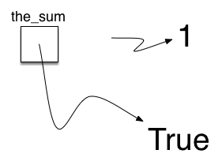

# 1.8. 数据入门

**1.8. Getting Started with Data**

=== "中文"

    上面我们说过Python支持面向对象的编程范式。 这意味着 Python 将数据视为解决问题过程的焦点。 在Python以及任何其他面向对象的编程语言中，我们定义**类(class)**来描述数据的样子（状态）以及数据可以做什么（行为）。 类类似于抽象数据类型，因为类的用户只能看到数据项的状态和行为。 在面向对象的范式中，数据项被称为**对象(objects)**。 对象是类的实例。

=== "英文"

    We stated above that Python supports the object-oriented programming paradigm. This means that Python considers data to be the focal point of the problem-solving process. In Python, as well as in any other object-oriented programming language, we define a **class** to be a description of what the data look like (the state) and what the data can do (the behavior). Classes are analogous to abstract data types because a user of a class only sees the state and behavior of a data item. Data items are called **objects** in the object-oriented paradigm. An object is an instance of a class.

## 1.8.1. 内建的原子数据类型

**1.8.1. Built-in Atomic Data Types**

=== "中文"

    我们将通过考虑原子数据类型来开始我们的审查。 Python 有两个主要的内置数字类，它们实现**整数**和**浮点数据类型**。 这些 Python 类称为 `int` 和“float”。 标准算术运算符 +、-、\*、/ 和 \*\*（求幂）可以与括号一起使用，强制操作顺序偏离正常运算符优先级。 其他非常有用的运算符是**余数（模）运算符** (%) 和**整数除法** (//)。 请注意，当两个整数相除时，结果是浮点数。 整数除法运算符通过截断任何小数部分来返回商的整数部分。

    ```python title='Activity: 1.8.1.1 Basic Arithmetic Operators' linenums="1"
    print(2 + 3 * 4)
    print((2 + 3) * 4)
    print(2 ** 10)
    print(6 / 3)
    print(7 / 3)
    print(7 // 3)
    print(7 % 3)
    print(3 / 6)
    print(3 // 6)
    print(3 % 6)
    print(2 ** 100)
    ```

    布尔数据类型，作为Python `bool` 类实现，对于表示真值非常有用。 布尔对象的可能状态值是`True`和`False`，以及标准布尔运算符`and`、`or`和`not`。

    ```py
    >>> True
    True
    >>> False
    False
    >>> False or True
    True
    >>> not (False or True)
    False
    >>> True and True
    True
    ```
    
    布尔数据对象还用作比较运算符的结果，例如**等于** (==) 和**大于** ($>$)。 此外，关系运算符和逻辑运算符可以组合在一起形成复杂的逻辑问题。 “表 1”显示了关系运算符和逻辑运算符，并在随后的会话中显示了示例。

    **表 1: 关系运算符和逻辑运算符**

    | **运算符名称** | **运算符** | **解释**                                   |
    | -------------- | ---------- | ------------------------------------------ |
    | 小于           | $<$        | 小于运算符                                 |
    | 大于           | $>$        | 大于运算符                                 |
    | 小于或等于     | $<=$       | 小于或等于运算符                           |
    | 大于或等于     | $>=$       | 大于或等于运算符                           |
    | 等于           | $==$       | 等于运算符                                 |
    | 不等于         | $!=$       | 不等于运算符                               |
    | 逻辑和         | $and$      | 两个操作数都为 True 时结果为 True          |
    | 逻辑或         | $or$       | 一个或另一个操作数为 True 则结果为 True    |
    | 逻辑非         | $not$      | 否定真值，False 变为 True，True 变为 False |
    

    ```pycon title="Activity: 1.8.1.2 基本关系和逻辑运算符"
    >>> print(5 == 10)
    False
    >>> print(10 > 5)
    True
    >>> print((5 >= 1) and (5 <= 10))
    True
    >>> print((1 < 5) or (10 < 1))
    True
    >>> print(1 < 5 < 10)
    True
    ```

    标识符在编程语言中用作名称。 在 Python 中，标识符以字母或下划线 (_) 开头，区分大小写，并且可以是任意长度。 请记住，使用传达含义的名称始终是一个好主意，以便您的程序代码更易于阅读和理解。

    当第一次在赋值语句的左侧使用名称时，就会创建 Python 变量。 赋值语句提供了一种将名称与值关联起来的方法。 该变量将保存对一段数据的引用，但不保存数据本身。 考虑以下会话：

    ```python
    >>> the_sum = 0
    >>> the_sum
    0
    >>> the_sum = the_sum + 1
    >>> the_sum
    1
    >>> the_sum = True
    >>> the_sum
    True
    ```
    
    赋值语句`the_sum = 0`创建一个名为`the_sum`的变量，并让它保存对数据对象`0`的引用（参见“图3”）。 通常，对赋值语句的右侧进行求值，并对结果数据对象的引用分配给左侧的名称。 在我们的示例中，此时变量的类型是整数，因为这是`the_sum`当前引用的数据的类型。 如果数据类型发生变化（参见“图 4”），如上面布尔值`True`所示，变量的类型也会发生变化（`the_sum`现在是布尔类型）。 赋值语句更改变量所持有的引用。 这是Python的动态特性。 同一变量可以引用许多不同类型的数据。
        
    <figure markdown>
    
    <figcaption>图 3: 变量保存对数据对象的引用</figcaption>
    </figure>
        
    <figure markdown>
    
    <figcaption>图 4: 赋值改变引用</figcaption>
    </figure>

=== "英文"

    We will begin our review by considering the atomic data types. Python has two main built-in numeric classes that implement the integer and floating-point data types. These Python classes are called `int` and `float`. The standard arithmetic operators, +, -, \*, /, and \*\* (exponentiation), can be used with parentheses forcing the order of operations away from normal operator precedence. Other very useful operators are the remainder (modulo) operator (%) and integer division (//). Note that when two integers are divided, the result is a floating point. The integer division operator returns the integer portion of the quotient by truncating any fractional part.

    ```python title='Activity: 1.8.1.1 Basic Arithmetic Operators' linenums="1"
    print(2 + 3 * 4)
    print((2 + 3) * 4)
    print(2 ** 10)
    print(6 / 3)
    print(7 / 3)
    print(7 // 3)
    print(7 % 3)
    print(3 / 6)
    print(3 // 6)
    print(3 % 6)
    print(2 ** 100)
    ```

    The Boolean data type, implemented as the Python `bool` class, will be quite useful for representing truth values. The possible state values for a Boolean object are `True` and `False` with the standard Boolean operators, `and`, `or`, and `not`.

    ```py
    >>> True
    True
    >>> False
    False
    >>> False or True
    True
    >>> not (False or True)
    False
    >>> True and True
    True
    ```
    
    Boolean data objects are also used as results for comparison operators such as equality (==) and greater than ( &gt; ). In addition, relational operators and logical operators can be combined together to form complex logical questions. Table 1 shows the relational and logical operators with examples shown in the session that follows.

    **Table 1: Relational and Logical Operators**

    | **Operation Name**    | **Operator** | **Explanation**                                                 |
    | --------------------- | ------------ | --------------------------------------------------------------- |
    | less than             | $<$          | Less than operator                                              |
    | greater than          | $>$          | Greater than operator                                           |
    | less than or equal    | $<=$         | Less than or equal to operator                                  |
    | greater than or equal | $>=$         | Greater than or equal to operator                               |
    | equal                 | $==$         | Equality operator                                               |
    | not equal             | $!=$         | Not equal operator                                              |
    | logical and           | $and$        | Both operands True for result to be True                        |
    | logical or            | $or$         | One or the other operand is True for the result to be True      |
    | logical not           | $not$        | Negates the truth value, False becomes True, True becomes False |
    

    ```pycon title="Activity: 1.8.1.2 Basic Relational and Logical Operators"
    >>> print(5 == 10)
    False
    >>> print(10 > 5)
    True
    >>> print((5 >= 1) and (5 <= 10))
    True
    >>> print((1 < 5) or (10 < 1))
    True
    >>> print(1 < 5 < 10)
    True
    ```

    Identifiers are used in programming languages as names. In Python, identifiers start with a letter or an underscore (_), are case sensitive, and can be of any length. Remember that it is always a good idea to use names that convey meaning so that your program code is easier to read and understand.

    A Python variable is created when a name is used for the first time on the left-hand side of an assignment statement. Assignment statements provide a way to associate a name with a value. The variable will hold a reference to a piece of data but not the data itself. Consider the following session:

    ```python
    >>> the_sum = 0
    >>> the_sum
    0
    >>> the_sum = the_sum + 1
    >>> the_sum
    1
    >>> the_sum = True
    >>> the_sum
    True
    ```
    
    The assignment statement `the_sum = 0` creates a variable called `the_sum` and lets it hold the reference to the data object `0` (see Figure 3). In general, the right-hand side of the assignment statement is evaluated and a reference to the resulting data object is assigned to the name on the left-hand side. At this point in our example, the type of the variable is integer as that is the type of the data currently being referred to by `the_sum`. If the type of the data changes (see Figure 4), as shown above with the Boolean value `True`, so does the type of the variable (`the_sum` is now of the type Boolean). The assignment statement changes the reference being held by the variable. This is a dynamic characteristic of Python. The same variable can refer to many different types of data.
        
    <figure markdown>
    
    <figcaption>Figure 3: Variables Hold References to Data Objects</figcaption>
    </figure>
        
    <figure markdown>
    
    <figcaption>Figure 4: Assignment Changes the Reference</figcaption>
    </figure>

## 1.8.2. 内建的集合数据类型

**1.8.2. Built-in Collection Data Types**

=== "中文"

    除了数字类和布尔类之外，Python 还有许多非常强大的内置集合类。 列表、字符串和元组是有序集合，它们在一般结构上非常相似，但具有特定的差异，必须理解这些差异才能正确使用它们。 集合和字典是无序集合。

=== "英文"

    In addition to the numeric and Boolean classes, Python has a number of very powerful built-in collection classes. Lists, strings, and tuples are ordered collections that are very similar in general structure but have specific differences that must be understood for them to be used properly. Sets and dictionaries are unordered collections.

### list

=== "中文"

    **列表(list)**是零个或多个对 Python 数据对象的引用的有序集合。 列表被写为括在方括号中的逗号分隔值。 空列表就是`[ ]`。 列表是异构的，这意味着数据对象不必全部来自同一类，并且可以将集合分配给变量，如下所示。 以下片段显示了列表中的各种 Python 数据对象。

    ```pycon
    >>> [1, 3, True, 6.5]
    [1, 3, True, 6.5]
    >>> my_list = [1, 3, True, 6.5]
    >>> my_list
    [1, 3, True, 6.5]
    ```
    
    请注意，当 Python 计算(evaluates)列表时，会返回列表本身。 但是，为了记住该列表以供以后处理，需要将其引用分配给一个变量。
    
    由于列表被认为是按顺序排序的，因此它们支持许多可应用于任何 Python 序列的操作。 “表 2”回顾了这些操作，下面的课程给出了它们的使用示例。
    
    **表 2：Python 中任意序列的操作**
    
    | **运算符名称** | **运算符** | **解释**                 |
    | -------------- | ---------- | ------------------------ |
    | 索引           | [ ]        | 访问序列的元素           |
    | 串联           | \+         | 将序列组合在一起         |
    | 重复           | \*         | 连接重复次数             |
    | 会员           | `in`       | 询问某个项目是否在序列中 |
    | 长度           | `len`      | 询问序列中的项目数       |
    | 切片           | [ : ]      | 提取序列的一部分         |
    
    请注意，列表（序列）的索引从 0 开始计数。切片操作 `my_list[1:3]` 返回一个项目列表，该列表以索引为 `1` 的项目开始，直到（但不包括）索引为的项目 `3`.
    
    有时您会想要初始化一个列表。 这可以通过重复来快速完成。 例如，
    
    ```pycon
    >>> my_list = [0] * 6
    >>> my_list
    [0, 0, 0, 0, 0, 0]
    ```
    
    与重复运算符相关的一个非常重要的问题是，结果是重复对序列中的数据对象的引用。 通过考虑以下会议可以最好地看出这一点：
    
    ```python title="参考文献的重复"
    my_list = [1, 2, 3, 4]
    big_list = [my_list] * 3
    print(big_list)
    my_list[2] = 45
    print(big_list)
    ```
    
    变量`big_list`保存对原始列表`my_list`的三个引用的集合。 请注意，对 `my_list` 的一个元素的更改会出现在 `big_list` 中的所有三个事件中。
    
    列表支持许多用于构建数据结构的方法。 “表 3”提供了摘要。 它们的使用示例如下。
    
    **表 3：Python 中列表提供的方法**
    
    | **方法名称** | **用法**                  | **解释**                          |
    | ------------ | ------------------------- | --------------------------------- |
    | ``append``   | ``a_list.append(item)``   | 将新项目添加到列表末尾            |
    | ``insert``   | ``a_list.insert(i,item)`` | 在列表中的第 i 个位置插入一个项目 |
    | ``pop``      | ``a_list.pop()``          | 删除并返回列表中的最后一项        |
    | ``pop``      | ``a_list.pop(i)``         | 删除并返回列表中的第 i 个项目     |
    | ``sort``     | ``a_list.sort()``         | 对列表进行适当排序                |
    | ``reverse``  | ``a_list.reverse()``      | 将列表修改为倒序                  |
    | ``del``      | ``del a_list[i]``         | 删除第 i 个位置的项目             |
    | ``index``    | ``a_list.index(item)``    | 返回第一次出现`item`的索引        |
    | ``count``    | ``a_list.count(item)``    | 返回`item`出现的次数              |
    | ``remove``   | ``a_list.remove(item)``   | 删除第一次出现的`item`            |
    
    ```python title="列表方法的示例"
    my_list = [1024, 3, True, 6.5]
    my_list.append(False)
    print(my_list)
    my_list.insert(2,4.5)
    print(my_list)
    print(my_list.pop())
    print(my_list)
    print(my_list.pop(1))
    print(my_list)
    my_list.pop(2)
    print(my_list)
    my_list.sort()
    print(my_list)
    my_list.reverse()
    print(my_list)
    print(my_list.count(6.5))
    print(my_list.index(4.5))
    my_list.remove(6.5)
    print(my_list)
    del my_list[0]
    print(my_list)
    ```
  
    您可以看到某些方法，例如`pop`，返回一个值并修改列表。 其他的，例如`reverse`，只是简单地修改列表，没有返回值。 ``pop`` 将默认位于列表末尾，但也可以删除并返回特定项目。 这些方法再次使用从 0 开始的索引范围。 您还应该注意到熟悉的“点(.)”表示法，用于要求对象调用方法。 ``my_list.append(False)`` 可以理解为“要求对象 ``my_list`` 执行其 ``append`` 方法并向其发送值 ``False``。 即使是简单的数据对象（例如整数）也可以通过这种方式调用方法。
    
    ```pycon
    >>> (54).__add__(21)
    75
    ```
    
    在这个片段中，我们要求整数对象`54`执行其`add`方法（在Python中称为`__add__`）并将其传递`21`作为要添加的值。 结果是总和`75`。 当然，我们通常写成``54+21``。 我们将在本节后面详细介绍这些方法。
    
    经常与列表一起讨论的一种常见 Python 函数是`range`函数。 ``range`` 生成一个表示值序列的范围对象。 通过使用`list`函数，可以将范围对象的值视为列表。 如下图所示。
    
    ```pycon
    >>> range(10)
    range(0, 10)
    >>> list(range(10))
    [0, 1, 2, 3, 4, 5, 6, 7, 8, 9]
    >>> range(5, 10)
    range(5, 10)
    >>> list(range(5, 10))
    [5, 6, 7, 8, 9]
    >>> list(range(5, 10, 2))
    [5, 7, 9]
    >>> list(range(10, 1, -1))
    [10, 9, 8, 7, 6, 5, 4, 3, 2]
    ```
    
    range 对象表示一个整数序列。 默认情况下，它将从 0 开始。如果您提供更多参数，它将在特定点开始和结束，甚至可以跳过项目。 在我们的第一个示例中，`range(10)`，序列从 0 开始，一直上升到但不包括 10。在我们的第二个示例中，`range(5, 10)`从 5 开始，一直上升 到但不包括 10。``range(5, 10, 2)`` 执行类似，但跳过两个（同样，不包括 10）。
    

=== "英文"

    A `list` is an ordered collection of zero or more references to Python data objects. Lists are written as comma-delimited values enclosed in square brackets. The empty list is simply `[ ]`. Lists are heterogeneous, meaning that the data objects need not all be from the same class and the collection can be assigned to a variable as below. The following fragment shows a variety of Python data objects in a list.

    ```python
    >>> [1, 3, True, 6.5]
    [1, 3, True, 6.5]
    >>> my_list = [1, 3, True, 6.5]
    >>> my_list
    [1, 3, True, 6.5]
    ```
    
    Note that when Python evaluates a list, the list itself is returned. However, in order to remember the list for later processing, its reference needs to be assigned to a variable.

    Since lists are considered to be sequentially ordered, they support a number of operations that can be applied to any Python sequence. Table 2 reviews these operations and the following session gives examples of their use.

    **Table 2: Operations on Any Sequence in Python**

    | **Operation Name** | **Operator** | **Explanation**                         |
    | ------------------ | ------------ | --------------------------------------- |
    | indexing           | [ ]          | Access an element of a sequence         |
    | concatenation      | \+           | Combine sequences together              |
    | repetition         | \*           | Concatenate a repeated number of times  |
    | membership         | in           | Ask whether an item is in a sequence    |
    | length             | len          | Ask the number of items in the sequence |
    | slicing            | [ : ]        | Extract a part of a sequence            |

    Note that the indices for lists (sequences) start counting with 0. The slice operation my_list[1:3] returns a list of items starting with the item indexed by 1 up to---but not including---the item indexed by 3.

    Sometimes you will want to initialize a list. This can quickly be accomplished by using repetition. For example,

    ```pycon
    >>> my_list = [0] * 6
    >>> my_list
    [0, 0, 0, 0, 0, 0]
    ```

    One very important aside relating to the repetition operator is that the result is a repetition of references to the data objects in the sequence. This can best be seen by considering the following session:

    ```python title="Activity: 1.8.2.1 Repetition of References" linenums="1"
    my_list = [1, 2, 3, 4]
    big_list = [my_list] * 3
    print(big_list)
    my_list[2] = 45
    print(big_list)
    ```

    The variable ``big_list`` holds a collection of three references to the original list called ``my_list``. Note that a change to one element of ``my_list`` shows up in all three occurrences in ``big_list``.

    Lists support a number of methods that will be used to build data structures. `Table 3` provides a summary. Examples of their use follow.

    **Table 3: Methods Provided by Lists in Python**

    | **Method Name** | **Use**                   | **Explanation**                                       |
    | --------------- | ------------------------- | ----------------------------------------------------- |
    | ``append``      | ``a_list.append(item)``   | Adds a new item to the end of a list                  |
    | ``insert``      | ``a_list.insert(i,item)`` | Inserts an item at the ith position in a list         |
    | ``pop``         | ``a_list.pop()``          | Removes and returns the last item in a list           |
    | ``pop``         | ``a_list.pop(i)``         | Removes and returns the ith item in a list            |
    | ``sort``        | ``a_list.sort()``         | Sorts a list in place                                 |
    | ``reverse``     | ``a_list.reverse()``      | Modifies a list to be in reverse order                |
    | ``del``         | ``del a_list[i]``         | Deletes the item in the ith position                  |
    | ``index``       | ``a_list.index(item)``    | Returns the index of the first occurrence of ``item`` |
    | ``count``       | ``a_list.count(item)``    | Returns the number of occurrences of ``item``         |
    | ``remove``      | ``a_list.remove(item)``   | Removes the first occurrence of ``item``              |


    ```python title="Activity: 1.8.2.2 Examples of List Methods"
    my_list = [1024, 3, True, 6.5]
    my_list.append(False)
    print(my_list)
    my_list.insert(2,4.5)
    print(my_list)
    print(my_list.pop())
    print(my_list)
    print(my_list.pop(1))
    print(my_list)
    my_list.pop(2)
    print(my_list)
    my_list.sort()
    print(my_list)
    my_list.reverse()
    print(my_list)
    print(my_list.count(6.5))
    print(my_list.index(4.5))
    my_list.remove(6.5)
    print(my_list)
    del my_list[0]
    print(my_list)
    ```

    You can see that some of the methods, such as ``pop``, return a value and also modify the list. Others, such as ``reverse``, simply modify the list with no return value. ``pop`` will default to the end of the list but can also remove and return a specific item. The index range starting from 0 is again used for these methods. You should also notice the familiar “dot” notation for asking an object to invoke a method. ``my_list.append(False)`` can be read as “ask the object ``my_list`` to perform its ``append`` method and send it the value ``False``.” Even simple data objects such as integers can invoke methods in this way.

    ```pycon
    >>> (54).__add__(21)
    75
    ```

    In this fragment we are asking the integer object ``54`` to execute its ``add`` method (called ``__add__`` in Python) and passing it ``21`` as the value to add. The result is the sum, ``75``. Of course, we usually write this as ``54+21``. We will say much more about these methods later in this section.

    One common Python function that is often discussed in conjunction with lists is the ``range`` function. ``range`` produces a range object that represents a sequence of values. By using the ``list`` function, it is possible to see the value of the range object as a list. This is illustrated below.

    ```pycon
    >>> range(10)
    range(0, 10)
    >>> list(range(10))
    [0, 1, 2, 3, 4, 5, 6, 7, 8, 9]
    >>> range(5, 10)
    range(5, 10)
    >>> list(range(5, 10))
    [5, 6, 7, 8, 9]
    >>> list(range(5, 10, 2))
    [5, 7, 9]
    >>> list(range(10, 1, -1))
    [10, 9, 8, 7, 6, 5, 4, 3, 2]
    ```

    The range object represents a sequence of integers. By default, it will start with 0. If you provide more parameters, it will start and end at particular points and can even skip items. In our first example, ``range(10)``, the sequence starts with 0 and goes up to but does not include 10. In our second example, ``range(5, 10)`` starts at 5 and goes up to but does not include 10. ``range(5, 10, 2)`` performs similarly but skips by twos (again, 10 is not included).

### Strings

=== "中文"

    **字符串(Strings)**是零个或多个字母、数字和其他符号的连续集合。 我们将这些字母、数字和其他符号称为*字符*。 文字字符串值通过使用引号（单引号或双引号）与标识符区分开来。
    
    ```pycon
    >>> "David"
    'David'
    >>> my_name = "David"
    >>> my_name[3]
    'i'
    >>> my_name * 2
    'DavidDavid'
    >>> len(my_name)
    5
    ```
    
    由于字符串是序列，因此上述所有序列操作都按您的预期工作。 此外，字符串还有许多方法，其中一些方法如“表 4”所示。
    
    **表 4：Python 中字符串提供的方法**
    
    | **方法名称** | **用法**                   | **解释**                               |
    | ------------ | -------------------------- | -------------------------------------- |
    | ``center``   | ``a_string.center(w)``     | 返回以大小为`w`的字段为中心的字符串    |
    | ``count``    | ``a_string.count(item)``   | 返回字符串中`item`出现的次数           |
    | ``ljust``    | ``a_string.ljust(w)``      | 返回在大小为`w`的字段中左对齐的字符串  |
    | ``lower``    | ``a_string.lower()``       | 返回全小写的字符串                     |
    | ``rjust``    | ``a_string.rjust(w)``      | 返回在大小为`w`的字段中右对齐的字符串  |
    | ``find``     | ``a_string.find(item)``    | 返回第一次出现`item`的索引             |
    | ``split``    | ``a_string.split(s_char)`` | 将字符串拆分为 ``s_char`` 处的子字符串 |
    
    其中，`split`对于处理数据非常有用。 ``split`` 将接受一个字符串并使用分割字符作为分割点返回一个字符串列表。 在下面的示例中，`v`是划分点。 如果未指定除法，则 `split` 方法将查找空白字符，例如制表符、换行符和空格。
    
    ```pycon
    >>> my_name
    'David'
    >>> my_name.upper()
    'DAVID'
    >>> my_name.center(10)
    '  David   '
    >>> my_name.find("v")
    2
    >>> my_name.split("v")
    ['Da', 'id']
    ```
    
    列表和字符串之间的主要区别是列表可以修改，而字符串则不能。 这称为**可变性**。 列表是可变的； 字符串是不可变的。 例如，您可以使用索引和分配来更改列表中的项目。 对于不允许更改的字符串，如下所示。
    
    ```pycon
    >>> my_list
    [1, 3, True, 6.5]
    >>> my_list[0] = 2 ** 10
    >>> my_list
    [1024, 3, True, 6.5]
    >>>
    >>> my_name
    'David'
    >>> my_name[0] = "X"
    Traceback (most recent call last):
    File "<stdin>", line 1, in <module>
    TypeError: 'str' object does not support item assignment
    ```
    
=== "英文"

    **Strings** are sequential collections of zero or more letters, numbers, and other symbols. We call these letters, numbers, and other symbols *characters*. Literal string values are differentiated from identifiers by using quotation marks (either single or double).

    ```pycon
    >>> "David"
    'David'
    >>> my_name = "David"
    >>> my_name[3]
    'i'
    >>> my_name * 2
    'DavidDavid'
    >>> len(my_name)
    5
    ```

    Since strings are sequences, all of the sequence operations described above work as you would expect. In addition, strings have a number of methods, some of which are shown in `Table 4`.


    **Table 4: Methods Provided by Strings in Python**

    | **Method Name** | **Use**                    | **Explanation**                                             |
    | --------------- | -------------------------- | ----------------------------------------------------------- |
    | ``center``      | ``a_string.center(w)``     | Returns a string centered in a field of size ``w``          |
    | ``count``       | ``a_string.count(item)``   | Returns the number of occurrences of ``item`` in the string |
    | ``ljust``       | ``a_string.ljust(w)``      | Returns a string left-justified in a field of size ``w``    |
    | ``lower``       | ``a_string.lower()``       | Returns a string in all lowercase                           |
    | ``rjust``       | ``a_string.rjust(w)``      | Returns a string right-justified in a field of size ``w``   |
    | ``find``        | ``a_string.find(item)``    | Returns the index of the first occurrence of ``item``       |
    | ``split``       | ``a_string.split(s_char)`` | Splits a string into substrings at ``s_char``               |
    

    Of these, ``split`` will be very useful for processing data. ``split`` will take a string and return a list of strings using the split character as a division point. In the example below, “v” is the division point. If no division is specified, the split method looks for whitespace characters such as tab, newline, and space.

    ```pycon
    >>> my_name
    'David'
    >>> my_name.upper()
    'DAVID'
    >>> my_name.center(10)
    '  David   '
    >>> my_name.find("v")
    2
    >>> my_name.split("v")
    ['Da', 'id']
    ```

    A major difference between lists and strings is that lists can be modified while strings cannot. This is referred to as **mutability**. Lists are mutable; strings are immutable. For example, you can change an item in a list by using indexing and assignment. With a string that change is not allowed, as shown below.
    
    ```pycon
    >>> my_list
    [1, 3, True, 6.5]
    >>> my_list[0] = 2 ** 10
    >>> my_list
    [1024, 3, True, 6.5]
    >>>
    >>> my_name
    'David'
    >>> my_name[0] = "X"
    Traceback (most recent call last):
    File "<stdin>", line 1, in <module>
    TypeError: 'str' object does not support item assignment
    ```

### Tuples

=== "中文"

    **元组(Tuples)**与列表非常相似，因为它们是异构数据序列。 不同之处在于元组是不可变的，就像字符串一样。 元组无法更改。 元组被写为括在括号中的逗号分隔值。 作为序列，它们可以使用上述任何操作。 例如，

    ```pycon
    >>> my_tuple = (2, True, 4.96)
    >>> my_tuple
    (2, True, 4.96)
    >>> len(my_tuple)
    3
    >>> my_tuple[0]
    2
    >>> my_tuple * 3
    (2, True, 4.96, 2, True, 4.96, 2, True, 4.96)
    >>> my_tuple[0:2]
    (2, True)
    ```
    
    但是，如果您尝试更改元组中的项目，则会收到错误。 请注意，错误消息提供了问题的位置和原因。
    
    ```pycon
    >>> my_tuple[1] = False
    Traceback (most recent call last):
    File "<stdin>", line 1, in <module>
    TypeError: 'tuple' object does not support item assignment
    ```

=== "英文"

    **Tuples** are very similar to lists in that they are heterogeneous sequences of data. The difference is that a tuple is immutable, like a string. A tuple cannot be changed. Tuples are written as comma-delimited values enclosed in parentheses. As sequences, they can use any operation described above. For example,

    ```pycon
    >>> my_tuple = (2, True, 4.96)
    >>> my_tuple
    (2, True, 4.96)
    >>> len(my_tuple)
    3
    >>> my_tuple[0]
    2
    >>> my_tuple * 3
    (2, True, 4.96, 2, True, 4.96, 2, True, 4.96)
    >>> my_tuple[0:2]
    (2, True)
    ```

    However, if you try to change an item in a tuple, you will get an error. Note that the error message provides the location and reason for the problem.

    ```pycon
    >>> my_tuple[1] = False
    Traceback (most recent call last):
    File "<stdin>", line 1, in <module>
    TypeError: 'tuple' object does not support item assignment
    ```

### set

=== "中文"

    **集合(set)** 是零个或多个不可变 Python 数据对象的无序集合。 集合不允许重复，并且被写为用大括号括起来的逗号分隔值。 空集由`set()`表示。 集合是异构的，集合可以分配给变量，如下所示。

    ```pycon
    >>> {3, 6, "cat", 4.5, False}
    {False, 3, 4.5, 6, 'cat'}
    >>> my_set = {3, 6, "cat", 4.5, False}
    >>> my_set
    {False, 3, 4.5, 6, 'cat'}
    ```
    
    尽管集合不被认为是连续的，但它们确实支持前面介绍的一些熟悉的操作。 `表 5` 回顾了这些操作，下面的会议给出了它们的使用示例。
    
    **表 5：Python 中集合的操作**
    
    | **运算符名称** | **运算符**             | **解释**                                                         |
    | -------------- | ---------------------- | ---------------------------------------------------------------- |
    | 项             | ``in``                 | 时候为集合中的项                                                 |
    | 长度           | ``len``                | 返回集合的长度                                                   |
    | ``             | ``                     | ``a_set                                                          | other_set`` | 返回一个新集合，其中包含两个集合中的所有元素 |
    | ``&``          | ``a_set & other_set``  | 返回一个新集合，其中仅包含两个集合共有的元素                     |
    | ``-``          | ``a_set - other_set``  | 返回一个新集合，其中包含第一个集合中不属于第二个集合中的所有项目 |
    | ``<=``         | ``a_set <= other_set`` | 询问第一个集合的所有元素是否都在第二个集合中                     |
    
    ```pycon
    >>> my_set
    {False, 3, 4.5, 6, 'cat'}
    >>> len(my_set)
    5
    >>> False in my_set
    True
    >>> "dog" in my_set
    False
    ```
    
    集合支持许多方法，那些在数学环境中使用过集合的人应该熟悉这些方法。 表 6 提供了摘要。 它们的使用示例如下。 请注意，`union`、`intersection`、`issubset`和`difference`都具有可以使用的运算符。
    
    **表 6：Python 中集合提供的方法**
    
    | **方法名称**     | **用法**                          | **解释**                                                         |
    | ---------------- | --------------------------------- | ---------------------------------------------------------------- |
    | ``union``        | ``a_set.union(other_set)``        | 返回一个新集合，其中包含两个集合中的所有元素                     |
    | ``intersection`` | ``a_set.intersection(other_set)`` | 返回一个新集合，其中仅包含两个集合共有的元素                     |
    | ``difference``   | ``a_set.difference(other_set)``   | 返回一个新集合，其中包含第一个集合中不属于第二个集合中的所有项目 |
    | ``issubset``     | ``a_set.issubset(othe_rset)``     | 询问一个集合的所有元素是否都在另一个集合中                       |
    | ``add``          | ``a_set.add(item)``               | 将项目添加到集合中                                               |
    | ``remove``       | ``a_set.remove(item)``            | 从集合中删除项目                                                 |
    | ``pop``          | ``a_set.pop()``                   | 从集合中删除任意元素                                             |
    | ``clear``        | ``a_set.clear()``                 | 从集合中删除所有元素                                             |
    
    ```pycon
    >>> my_set
    {False, 3, 4.5, 6, 'cat'}
    >>> your_set = {99, 3, 100}
    >>> my_set.union(your_set)
    {False, 3, 4.5, 'cat', 6, 99, 100}
    >>> my_set | your_set
    {False, 3, 4.5, 'cat', 6, 99, 100}
    >>> my_set.intersection(your_set)
    {3}
    >>> my_set & your_set
    {3}
    >>> my_set.difference(your_set)
    {False, 'cat', 4.5, 6}
    >>> my_set - your_set
    {False, 'cat', 4.5, 6}
    >>> {3, 100}.issubset(your_set)
    True
    >>> {3, 100} <= your_set
    True
    >>> my_set.add("house")
    >>> my_set
    {False, 'house', 3, 4.5, 6, 'cat'}
    >>> my_set.remove(4.5)
    >>> my_set
    {False, 'house', 3, 6, 'cat'}
    >>> my_set.pop()
    False
    >>> my_set
    {'house', 3, 6, 'cat'}
    >>> my_set.clear()
    >>> my_set
    set()
    ```
    
    我们最终的 Python 集合是一个无序结构，称为 **字典**。 字典是相关项目对的集合，其中每对都包含一个键和一个值。 该键值对通常写为键：值。 字典以逗号分隔的键：值对形式编写，并括在大括号中。 例如，
    
    ```pycon
    >>> capitals = {"Iowa": "Des Moines", "Wisconsin": "Madison"}
    >>> capitals
    {'Iowa': 'Des Moines', 'Wisconsin': 'Madison'}
    ```
    
    我们可以通过键访问值或添加另一个键值对来操作字典。 访问的语法看起来很像序列访问，只不过我们不使用项目的索引，而是使用键值。 添加新值也是类似的。
    
    ```python title="Using a Dictionary"
    capitals = {"Iowa": "Des Moines", "Wisconsin": "Madison"}
    print(capitals["Iowa"])
    capitals["Utah"] = "Salt Lake City"
    print(capitals)
    capitals["California"] = "Sacramento"
    print(len(capitals))
    for k in capitals:
        print(capitals[k],"is the capital of", k)
    ```
    
    值得注意的是，在 Python 3.6 之前，字典的维护顺序与键没有特定的顺序。 添加的第一对 (``"Utah":`` ``"Salt Lake City"``) 将放在字典中的第一位，添加的第二对 (``"California":`` ``"Sacramento"``) 将放在最后。 键的放置取决于 *散列* 的思想，这将在第 5 章中更详细地解释。自 Python 3.6 以来，字典确实保持顺序，因此在上面的示例中，对按照它们在字典中出现的顺序出现。 添加。 我们还展示了长度函数，其作用与其他集合相同。
    
    字典既有方法又有运算符。 “表 7”和“表 8”对它们进行了描述，会议展示了它们的实际应用。 `keys`、`values`和`items`方法都返回包含感兴趣值的对象。 您可以使用`list`函数将它们转换为列表。 您还将看到`get`方法有两种变体。 如果字典中不存在该键，`get`将返回`None`。 但是，第二个可选参数可以指定返回值。
    
    **表 7：Python 中字典提供的运算符**
    
    | **运算符** | **用法**            | **解释**                                    |
    | ---------- | ------------------- | ------------------------------------------- |
    | ``[]``     | ``a_dict[k]``       | 返回与`k`关联的值，否则错误                 |
    | ``in``     | ``key in a_dict``   | 如果键在字典中则返回`True`，否则返回`False` |
    | ``del``    | del ``a_dict[key]`` | 从字典中删除条目                            |
    
    **表 8：Python 中字典提供的方法**
    
    | **方法名称** | **用法**               | **解释**                          |
    | ------------ | ---------------------- | --------------------------------- |
    | ``keys``     | ``a_dict.keys()``      | 返回 dict_keys 对象中字典的键     |
    | ``values``   | ``a_dict.values()``    | 返回 dict_values 对象中字典的值   |
    | ``items``    | ``a_dict.items()``     | 返回 dict_items 对象中的键值对    |
    | ``get``      | ``a_dict.get(k)``      | 返回与`k`相关的值，否则返回`None` |
    | ``get``      | ``a_dict.get(k, alt)`` | 否则返回与`k`、`alt`关联的值      |
    
    ```pycon
    >>> phone_ext={"david": 1410, "brad": 1137, "roman": 1171}
    >>> phone_ext
    {'david': 1410, 'brad': 1137, 'roman': 1171}
    >>> phone_ext.keys()
    dict_keys(['david', 'brad', 'roman'])
    >>> list(phone_ext.keys())
    ['david', 'brad', 'roman']
    >>> phone_ext.values()
    dict_values([1410, 1137, 1171])
    >>> list(phone_ext.values())
    [1410, 1137, 1171]
    >>> phone_ext.items()
    dict_items([('david', 1410), ('brad', 1137), ('roman', 1171)])
    >>> list(phone_ext.items())
    [('david', 1410), ('brad', 1137), ('roman', 1171)]
    >>> phone_ext.get("kent")
    >>> phone_ext.get("kent", "NO ENTRY")
    'NO ENTRY'
    ```

=== "英文"

    A **set** is an unordered collection of zero or more immutable Python data objects. Sets do not allow duplicates and are written as comma-delimited values enclosed in curly braces. The empty set is represented by ``set()``. Sets are heterogeneous, and the collection can be assigned to a variable as below.

    ```pycon
    >>> {3, 6, "cat", 4.5, False}
    {False, 3, 4.5, 6, 'cat'}
    >>> my_set = {3, 6, "cat", 4.5, False}
    >>> my_set
    {False, 3, 4.5, 6, 'cat'}
    ```

    Even though sets are not considered to be sequential, they do support a few of the familiar operations presented earlier. `Table 5` reviews these operations and the following session gives examples of their use.

    **Table 5: Operations on a Set in Python**

    | **Operation Name** | **Operator**           | **Explanation**                                                       |
    | ------------------ | ---------------------- | --------------------------------------------------------------------- |
    | membership         | ``in``                 | Set membership                                                        |
    | length             | ``len``                | Returns the cardinality of the set                                    |
    | ``                 | ``                     | `a_set                                                                | other_set` | Returns a new set with all elements from both sets |
    | ``&``              | ``a_set & other_set``  | Returns a new set with only those elements common to both sets        |
    | ``-``              | ``a_set - other_set``  | Returns a new set with all items from the first set not in the second |
    | ``<=``             | ``a_set <= other_set`` | Asks whether all elements of  the first set are in the second         |

    ```pycon
    >>> my_set
    {False, 3, 4.5, 6, 'cat'}
    >>> len(my_set)
    5
    >>> False in my_set
    True
    >>> "dog" in my_set
    False
    ```

    Sets support a number of methods that should be familiar to those who have worked with them in a mathematics setting. `Table 6` provides a summary. Examples of their use follow. Note that ``union``, ``intersection``, ``issubset``, and ``difference`` all have operators that can be used as well.

    **Table 6: Methods Provided by Sets in Python**

    | **Method Name**  | **Use**                           | **Explanation**                                                       |
    | ---------------- | --------------------------------- | --------------------------------------------------------------------- |
    | ``union``        | ``a_set.union(other_set)``        | Returns a new set with all elements from both sets                    |
    | ``intersection`` | ``a_set.intersection(other_set)`` | Returns a new set with only those elements common to both sets        |
    | ``difference``   | ``a_set.difference(other_set)``   | Returns a new set with all items from the first set not in the second |
    | ``issubset``     | ``a_set.issubset(othe_rset)``     | Asks whether all elements of one set are in the other                 |
    | ``add``          | ``a_set.add(item)``               | Adds item to the set                                                  |
    | ``remove``       | ``a_set.remove(item)``            | Removes item from the set                                             |
    | ``pop``          | ``a_set.pop()``                   | Removes an arbitrary element from the set                             |
    | ``clear``        | ``a_set.clear()``                 | Removes all elements from the set                                     |

    ```pycon
    >>> my_set
    {False, 3, 4.5, 6, 'cat'}
    >>> your_set = {99, 3, 100}
    >>> my_set.union(your_set)
    {False, 3, 4.5, 'cat', 6, 99, 100}
    >>> my_set | your_set
    {False, 3, 4.5, 'cat', 6, 99, 100}
    >>> my_set.intersection(your_set)
    {3}
    >>> my_set & your_set
    {3}
    >>> my_set.difference(your_set)
    {False, 'cat', 4.5, 6}
    >>> my_set - your_set
    {False, 'cat', 4.5, 6}
    >>> {3, 100}.issubset(your_set)
    True
    >>> {3, 100} <= your_set
    True
    >>> my_set.add("house")
    >>> my_set
    {False, 'house', 3, 4.5, 6, 'cat'}
    >>> my_set.remove(4.5)
    >>> my_set
    {False, 'house', 3, 6, 'cat'}
    >>> my_set.pop()
    False
    >>> my_set
    {'house', 3, 6, 'cat'}
    >>> my_set.clear()
    >>> my_set
    set()
    ```

    Our final Python collection is an unordered structure called a **dictionary**. Dictionaries are collections of associated pairs of items where each pair consists of a key and a value. This key-value pair is typically written as key:value. Dictionaries are written as comma-delimited key:value pairs enclosed in curly braces. For example,
    
    ```pycon
    >>> capitals = {"Iowa": "Des Moines", "Wisconsin": "Madison"}
    >>> capitals
    {'Iowa': 'Des Moines', 'Wisconsin': 'Madison'}
    ```

    We can manipulate a dictionary by accessing a value via its key or by adding another key-value pair. The syntax for access looks much like a sequence access except that instead of using the index of the item, we use the key value. To add a new value is similar.

    ```python title="Using a Dictionary"
    capitals = {"Iowa": "Des Moines", "Wisconsin": "Madison"}
    print(capitals["Iowa"])
    capitals["Utah"] = "Salt Lake City"
    print(capitals)
    capitals["California"] = "Sacramento"
    print(len(capitals))
    for k in capitals:
        print(capitals[k],"is the capital of", k)
    ```

    It is important to note that prior to Python 3.6 dictionaries were maintained in no particular order with respect to the keys. The first pair added (``"Utah":`` ``"Salt Lake City"``) would be placed first in the dictionary and the second pair added (``"California":`` ``"Sacramento"``) would be placed last. The placement of a key is dependent on the idea of *hashing*, which will be explained in more detail in Chapter 5. Dictionaries do maintain the order since Python 3.6, so in the example above the pairs appear in the dictionary in the order they were added. We also show the length function performing the same role as with other collections.

    Dictionaries have both methods and operators. `Table 7` and `Table 8` describe them, and the session shows them in action. The ``keys``, ``values``, and ``items`` methods all return objects that contain the values of interest. You can use the ``list`` function to convert them to lists. You will also see that there are two variations on the ``get`` method. If the key is not present in the dictionary, ``get`` will return ``None``. However, a second, optional parameter can specify a return value instead.

    **Table 7: Operators Provided by Dictionaries in Python**

    | **Operator** | **Use**             | **Explanation**                                                     |
    | ------------ | ------------------- | ------------------------------------------------------------------- |
    | ``[]``       | ``a_dict[k]``       | Returns the value associated with ``k``, otherwise its an error     |
    | ``in``       | ``key in a_dict``   | Returns ``True`` if key is in the   dictionary, ``False`` otherwise |
    | ``del``      | del ``a_dict[key]`` | Removes the entry from the dictionary                               |

    **Table 8: Methods Provided by Dictionaries in Python**

    | **Method Name** | **Use**                | **Explanation**                                              |
    | --------------- | ---------------------- | ------------------------------------------------------------ |
    | ``keys``        | ``a_dict.keys()``      | Returns the keys of the dictionary in a dict_keys object     |
    | ``values``      | ``a_dict.values()``    | Returns the values of the dictionary in a dict_values object |
    | ``items``       | ``a_dict.items()``     | Returns the key-value pairs in a dict_items object           |
    | ``get``         | ``a_dict.get(k)``      | Returns the value associated with ``k``, ``None`` otherwise  |
    | ``get``         | ``a_dict.get(k, alt)`` | Returns the value associated with ``k``, ``alt`` otherwise   |


    ```pycon
    >>> phone_ext={"david": 1410, "brad": 1137, "roman": 1171}
    >>> phone_ext
    {'david': 1410, 'brad': 1137, 'roman': 1171}
    >>> phone_ext.keys()
    dict_keys(['david', 'brad', 'roman'])
    >>> list(phone_ext.keys())
    ['david', 'brad', 'roman']
    >>> phone_ext.values()
    dict_values([1410, 1137, 1171])
    >>> list(phone_ext.values())
    [1410, 1137, 1171]
    >>> phone_ext.items()
    dict_items([('david', 1410), ('brad', 1137), ('roman', 1171)])
    >>> list(phone_ext.items())
    [('david', 1410), ('brad', 1137), ('roman', 1171)]
    >>> phone_ext.get("kent")
    >>> phone_ext.get("kent", "NO ENTRY")
    'NO ENTRY'
    ```