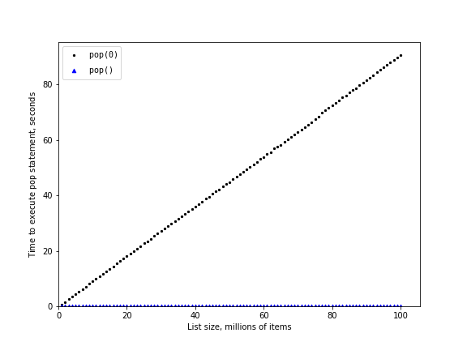

# 2.6. 列表

**2.6. Lists**

=== "中文"
    
    Python 的设计者在实现列表数据结构时有很多选择。每个选择都会影响列表操作的执行速度。为了做出正确的选择，他们考察了人们最常使用列表数据结构的方式，并优化了列表的实现，使最常见的操作非常快速。当然，他们也试图让不太常见的操作更快，但当必须在不同操作的性能之间做出取舍时，往往会牺牲不常见操作的性能，优先优化常见操作的性能。
    
    两种常见的操作是索引访问和索引赋值。无论列表多大，这两种操作所花费的时间都是相同的。当一个操作与列表的大小无关时，它的时间复杂度是 $O(1)$。
    
    另一项非常常见的编程任务是扩展列表。可以通过两种方式来创建一个更长的列表：使用 `append` 方法或使用连接操作符。`append` 方法的时间复杂度是 $O(1)$。然而，连接操作符的时间复杂度是 $O(k)$，其中 $k$ 是被连接的列表的大小。了解这一点很重要，因为它可以帮助你选择合适的工具，从而让程序更高效。
    
    让我们来看看生成一个包含从 0 开始的 `n` 个数字的列表的四种不同方式。首先，我们将尝试使用 `for` 循环，通过连接来创建列表，然后我们使用 `append` 方法代替连接操作。接下来，我们尝试使用列表推导式创建列表，最后，也许是最明显的方法，使用 `range` 函数，并通过 `list` 构造函数将其包装起来。`列表 3` 显示了这四种生成列表的代码。
    
    ```python title="列表 3"
    def test1():
        l = []
        for i in range(1000):
            l = l + [i]
    
    
    def test2():
        l = []
        for i in range(1000):
            l.append(i)
    
    
    def test3():
        l = [i for i in range(1000)]
    
    
    def test4():
        l = list(range(1000))
    ```

    为了记录我们每个函数的执行时间，我们将使用 Python 的 ``timeit`` 模块。``timeit`` 模块旨在让 Python 开发者在跨平台的环境下进行时间测量，通过在一致的环境中运行函数，并使用尽可能相似的计时机制来跨操作系统进行精确的时间比较。
    
    要使用 ``timeit``，你需要创建一个 ``Timer`` 对象，其参数是两个 Python 语句。第一个参数是你想要计时的 Python 语句；第二个参数是设置测试的语句，只运行一次。然后，``timeit`` 模块将对语句执行若干次并计时。默认情况下，``timeit`` 会尝试执行语句一百万次。执行完成后，它会返回一个浮点数，表示执行这些语句的总秒数。然而，由于它执行了一百万次，你可以将结果理解为执行一次测试所需的微秒数。你还可以通过传递一个名为 ``number`` 的参数来指定测试语句执行的次数。下面的例子展示了我们如何记录每个测试函数执行一千次的时间。
    
    ```python
    from timeit import Timer
    
    
    t1 = Timer("test1()", "from __main__ import test1")
    print(f"concatenation: {t1.timeit(number=1000):15.2f} milliseconds")
    t2 = Timer("test2()", "from __main__ import test2")
    print(f"appending: {t2.timeit(number=1000):19.2f} milliseconds")
    t3 = Timer("test3()", "from __main__ import test3")
    print(f"list comprehension: {t3.timeit(number=1000):10.2f} milliseconds")
    t4 = Timer("test4()", "from __main__ import test4")
    print(f"list range: {t4.timeit(number=1000):18.2f} milliseconds")
    
    concatenation:           6.54 milliseconds
    appending:               0.31 milliseconds
    list comprehension:      0.15 milliseconds
    list range:              0.07 milliseconds
    ```
    
    在上面的实验中，我们计时的语句是对 ``test1()``, ``test2()`` 等函数的调用。设置语句可能看起来有点奇怪，所以我们详细解释一下。你可能已经很熟悉 ``from...import`` 语句，但它通常在 Python 程序文件的开头使用。在这里，语句 ``from __main__ import test1`` 将函数 ``test1`` 从 ``__main__`` 命名空间导入到 ``timeit`` 为计时实验设置的命名空间中。``timeit`` 模块这样做是为了确保计时测试在一个干净的环境中进行，不受你可能创建的杂乱变量的干扰，从而避免它们在未预见的情况下影响函数的性能。
    
    从上面的实验可以看出，``append`` 操作的时间为 0.31 毫秒，远远快于连接操作的 6.54 毫秒。我们还展示了另外两种创建列表的方法：使用带有 ``range`` 调用的列表构造函数和列表推导式。值得注意的是，列表推导式的速度是使用 ``append`` 操作的 ``for`` 循环的两倍。
    
    关于这个小实验的最后一个观察是，所有你看到的时间都包括了实际调用测试函数的开销，但我们可以假设所有四个测试中的函数调用开销是相同的，因此我们仍然可以对操作进行有意义的比较。因此，准确地说，连接操作本身并不是花费 6.54 毫秒，而是连接测试函数花费了 6.54 毫秒。作为一个练习，你可以测试调用空函数所需的时间，并从上面的数字中减去那个值。
    
    现在我们已经看到如何具体地衡量性能，你可以查看 `表 2`，了解所有基本列表操作的 Big O 效率。在仔细思考 `表 2` 之后，你可能会对 ``pop`` 的两种不同时间感到好奇。当在列表的末尾调用 ``pop`` 时，它的时间复杂度是 $O(1)$，但当在列表的第一个元素或中间某处调用 ``pop`` 时，它的时间复杂度是 $O(n)$。这背后的原因在于 Python 选择如何实现列表。当从列表的开头删除一个元素时，列表中的所有其他元素都会向前移动一个位置。你现在可能觉得这有点不合理，但如果你查看 `表 2`，你会发现这种实现方式允许索引操作的时间复杂度为 $O(1)$。这是 Python 设计者认为不错的一种权衡。
    
    **表 2：Python 列表操作的 Big O 效率**
    
    | 操作                          | Big O 效率 |
    | ----------------------------- | ---------- |
    | ``index []``                  | O(1)       |
    | ``index 赋值(assignment)``    | O(1)       |
    | ``append``                    | O(1)       |
    | ``pop()``                     | O(1)       |
    | ``pop(i)``                    | O(n)       |
    | ``insert(i, item)``           | O(n)       |
    | ``del 操作符(operator)``      | O(n)       |
    | ``遍历(iteration)``           | O(n)       |
    | ``包含 (in)``                 | O(n)       |
    | ``切片获取 [x:y](get slice)`` | O(k)       |
    | ``切片删除(del slice)``       | O(n)       |
    | ``切片赋值(set slice)``       | O(n+k)     |
    | ``反转(reverse)``             | O(n)       |
    | ``连接(concatenate)``         | O(k)       |
    | ``排序(sort)``                | O(n log n) |
    | ``乘法(multiply)``            | O(nk)      |
    
    为了展示性能的差异，让我们使用 ``timeit`` 模块进行另一个实验。我们的目标是验证在已知大小的列表上调用 ``pop`` 操作时，从列表末尾弹出和从列表开头弹出的性能差异。我们还希望测量不同大小的列表的时间。我们预期的结果是，随着列表的增长，从列表末尾弹出的时间保持不变，而从列表开头弹出的时间会随着列表的增长而增加。
    
    `列表 4` 显示了一种测量 ``pop`` 不同用法性能的尝试。正如你从这个例子中看到的，从末尾弹出需要 0.00014 毫秒，而从开头弹出需要 2.09779 毫秒。对于包含两百万个元素的列表，这个差异是 15,000 倍。
    
    在 `列表 4` 中，有几件值得注意的事情。首先是语句 ``from __main__ import x``。尽管我们没有定义函数，但我们确实想在测试中使用列表对象 x。这个方法允许我们仅对单个 ``pop`` 语句进行计时，并获得该操作的最精确时间。由于计时器会重复一千次，因此还需指出的是，每次循环中列表的大小都会减少一个元素。不过由于初始列表有两百万个元素，因此整体大小只减少了 $0.05\%$。
    
    ```python title="列表 4"
    pop_zero = Timer("x.pop(0)", "from __main__ import x")
    pop_end = Timer("x.pop()", "from __main__ import x")
    
    x = list(range(2000000))
    print(f"pop(0): {pop_zero.timeit(number=1000):10.5f} milliseconds")
    
    x = list(range(2000000))
    print(f"pop(): {pop_end.timeit(number=1000):11.5f} milliseconds")
    
    pop(0):    2.09779 milliseconds
    pop():     0.00014 milliseconds
    ```
    
    虽然我们的第一次测试确实表明 ``pop(0)`` 比 ``pop()`` 慢，但它并没有验证 ``pop(0)`` 是 $O(n)$ 而 ``pop()`` 是 $O(1)$ 的说法。为了验证这一点，我们需要在不同大小的列表上测试这两种调用的性能。`列表 5` 实现了这个测试。
    
    ```python title="列表 5"
    pop_zero = Timer("x.pop(0)", "from __main__ import x")
    pop_end = Timer("x.pop()", "from __main__ import x")
    print(f"{'n':10s}{'pop(0)':>15s}{'pop()':>15s}")
    for i in range(1_000_000, 100_000_001, 1_000_000):
        x = list(range(i))
        pop_zero_t = pop_zero.timeit(number=1000)
        x = list(range(i))
        pop_end_t = pop_end.timeit(number=1000)
        print(f"{i:<10d}{pop_zero_t:>15.5f}{pop_end_t:>15.5f}")
    ```
    
    `图 3` 显示了我们的实验结果。你可以看到，随着列表越来越长，``pop(0)`` 所花的时间也增加，而 ``pop`` 的时间几乎没有变化。这正是我们期望从 $O(n)$ 和 $O(1
    
    )$ 算法中看到的结果。
    
    <figure markdown="span">
        { width="300" }
        <figcaption markdown="span">图 3：比较 ``pop`` 和 ``pop(0)`` 的性能</figcaption>
    </figure>   
    
    我们的实验中可能存在的一些误差来源包括：在我们测量代码时，计算机上运行的其他进程可能会拖慢程序速度，因此即使我们尝试将其他活动降到最低，也难免会出现一些时间上的波动。这也是为什么循环会运行一千次，以便统计收集足够的信息来使测量结果更加可靠。

=== "英文"

    The designers of Python had many choices to make when they implemented the list data structure. Each of these choices could have an impact on how fast list operations perform. To help them make the right choices they looked at the ways that people would most commonly use the list data structure, and they optimized their implementation of a list so that the most common operations were very fast. Of course they also tried to make the less common operations fast, but when a trade-off had to be made the performance of a less common operation was often sacrificed in favor of the more common operation.
    
    Two common operations are indexing and assigning to an index position. Both of these operations take the same amount of time no matter how large the list becomes. When an operation like this is independent of the size of the list, it is $O(1)$.
    
    Another very common programming task is to grow a list. There are two ways to create a longer list. You can use the append method or the concatenation operator. The `append` method is $O(1)$. However, the concatenation operator is $O(k)$ where $k$ is the size of the list that is being concatenated. This is important for you to know because it can help you make your own programs more efficient by choosing the right tool for the job.
    
    Let's look at four different ways we might generate a list of `n` numbers starting with 0. First we’ll try a `for` loop and create the list by concatenation, then we’ll use `append` rather than concatenation. Next, we’ll try creating the list using list comprehension and finally, and perhaps the most obvious way, using the range function wrapped by a call to the list constructor. `Listing 3` shows the code for making our list four different ways.
    
    ```python title="Listing 3"
    def test1():
        l = []
        for i in range(1000):
            l = l + [i]
    
    
    def test2():
        l = []
        for i in range(1000):
            l.append(i)
    
    
    def test3():
        l = [i for i in range(1000)]
    
    
    def test4():
        l = list(range(1000))
    ```
    
    To capture the time it takes for each of our functions to execute we will use Python’s ``timeit`` module. The ``timeit`` module is designed to allow Python developers to make cross-platform timing measurements by running functions in a consistent environment and using timing mechanisms that are as similar as possible across operating systems.
    
    To use ``timeit`` you create a ``Timer`` object whose parameters are two Python statements. The first parameter is a Python statement that you want to time; the second parameter is a statement that will run once to set up the test. The ``timeit`` module will then time how long it takes to execute the statement some number of times. By default ``timeit`` will try to run the statement one million times. When it's done it returns the time as a floating-point value representing the total number of seconds. However, since it executes the statement a million times, you can read the result as the number of microseconds to execute the test one time. You can also pass ``timeit`` a named parameter called ``number`` that allows you to specify how many times the test statement is executed. The following session shows how long it takes to run each of our test functions a thousand times.
    
    ```python
    from timeit import Timer
    
    
    t1 = Timer("test1()", "from __main__ import test1")
    print(f"concatenation: {t1.timeit(number=1000):15.2f} milliseconds")
    t2 = Timer("test2()", "from __main__ import test2")
    print(f"appending: {t2.timeit(number=1000):19.2f} milliseconds")
    t3 = Timer("test3()", "from __main__ import test3")
    print(f"list comprehension: {t3.timeit(number=1000):10.2f} milliseconds")
    t4 = Timer("test4()", "from __main__ import test4")
    print(f"list range: {t4.timeit(number=1000):18.2f} milliseconds")
    
    concatenation:           6.54 milliseconds
    appending:               0.31 milliseconds
    list comprehension:      0.15 milliseconds
    list range:              0.07 milliseconds
    ```
    
    In the experiment above the statement that we are timing is the function call to ``test1()``, ``test2()``, and so on. The setup statement may look very strange to you, so let’s consider it in more detail. You are probably very familiar with the ``from...import`` statement, but this is usually used at the beginning of a Python program file. In this case the statement ``from __main__ import test1`` imports the function ``test1`` from the ``__main__`` namespace into the namespace that ``timeit`` sets up for the timing experiment. The ``timeit`` module does this because it wants to run the timing tests in an environment that is uncluttered by any stray variables you may have created that may interfere with your function’s performance in some unforeseen way.
    
    From the experiment above it is clear that the ``append`` operation at 0.31 milliseconds is much faster than concatenation at 6.54 milliseconds. We also show the times for two additional methods for creating a list: using the list constructor with a call to ``range`` and a list comprehension. It is interesting to note that the list comprehension is twice as fast as a ``for`` loop with an ``append`` operation.
    
    One final observation about this little experiment is that all of the times that you see above include some overhead for actually calling the test function, but we can assume that the function call overhead is identical in all four cases so we still get a meaningful comparison of the operations. So it would not be accurate to say that the concatenation operation takes 6.54 milliseconds but rather the concatenation test function takes 6.54 milliseconds. As an exercise you could test the time it takes to call an empty function and subtract that from the numbers above.
    
    Now that we have seen how performance can be measured concretely, you can look at `Table 2` to see the Big O efficiency of all the basic list operations. After thinking carefully about `Table 2`, you may be wondering about the two different times for ``pop``. When ``pop`` is called on the end of the list it takes $O(1)$, but when ``pop`` is called on the first element in the list---or anywhere in the middle it---is $O(n)$ The reason for this lies in how Python chooses to implement lists. When an item is taken from the front of the list, all the other elements in the list are shifted one position closer to the beginning. This may seem silly to you now, but if you look at `Table 2` you will see that this implementation also allows the index operation to be $O(1)$. This is a tradeoff that the Python designers thought was a good one.
    
    **Table 2: Big O Efficiency of Python List Operators**
    
    
    | Operation            | Big O Efficiency |
    | -------------------- | ---------------- |
    | ``index []``         | O(1)             |
    | ``index assignment`` | O(1)             |
    | ``append``           | O(1)             |
    | ``pop()``            | O(1)             |
    | ``pop(i)``           | O(n)             |
    | ``insert(i, item)``  | O(n)             |
    | ``del operator``     | O(n)             |
    | ``iteration``        | O(n)             |
    | ``contains (in)``    | O(n)             |
    | ``get slice [x:y]``  | O(k)             |
    | ``del slice``        | O(n)             |
    | ``set slice``        | O(n+k)           |
    | ``reverse``          | O(n)             |
    | ``concatenate``      | O(k)             |
    | ``sort``             | O(n log n)       |
    | ``multiply``         | O(nk)            |
    
    As a way of demonstrating this difference in performance, let’s do another experiment using the ``timeit`` module. Our goal is to be able to verify the performance of the ``pop`` operation on a list of a known size when the program pops from the end of the list, and again when the program pops from the beginning of the list. We will also want to measure this time for lists of different sizes. What we would expect to see is that the time required to pop from the end of the list will stay constant even as the list grows in size, while the time to pop from the beginning of the list will continue to increase as the list grows.
    
    `Listing 4` shows one attempt to measure the difference between the two uses of ``pop``. As you can see from this first example, popping from the end takes 0.00014 milliseconds, whereas popping from the beginning takes 2.09779 milliseconds. For a list of two million elements this is a factor of 15,000.
    
    There are a couple of things to notice about `Listing 4`. The first is the statement ``from __main__ import x``. Although we did not define a function, we do want to be able to use the list object x in our test. This approach allows us to time just the single ``pop`` statement and get the most accurate measure of the time for that single operation. Because the timer repeats a thousand times, it is also important to point out that the list is decreasing in size by one each time through the loop. But since the initial list is two million elements in size, we only reduce the overall size by $0.05\%$.
    
    ```python title="Listing 4"
    pop_zero = Timer("x.pop(0)", "from __main__ import x")
    pop_end = Timer("x.pop()", "from __main__ import x")
    
    x = list(range(2000000))
    print(f"pop(0): {pop_zero.timeit(number=1000):10.5f} milliseconds")
    
    x = list(range(2000000))
    print(f"pop(): {pop_end.timeit(number=1000):11.5f} milliseconds")
    
    pop(0):    2.09779 milliseconds
    pop():     0.00014 milliseconds
    ```
    
    While our first test does show that ``pop(0)`` is indeed slower than ``pop()``, it does not validate the claim that ``pop(0)`` is $O(n)$ while ``pop()`` is $O(1)$. To validate that claim we need to look at the performance of both calls over a range of list sizes. `Listing 5` implements this test.
    
    ```python title="Listing 5"
    pop_zero = Timer("x.pop(0)", "from __main__ import x")
    pop_end = Timer("x.pop()", "from __main__ import x")
    print(f"{'n':10s}{'pop(0)':>15s}{'pop()':>15s}")
    for i in range(1_000_000, 100_000_001, 1_000_000):
        x = list(range(i))
        pop_zero_t = pop_zero.timeit(number=1000)
        x = list(range(i))
        pop_end_t = pop_end.timeit(number=1000)
        print(f"{i:<10d}{pop_zero_t:>15.5f}{pop_end_t:>15.5f}")
    ```
    
    `Figure 3` shows the results of our experiment. You can see that as the list gets longer and longer the time it takes to ``pop(0)`` also increases while the time for ``pop`` stays very flat. This is exactly what we would expect to see for an $O(n)$ and $O(1)$ algorithm.
    
    <figure markdown="span">
      { width="300" }
      <figcaption markdown="span">Figure 3: Comparing the Performance of ``pop`` and ``pop(0)``</figcaption>
    </figure>   
    
    Among the sources of error in our little experiment is the fact that there are other processes running on the computer as we measure that may slow down our code, so even though we try to minimize other things happening on the computer there is bound to be some variation in time. That is why the loop runs the test one thousand times in the first place to statistically gather enough information to make the measurement reliable.