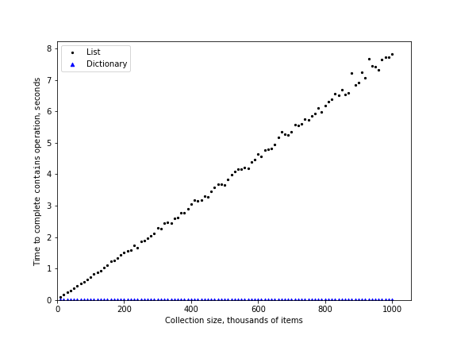

# 2.7. 字典

**2.7. Dictionaries**

=== "中文"

    第二种主要的 Python 数据结构是字典。正如你可能记得的，字典与列表的不同之处在于，你可以通过键来访问字典中的元素，而不是通过位置。在本书的后面章节中，你会看到实现字典的许多方式。此时最重要的是注意字典中的 ``获取元素`` 和 ``设置元素`` 操作的时间复杂度都是 $O(1)$。另一个重要的字典操作是 ``包含`` 操作，检查一个键是否在字典中也是 $O(1)$。所有字典操作的效率总结在 `表 3` 中。关于字典性能的一个重要注释是，表中给出的效率是平均性能。在一些罕见的情况下，``包含``、``获取元素`` 和 ``设置元素`` 操作可能会退化为 $O(n)$，但我们会在第 8 章讨论字典可能的不同实现方式时详细说明。
    
    **表 3：Python 字典操作的 Big O 效率**
    
    | 操作                      | Big O 效率 |
    | ------------------------- | ---------- |
    | ``复制(copy)``            | O(n)       |
    | ``获取元素(get item)``    | O(1)       |
    | ``设置元素(set item)``    | O(1)       |
    | ``删除元素(delete item)`` | O(1)       |
    | ``包含 (in)``             | O(1)       |
    | ``迭代(iteration)``       | O(n)       |
    
    在我们最后的性能实验中，我们将比较列表和字典的 ``包含`` 操作的性能。我们会验证列表的 ``包含`` 操作是 $O(n)$，而字典的 ``包含`` 操作是 $O(1)$。我们将使用一个简单的实验来比较这两者：创建一个包含数字范围的列表，然后随机挑选数字，检查该数字是否在列表中。如果我们的性能表是正确的，那么列表越大，确定某个数字是否在列表中的时间应该越长。
    
    我们将对一个包含数字作为键的字典重复相同的实验。在这个实验中，我们会看到确定某个数字是否在字典中的速度不仅要快得多，而且随着字典变大，检查所需的时间应该保持不变。
    
    `列表 6` 实现了这个比较。注意我们执行的是完全相同的操作，``number in container``。区别在于第 8 行的 ``x`` 是一个列表，而第 10 行的 ``x`` 是一个字典。
    
    ```python title="列表 6" linenums="1"
    import timeit
    import random
    
    print(f"{'n':10s}{'list':>10s}{'dict':>10s}")
    for i in range(10_000, 1_000_001, 20_000):
        t = timeit.Timer(f"random.randrange({i}) in x", 
        "from __main__ import random, x")
        x = list(range(i))
        lst_time = t.timeit(number=1000)
        x = {j: None for j in range(i)}
        dict_time = t.timeit(number=1000)
        print(f"{i:<10,}{lst_time:>10.3f}{dict_time:>10.3f}")
    ```
    
    `图 4` 总结了运行 `列表 6` 的结果。你可以看到字典始终更快。对于包含 10,000 个元素的最小列表，字典比列表快 89.4 倍。对于包含 990,000 个元素的最大列表，字典比列表快 11,603 倍！你还可以看到，列表上 ``包含`` 操作的时间随着列表大小呈线性增长。这验证了列表上 ``包含`` 操作是 $O(n)$。还可以看出，字典上 ``包含`` 操作的时间即使在字典大小增长时也是恒定的。事实上，对于大小为 10,000 的字典，``包含`` 操作耗时 0.004 毫秒，而对于大小为 990,000 的字典，``包含`` 操作同样耗时 0.004 毫秒。
    
    <figure markdown="span">
        { width="300" }
        <figcaption markdown="span">图 4：比较 Python 列表和字典的 ``in`` 操作</figcaption>
    </figure>
    
    由于 Python 是一种不断发展的语言，幕后总是在进行一些变化。关于 Python 数据结构性能的最新信息可以在 Python 网站上找到。截至本文撰写时，Python Wiki 上有一个关于 **时间复杂度** 的页面，你可以访问 [Time Complexity Wiki](http://wiki.python.org/moin/TimeComplexity) 了解更多。
    
    !!! info "自测"
        
        === "活动：2.7.1 选择题"
    
            以下列表操作中，哪一个不是 O(1)？
    
            - [ ] a: a_list.pop(0)
            - [ ] b: a_list.pop()
            - [ ] c: a_list.append()
            - [ ] d: a_list[10]
            - [ ] e: 上述所有操作都是 O(1)
    
            正确答案：a
    
            - [ ] 反馈 a: 当你删除列表的第一个元素时，列表中的所有其他元素必须前移。
            - [ ] 反馈 b: 从列表末尾删除元素是一个常量操作。
            - [ ] 反馈 c: 向列表末尾添加元素是一个常量操作。
            - [ ] 反馈 d: 索引列表是一个常量操作。
            - [ ] 反馈 e: 有一个操作需要移动列表中的所有其他元素。
        
        === "活动：2.7.2 选择题"
    
            以下字典操作中，哪个是 O(1)？
    
            - [ ] a: "x" in a_dict
            - [ ] b: del a_dict["x"]
            - [ ] c: a_dict["x"] == 10
            - [ ] d: a_dict["x"] = a_dict["x"] + 1
            - [ ] e: 上述所有操作都是 O(1)
    
            正确答案：e
    
            - [ ] 反馈 a: 在字典中使用 `in` 是一个常量操作，因为你不需要遍历整个字典，但有更好的答案。
            - [ ] 反馈 b: 从字典中删除元素是一个常量操作，但有更好的答案。
            - [ ] 反馈 c: 为字典键赋值是一个常量操作，但有更好的答案。
            - [ ] 反馈 d: 重新为字典键赋值是一个常量操作，但有更好的答案。
            - [ ] 反馈 e: 唯一不是 O(1) 的字典操作是那些需要迭代的操作。
    
    <iframe id="pythonopsperf" data-component="youtube" class="align-left youtube-video" data-video-height="315" data-question_label="2.7.3" data-video-width="560" data-video-videoid="zKq8iVEX6gU" data-video-divid="pythonopsperf" data-video-start="0" data-video-end="-1" frameborder="0" allowfullscreen="" allow="accelerometer; autoplay; clipboard-write; encrypted-media; gyroscope; picture-in-picture; web-share" referrerpolicy="strict-origin-when-cross-origin" title="pythonops" width="560" height="315" src="https://www.youtube.com/embed/zKq8iVEX6gU?start=0&amp;enablejsapi=1&amp;origin=https%3A%2F%2Frunestone.academy&amp;widgetid=1"></iframe>

=== "英文"

    The second major Python data structure is the dictionary. As you probably recall, dictionaries differ from lists in that you can access items in a dictionary by a key rather than a position. Later in this book you will see that there are many ways to implement a dictionary. The thing that is most important to notice right now is that the ``get item`` and ``set item`` operations on a dictionary are $O(1)$. Another important dictionary operation is the ``contains`` operation. Checking to see whether a key is in the dictionary or not is also $O(1)$. The efficiency of all dictionary operations is summarized in `Table 3`. One important side note on dictionary performance is that the efficiencies we provide in the table are for average performance. In some rare cases the ``contains``, ``get item``, and ``set item`` operations can degenerate into $O(n)$ performance, but we will get into that in Chapter 8 when we talk about the different ways that a dictionary could be implemented.
    
    **Table 3: Big O Efficiency of Python Dictionary Operations**
    
        
    | Operation         | Big O Efficiency |
    | ----------------- | ---------------- |
    | ``copy``          | O(n)             |
    | ``get item``      | O(1)             |
    | ``set item``      | O(1)             |
    | ``delete item``   | O(1)             |
    | ``contains (in)`` | O(1)             |
    | ``iteration``     | O(n)             |
    
    For our last performance experiment we will compare the performance of the contains operation between lists and dictionaries. In the process we will confirm that the contains operator for lists is $O(n)$ and the contains operator for dictionaries is $O(1)$. The experiment we will use to compare the two is simple: we’ll make a list with a range of numbers in it, then we will pick numbers at random and check to see if the numbers are in the list. If our performance tables are correct, the bigger the list, the longer it should take to determine if any one number is contained in the list.
    
    We will repeat the same experiment for a dictionary that contains numbers as the keys. In this experiment we should see that determining whether or not a number is in the dictionary is not only much faster, but the time it takes to check should remain constant even as the dictionary grows larger.
    
    `Listing 6` implements this comparison. Notice that we are performing exactly the same operation, ``number in container``. The difference is that on line 8 ``x`` is a list, and on line 10 ``x`` is a dictionary.
    
    
    ```python title="Listing 6" linenums="1"
    
    import timeit
    import random
    
    print(f"{'n':10s}{'list':>10s}{'dict':>10s}")
    for i in range(10_000, 1_000_001, 20_000):
        t = timeit.Timer(f"random.randrange({i}) in x", 
        "from __main__ import random, x")
        x = list(range(i))
        lst_time = t.timeit(number=1000)
        x = {j: None for j in range(i)}
        dict_time = t.timeit(number=1000)
        print(f"{i:<10,}{lst_time:>10.3f}{dict_time:>10.3f}")
    ```
    
    `Figure 4` summarizes the results of running `Listing 6`. You can see that the dictionary is consistently faster. For the smallest list size of 10,000 elements a dictionary is 89.4 times faster than a list. For the largest list size of 990,000 elements the dictionary is 11,603 times faster! You can also see that the time it takes for the ``contains`` operator on the list grows linearly with the size of the list. This verifies the assertion that the ``contains`` operator on a list is :math:`O(n)`. It can also be seen that the time for the ``contains`` operator on a dictionary is constant even as the dictionary size grows. In fact, for a dictionary size of 10,000 the ``contains`` operation took 0.004 milliseconds, and for the dictionary size of 990,000 it also took 0.004 milliseconds.
    
    <figure markdown="span">
      { width="300" }
      <figcaption markdown="span">Figure 4: Comparing the ``in`` Operator for Python Lists and Dictionaries</figcaption>
    </figure>
       
    
    Since Python is an evolving language, there are always changes going on behind the scenes. The latest information on the performance of Python data structures can be found on the Python website. As of this writing the Python wiki has a nice **time complexity** page that can be found at the [Time Complexity Wiki](http://wiki.python.org/moin/TimeComplexity).
    
    !!! info "Self Check"
        
        === "Activity: 2.7.1 Multiple Choice"
    
            Which of the list operations shown below is not O(1)?
            
            - [ ] a: a_list.pop(0)
            - [ ] b: a_list.pop()
            - [ ] c: a_list.append()
            - [ ] d: a_list[10]
            - [ ] e: all of the above are O(1)
            
            correct: a
           
            - [ ] feedback a: When you remove the first element of a list, all the other elements of the list must be shifted forward.
            - [ ] feedback b: Removing an element from the end of the list is a constant operation.
            - [ ] feedback c: Appending to the end of the list is a constant operation
            - [ ] feedback d: Indexing a list is a constant operation
            - [ ] feedback e: There is one operation that requires all other list elements to be moved.
        
        === "Activity: 2.7.2 Multiple Choice"
    
            Which of the dictionary operations shown below is O(1)?
    
            - [ ] a: "x" in a_dict
            - [ ] b: del a_dict["x"]
            - [ ] c: a_dict["x"] == 10
            - [ ] d: a_dict["x"] = a_dict["x"] + 1
            - [ ] e: all of the above are O(1)
            
            correct: e
            
            - [ ] feedback a: in is a constant operation for a dictionary because you do not have to iterate but there is a better answer.
            - [ ] feedback b: deleting an element from a dictionary is a constant operation but there is a better answer.
            - [ ] feedback c: Assignment to a dictionary key is constant but there is a better answer.
            - [ ] feedback d: Re-assignment to a dictionary key is constant but there is a better answer.
            - [ ] feedback e: The only dictionary operations that are not O(1) are those that require iteration.

    <iframe id="pythonopsperf" data-component="youtube" class="align-left youtube-video" data-video-height="315" data-question_label="2.7.3" data-video-width="560" data-video-videoid="zKq8iVEX6gU" data-video-divid="pythonopsperf" data-video-start="0" data-video-end="-1" frameborder="0" allowfullscreen="" allow="accelerometer; autoplay; clipboard-write; encrypted-media; gyroscope; picture-in-picture; web-share" referrerpolicy="strict-origin-when-cross-origin" title="pythonops" width="560" height="315" src="https://www.youtube.com/embed/zKq8iVEX6gU?start=0&amp;enablejsapi=1&amp;origin=https%3A%2F%2Frunestone.academy&amp;widgetid=1"></iframe>