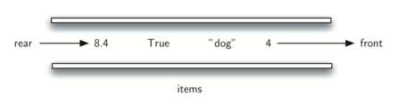

# 3.10. 队列

**3.10. Queues**

原文: <https://runestone.academy/ns/books/published/pythonds3/BasicDS/WhatIsaQueue.html?mode=browsing>

=== "中文"

    **队列** 是一种有序的项目集合，其中新项目的添加发生在一个端点，称为 *尾部*，而现有项目的移除发生在另一个端点，通常称为 *前端*。当一个元素进入队列时，它从尾部开始，向前移动，直到成为下一个被移除的元素时才会被处理。
    
    队列中最近添加的项目必须在集合的末尾等待。而在集合中存在时间最长的项目位于前端。这种排序原则有时被称为 **FIFO**，即 **先进先出**。它也被称为 *先到先得*。
    
    队列的最简单示例是我们都参与过的典型排队场景。我们在排队等电影，我们在超市结账时排队，我们在餐厅排队（以便可以取餐盘）。排队或者说队列的行为是非常严格的，只有一个入口和一个出口。你不能插队，也不能在等待到前面之前就离开。
    
    计算机科学中也有队列的常见例子。`Figure 1` 显示了一个简单的 Python 数据对象队列。我们的计算机实验室有 30 台计算机连接到一台打印机。当学生们想要打印时，他们的打印任务会“排队”在其他等待的打印任务之后。第一个进入队列的任务是下一个被完成的任务。如果你在队列的最后，你必须等所有其他任务完成之后才能打印。我们会在稍后详细探讨这个有趣的例子。
    
    <figure markdown="span">
        
        <figcaption>图 1：Python 数据对象队列</figcaption>
    </figure>
    
    除了打印队列，操作系统还使用多种不同的队列来控制计算机内部的进程。下一步做什么通常基于一个队列算法，该算法试图尽可能快速地执行程序，并服务于尽可能多的用户。此外，当我们输入时，有时按键操作会在屏幕上出现的字符之前。这是由于计算机在那一刻正在做其他工作。按键操作被放置在一个类似队列的缓冲区中，以便最终能够按照正确的顺序显示在屏幕上。

=== "英文"

    A **queue** is an ordered collection of items where the addition of new items happens at one end, called the *rear*, and the removal of existing items occurs at the other end, commonly called the *front*. As an element enters the queue it starts at the rear and makes its way toward the front, waiting until that time when it is the next element to be removed.
    
    The most recently added item in the queue must wait at the end of the collection. The item that has been in the collection the longest is at the front. This ordering principle is sometimes called **FIFO**, **first in, first out**. It is also known as *first come, first served*.
    
    The simplest example of a queue is the typical line that we all participate in from time to time. We wait in a line for a movie, we wait in the checkout line at a grocery store, and we wait in the cafeteria line (so that we can pop the tray stack). Well-behaved lines, or queues, are very restrictive in that they have only one way in and only one way out. There is no jumping in the middle and no leaving before you have waited the necessary amount of time to get to the front.
    
    Computer science also has common examples of queues. `Figure 1`  shows a simple queue of Python data objects. Our computer laboratory has 30 computers networked with a single printer. When students want to print, their print tasks “get in line” with all the other printing tasks that are waiting. The first task in is the next to be completed. If you are last in line, you must wait for all the other tasks to print ahead of you. We will explore this interesting example in more detail later.
        
    <figure markdown="span">
        
        <figcaption>Figure 1: A Queue of Python Data Objects</figcaption>
    </figure>
    
    In addition to printing queues, operating systems use a number of different queues to control processes within a computer. The scheduling of what gets done next is typically based on a queuing algorithm that tries to execute programs as quickly as possible and serve as many users as it can. Also, as we type, sometimes keystrokes get ahead of the characters that appear on the screen. This is due to the computer doing other work at that moment. The keystrokes are being placed in a queue-like buffer so that they can eventually be displayed on the screen in the proper order.