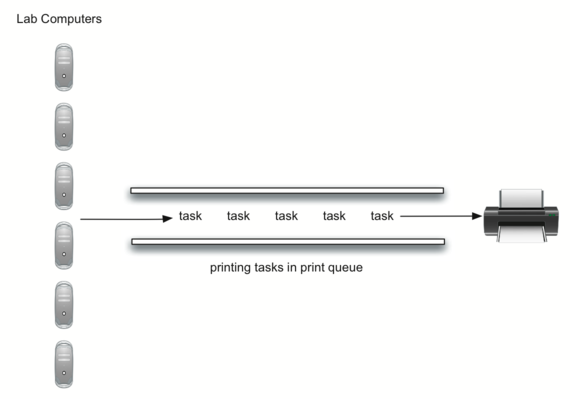

# 3.14. 队列模拟：打印任务

**3.14. Queue Simulation: Printing Tasks**

原文: <https://runestone.academy/ns/books/published/pythonds3/BasicDS/SimulationPrintingTasks.html?mode=browsing>

=== "中文"

    一个更有趣的模拟可以让我们研究之前描述的打印队列的行为。回顾一下，当学生将打印任务发送到共享打印机时，这些任务会被放入队列中，按先到先服务的方式处理。在这种配置中会出现许多问题。其中最重要的可能是打印机是否能够处理一定量的工作。如果不能，学生可能需要等待很长时间，甚至错过下一节课。
    
    考虑以下计算机实验室的情况。在任何一个普通的工作日，实验室里大约有 10 个学生在使用计算机。这些学生通常在这一时间段内打印两次，任务长度从 1 到 20 页不等。实验室中的打印机较旧，能够以每分钟 10 页的速度处理草稿质量的打印。如果切换到更高质量的打印，速度将降为每分钟 5 页。较慢的打印速度可能会让学生等待太久。那么，应该使用什么样的页面打印速度呢？
    
    我们可以通过构建一个模拟模型来决定。我们需要为学生、打印任务和打印机构建表示（见 `Figure 4`）。当学生提交打印任务时，我们将它们添加到等待列表中，即附加到打印机的打印任务队列。当打印机完成一个任务时，它会查看队列，看看是否还有剩余的任务需要处理。我们关心的是学生等待打印任务完成的平均时间。这等于任务在队列中等待的平均时间。
    
    <figure markdown="span">
        
        <figcaption>Figure 4: 计算机实验室打印队列</figcaption>
    </figure>
    
    为了模拟这种情况，我们需要使用一些概率。例如，学生可能会打印长度从 1 到 20 页的文件。如果每种长度出现的概率相同，可以通过生成 1 到 20 之间的随机数来模拟实际的打印任务长度。这意味着任何长度从 1 到 20 出现的机会是相等的。
    
    如果实验室里有 10 个学生，每个人打印两次，那么平均每小时有 20 个打印任务。那么，在任何给定的秒数内，创建一个打印任务的概率是多少呢？回答这个问题的方法是考虑任务与时间的比率。每小时 20 个任务意味着平均每 180 秒会有一个任务产生：
    
    $\frac {20\ tasks}{1\ hour} \times \frac {1\ hour} {60\ minutes} \times \frac {1\ minute} {60\ seconds}=\frac {1\ task} {180\ seconds}$
    
    对于每一秒，我们可以通过生成一个 1 到 180 之间的随机数来模拟打印任务的发生机会。如果生成的数字是 180，则表示任务已被创建。注意，可能会有多个任务连续创建，或者我们可能需要等待很长时间才能出现一个任务。这就是模拟的本质。你想要尽可能真实地模拟实际情况，前提是你了解一般参数。

=== "英文"

    A more interesting simulation allows us to study the behavior of the printing queue described earlier in this section. Recall that as students send printing tasks to the shared printer, the tasks are placed in a queue to be processed in a first come, first served manner. Many questions arise with this configuration. The most important of these might be whether the printer is capable of handling a certain amount of work. If it cannot, students will be waiting too long for printing and may miss their next class.
    
    Consider the following situation in a computer science laboratory. On any average day about 10 students are working in the lab at any given hour. These students typically print up to twice during that time, and the length of these tasks ranges from 1 to 20 pages. The printer in the lab is older, capable of processing 10 pages per minute of draft quality. The printer could be switched to give better quality, but then it would produce only five pages per minute. The slower printing speed could make students wait too long. What page rate should be used?
    
    We could decide by building a simulation that models the laboratory. We will need to construct representations for students, printing tasks, and the printer (`Figure 4`). As students submit printing tasks, we will add them to a waiting list, a queue of print tasks attached to the printer. When the printer completes a task, it will look at the queue to see if there are any remaining tasks to process. Of interest for us is the average amount of time students will wait for their papers to be printed. This is equal to the average amount of time a task waits in the queue.
    
    <figure markdown="span">
        
        <figcaption>Figure 4: Computer Science Laboratory Printing Queue</figcaption>
    </figure>
    
    To model this situation we need to use some probabilities. For example, students may print a paper from 1 to 20 pages in length. If each length from 1 to 20 is equally likely, the actual length for a print task can be simulated by using a random number between 1 and 20 inclusive. This means that there is equal chance of any length from 1 to 20 appearing. 
    
    If there are 10 students in the lab and each prints twice, then there are 20 print tasks per hour on average. What is the chance that at any given second, a print task is going to be created? The way to answer this is to consider the ratio of tasks to time. Twenty tasks per hour means that on average there will be one task every 180 seconds:
    
    $\frac {20\ tasks}{1\ hour} \times \frac {1\ hour}  {60\ minutes} \times \frac {1\ minute} {60\ seconds}=\frac {1\ task} {180\ seconds}$
    
    For every second we can simulate the chance that a print task occurs by generating a random number between 1 and 180 inclusive. If the number is 180, we say a task has been created. Note that it is possible that many tasks could be created in a row or we may wait quite a while for a task to appear. That is the nature of simulation. You want to simulate the real situation as closely as possible given that you know general parameters.

## 3.14.1. 主要模拟步骤

**3.14.1. Main Simulation Steps**

=== "中文"

    以下是主要的模拟步骤：
    
    1. 创建一个打印任务的队列。每个任务在到达时都会被赋予一个时间戳。队列开始时是空的。
    
    2. 对于每一秒（``current_second``）：
    
        - 检查是否创建了新的打印任务？如果是，将其添加到队列中，并以``current_second``作为时间戳。
    
        - 如果打印机没有忙碌且有任务在等待，
    
            - 从打印队列中移除下一个任务，并将其分配给打印机。
    
            - 从``current_second``中减去时间戳，以计算该任务的等待时间。
    
            - 将该任务的等待时间附加到一个列表中，以便后续处理。
    
            - 根据打印任务的页数，计算所需的打印时间。
        
        - 如果需要，打印机现在进行一秒钟的打印。同时将该任务所需的时间减少一秒。
        
        - 如果任务已完成，即所需的时间已降至零，则打印机不再忙碌。
    
    3. 模拟完成后，从生成的等待时间列表中计算平均等待时间。

=== "英文"

    Here is the main simulation.
    
    1. Create a queue of print tasks. Each task will be given a timestamp upon its arrival. The queue is empty to start.
    
    2. For each second (``current_second``):
    
        -  Does a new print task get created? If so, add it to the queue with the ``current_second`` as the timestamp.
    
        -  If the printer is not busy and if a task is waiting,
    
            -  Remove the next task from the print queue and assign it to the printer.
    
            -  Subtract the timestamp from the ``current_second`` to compute the waiting time for that task.
    
            -  Append the waiting time for that task to a list for later processing.
    
            -  Based on the number of pages in the print task, figure out how much time will be required.
        
        -  The printer now does one second of printing if necessary. It also subtracts one second from the time required for that task.
        
        -  If the task has been completed, in other words the time required has reached zero, the printer is no longer busy.
    
    3. After the simulation is complete, compute the average waiting time from the list of waiting times generated.

## 3.14.2. Python实现

**3.14.2. Python Implementation**

=== "中文"
    
    以下是主要的模拟内容：
    
    为了设计这个模拟，我们将创建三个表示实际对象的类：``Printer``（打印机）、``Task``（任务）和``PrintQueue``（打印队列）。
    
    ``Printer`` 类（`Listing 2`）需要跟踪是否有当前任务。如果有，则表示打印机正在忙碌（第13-17行），并且可以根据任务的页数计算所需的时间。构造函数还允许初始化每分钟页数设置。``tick`` 方法会减少内部计时器，并在任务完成时将打印机设置为空闲状态（第11行）。
    
    ```python title="Listing 2" linenums="1"
    class Printer:
        def __init__(self, ppm):
            self.page_rate = ppm
            self.current_task = None
            self.time_remaining = 0
    
        def tick(self):
            if self.current_task is not None:
                self.time_remaining = self.time_remaining - 1
                if self.time_remaining <= 0:
                    self.current_task = None
    
        def busy(self):
            return self.current_task is not None
    
        def start_next(self, new_task):
            self.current_task = new_task
            self.time_remaining = new_task.get_pages() * 60 / self.page_rate
    ```
    
    ``Task`` 类（`Listing 3`）将表示一个单一的打印任务。当任务被创建时，随机数生成器将提供一个1到20页的长度。我们选择使用 ``random`` 模块的 ``randrange`` 函数。
    
    ```pycon
    >>> import random
    >>> random.randrange(1,21)
    18
    >>> random.randrange(1,21)
    8
    >>>
    ```
    
    每个任务还需要保持一个时间戳，用于计算等待时间。这个时间戳表示任务创建并放入打印队列的时间。``wait_time`` 方法可以用来检索任务在打印开始之前在队列中等待的时间。
    
    ```python title="Listing 3" linenums="1"
    import random
    
    
    class Task:
        def __init__(self, time):
            self.timestamp = time
            self.pages = random.randrange(1, 21)
    
        def get_stamp(self):
            return self.timestamp
    
        def get_pages(self):
            return self.pages
    
        def wait_time(self, current_time):
            return current_time - self.timestamp
    ```
    
    主要模拟（`Listing 4`）实现了上述算法。``print_queue`` 对象是我们现有队列ADT的一个实例。一个布尔辅助函数 ``new_print_task`` 决定是否创建了新的打印任务。我们再次选择使用 ``random`` 模块的 ``randrange`` 函数来返回1到180之间的随机整数。打印任务每180秒到达一次。通过在随机整数范围内任意选择180（第31行），我们可以模拟这个随机事件。模拟函数允许我们设置总时间和打印机的每分钟页数。
    
    ```python title="Listing 4" linenums="1"
    import random
    from pythonds3.basic import Queue
    
    
    def simulation(num_seconds, pages_per_minute):
        lab_printer = Printer(pages_per_minute)
        print_queue = Queue()
        waiting_times = []
    
        for current_second in range(num_seconds):
            if new_print_task():
                task = Task(current_second)
                print_queue.enqueue(task)
    
            if (not lab_printer.busy()) and (not print_queue.is_empty()):
                nexttask = print_queue.dequeue()
                waiting_times.append(nexttask.wait_time(current_second))
                lab_printer.start_next(nexttask)
    
            lab_printer.tick()
    
        average_wait = sum(waiting_times) / len(waiting_times)
        print(
            f"Average Wait {average_wait:6.2f} secs" \
            + f"{print_queue.size():3d} tasks remaining."
        )
    
    
    def new_print_task():
        num = random.randrange(1, 181)
        return num == 180
    
    
    for i in range(10):
        simulation(3600, 5)
    ```
    
    当我们运行模拟时，不必担心每次结果都不同。这是由于随机数的概率特性。我们感兴趣的是在调整模拟参数时可能出现的趋势。以下是一些结果。
    
    首先，我们将模拟运行60分钟（3,600秒），打印速度为每分钟5页。此外，我们将运行10次独立的试验。请记住，由于模拟使用随机数，每次运行将返回不同的结果。
    
    ```pycon
    >>> for i in range(10):
    ...     simulation(3600, 5)
    ... 
    Average Wait 165.38 secs 2 tasks remaining.
    Average Wait  95.07 secs 1 tasks remaining.
    Average Wait  65.05 secs 2 tasks remaining.
    Average Wait  99.74 secs 1 tasks remaining.
    Average Wait  17.27 secs 0 tasks remaining.
    Average Wait 239.61 secs 5 tasks remaining.
    Average Wait  75.11 secs 1 tasks remaining.
    Average Wait  48.33 secs 0 tasks remaining.
    Average Wait  39.31 secs 3 tasks remaining.
    Average Wait 376.05 secs 1 tasks remaining.
    >>> 
    ```
    
    在进行10次试验后，我们可以看到平均等待时间是 (165.38 + 95.07 + 65.05 + 99.74 + 17.27 + 239.61 + 75.11 + 48.33 + 39.31 + 376.05) / 10 = 122.09秒。您还可以看到平均等待时间的变化很大，最小平均等待时间为17.27秒，最大为376.05秒。您还可能注意到，在仅有两个情况下，所有任务都被完成了。
    
    现在我们将打印速度调整为每分钟10页，并再次运行10次试验。希望通过更快的打印速度，更多任务能够在一小时的时间框架内完成。
    
    ```pycon
    >>> for i in range(10):
    ...     simulation(3600, 10)
    ... 
    Average Wait   1.29 secs 0 tasks remaining.
    Average Wait   7.00 secs 0 tasks remaining.
    Average Wait  28.96 secs 1 tasks remaining.
    Average Wait  13.55 secs 0 tasks remaining.
    Average Wait  12.67 secs 0 tasks remaining.
    Average Wait   6.46 secs 0 tasks remaining.
    Average Wait  22.33 secs 0 tasks remaining.
    Average Wait  12.39 secs 0 tasks remaining.
    Average Wait   7.27 secs 0 tasks remaining.
    Average Wait  18.17 secs 0 tasks remaining.
    >>> 
    ```
    
    您可以在 ActiveCode 2 中自己运行这个模拟。

=== "英文"
    
    To design this simulation we will create classes for the three real-world objects described above: ``Printer``, ``Task``, and ``PrintQueue``.
    
    The ``Printer`` class (`Listing 2`) will need to track whether it has a current task. If it does, then it is busy (lines 13–17) and the amount of time needed can be computed from the number of pages in the task. The constructor will also allow the pages-per-minute setting to be initialized. The ``tick`` method decrements the internal timer and sets the printer to idle (line 11) if the task is completed.
    
    ```python title="Listing 2" linenums="1"
    class Printer:
        def __init__(self, ppm):
            self.page_rate = ppm
            self.current_task = None
            self.time_remaining = 0
    
        def tick(self):
            if self.current_task is not None:
                self.time_remaining = self.time_remaining - 1
                if self.time_remaining <= 0:
                    self.current_task = None
    
        def busy(self):
            return self.current_task is not None
    
        def start_next(self, new_task):
            self.current_task = new_task
            self.time_remaining = new_task.get_pages() * 60 / self.page_rate
    ```
    
    The ``Task`` class (`Listing 3`) will represent a single printing task. When the task is created, a random number generator will provide a length from 1 to 20 pages. We have chosen to use the ``randrange`` function from the ``random`` module.
    
    ```pycon
    >>> import random
    >>> random.randrange(1,21)
    18
    >>> random.randrange(1,21)
    8
    >>>
    ```
    
    Each task will also need to keep a timestamp to be used for computing waiting time. This timestamp will represent the time that the task was created and placed in the printer queue. The ``wait_time`` method can then be used to retrieve the amount of time spent in the queue before printing begins.
    
    ```python title="Listing 3" linenums="1"
    import random
    
    
    class Task:
        def __init__(self, time):
            self.timestamp = time
            self.pages = random.randrange(1, 21)
    
        def get_stamp(self):
            return self.timestamp
    
        def get_pages(self):
            return self.pages
    
        def wait_time(self, current_time):
            return current_time - self.timestamp
    ```
    
    The main simulation (`Listing 4`) implements the algorithm described above. The ``print_queue`` object is an instance of our existing queue ADT. A boolean helper function, ``new_print_task``, decides whether a new printing task has been created. We have again chosen to use the ``randrange`` function from the ``random`` module to return a random integer between 1 and 180. Print tasks arrive once every 180 seconds. By arbitrarily choosing 180 from the range of random integers (line 31), we can simulate this random event. The simulation function allows us to set the total time and the pages per minute for the printer.
    
    ```python title="Listing 4" linenums="1"
    import random
    from pythonds3.basic.queue Queue
    
    
    def simulation(num_seconds, pages_per_minute):
        lab_printer = Printer(pages_per_minute)
        print_queue = Queue()
        waiting_times = []
    
        for current_second in range(num_seconds):
            if new_print_task():
                task = Task(current_second)
                print_queue.enqueue(task)
    
            if (not lab_printer.busy()) and (not print_queue.is_empty()):
                nexttask = print_queue.dequeue()
                waiting_times.append(nexttask.wait_time(current_second))
                lab_printer.start_next(nexttask)
    
            lab_printer.tick()
    
        average_wait = sum(waiting_times) / len(waiting_times)
        print(
            f"Average Wait {average_wait:6.2f} secs" \
            + f"{print_queue.size():3d} tasks remaining."
        )
    
    
    def new_print_task():
        num = random.randrange(1, 181)
        return num == 180
    
    
    for i in range(10):
        simulation(3600, 5)
    ```
    
    When we run the simulation, we should not be concerned that the results are different each time. This is due to the probabilistic nature of the random numbers. We are interested in the trends that may be occurring as the parameters to the simulation are adjusted. Here are some results.
    
    First, we will run the simulation for a period of 60 minutes (3,600 seconds) using a page rate of five pages per minute. In addition, we will run 10 independent trials. Remember that because the simulation works with random numbers each run will return different results.
    
    ```pycon
    >>> for i in range(10):
    ...     simulation(3600, 5)
    ... 
    Average Wait 165.38 secs 2 tasks remaining.
    Average Wait  95.07 secs 1 tasks remaining.
    Average Wait  65.05 secs 2 tasks remaining.
    Average Wait  99.74 secs 1 tasks remaining.
    Average Wait  17.27 secs 0 tasks remaining.
    Average Wait 239.61 secs 5 tasks remaining.
    Average Wait  75.11 secs 1 tasks remaining.
    Average Wait  48.33 secs 0 tasks remaining.
    Average Wait  39.31 secs 3 tasks remaining.
    Average Wait 376.05 secs 1 tasks remaining.
    >>> 
    ```
        
    
    After running our 10 trials we can see that the mean average wait time is (165.38 + 95.07 + 65.05 + 99.74 + 17.27 + 239.61 + 75.11 + 48.33 + 39.31 + 376.05) / 10 = 122.09 seconds. You can also see that there is a large variation in the average wait time with a minimum average of 17.27 seconds and a maximum of 376.05 seconds. You may also notice that in only two of the cases were all the tasks completed.
    
    Now we will adjust the page rate to 10 pages per minute and run the 10 trials again. With a faster page rate, our hope would be that more tasks would be completed in the one-hour time frame.
    
    ```pycon
    >>> for i in range(10):
    ...     simulation(3600, 10)
    ... 
    Average Wait   1.29 secs 0 tasks remaining.
    Average Wait   7.00 secs 0 tasks remaining.
    Average Wait  28.96 secs 1 tasks remaining.
    Average Wait  13.55 secs 0 tasks remaining.
    Average Wait  12.67 secs 0 tasks remaining.
    Average Wait   6.46 secs 0 tasks remaining.
    Average Wait  22.33 secs 0 tasks remaining.
    Average Wait  12.39 secs 0 tasks remaining.
    Average Wait   7.27 secs 0 tasks remaining.
    Average Wait  18.17 secs 0 tasks remaining.
    >>> 
    ```
    
    You can run the simulation for yourself in ActiveCode 2.
    
    
    ```python title="Activity: 3.14.2.1 Printer Queue Simulation" linenums="1"
    import random
    from pythonds3.basic import Queue
    
    
    class Printer:
        def __init__(self, ppm):
            self.page_rate = ppm
            self.current_task = None
            self.time_remaining = 0
    
        def tick(self):
            if self.current_task is not None:
                self.time_remaining = self.time_remaining - 1
                if self.time_remaining <= 0:
                    self.current_task = None
    
        def busy(self):
            return self.current_task is not None
    
        def start_next(self, new_task):
            self.current_task = new_task
            self.time_remaining = new_task.get_pages() * 60 / self.page_rate
    
    
    class Task:
        def __init__(self, time):
            self.timestamp = time
            self.pages = random.randrange(1, 21)
    
        def get_stamp(self):
            return self.timestamp
    
        def get_pages(self):
            return self.pages
    
        def wait_time(self, current_time):
            return current_time - self.timestamp
    
    
    def simulation(num_seconds, pages_per_minute):
        lab_printer = Printer(pages_per_minute)
        print_queue = Queue()
        waiting_times = []
    
        for current_second in range(num_seconds):
            if new_print_task():
                task = Task(current_second)
                print_queue.enqueue(task)
    
            if (not lab_printer.busy()) and (not print_queue.is_empty()):
                nexttask = print_queue.dequeue()
                waiting_times.append(nexttask.wait_time(current_second))
                lab_printer.start_next(nexttask)
    
            lab_printer.tick()
    
        average_wait = sum(waiting_times) / len(waiting_times)
        print("Average Wait %6.2f secs %3d tasks remaining." % (average_wait, print_queue.size()))
    
    
    def new_print_task():
        num = random.randrange(1, 181)
        return num == 180
    
    
    for i in range(10):
        simulation(3600, 5)
    ```

## 3.14.3. 讨论

**3.14.3. Discussion**

=== "中文"

    我们试图回答一个问题，即如果当前打印机设置为更高质量但打印速度较慢，是否能处理任务负载。我们采取的方法是编写一个模拟程序，将打印任务建模为不同长度和到达时间的随机事件。
    
    上面的输出显示，当打印速度为每分钟5页时，平均等待时间从最低17秒到最高376秒（约6分钟）不等。使用更快的打印速度时，最低值为1秒，最高值仅为28秒。此外，在每分钟5页的情况下，10次运行中的8次在一小时结束时仍有打印任务在队列中等待。
    
    因此，我们可能会认为，降低打印机速度以获得更高质量可能不是一个好主意。学生们不能等待那么长时间才能打印完他们的文件，特别是当他们需要赶往下节课时。六分钟的等待时间简直太长了。
    
    这种类型的模拟分析可以回答许多问题，通常称为“假设问题”。我们只需改变模拟中使用的参数，就可以模拟任何数量的有趣行为。例如，
    
    - 如果入学人数增加，平均学生人数增加20%会怎样？
    
    - 如果是周六，学生们不需要上课？他们能承受等待吗？
    
    - 如果平均打印任务的大小减少，因为Python是一种强大的语言，程序通常较短呢？
    
    这些问题都可以通过修改上述模拟来回答。然而，重要的是要记住，模拟的效果仅取决于用于构建它的假设。有关每小时打印任务数量和每小时学生数量的真实数据对于构建一个稳健的模拟是必要的。
    
    !!! info "自我检查"
    
        你会如何修改打印机模拟以反映更多的学生？假设学生人数翻了一番。你可能需要对这个模拟是如何构建的做一些合理的假设，但你会改变什么？修改代码。同时假设平均打印任务的长度减少了一半。更改代码以反映这一变化。最后，如何将学生人数参数化，而不是改变代码，我们希望将学生人数作为模拟的参数。
    
    ```python title="Activity: 3.14.3.1 ActiveCode" linenums="1"
    import random
    from pythonds3.basic import Queue
    
    
    class Printer:
        def __init__(self, ppm):
            self.page_rate = ppm
            self.current_task = None
            self.time_remaining = 0
    
        def tick(self):
            if self.current_task is not None:
                self.time_remaining = self.time_remaining - 1
                if self.time_remaining <= 0:
                    self.current_task = None
    
        def busy(self):
            return self.current_task is not None
    
        def start_next(self, new_task):
            self.current_task = new_task
            self.time_remaining = new_task.get_pages() * 60 / self.page_rate
    
    
    class Task:
        def __init__(self, time):
            self.timestamp = time
            self.pages = random.randrange(1, 21)
    
        def get_stamp(self):
            return self.timestamp
    
        def get_pages(self):
            return self.pages
    
        def wait_time(self, current_time):
            return current_time - self.timestamp
    
    
    def simulation(num_seconds, pages_per_minute, num_students):
        lab_printer = Printer(pages_per_minute)
        print_queue = Queue()
        waiting_times = []
    
        for current_second in range(num_seconds):
            if new_print_task(num_students):
                task = Task(current_second)
                print_queue.enqueue(task)
    
            if (not lab_printer.busy()) and (not print_queue.is_empty()):
                nexttask = print_queue.dequeue()
                waiting_times.append(nexttask.wait_time(current_second))
                lab_printer.start_next(nexttask)
    
            lab_printer.tick()
    
        average_wait = sum(waiting_times) / len(waiting_times) if waiting_times else 0
        print("Average Wait %6.2f secs %3d tasks remaining." % (average_wait, print_queue.size()))
    
    
    def new_print_task(num_students):
        num = random.randrange(1, 181)
        return num == 180 / num_students
    
    
    for i in range(10):
        simulation(3600, 5, 2)  # Example with doubled number of students
    ```

=== "英文"

    We were trying to answer a question about whether the current printer could handle the task load if it were set to print with a better quality but slower page rate. The approach we took was to write a simulation that modeled the printing tasks as random events of various lengths and arrival times.
    
    The output above shows that with 5 pages per minute printing, the average waiting time varied from a low of 17 seconds to a high of 376 seconds (about 6 minutes). With a faster printing rate, the low value was 1 second with a high of only 28. In addition, in 8 out of 10 runs at 5 pages per minute there were print tasks still waiting in the queue at the end of the hour.
    
    Therefore, we are perhaps persuaded that slowing the printer down to get better quality may not be a good idea. Students cannot afford to wait that long for their papers, especially when they need to be getting on to their next class. A six-minute wait would simply be too long.
    
    This type of simulation analysis allows us to answer many questions, commonly known as what-if questions. All we need to do is vary the parameters used by the simulation and we can simulate any number of interesting behaviors. For example,
    
    -  What if enrollment goes up and the average number of students increases by 20?
    
    -  What if it is Saturday and students do not need to get to class? Can they afford to wait?
    
    -  What if the size of the average print task decreases since Python is such a powerful language and programs tend to be much shorter?
    
    These questions could all be answered by modifying the above simulation. However, it is important to remember that the simulation is only as good as the assumptions that are used to build it. Real data about the number of print tasks per hour and the number of students per hour was necessary to construct a robust simulation.
    
    !!! info "Self Check"
    
        How would you modify the printer simulation to reflect a larger number of students?  Suppose that the number of students was doubled.  You make need to make some reasonable assumptions about how this simulation was put together but what would you change?  Modify the code.  Also suppose that the length of the average print task was cut in half.  Change the code to reflect that change.  Finally How would you parametertize the number of students, rather than changing the code we would like to make the number of students a parameter of the simulation.
        
        ```python  title="Activity: 3.14.3.1 ActiveCode" linenums="1"
        import random
        from pythonds3.basic import Queue
    
    
        class Printer:
            def __init__(self, ppm):
                self.page_rate = ppm
                self.current_task = None
                self.time_remaining = 0
    
            def tick(self):
                if self.current_task is not None:
                    self.time_remaining = self.time_remaining - 1
                    if self.time_remaining <= 0:
                        self.current_task = None
    
            def busy(self):
                return self.current_task is not None
    
            def start_next(self, new_task):
                self.current_task = new_task
                self.time_remaining = new_task.get_pages() * 60 / self.page_rate
    
    
        class Task:
            def __init__(self, time):
                self.timestamp = time
                self.pages = random.randrange(1, 21)
    
            def get_stamp(self):
                return self.timestamp
    
            def get_pages(self):
                return self.pages
    
            def wait_time(self, current_time):
                return current_time - self.timestamp
    
    
        def simulation(num_seconds, pages_per_minute):
            lab_printer = Printer(pages_per_minute)
            print_queue = Queue()
            waiting_times = []
    
            for current_second in range(num_seconds):
                if new_print_task():
                    task = Task(current_second)
                    print_queue.enqueue(task)
    
                if (not lab_printer.busy()) and (not print_queue.is_empty()):
                    nexttask = print_queue.dequeue()
                    waiting_times.append(nexttask.wait_time(current_second))
                    lab_printer.start_next(nexttask)
    
                lab_printer.tick()
    
            average_wait = sum(waiting_times) / len(waiting_times)
            print("Average Wait %6.2f secs %3d tasks remaining." % (average_wait, print_queue.size()))
    
    
        def new_print_task():
            num = random.randrange(1, 181)
            return num == 180
    
    
        for i in range(10):
            simulation(3600, 5)
        ```