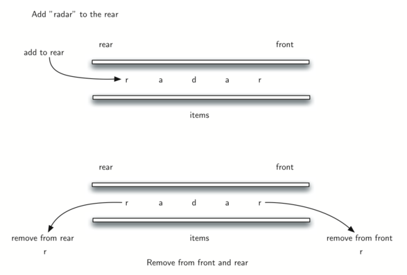

# 3.18. 回文检测器

**3.18. Palindrome Checker**

=== "中文"

    一个有趣的问题是使用双端队列（deque）数据结构来解决经典的回文问题。**回文**是指一个字符串从前向后读和从后向前读都相同，例如 *radar*、*toot* 和 *madam*。我们想构造一个算法来输入一个字符字符串，并检查它是否是回文。
    
    这个问题的解决方案将使用双端队列来存储字符串的字符。我们将从左到右处理字符串，并将每个字符添加到双端队列的后端。此时，双端队列将类似于一个普通的队列。然而，我们可以利用双端队列的双重功能。双端队列的前端将保存字符串的第一个字符，而后端将保存最后一个字符（见 `Figure 2`）。
    
    <figure markdown="span">
        
        <figcaption>Figure 2: 双端队列</figcaption>
    </figure>
        
    由于我们可以直接从双端队列的前端和后端移除字符，我们可以将它们进行比较，并仅在它们匹配时继续。如果我们能够持续匹配首尾字符，最终要么会耗尽字符，要么会剩下一个大小为 1 的双端队列，具体取决于原始字符串的长度是偶数还是奇数。在这两种情况下，字符串必须是回文。完整的回文检查函数如下 `ActiveCode 1`。
    
    ```python title="Activity: 3.18.1 A Palindrome Checker Using Deque" linenums="1"
    from pythonds3.basic import Deque
    
    
    def pal_checker(a_string):
        char_deque = Deque()
    
        for ch in a_string:
            char_deque.add_rear(ch)
    
        while char_deque.size() > 1:
            first = char_deque.remove_front()
            last = char_deque.remove_rear()
            if first != last:
                return False
    
        return True
    
    print(pal_checker("lsdkjfskf"))
    print(pal_checker("radar"))
    ```

=== "英文"

    An interesting problem that can be easily solved using the deque data structure is the classic palindrome problem. A **palindrome** is a string that reads the same forward and backward, for example, *radar*, *toot*, and *madam*. We would like to construct an algorithm to input a string of characters and check whether it is a palindrome.
    
    The solution to this problem will use a deque to store the characters of the string. We will process the string from left to right and add each character to the rear of the deque. At this point, the deque will be acting very much like an ordinary queue. However, we can now make use of the dual functionality of the deque. The front of the deque will hold the first character of the string and the rear of the deque will hold the last character (see `Figure 2`).
    
    <figure markdown="span">
        
        <figcaption>Figure 2: A Deque</figcaption>
    </figure>
     
    Since we can remove both of the front and rear characters directly, we can compare them and continue only if they match. If we can keep matching first and the last items, we will eventually either run out of characters or be left with a deque of size 1 depending on whether the length of the original string was even or odd. In either case, the string must be a palindrome. The complete function for palindrome-checking appears in `ActiveCode 1`.
    
    ```python title="Activity: 3.18.1 A Palindrome Checker Using Deque" linenums="1"
    from pythonds3.basic import Deque
    
    
    def pal_checker(a_string):
        char_deque = Deque()
    
        for ch in a_string:
            char_deque.add_rear(ch)
    
        while char_deque.size() > 1:
            first = char_deque.remove_front()
            last = char_deque.remove_rear()
            if first != last:
                return False
    
        return True
    
    print(pal_checker("lsdkjfskf"))
    print(pal_checker("radar"))
    ```