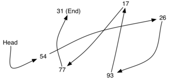
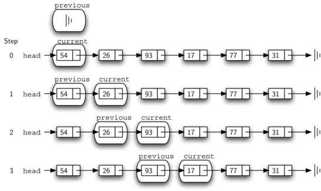

# 3.21. 用链表实现无序列表

**3.21. Implementing an Unordered List: Linked Lists**

原文: <https://runestone.academy/ns/books/published/pythonds3/BasicDS/ImplementinganUnorderedListLinkedLists.html?mode=browsing>

=== "中文"

    为了实现一个无序列表，我们将构造一个通常称为**链表**的数据结构。请记住，我们需要确保能够保持项目的相对位置。然而，并不要求我们在连续的内存中保持这些位置。例如，考虑`图 1`中显示的项目集合。这些值似乎是随机放置的。如果我们可以在每个项目中保持一些显式的信息，即下一个项目的位置（参见`图 2`），那么每个项目的相对位置可以通过简单地跟随从一个项目到下一个项目的链接来表示。
    
    <figure markdown="span">
        
        <figcaption>图 1: 项目不受物理位置的限制</figcaption>
    </figure>
    
    <figure markdown="span">
        
        <figcaption>图 2: 通过显式链接保持相对位置</figcaption>
    </figure>
    
    需要注意的是，列表中第一个项目的位置必须明确指定。一旦知道了第一个项目的位置，第一个项目可以告诉我们第二个项目的位置，以此类推。外部引用通常被称为列表的**头**。类似地，最后一个项目需要知道没有下一个项目。

=== "英文"

    In order to implement an unordered list, we will construct what is commonly known as a **linked list**. Recall that we need to be sure that we can maintain the relative positioning of the items. However, there is no requirement that we maintain that positioning in contiguous memory. For example, consider the collection of items shown in `Figure 1`. It appears that these values have been placed randomly. If we can maintain some explicit information in each item, namely the location of the next item (see `Figure 2`), then the relative position of each item can be expressed by simply following the link from one item to the next.
        
    <figure markdown="span">
        
        <figcaption>Figure 1: Items Not Constrained in Their Physical Placement</figcaption>
    </figure>
    
    <figure markdown="span">
        
        <figcaption>Figure 2: Relative Positions Maintained by Explicit Links</figcaption>
    </figure>
    
    
    
    It is important to note that the location of the first item of the list must be explicitly specified. Once we know where the first item is, the first item can tell us where the second is, and so on. The external reference is often referred to as the **head** of the list. Similarly, the last item needs to know that there is no next item.

## 3.21.1. 节点类

**3.21.1. The Node Class**

=== "中文"
    
    链表实现的基本构建块是**节点**。每个节点对象必须至少包含两个信息。首先，节点必须包含列表项本身。我们将称之为节点的**数据字段**。此外，每个节点必须持有对下一个节点的引用。`Listing 1`展示了Python的实现。要构造一个节点，需要提供节点的初始数据值。以下赋值语句将生成一个包含值`93`的`Node`对象（见`图 3`）。需要注意的是，我们通常将节点对象表示如`图 4`所示。`Node`类中的隐藏字段`_data`和`_next`被转换为属性，可以分别通过`data`和`next`访问。
    
    ```python title="Listing 1" linenums="1"
    class Node:
        """链表节点"""
    
        def __init__(self, node_data):
            self._data = node_data
            self._next = None
    
        def get_data(self):
            """获取节点数据"""
            return self._data
    
        def set_data(self, node_data):
            """设置节点数据"""
            self._data = node_data
    
        data = property(get_data, set_data)
    
        def get_next(self):
            """获取下一个节点"""
            return self._next
    
        def set_next(self, node_next):
            """设置下一个节点"""
            self._next = node_next
    
        next = property(get_next, set_next)
    
        def __str__(self):
            """字符串表示"""
            return str(self._data)
    ```
    
    我们按照通常的方式创建`Node`对象。
    
    ```pycon
    >>> temp = Node(93)
    >>> temp.data
    93
    ```
    
    特殊的Python引用值`None`将在`Node`类中以及后来的链表实现中扮演重要角色。对`None`的引用表示没有下一个节点。请注意，在构造函数中，节点最初创建时`next`被设置为`None`。由于这有时被称为“节点的基础”，我们将使用标准的基础符号表示引用指向`None`。显式地将`None`分配给初始的下一个引用值总是一个好主意。
    
    <figure markdown="span">
        
        <figcaption>图 3: 一个节点对象包含项目和对下一个节点的引用</figcaption>
    </figure>
    
    <figure markdown="span">
        
        <figcaption>图 4: 节点的典型表示</figcaption>
    </figure>

=== "英文"

    The basic building block for the linked list implementation is the **node**. Each node object must hold at least two pieces of information. First, the node must contain the list item itself. We will call this the **data field** of the node. In addition, each node must hold a reference to the next node. `Listing 1` shows the Python implementation. To construct a node, you need to supply the initial data value for the node. Evaluating the assignment statement below will yield a ``Node`` object containing the value ``93`` (see `Figure 3`). You should note that we will typically represent a node object as shown in `Figure 4`. Hidden fields ``_data`` and ``_next`` of the ``Node`` class are turned into properties and can be accessed as ``data`` and ``next`` respectively.
    
    
    ```python title="Listing 1" linenums="1"
    class Node:
        """A node of a linked list"""
    
        def __init__(self, node_data):
            self._data = node_data
            self._next = None
    
        def get_data(self):
            """Get node data"""
            return self._data
    
        def set_data(self, node_data):
            """Set node data"""
            self._data = node_data
    
        data = property(get_data, set_data)
    
        def get_next(self):
            """Get next node"""
            return self._next
    
        def set_next(self, node_next):
            """Set next node"""
            self._next = node_next
    
        next = property(get_next, set_next)
    
        def __str__(self):
            """String"""
            return str(self._data)
    ```
    
    We create ``Node`` objects in the usual way.
    
    ```pycon
    >>> temp = Node(93)
    >>> temp.data
    93
    ```
    
    The special Python reference value ``None`` will play an important role in the ``Node`` class and later in the linked list itself. A reference to ``None`` will denote the fact that there is no next node. Note in the constructor that a node is initially created with ``next`` set to ``None``. Since this is sometimes referred to as “grounding the node,” we will use the standard ground symbol to denote a reference that is referring to ``None``. It is always a good idea to explicitly assign ``None`` to your initial next reference values.
        
    <figure markdown="span">
        
        <figcaption>Figure 3: A Node Object Contains the Item and a Reference to the Next Node</figcaption>
    </figure>
    
    <figure markdown="span">
        
        <figcaption>Figure 4: A Typical Representation for a Node</figcaption>
    </figure>

## 3.21.2. 无序列表类

**3.21.2. The UnorderedList Class**

=== "中文"
    
    正如我们前面所提到的，无序列表将由一系列节点构成，每个节点通过显式引用链接到下一个节点。只要我们知道第一个节点的位置（包含第一个项），之后的每个项都可以通过依次跟随“下一个”链接来找到。考虑到这一点，`UnorderedList` 类必须维护对第一个节点的引用。`Listing 2` 显示了构造函数。请注意，每个列表对象将维护对列表头的单个引用。
    
    ```python title="Listing 2" linenums="1"
    class UnorderedList:
    
        def __init__(self):
            self.head = None
    ```
    
    初始时，当我们构造一个列表时，列表中没有任何项。赋值语句
    
    ```pycon
    >>> my_list = UnorderedList()
    ```
    
    创建了如`图 5`所示的链表表示。正如我们在`Node`类中讨论的，特殊的引用值`None`将再次用于表示列表头不指向任何内容。最终，之前给出的示例列表将被表示为如`图 6`所示的链表。列表的头指向第一个节点，该节点包含列表的第一个项。该节点又持有对下一个节点（下一个项）的引用，依此类推。非常重要的一点是，列表类本身不包含任何节点对象。它只包含对链表结构中第一个节点的单个引用。
    
    <figure markdown="span">
        
        <figcaption>图 5: 空列表</figcaption>
    </figure>
    
    <figure markdown="span">
        
        <figcaption>图 6: 整数链表</figcaption>
    </figure>
    
    `is_empty` 方法，如`Listing 3`所示，简单地检查列表的头是否引用`None`。布尔表达式`self.head == None`的结果只有在链表中没有节点时才为真。由于新列表是空的，构造函数和空检查必须是一致的。这展示了使用引用`None`来表示链表结构末尾的优点。在Python中，`None`可以与任何引用进行比较。如果两个引用都指向相同的对象，则它们相等。我们将在其余的方法中经常使用这一点。
    
    ```python title="Listing 3"
    def is_empty(self):
        return self.head == None
    ```
    
    那么，我们如何将项添加到列表中呢？我们需要实现`add`方法。然而，在此之前，我们需要解决一个重要的问题，即在链表中将新项放置在哪里。由于该列表是无序的，新项相对于列表中其他项的具体位置并不重要。新项可以放在任何地方。考虑到这一点，将新项放在最简单的位置是有意义的。
    
    请记住，链表结构提供了唯一的入口点，即列表的头。所有其他节点只能通过访问第一个节点，然后跟随“下一个”链接来到达。这意味着，添加新节点的最简单位置是列表的头部，或开始部分。换句话说，我们将新项作为列表的第一个项，并且现有项需要链接到这个新的第一个项，使其跟随。
    
    如`图 6`所示的链表是通过多次调用`add`方法构建的。
    
    ```pycon
    >>> my_list.add(31)
    >>> my_list.add(77)
    >>> my_list.add(17)
    >>> my_list.add(93)
    >>> my_list.add(26)
    >>> my_list.add(54)
    ```
    
    注意，由于`31`是添加到列表中的第一个项，它最终将成为链表中的最后一个节点，因为所有其他项都被添加在它之前。此外，由于`54`是最后一个添加的项，它将成为链表中第一个节点的数据值。
    
    `add`方法如`Listing 4`所示。列表中的每个项必须位于一个节点对象中。第2行创建一个新节点，并将项作为其数据。现在我们必须通过将新节点链接到现有结构中来完成过程。这需要两个步骤，如`图 7`所示。第1步（第3行）将新节点的“下一个”引用更改为指向旧的第一个节点。现在，列表的其余部分已正确附加到新节点上，我们可以修改列表的头以指向新节点。第4行的赋值语句设置了列表的头。
    
    ```python title="Listing 4" linenums="1"
    def add(self, item):
        temp = Node(item)
        temp.set_next(self.head)
        self.head = temp
    ```
    
    <figure markdown="span">
        
        <figcaption>图 7: 添加新节点是一个两步过程</figcaption>
    </figure>
    
    上述两个步骤的顺序非常重要。如果第3行和第4行的顺序被颠倒了，会发生什么？如果首先修改列表的头，结果可以在`图 8`中看到。由于头是链表节点的唯一外部引用，所有原始节点都被丢失，无法再访问。
    
    <figure markdown="span">
        
        <figcaption>图 8: 颠倒两个步骤的顺序的结果</figcaption>
    </figure>
    
    接下来我们将实现的方法——`size`、`search` 和 `remove`——都基于一种称为**链表遍历**的技术。*遍历*指的是系统地访问每个节点的过程。为此，我们使用一个外部引用，该引用从列表中的第一个节点开始。当我们访问每个节点时，我们通过“遍历”下一个引用来移动引用到下一个节点。
    
    要实现 `size` 方法，我们需要遍历链表并统计节点的数量。`Listing 5` 显示了计数链表中节点数量的 Python 代码。外部引用名为 `current`，在第 2 行初始化为链表的头部。在开始时，我们还没有访问任何节点，因此计数被设置为 0。第 4 行到第 6 行实际实现了遍历操作。只要当前引用没有到达链表的末尾（`None`），我们就通过第 6 行的赋值语句将 `current` 移动到下一个节点。再次强调，将引用与 `None` 比较非常有用。每次 `current` 移动到一个新节点时，我们就将 `count` 加 1。最后，在迭代停止后返回 `count`。`Figure 9` 显示了这个过程如何沿链表向下进行。
    
    ```python title="Listing 5" linenums="1"
    def size(self):
        current = self.head
        count = 0
        while current is not None:
            count = count + 1
            current = current.next
    
        return count
    ```
    
    <figure markdown="span">
        
        <figcaption>Figure 9: 从头到尾遍历链表</figcaption>
    </figure>
    
    在链表实现的无序列表中查找一个值也使用遍历技术。在访问链表中的每个节点时，我们会检查存储的数据是否与我们要查找的项目匹配。在这种情况下，我们可能不需要遍历到链表的末尾。事实上，如果我们到达链表的末尾，那么我们要找的项一定不在链表中。另外，如果找到项，就没有必要继续遍历。
    
    `Listing 6` 显示了 `search` 方法的实现。与 `size` 方法一样，遍历初始化为从链表的头部开始（第 2 行）。只要还有更多节点需要访问，我们就继续遍历。第 4 行的问题是检查当前节点中是否存在数据项。如果存在，我们立即返回 `True`。
    
    ```python title="Listing 6" linenums="1"
    def search(self, item):
        current = self.head
        while current is not None:
            if current.data == item:
                return True
            current = current.next
    
        return False
    ```
    
    例如，考虑调用 `search` 方法查找项 17。
    
    ```pycon
    >>> my_list.search(17)
    True
    ```
    
    由于 `17` 在列表中，遍历过程只需要移动到包含 `17` 的节点。在那时，第 4 行的条件为 `True`，我们返回搜索的结果。`Figure 10` 显示了成功查找值 17 的过程。
    
    <figure markdown="span">
        
        <figcaption>Figure 10: 成功查找值 17</figcaption>
    </figure>
    
    `remove` 方法需要两个逻辑步骤。首先，我们需要遍历链表查找要删除的项。一旦找到项，我们必须将其删除。如果项不在列表中，我们的方法应引发 `ValueError` 异常。
    
    第一步与 `search` 方法非常相似。从外部引用设置为链表的头部开始，我们遍历链表直到发现要删除的项。
    
    当项被找到并跳出循环时，`current` 将引用包含要删除项的节点。但我们如何删除它呢？一种可能性是将项的值替换为某个标记，表示该项不再存在。这个方法的问题是节点的数量将不再与项的数量匹配。更好的方法是通过删除整个节点来移除项。
    
    为了删除包含项的节点，我们需要修改前一个节点中的链接，使其指向 `current` 节点之后的节点。不幸的是，链表没有向后遍历的功能。由于 `current` 引用的是我们想要更改的节点的前一个节点，因此现在更改已经为时已晚。
    
    解决这个困境的方法是使用两个外部引用进行遍历。`current` 将像之前一样，标记遍历的当前位置。新的引用，我们称之为 `previous`，将始终比 `current` 领先一个节点。这样，当 `current` 停在要删除的节点时，`previous` 将引用链表中需要修改的位置。
    
    `Listing 7` 显示了完整的 `remove` 方法。第 2 行到第 3 行为两个引用赋予初始值。请注意，`current` 从链表头开始，正如其他遍历示例一样。然而，`previous` 被假设始终在 `current` 之前一个节点。因此，`previous` 初始值为 `None`，因为头部之前没有节点（参见 `Figure 11`）。
    
    第 6 行到第 7 行询问当前节点中存储的项是否是我们希望删除的项。如果是，我们就跳出循环。如果未找到项，`previous` 和 `current` 必须都向前移动一个节点。再次强调，这两个语句的顺序是至关重要的。`previous` 必须首先移动到 `current` 的位置，然后 `current` 才能移动。这种过程通常被称为 *inchworming*（爬虫式移动），因为 `previous` 必须追赶到 `current` 之前，才能让 `current` 向前移动。`Figure 12` 显示了 `previous` 和 `current` 在查找包含值 17 的节点时的移动情况。
    
    ```python title="Listing 7" linenums="1"
    def remove(self, item):
        current = self.head
        previous = None
    
        while current is not None:
            if current.data == item:
                break
            previous = current
            current = current.next
    
        if current is None:
            raise ValueError("{} is not in the list".format(item))
        if previous is None:
            self.head = current.next
        else:
            previous.next = current.next
    ```
    
    <figure markdown="span">
        
        <figcaption>Figure 11: ``previous`` 和 ``current`` 的初始值</figcaption>
    </figure>
    
    <figure markdown="span">
        
        <figcaption>Figure 12: ``previous`` 和 ``current`` 向下移动链表</figcaption>
    </figure>
    
    完成 `remove` 方法的查找步骤后，我们需要从链表中删除节点。`Figure 13` 显示了必须修改的链接。但是，有一个特殊情况需要处理。如果要删除的项恰好是列表中的第一个项，那么 `current` 将引用链表中的第一个节点。这也意味着 `previous` 将为 `None`。我们之前说过 `previous` 将引用需要修改其 `next` 引用的节点，以完成删除。在这种情况下，需要更改的不是 `previous`，而是链表的头部（参见 `Figure 14`）。另一个特殊情况是项不在列表中。在这种情况下，`current is None` 评估为 `True`，并引发错误。
    
    <figure markdown="span">
        
        <figcaption>Figure 13: 从链表中删除中间的项</figcaption>
    </figure>
    
    <figure markdown="span">
        
        <figcaption>Figure 14: 从链表中删除第一个节点</figcaption>
    </figure>
    
    第 13 行允许我们检查是否处理上述特殊情况。如果 `previous` 没有移动，当循环跳出时，它将仍然具有值 `None`。在这种情况下，链表的头部被修改为引用 `current` 节点之后的节点（第 14 行），有效地从链表中删除第一个节点。然而，如果 `previous` 不是 `None`，要删除的节点在链表的某处。在这种情况下，`previous` 引用提供了必须更改的 `next` 引用的节点。第 16 行修改 `previous` 的 `next` 属性以完成删除。注意，在这两种情况下，引用更改的目标都是 `current.next`。一个常见的问题是这两种情况是否也处理了要删除的项位于链表最后一个节点的情况。我们留给你自己思考。
    
    你可以在 ActiveCode 1 中试用 `UnorderedList` 类。
    
    ```python title="Activity: 3.21.2.1 完整的 UnorderedList 类" linenums="1"
    class Node:
        """链表的节点"""
    
        def __init__(self, node_data):
            self._data = node_data
            self._next = None
    
        def get_data(self):
            """获取节点数据"""
            return self._data
    
        def set_data(self, node_data):
            """设置节点数据"""
            self._data = node_data
    
        data = property(get_data, set_data)
    
        def get_next(self):
            """获取下一个节点"""
            return self._next
    
        def set_next(self, node_next):
            """设置下一个节点"""
            self._next = node_next
    
        next = property(get_next, set_next)
    
        def __str__(self):
            """字符串表示"""
            return str(self._data)
    
    
    class UnorderedList:
        def __init__(self):
            self.head = None
    
        def is_empty(self):
            return self.head == None
    
        def add(self, item):
            temp = Node(item)
            temp.set_next(self.head)
            self.head = temp
    
        def size(self):
            current = self.head
            count = 0
            while current is not None:
                count = count + 1
                current = current.next
    
            return count
    
        def search(self, item):
            current = self.head
            while current is not None:
                if current.data == item:
                    return True
                current = current.next
    
            return False
    
        def remove(self, item):
            current = self.head
            previous = None
    
            while current is not None:
                if current.data == item:
                    break
                previous = current
                current = current.next
    
            if current is None:
                raise ValueError("{} is not in the list".format(item))
            if previous is None:
                self.head = current.next
            else:
                previous.next = current.next
    
    
    my_list = UnorderedList()
    
    my_list.add(31)
    my_list.add(77)
    my_list.add(17)
    my_list.add(93)
    my_list.add(26)
    my_list.add(54)
    
    print(my_list.size())
    print(my_list.search(93))
    print(my_list.search(100))
    
    my_list.add(100)
    print(my_list.search(100))
    print(my_list.size())
    
    my_list.remove(54)
    print(my_list.size())
    my_list.remove(93)
    print(my_list.size())
    my_list.remove(31)
    print(my_list.size())
    print(my_list.search(93))
    
    try:
        my_list.remove(27)
    except ValueError as ve:
        print(ve)
    ```
    
    其余方法 `append`、`insert`、`index` 和 `pop` 留作练习。请记住，每个方法都必须考虑更改是否发生在列表头部或其他地方。此外，`insert`、`index` 和 `pop` 需要我们指定列表的位置。我们将假定位置名称是从 0 开始的整数。
    
    !!! info "自检"
    
        第一部分：为 UnorderedList 实现 `append` 方法。你创建的方法的时间复杂度是多少？
    
        ```python title="self_check_list1"
        class Node:
            """链表的节点"""
        
            def __init__(self, node_data):
                self._data = node_data
                self._next = None
        
            def get_data(self):
                """获取节点数据"""
                return self._data
        
            def set_data(self, node_data):
                """设置节点数据"""
                self._data = node_data
        
            data = property(get_data, set_data)
        
            def get_next(self):
                """获取下一个节点"""
                return self._next
        
            def set_next(self, node_next):
                """设置下一个节点"""
                self._next = node_next
        
            next = property(get_next, set_next)
        
            def __str__(self):
                """字符串表示"""
                return str(self._data)
        
        
        class UnorderedList:
            def __init__(self):
                self.head = None
        
            def is_empty(self):
                return self.head == None
        
            def add(self, item):
                temp = Node(item)
                temp.set_next(self.head)
                self.head = temp
        
            def size(self):
                current = self.head
                count = 0
                while current is not None:
                    count = count + 1
                    current = current.next
        
                return count
        
            def search(self, item):
                current = self.head
                while current is not None:
                    if current.data == item:
                        return True
                    current = current.next
        
                return False
        
            def remove(self, item):
                current = self.head
                previous = None
        
                while current is not None:
                    if current.data == item:
                        break
                    previous = current
                    current = current.next
        
                if current is None:
                    raise ValueError("{} is not in the list".format(item))
                if previous is None:
                    self.head = current.next
                else:
                    previous.next = current.next
        
        
        my_list = UnorderedList()
        ```
    
        第二部分：在前一个问题中，你很可能创建了一个时间复杂度为 O(n) 的 `append` 方法。如果你向 `UnorderedList` 类添加一个实例变量，你可以创建一个时间复杂度为 O(1) 的 `append` 方法。修改你的 `append` 方法，使其时间复杂度为 O(1)。小心！为了正确完成这项任务，你可能需要考虑几个特殊情况，这可能还需要你修改 `add` 方法。
    
        ```python title="self_check_list2"
        class Node:
            """链表的节点"""
        
            def __init__(self, node_data):
                self._data = node_data
                self._next = None
        
            def get_data(self):
                """获取节点数据"""
                return self._data
        
            def set_data(self, node_data):
                """设置节点数据"""
                self._data = node_data
        
            data = property(get_data, set_data)
        
            def get_next(self):
                """获取下一个节点"""
                return self._next
        
            def set_next(self, node_next):
                """设置下一个节点"""
                self._next = node_next
        
            next = property(get_next, set_next)
        
            def __str__(self):
                """字符串表示"""
                return str(self._data)
        
        
        class UnorderedList:
            def __init__(self):
                self.head = None
        
            def is_empty(self):
                return self.head == None
        
            def add(self, item):
                temp = Node(item)
                temp.set_next(self.head)
                self.head = temp
        
            def size(self):
                current = self.head
                count = 0
                while current is not None:
                    count = count + 1
                    current = current.next
        
                return count
        
            def search(self, item):
                current = self.head
                while current is not None:
                    if current.data == item:
                        return True
                    current = current.next
        
                return False
        
            def remove(self, item):
                current = self.head
                previous = None
        
                while current is not None:
                    if current.data == item:
                        break
                    previous = current
                    current = current.next
        
                if current is None:
                    raise ValueError("{} is not in the list".format(item))
                if previous is None:
                    self.head = current.next
                else:
                    previous.next = current.next
        
        
        my_list = UnorderedList()
        ```

=== "英文"

    As we suggested above, the unordered list will be built from a collection of nodes, each linked to the next by explicit references. As long as we know where to find the first node (containing the first item), each item after that can be found by successively following the next links. With this in mind, the ``UnorderedList`` class must maintain a reference to the first node. `Listing 2` shows the constructor. Note that each list object will maintain a single reference to the head of the list.
    
    ```python title="Listing 2" linenums="1"
    class UnorderedList:
    
        def __init__(self):
            self.head = None
    ```
    
    Initially when we construct a list, there are no items. The assignment statement
    
    ```pycon
    >>> my_list = UnorderedList()
    ```
    
    creates the linked list representation shown in `Figure 5`. As we discussed in the ``Node`` class, the special reference ``None`` will again be used to state that the head of the list does not refer to anything. Eventually, the example list given earlier will be represented by a linked list as shown in `Figure 6`. The head of the list refers to the first node which contains the first item of the list. In turn, that node holds a reference to the next node (the next item), and so on. It is very important to note that the list class itself does not contain any node objects. Instead it contains a single reference to only the first node in the linked structure.
        
    <figure markdown="span">
        
        <figcaption>Figure 5: An Empty List</figcaption>
    </figure>
    
    <figure markdown="span">
        
        <figcaption>Figure 6: A Linked List of Integers</figcaption>
    </figure>
    
    The ``is_empty`` method, shown in `Listing 3`, simply checks to see if the head of the list is a reference to ``None``. The result of the boolean expression ``self.head == None`` will only be true if there are no nodes in the linked list. Since a new list is empty, the constructor and the check for empty must be consistent with one another. This shows the advantage to using the reference ``None`` to denote the end of the linked structure. In Python, ``None`` can be compared to any reference. Two references are equal if they both refer to the same object. We will use this often in our remaining methods.
    
    
    ```python title="Listing 3"
    def is_empty(self):
        return self.head == None
    ```
    
    So how do we get items into our list? We need to implement the ``add`` method. However, before we can do that, we need to address the important question of where in the linked list to place the new item. Since this list is unordered, the specific location of the new item with respect to the other items already in the list is not important. The new item can go anywhere. With that in mind, it makes sense to place the new item in the easiest location possible.
    
    Recall that the linked list structure provides us with only one entry point, the head of the list. All of the other nodes can only be reached by accessing the first node and then following ``next`` links. This means that the easiest place to add the new node is right at the head, or beginning, of the list. In other words, we will make the new item the first item of the list and the existing items will need to be linked to this new first item so that they follow.
    
    The linked list shown in `Figure 6` was built by calling the ``add`` method a number of times.
    
    ```pycon
    >>> my_list.add(31)
    >>> my_list.add(77)
    >>> my_list.add(17)
    >>> my_list.add(93)
    >>> my_list.add(26)
    >>> my_list.add(54)
    ```
    
    Note that since ``31`` is the first item added to the list, it will eventually be the last node on the linked list as every other item is added ahead of it. Also, since ``54`` is the last item added, it will become the data value in the first node of the linked list.
    
    The ``add`` method is shown in `Listing 4`. Each item of the list must reside in a node object. Line 2 creates a new node and places the item as its data. Now we must complete the process by linking the new node into the existing structure. This requires two steps as shown in `Figure 7`. Step 1 (line 3) changes the ``next`` reference of the new node to refer to the old first node of the list. Now that the rest of the list has been properly attached to the new node, we can modify the head of the list to refer to the new node. The assignment statement in line 4 sets the head of the list.
    
    
    ```python title="Listing 4" linenums="1"
    def add(self, item):
        temp = Node(item)
        temp.set_next(self.head)
        self.head = temp
    ```
    
    <figure markdown="span">
        
        <figcaption>Figure 7: Adding a New Node is a Two-Step Process</figcaption>
    </figure>
    
    The order of the two steps described above is very important. What happens if the order of line 3 and line 4 is reversed? If the modification of the head of the list happens first, the result can be seen in `Figure 8`. Since the head was the only external reference to the list nodes, all of the original nodes are lost and can no longer be accessed.
    
    <figure markdown="span">
        
        <figcaption>Figure 8: Result of Reversing the Order of the Two Steps</figcaption>
    </figure>
    
    The next methods that we will implement–``size``, ``search``, and ``remove``–are all based on a technique known as **linked list traversal**. *Traversal* refers to the process of systematically visiting each node. To do this we use an external reference that starts at the first node in the list. As we visit each node, we move the reference to the next node by “traversing” the next reference.
    
    To implement the ``size`` method, we need to traverse the linked list and keep a count of the number of nodes that occurred. `Listing 5` shows the Python code for counting the number of nodes in the list. The external reference is called ``current`` and is initialized to the head of the list in line 2. At the start of the process we have not seen any nodes so the count is set to :math:`0`. Lines 4–6 actually implement the traversal. As long as the current reference has not seen the end of the list (``None``), we move current along to the next node via the assignment statement in line 6. Again, the ability to compare a reference to ``None`` is very useful. Every time current moves to a new node, we add :math:`1` to ``count``. Finally, ``count`` gets returned after the iteration stops. `Figure 9` shows this process as it proceeds down the list.
    
    ```python title="Listing 5" linenums="1"
    def size(self):
        current = self.head
        count = 0
        while current is not None:
            count = count + 1
            current = current.next
    
        return count
    ```
    
    <figure markdown="span">
        
        <figcaption>Figure 9: Traversing the Linked List from the Head to the End</figcaption>
    </figure>
    
    Searching for a value in a linked list implementation of an unordered list also uses the traversal technique. As we visit each node in the linked list we will ask whether the data stored there matches the item we are looking for. In this case, however, we may not have to traverse all the way to the end of the list. In fact, if we do get to the end of the list, that means that the item we are looking for must not be present. Also, if we do find the item, there is no need to continue.
    
    `Listing 6` shows the implementation for the ``search`` method. As in the ``size`` method, the traversal is initialized to start at the head of the list (line 2). We continue to iterate over the list as long as there are more nodes to visit. The question in line 4 asks whether the data item is present in the current node. If so, we return ``True`` immediately.
    
    ```python title="Listing 6" linenums="1"
    def search(self, item):
        current = self.head
        while current is not None:
            if current.data == item:
                return True
            current = current.next
    
        return False
    ```
    
    As an example, consider invoking the ``search`` method looking for the item 17.
    
    ```pycon
    >>> my_list.search(17)
    True
    ```
    
    Since ``17`` is in the list, the traversal process needs to move only to the node containing ``17``. At that point, the condition in line 4 becomes ``True`` and we return the result of the search. This process can be seen in `Figure 10`.
    
    <figure markdown="span">
        
        <figcaption>Figure 10: Successful Search for the Value 17</figcaption>
    </figure>
    
    The ``remove`` method requires two logical steps. First, we need to traverse the list looking for the item we want to remove. Once we find the item, we must remove it. If the item is not in the list, our method should raise a ``ValueError``.
    
    The first step is very similar to ``search``. Starting with an external reference set to the head of the list, we traverse the links until we discover the item we are looking for.
    
    When the item is found and we break out of the loop, ``current`` will be a reference to the node containing the item to be removed. But how do we remove it? One possibility would be to replace the value of the item with some marker that suggests that the item is no longer present. The problem with this approach is the number of nodes will no longer match the number of items. It would be much better to remove the item by removing the entire node.
    
    In order to remove the node containing the item, we need to modify the link in the previous node so that it refers to the node that comes after ``current``. Unfortunately, there is no way to go backward in the linked list. Since ``current`` refers to the node ahead of the node where we would like to make the change, it is too late to make the necessary modification.
    
    The solution to this dilemma is to use two external references as we traverse down the linked list. ``current`` will behave just as it did before, marking the current location of the traversal. The new reference, which we will call ``previous``, will always travel one node behind ``current``. That way, when ``current`` stops at the node to be removed, ``previous`` will refer to the proper place in the linked list for the modification.
    
    `Listing 7` shows the complete ``remove`` method. Lines 2–3 assign initial values to the two references. Note that ``current`` starts out at the list head as in the other traversal examples. ``previous``, however, is assumed to always travel one node behind ``current``. For this reason, ``previous`` starts out with a value of ``None`` since there is no node before the head (see `Figure 11`).
    
    In lines 6–7 we ask whether the item stored in the current node is the item we wish to remove. If so, we break out of the loop. If we do not find the item, ``previous`` and ``current`` must both be moved one node ahead. Again, the order of these two statements is crucial. ``previous`` must first be moved one node ahead to the location of ``current``. At that point, ``current`` can be moved. This process is often referred to as *inchworming*, as ``previous`` must catch up to ``current`` before ``current`` moves ahead. `Figure 12` shows the movement of ``previous`` and ``current`` as they progress down the list looking for the node containing the value 17.
    
    ```python title="Listing 7" linenums="1"
    def remove(self, item):
        current = self.head
        previous = None
    
        while current is not None:
            if current.data == item:
                break
            previous = current
            current = current.next
    
        if current is None:
            raise ValueError("{} is not in the list".format(item))
        if previous is None:
            self.head = current.next
        else:
            previous.next = current.next
    ```
    
    <figure markdown="span">
        
        <figcaption markdown="span">Figure 11: Initial Values for the ``previous`` and ``current`` References</figcaption>
    </figure>
    
    <figure markdown="span">
        
        <figcaption markdown="span">Figure 12: ``previous`` and ``current`` Move Down the List</figcaption>
    </figure>
    
    Once the searching step of the ``remove`` has been completed, we need to remove the node from the linked list. `Figure 13` shows the link that must be modified. However, there is a special case that needs to be addressed. If the item to be removed happens to be the first item in the list, then ``current`` will reference the first node in the linked list. This also means that ``previous`` will be ``None``. We said earlier that ``previous`` would be referring to the node whose next reference needs to be modified in order to complete the removal. In this case, it is not ``previous`` but rather the head of the list that needs to be changed (see `Figure 14`). Another special case occurs if the item is not in the list. In that case ``current is None`` evaluates to ``True`` and an error is raised.
    
    
    <figure markdown="span">
        
        <figcaption markdown="span">Figure 13: Removing an Item from the Middle of the List</figcaption>
    </figure>
    
    <figure markdown="span">
        
        <figcaption markdown="span">Figure 14: Removing the First Node from the List</figcaption>
    </figure>
    
    Line 13 allows us to check whether we are dealing with the special case described above. If ``previous`` did not move, it will still have the value ``None`` when the loop breaks. In that case, the head of the list is modified to refer to the node after the current node (line 14), in effect removing the first node from the linked list. However, if ``previous`` is not ``None``, the node to be removed is somewhere down the linked list structure. In this case the ``previous`` reference is providing us with the node whose next reference must be changed. Line 16 modifies the ``next`` property of the ``previous`` to accomplish the removal. Note that in both cases the destination of the reference change is ``current.next``. One question that often arises is whether the two cases shown here will also handle the situation where the item to be removed is in the last node of the linked list. We leave that for you to consider.
    
    You can try out the ``UnorderedList`` class in ActiveCode 1.  
    
    ```python title="Activity: 3.21.2.1 The Complete UnorderedList Class" linenums="1"
    class Node:
        """A node of a linked list"""
    
        def __init__(self, node_data):
            self._data = node_data
            self._next = None
    
        def get_data(self):
            """Get node data"""
            return self._data
    
        def set_data(self, node_data):
            """Set node data"""
            self._data = node_data
    
        data = property(get_data, set_data)
    
        def get_next(self):
            """Get next node"""
            return self._next
    
        def set_next(self, node_next):
            """Set next node"""
            self._next = node_next
    
        next = property(get_next, set_next)
    
        def __str__(self):
            """String"""
            return str(self._data)
    
    
    class UnorderedList:
        def __init__(self):
            self.head = None
    
        def is_empty(self):
            return self.head == None
    
        def add(self, item):
            temp = Node(item)
            temp.set_next(self.head)
            self.head = temp
    
        def size(self):
            current = self.head
            count = 0
            while current is not None:
                count = count + 1
                current = current.next
    
            return count
    
        def search(self, item):
            current = self.head
            while current is not None:
                if current.data == item:
                    return True
                current = current.next
    
            return False
    
        def remove(self, item):
            current = self.head
            previous = None
    
            while current is not None:
                if current.data == item:
                    break
                previous = current
                current = current.next
    
            if current is None:
                raise ValueError("{} is not in the list".format(item))
            if previous is None:
                self.head = current.next
            else:
                previous.next = current.next
    
    
    my_list = UnorderedList()
    
    my_list.add(31)
    my_list.add(77)
    my_list.add(17)
    my_list.add(93)
    my_list.add(26)
    my_list.add(54)
    
    print(my_list.size())
    print(my_list.search(93))
    print(my_list.search(100))
    
    my_list.add(100)
    print(my_list.search(100))
    print(my_list.size())
    
    my_list.remove(54)
    print(my_list.size())
    my_list.remove(93)
    print(my_list.size())
    my_list.remove(31)
    print(my_list.size())
    print(my_list.search(93))
    
    try:
        my_list.remove(27)
    except ValueError as ve:
        print(ve)
    ```
    
    The remaining methods ``append``, ``insert``, ``index``, and ``pop`` are left as exercises. Remember that each of these must take into account whether the change is taking place at the head of the list or someplace else. Also, ``insert``, ``index``, and ``pop`` require that we name the positions of the list. We will assume that position names are integers starting with 0.
    
    !!! info "Self Check"
       
        Part I:  Implement the append method for UnorderedList.  What is the time complexity of the method you created?
    
        ```python title="self_check_list1"
        class Node:
            """A node of a linked list"""
        
            def __init__(self, node_data):
                self._data = node_data
                self._next = None
        
            def get_data(self):
                """Get node data"""
                return self._data
        
            def set_data(self, node_data):
                """Set node data"""
                self._data = node_data
        
            data = property(get_data, set_data)
        
            def get_next(self):
                """Get next node"""
                return self._next
        
            def set_next(self, node_next):
                """Set next node"""
                self._next = node_next
        
            next = property(get_next, set_next)
        
            def __str__(self):
                """String"""
                return str(self._data)
        
        
        class UnorderedList:
            def __init__(self):
                self.head = None
        
            def is_empty(self):
                return self.head == None
        
            def add(self, item):
                temp = Node(item)
                temp.set_next(self.head)
                self.head = temp
        
            def size(self):
                current = self.head
                count = 0
                while current is not None:
                    count = count + 1
                    current = current.next
        
                return count
        
            def search(self, item):
                current = self.head
                while current is not None:
                    if current.data == item:
                        return True
                    current = current.next
        
                return False
        
            def remove(self, item):
                current = self.head
                previous = None
        
                while current is not None:
                    if current.data == item:
                        break
                    previous = current
                    current = current.next
        
                if current is None:
                    raise ValueError("{} is not in the list".format(item))
                if previous is None:
                    self.head = current.next
                else:
                    previous.next = current.next
        
        
        my_list = UnorderedList()
        ```
       
    
        Part II:  In the previous problem, you most likely created an append method that was :math:`O(n)`  If you add an instance variable to the UnorderedList class you can create an append method that is :math:`O(1)`.  Modify your append method to be :math:`O(1)`  Be Careful!  To really do this correctly you will need to consider a couple of special cases that may require you to make a modification to the add method as well.
    
        ```python title="self_check_list2"
        class Node:
            """A node of a linked list"""
        
            def __init__(self, node_data):
                self._data = node_data
                self._next = None
        
            def get_data(self):
                """Get node data"""
                return self._data
        
            def set_data(self, node_data):
                """Set node data"""
                self._data = node_data
        
            data = property(get_data, set_data)
        
            def get_next(self):
                """Get next node"""
                return self._next
        
            def set_next(self, node_next):
                """Set next node"""
                self._next = node_next
        
            next = property(get_next, set_next)
        
            def __str__(self):
                """String"""
                return str(self._data)
        
        
        class UnorderedList:
            def __init__(self):
                self.head = None
        
            def is_empty(self):
                return self.head == None
        
            def add(self, item):
                temp = Node(item)
                temp.set_next(self.head)
                self.head = temp
        
            def size(self):
                current = self.head
                count = 0
                while current is not None:
                    count = count + 1
                    current = current.next
        
                return count
        
            def search(self, item):
                current = self.head
                while current is not None:
                    if current.data == item:
                        return True
                    current = current.next
        
                return False
        
            def remove(self, item):
                current = self.head
                previous = None
        
                while current is not None:
                    if current.data == item:
                        break
                    previous = current
                    current = current.next
        
                if current is None:
                    raise ValueError("{} is not in the list".format(item))
                if previous is None:
                    self.head = current.next
                else:
                    previous.next = current.next
        
        
        my_list = UnorderedList()
        ```