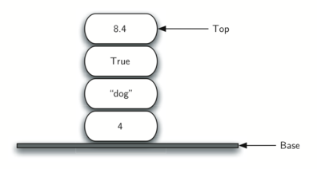

# 3.3. 栈

**3.3. Stacks**

=== "中文"

    **栈**（有时称为*推栈*）是一种有序的项目集合，其中新项目的添加和现有项目的移除总是在同一端进行。这个端通常被称为*顶部*。与顶部相对的端被称为*底部*。
    
    栈的底部非常重要，因为在栈中存储的项目越接近底部，表示它们在栈中的时间越长。最近添加的项目是最先被移除的。这个排序原则有时被称为**LIFO**，即**后进先出**。它基于在集合中存在的时间长度进行排序。较新的项目靠近顶部，而较旧的项目靠近底部。
    
    许多栈的例子在日常生活中都可以看到。几乎任何自助餐厅都有一堆托盘或盘子，你取的是最上面的一个，从而为下一个顾客露出一个新的托盘或盘子。想象一下桌子上的一堆书（`图 1`）。唯一能看到封面的书是最上面的那一本。要访问栈中的其他书，我们需要移除在它们上面的书。`图 2` 显示了包含多个原始 Python 数据对象的栈。
    
    <figure markdown="span">
      
      <figcaption>图 1: 一本书的堆叠</figcaption>
    </figure>
    
    <figure markdown="span">
      
      <figcaption>图 2: 原始 Python 数据对象的栈</figcaption>
    </figure>
    
    栈的一个最有用的属性可以在添加和移除项目时观察到。假设你开始时有一个干净的桌面。现在，将书一本一本地堆叠在一起。你正在构建一个栈。考虑一下当你开始移除书籍时会发生什么。它们被移除的顺序正好与它们被放置的顺序相反。栈是基本的重要的，因为它们可以用来反转项目的顺序。插入的顺序是移除顺序的反转。`图 3` 显示了 Python 数据对象栈的创建过程和项目被移除后的状态。注意对象的顺序。
    
    <figure markdown="span">
      
      <figcaption>图 3: 栈的反转属性</figcaption>
    </figure>
    
    考虑到这个反转属性，你可能会想到使用计算机时出现的栈的例子。例如，每个网页浏览器都有一个“后退”按钮。当你在网页之间导航时，这些页面被放置在一个栈上（实际上是 URL 被放在栈上）。你当前查看的页面在顶部，而你最初查看的页面在底部。如果你点击“后退”按钮，你将开始按相反的顺序浏览页面。

=== "英文"

    A **stack** (sometimes called a *push-down stack*) is an ordered collection of items where the addition of new items and the removal of existing items always takes place at the same end. This end is commonly referred to as the *top*. The end opposite the top is known as the *base*.
    
    The base of the stack is significant since items stored in the stack that are closer to the base represent those that have been in the stack the longest. The most recently added item is the one that is in position to be removed first. This ordering principle is sometimes called **LIFO**, or **last in, first out**. It provides an ordering based on length of time in the collection. Newer items are near the top, while older items are near the base.
    
    Many examples of stacks occur in everyday situations. Almost any cafeteria has a stack of trays or plates where you take the one at the top, uncovering a new tray or plate for the next customer in line. Imagine a stack of books on a desk (`Figure 1`). The only book whose cover is visible is the one on top. To access others in the stack, we need to remove the ones that are sitting on top of them. `Figure 2` shows another stack that contains a number of primitive Python data objects.
    
    <figure markdown="span">
      
      <figcaption>Figure 1: A Stack of Books</figcaption>
    </figure>
    
    <figure markdown="span">
      
      <figcaption>Figure 2: A Stack of Primitive Python Data Objects</figcaption>
    </figure>
       
    
    One of the most useful properties of stacks can be observed  as items are added and then removed. Assume you start out with a clean desktop. Now place books one at a time on top of each other. You are constructing a stack. Consider what happens when you begin removing books. The order that they are removed is exactly the reverse of the order that they were placed. Stacks are fundamentally important, as they can be used to reverse the order of items. The order of insertion is the reverse of the order of removal. `Figure 3` shows the Python data object stack as it was created and then again as items are removed. Note the order of the objects.
    
    <figure markdown="span">
      
      <figcaption>Figure 3: The Reversal Property of Stacks</figcaption>
    </figure>
    
    Considering this reversal property, you can perhaps think of examples of stacks that occur as you use your computer. For example, every web browser has a Back button. As you navigate from web page to web page, those pages are placed on a stack (actually it is the URLs that are going on the stack). The current page that you are viewing is on the top and the first page you looked at is at the base. If you click on the Back button, you begin to move in reverse order through the pages.