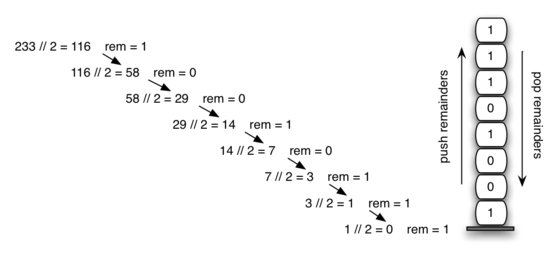

# 3.8. 将十进制数转换为二进制数

**3.8. Converting Decimal Numbers to Binary Numbers**

原文: <https://runestone.academy/ns/books/published/pythonds3/BasicDS/ConvertingDecimalNumberstoBinaryNumbers.html?mode=browsing>

=== "中文"

    在你的计算机科学学习中，你可能已经以某种方式接触过二进制数字的概念。二进制表示在计算机科学中非常重要，因为计算机内部存储的所有值都是以二进制数字串的形式存在，即由 0 和 1 组成的串。如果我们不能在常见表示和二进制数字之间进行转换，我们将不得不以非常不便的方式与计算机交互。
    
    整数值是常见的数据项。在计算机程序和计算中，它们经常被使用。我们在数学课上学习它们，当然，我们使用十进制数字系统或基数 10 来表示它们。十进制数字 $233_{10}$ 及其对应的二进制等价 $11101001_{2}$ 可以分别解释为
    
    $$2\times10^{2} + 3\times10^{1} + 3\times10^{0}$$
    
    和
    
    $$1\times2^{7} + 1\times2^{6} + 1\times2^{5} + 0\times2^{4} + 1\times2^{3} + 0\times2^{2} + 0\times2^{1} + 1\times2^{0}$$
    
    但我们如何轻松地将整数值转换为二进制数字呢？答案是一个称为“除以 2”的算法，该算法使用栈来跟踪二进制结果的数字。
    
    “除以 2”算法假设我们从一个大于 0 的整数开始。一个简单的迭代过程不断将十进制数字除以 2，并跟踪余数。第一次除以 2 可以确定值是偶数还是奇数。偶数的余数为 0，并且在个位上会有 0。奇数的余数为 1，并且在个位上会有 1。我们将二进制数字视为一串数字；我们计算的第一个余数实际上是序列中的最后一个数字。如 `Figure 5` 所示，我们再次看到这种逆序的属性，这表明栈很可能是解决问题的合适数据结构。
    
    <figure markdown="span">
        
        <figcaption>Figure 5: 十进制到二进制转换</figcaption>
    </figure>
    
    `ActiveCode 1` 中的 Python 代码实现了“除以 2”算法。函数 ``divide_by_2`` 接受一个十进制数字作为参数，并重复将其除以 2。第 8 行使用内置的取模运算符 ``%`` 来提取余数，第 9 行将其推入栈中。在除法过程达到 0 后，在第 12-14 行构建一个二进制字符串。第 12 行创建一个空字符串。二进制数字从栈中一个一个弹出，并附加到字符串的右端。然后返回二进制字符串。
    
    ```python title="Activity: 3.8.1 从十进制转换为二进制" linenums="1"
    from pythonds3.basic import Stack
    
    
    def divide_by_2(decimal_num):
        rem_stack = Stack()
    
        while decimal_num > 0:
            rem = decimal_num % 2
            rem_stack.push(rem)
            decimal_num = decimal_num // 2
    
        bin_string = ""
        while not rem_stack.is_empty():
            bin_string = bin_string + str(rem_stack.pop())
    
        return bin_string
    
    print(divide_by_2(42))
    print(divide_by_2(31))
    ```
    
    二进制转换的算法可以很容易地扩展到执行任何进制的转换。在计算机科学中，使用多种不同的编码方式是很常见的。其中最常见的有二进制、八进制（基数 8）和十六进制（基数 16）。
    
    十进制数字 $233$ 及其对应的八进制和十六进制等价 $351_{8}$ 和 $E9_{16}$ 可以解释为
    
    $3 \times 8^{2} + 5 \times 8^{1} + 1 \times 8^{0}$
    
    和
    
    $14 \times 16^{1} + 9 \times 16^{0}$
    
    函数 ``divide_by_2`` 可以修改为接受不仅是十进制值，还可以接受用于转换的进制。“除以 2” 的思想被更一般的“除以基数”所替代。新的函数 ``base_converter`` 如 `ActiveCode 2` 所示，接受一个十进制数字和 2 到 16 之间的任何基数作为参数。余数仍然被推入栈中，直到被转换的值变为 0。相同的从左到右的字符串构建技术可以使用，只需做一个小的改变。基数 2 到基数 10 的数字最多需要 10 个数字，因此典型的数字字符 0 到 9 足够用。当我们超过基数 10 时，会出现问题。我们不能简单地使用余数，因为它们本身表示为两位十进制数字。我们需要创建一组可以表示这些余数的数字字符。
    
    ```python title="Activity: 3.8.2 从十进制转换为任意进制" linenums="1"
    from pythonds3.basic import Stack
    
    
    def base_converter(decimal_num, base):
        digits = "0123456789ABCDEF"
        rem_stack = Stack()
    
        while decimal_num > 0:
            rem = decimal_num % base
            rem_stack.push(rem)
            decimal_num = decimal_num // base
    
        new_string = ""
        while not rem_stack.is_empty():
            new_string = new_string + digits[rem_stack.pop()]
    
        return new_string
    
    print(base_converter(25, 2))
    print(base_converter(25, 16))
    ```
    
    解决这个问题的方法是扩展数字集以包含一些字母字符。例如，十六进制使用十个十进制数字以及前六个字母字符来表示 16 个数字。为了实现这一点，创建了一个数字字符串（在 `Listing 6` 的第 5 行）来存储相应位置的数字。0 位于位置 0，1 位于位置 1，A 位于位置 10，B 位于位置 11，依此类推。当从栈中移除余数时，它可以用来索引数字字符串，并将正确的结果数字附加到答案中。例如，如果余数 13 从栈中移除，则将数字 D 附加到结果字符串中。
    
    !!! info "自我检测"
    
        === "Activity: 3.8.3 填空题"
        
            25 表示为八进制数字的值是多少？
        
            |blank|
        
            -  :31: 正确。
            -  :x: 错误。
    
        === "Activity: 3.8.4 填空题"
        
            256 表示为十六进制数字的值是多少？
        
            |blank|
        
            -  :100: 正确。
            - :x: 错误。
    
        === "Activity: 3.8.5 填空题"
        
            26 表示为基数 26 的值是多少？
        
            |blank|
        
            -  :10: 正确。
            - :x: 你可能需要修改 baseConverter 函数，或者仅仅找出基数转换中的规律。

=== "英文"

    In your study of computer science, you have probably been exposed in one way or another to the idea of a binary number. Binary representation is important in computer science since all values stored within a computer exist as a string of binary digits, a string of 0s and 1s. Without the ability to convert back and forth between common representations and binary numbers, we would need to interact with computers in very awkward ways.
    
    Integer values are common data items. They are used in computer programs and computation all the time. We learn about them in math class and of course represent them using the decimal number system, or base 10. The decimal number $233_{10}$ and its corresponding binary equivalent $11101001_{2}$ are interpreted respectively as
    
    $$2\times10^{2} + 3\times10^{1} + 3\times10^{0}$$
    
    and
    
    $$1\times2^{7} + 1\times2^{6} + 1\times2^{5} + 0\times2^{4} + 1\times2^{3} + 0\times2^{2} + 0\times2^{1} + 1\times2^{0}$$
    
    But how can we easily convert integer values into binary numbers? The answer is an algorithm called Divide by 2 that uses a stack to keep track of the digits for the binary result.
    
    The Divide by 2 algorithm assumes that we start with an integer greater than 0. A simple iteration then continually divides the decimal number by 2 and keeps track of the remainder. The first division by 2 gives information as to whether the value is even or odd. An even value will  have a remainder of 0 and will have the digit 0 in the ones place. An odd value will have a remainder of 1 and will have the digit 1 in the ones place. We think about building our binary number as a sequence of digits; the first remainder we compute will actually be the last digit in the sequence. As shown in `Figure 5`, we again see the reversal property that signals that a stack is likely to be the appropriate data structure for solving the problem.
    
    <figure markdown="span">
      
      <figcaption>Figure 5: Decimal-to-Binary Conversion</figcaption>
    </figure>
    
    The Python code in `ActiveCode 1` implements the Divide by 2 algorithm. The function ``divide_by_2`` takes an argument that is a decimal number and repeatedly divides it by 2. Line 8 uses the built-in modulo operator, ``%``, to extract the remainder and line 9 then pushes it on the stack. After the division process reaches 0, a binary string is constructed in lines 12-14. Line 12 creates an empty string. The binary digits are popped from the stack one at a time and appended to the right-hand end of the string. The binary string is then returned.
    
    ```python title="Activity: 3.8.1 Converting from Decimal to Binary" linenums="1"
    from pythonds3.basic import Stack
    
    
    def divide_by_2(decimal_num):
        rem_stack = Stack()
    
        while decimal_num > 0:
            rem = decimal_num % 2
            rem_stack.push(rem)
            decimal_num = decimal_num // 2
    
        bin_string = ""
        while not rem_stack.is_empty():
            bin_string = bin_string + str(rem_stack.pop())
    
        return bin_string
    
    print(divide_by_2(42))
    print(divide_by_2(31))
    ```
    
    The algorithm for binary conversion can easily be extended to perform the conversion for any base. In computer science it is common to use a number of different encodings. The most common of these are binary, octal (base 8), and hexadecimal (base 16).
    
    The decimal number $233$ and its corresponding octal and hexadecimal equivalents $351_{8}$ and $E9_{16}$ are interpreted as
    
    $3 \times 8^{2} + 5 \times 8^{1} + 1 \times 8^{0}$
    
    and
    
    $14 \times 16^{1} + 9 \times 16^{0}$
    
    The function ``divide_by_2`` can be modified to accept not only a decimal value but also a base for the intended conversion. The “Divide by 2” idea is simply replaced with a more general “Divide by base.” A new function called ``base_converter``, shown in `ActiveCode 2`, takes a decimal number and any base between 2 and 16 as parameters. The remainders are still pushed onto the stack until the value being converted becomes 0. The same left-to-right string construction technique can be used with one slight change. Base 2 through base 10 numbers need a maximum of 10 digits, so the typical digit characters 0  through 9 work fine. The problem comes when we go beyond base 10. We can no longer simply use the remainders, as they are themselves represented as two-digit decimal numbers. Instead we need to create a set of digits that can be used to represent those remainders beyond 9.
    
    ```python title="Activity: 3.8.2 Converting from Decimal to any Base" linenums="1"
    from pythonds3.basic import Stack
    
    
    def base_converter(decimal_num, base):
        digits = "0123456789ABCDEF"
        rem_stack = Stack()
    
        while decimal_num > 0:
            rem = decimal_num % base
            rem_stack.push(rem)
            decimal_num = decimal_num // base
    
        new_string = ""
        while not rem_stack.is_empty():
            new_string = new_string + digits[rem_stack.pop()]
    
        return new_string
    
    print(base_converter(25, 2))
    print(base_converter(25, 16))
    ```
    
    
    A solution to this problem is to extend the digit set to include some alphabet characters. For example, hexadecimal uses the ten decimal digits along with the first six alphabet characters for the 16 digits. To implement this, a digit string is created (line 5 in `Listing 6`) that stores the digits in their corresponding positions. 0 is at position 0, 1 is at position 1, A is at position 10, B is at position 11, and so on. When a remainder is removed from the stack, it can be used to index into the digit string and the correct resulting digit can be appended to the answer. For example, if the remainder 13 is removed from the stack, the digit D is appended to the resulting string.
    
    !!! info "Self Check"
    
        === "Activity: 3.8.3 Fill in the Blank"
    
            What is value of 25 expressed as an octal number?
        
            |blank|
        
            -  :31: Correct.
            -  :x: Incorrect
    
        === "Activity: 3.8.4 Fill in the Blank"
    
            What is value of 256 expressed as a hexidecimal number?
    
            |blank|
    
            -  :100: Correct.
            - :x: Incorrect.
    
        === "Activity: 3.8.5 Fill in the Blank"
    
            What is value of 26 expressed in base 26?
        
            |blank|
    
            -  :10: Correct.
            - :x: You may need to modify the baseConverter function, or simply find a pattern in the conversion of bases.

<iframe id="video_Stack2" data-component="youtube" class="align-left youtube-video" data-video-height="315" data-question_label="3.8.6" data-video-width="560" data-video-videoid="Q6B8k8INeq8" data-video-divid="video_Stack2" data-video-start="0" data-video-end="-1" frameborder="0" allowfullscreen="" allow="accelerometer; autoplay; clipboard-write; encrypted-media; gyroscope; picture-in-picture; web-share" referrerpolicy="strict-origin-when-cross-origin" title="Stack2" width="560" height="315" src="https://www.youtube.com/embed/Q6B8k8INeq8?start=0&amp;enablejsapi=1&amp;origin=https%3A%2F%2Frunestone.academy&amp;widgetid=1"></iframe>