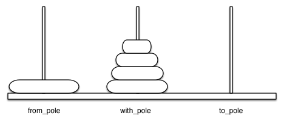

# 4.10. 汉诺塔问题

**4.10. Tower of Hanoi**

=== "中文"

    汉诺塔难题由法国数学家爱德华·卢卡斯（Edouard Lucas）于1883年发明。他受到一个传说的启发，该传说讲述了一个印度寺庙的故事，寺庙里将这个难题呈现给年轻的僧侣。在时间的开端，僧侣们被给予了三根杆子和64个金盘，每个盘子比下一个盘子略小。他们的任务是将所有64个盘子从一根杆子移动到另一根杆子，并且有两个重要的限制。他们每次只能移动一个盘子，并且不能将较大的盘子放在较小的盘子上面。僧侣们日夜高效地工作，每秒移动一个盘子。传说中说，当他们完成工作时，寺庙将崩溃成尘土，世界也将消失。
    
    尽管这个传说很有趣，你不必担心世界很快就会结束。将64个盘子的塔正确移动所需的步数是 $2^{64}-1 = 18,446,744,073,709,551,615$。以每秒一个步骤的速度，这将是 $584,942,417,355$ 年！显然，这个难题远不止表面看起来那么简单。
    
    `Figure 4.11` 展示了一个在将盘子从第一个杆子移动到第三个杆子过程中间的配置。注意，如规则所规定的那样，每根杆子上的盘子都被堆叠在一起，确保较小的盘子总是在较大的盘子上面。如果你之前没有尝试过解决这个难题，现在可以尝试一下。你不需要华丽的盘子和杆子——一本书或几张纸片就能派上用场。
    
    <figure markdown="span">
        
        <figcaption markdown="span">**Figure 4.11:** 汉诺塔盘子的示例排列</figcaption>
    </figure>
    
    我们如何递归地解决这个问题？你会如何解决这个问题？我们的基本情况是什么？让我们从底部开始思考这个问题。假设你有一个高度为五的塔，最初在杆子一上。如果你已经知道如何将一个高度为四的塔移动到杆子二，你可以轻松地将底部盘子移动到杆子三，然后将高度为四的塔从杆子二移动到杆子三。但是，如果你不知道如何将一个高度为四的塔移动怎么办？假设你知道如何将一个高度为三的塔移动到杆子三；那么，你可以轻松地将第四个盘子移动到杆子二，并将三个盘子从杆子三移动到它上面。但如果你不知道如何移动一个高度为三的塔怎么办？如何将一个高度为二的塔移动到杆子二，然后将第三个盘子移动到杆子三，然后将高度为二的塔移动到上面？但如果你仍然不知道如何做呢？显然，将一个盘子移动到杆子三是很简单的，你甚至可以说是微不足道的。这听起来像是一个即将成为基本情况的例子。
    
    下面是一个高层次的概述，描述如何将一个高度为 $h$ 的塔从起始杆移动到目标杆，使用一个中间杆：
    
    1. 将高度为 $h-1$ 的塔从起始杆移动到中间杆，通过目标杆。
    2. 将剩下的盘子从起始杆移动到目标杆。
    3. 将高度为 $h-1$ 的塔从中间杆移动到目标杆，通过起始杆。
    
    只要我们始终遵守较大的盘子保持在堆底的规则，我们可以递归地使用上述三个步骤，将任何较大的盘子视为不存在。上述概述中唯一缺少的是基本情况的识别。最简单的汉诺塔问题是一个高度为一的塔。在这种情况下，我们只需将一个盘子移动到最终目标。一个高度为一的塔将是我们的基本情况。此外，上述步骤通过在步骤 1 和 3 中逐步降低塔的高度，将我们引导到基本情况。`Listing 1` 显示了用于解决汉诺塔难题的 Python 代码。
    
    ```python title="**Listing 4.9:** 汉诺塔的 Python 代码" linenums="1"
    def move_tower(height, from_pole, to_pole, with_pole):
        if height < 1:
            return
        move_tower(height - 1, from_pole, with_pole, to_pole)
        move_disk(from_pole, to_pole)
        move_tower(height - 1, with_pole, to_pole, from_pole)
    ```
    
    注意，`Listing 1` 中的代码几乎与英文描述完全一致。算法的简洁性关键在于我们进行两个不同的递归调用，一个在第 4 行，另一个在第 6 行。在第 4 行，我们将初始塔的所有盘子（除了底部盘子）移动到中间杆。下一行将底部盘子移动到最终位置。然后在第 6 行，我们将塔从中间杆移动到最大盘子的上面。基本情况是高度为 0 的塔；在这种情况下，没有任何操作需要做，所以 `move_tower` 函数返回。处理基本情况时重要的一点是，简单地从 `move_tower` 返回最终允许调用 `move_disk` 函数。
    
    `move_disk` 函数在 `Listing 4.10` 中展示，非常简单。它的功能只是打印出它正在将一个盘子从一个杆子移动到另一个杆子。如果你输入并运行 `move_tower` 程序，你会发现它为解决难题提供了一个非常高效的方案。
    
    ```python title="**Listing 4.10:** 移动一个盘子的 Python 代码" linenums="1"
    def move_disk(from_pole, to_pole):
        print(f"moving disk from {from_pole} to {to_pole}")
    ```
    
    `ActiveCode 4.10.1` 提供了三个盘子的完整解决方案。
    
    ```python title="Activity: 4.10.1 递归解决汉诺塔" linenums="1"
    def move_tower(height, from_pole, to_pole, with_pole):
        if height >= 1:
            move_tower(height - 1, from_pole, with_pole, to_pole)
            move_disk(from_pole, to_pole)
            move_tower(height - 1, with_pole, to_pole, from_pole)
    
    def move_disk(from_p, to_p):
        print("moving disk from", from_p, "to", to_p)
    
    move_tower(3, "A", "B", "C")
    ```
    
    现在你已经看到了 `move_tower` 和 `move_disk` 的代码，你可能会想为什么我们没有一个明确跟踪盘子在杆子上的数据结构。这里有一个提示：如果你要显式跟踪盘子，你可能会使用三个 `Stack` 对象，每个杆子一个。答案是 Python 通过调用栈隐式地提供了我们所需的堆栈。

=== "英文"

    The Tower of Hanoi puzzle was invented by the French mathematician Edouard Lucas in 1883. He was inspired by a legend that tells of a Hindu temple where the puzzle was presented to young priests. At the beginning of time, the priests were given three poles and a stack of 64 gold disks, each disk a little smaller than the one beneath it. Their assignment was to transfer all 64 disks from one of the three poles to another, with two important constraints. They could only move one disk at a time, and they could never place a larger disk on top of a smaller one. The priests worked very efficiently, day and night, moving one disk every second. When they finished their work, the legend said, the temple would crumble into dust and the world would vanish.
    
    Although the legend is interesting, you need not worry about the world ending any time soon. The number of moves required to correctly move a tower of 64 disks is $2^{64}-1 = 18,446,744,073,709,551,615$. At a rate of one move per second, that is $584,942,417,355$ years! Clearly there is more to this puzzle than meets the eye.
    
    `Figure 4.11` shows an example of a configuration of disks in the middle of a move from the first peg to the third. Notice that, as the rules specify, the disks on each peg are stacked so that smaller disks are always on top of the larger disks. If you have not tried to solve this puzzle before, you should try it now. You do not need fancy disks and poles—a pile of books or pieces of paper will work.
    
    <figure markdown="span">
        
        <figcaption markdown="span">**Figure 4.11:** An Example Arrangement of Disks for the Tower of Hanoi</figcaption>
    </figure>
    
    How do we go about solving this problem recursively? How would you go about solving this problem at all? What is our base case? Let’s think about this problem from the bottom up. Suppose you have a tower of five disks, originally on peg one. If you already knew how to move a tower of four disks to peg two, you could then easily move the bottom disk to peg three, and then move the tower of four from peg two to peg three. But what if you do not know how to move a tower of height four? Suppose that you knew how to move a tower of height three to peg three; then it would be easy to move the fourth disk to peg two and move the three from peg three on top of it. But what if you do not know how to move a tower of three? How about moving a tower of two disks to peg two and then moving the third disk to peg three, and then moving the tower of height two on top of it? But what if you still do not know how to do this? Surely you would agree that moving a single disk to peg three is easy enough, trivial you might even say. This sounds like a base case in the making.
    
    Here is a high-level outline of how to move a tower of height $h$ from the starting pole to the goal pole, using an intermediate pole:
    
    1. Move a tower of height $h-1$ from the starting pole to an intermediate pole via the goal pole.
    2. Move the remaining disk from the starting pole to the final pole.
    3. Move the tower of height $h-1$ from the intermediate pole to the goal pole via the starting pole.
    
    As long as we always obey the rule that the larger disks remain on the bottom of the stack, we can use the three steps above recursively, treating any larger disks as though they were not even there. The only thing missing from the outline above is the identification of a base case. The simplest Tower of Hanoi problem is a tower of one disk. In this case, we need move only a single disk to its final destination. A tower of one disk will be our base case. In addition, the steps outlined above move us toward the base case by reducing the height of the tower in steps 1 and 3. `Listing 1` shows the Python code to solve the Tower of Hanoi puzzle.
    
    ```python title="**Listing 4.9:** Python Code for the Tower of Hanoi" linenums="1"
    def move_tower(height, from_pole, to_pole, with_pole):
        if height < 1:
            return
        move_tower(height - 1, from_pole, with_pole, to_pole)
        move_disk(from_pole, to_pole)
        move_tower(height - 1, with_pole, to_pole, from_pole)
    ```
    
    Notice that the code in `Listing 1` is almost identical to the English description. The key to the simplicity of the algorithm is that we make two different recursive calls, one on line 4 and a second on line 6. On line 4 we move all but the bottom disk on the initial tower to an intermediate pole. The next line moves the bottom disk to its final resting place. Then on line 6 we move the tower from the intermediate pole to the top of the largest disk. The base case is the tower of height 0; in this case there is nothing to do, so the ``move_tower`` function returns. The important thing to remember about handling the base case this way is that simply returning from ``move_tower`` is what finally allows the ``move_disk`` function to be called.
    
    The function ``move_disk``, shown in `Listing 4.10`, is very simple. All it does is print out that it is moving a disk from one pole to another. If you type in and run the ``move_tower`` program you can see that it gives you a very efficient solution to the puzzle.
    
    ```python title="**Listing 4.10:** Python Code to Move One Disk" linenums="1"
    def move_disk(from_pole, to_pole):
        print(f"moving disk from {from_pole} to {to_pole}")
    ```
            
    The program in `ActiveCode 4.10.1` provides the entire solution for three disks.
            
    ```python title="Activity: 4.10.1 Solving Tower of Hanoi Recursively" linenums="1"
    def move_tower(height, from_pole, to_pole, with_pole):
        if height >= 1:
            move_tower(height - 1, from_pole, with_pole, to_pole)
            move_disk(from_pole, to_pole)
            move_tower(height - 1, with_pole, to_pole, from_pole)
    
    
    def move_disk(from_p, to_p):
        print("moving disk from", from_p, "to", to_p)
    
    
    move_tower(3, "A", "B", "C")
    ```
    
    Now that you have seen the code for both ``move_tower`` and ``move_disk``, you may be wondering why we do not have a data structure that explicitly keeps track of what disks are on what poles. Here is a hint: if you were going to explicitly keep track of the disks, you would probably use three ``Stack`` objects, one for each pole. The answer is that Python provides the stacks that we need implicitly through the call stack.