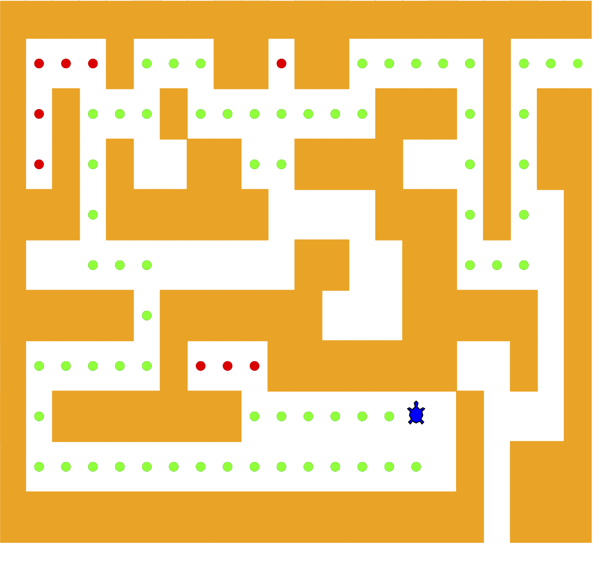

# 4.11. 迷宫探索

**4.11. Exploring a Maze**

=== "中文"

    在这一部分，我们将讨论一个与不断扩展的机器人世界相关的问题：如何找到迷宫的出口？如果你有一个 Roomba 吸尘器在你的宿舍（难道所有大学生都有吗？），你会希望能使用你在这一部分学到的知识重新编程它。我们要解决的问题是帮助我们的海龟找到迷宫中的出口。迷宫问题的根源可以追溯到希腊神话中的忒修斯，忒修斯被送入迷宫去杀死弥诺陶洛斯。忒修斯使用了一球线团来帮助他在完成任务后找到出路。在我们的问题中，我们假设我们的海龟被丢在迷宫的某个地方，必须找到出口。请查看 `Figure 4.12` 以了解我们在这一部分要解决的问题。
    
    <figure markdown="span">
        
        <figcaption markdown="span">**Figure 4.12:** 完成的迷宫搜索程序</figcaption>
    </figure>
    
    为了简化问题，我们将假设迷宫被划分为方格。每个方格要么是开放的，要么被墙壁占据。海龟只能通过开放的方格。如果海龟碰到墙壁，它必须尝试不同的方向。海龟需要一个系统的程序来找到迷宫的出口。程序如下：
    
    1. 从起始位置开始，我们首先尝试向北走一个方格，然后从那里递归地尝试我们的程序。
    2. 如果我们在第一步尝试北方路径没有成功，那么我们将向南走一步，并递归地重复我们的程序。
    3. 如果南方也没有成功，我们将尝试向西走一步，并递归应用我们的程序。
    4. 如果北方、南方和西方都没有成功，那么我们将从东边的一步位置递归地应用程序。
    5. 如果这些方向都不行，那么迷宫中没有出路，我们就失败了。
    
    这听起来很简单，但首先有几个细节需要讨论。假设我们第一次递归步骤是向北走。按照我们的程序，下一步也会向北。但是，如果北方被墙壁挡住，我们必须查看程序的下一步并尝试向南。不幸的是，这一步向南将我们带回到最初的位置。如果我们从那里应用递归程序，我们将返回一步到北方，形成一个无限循环。因此，我们必须有一个策略来记住我们已经去过的地方。在这种情况下，我们假设我们有一袋面包屑可以沿途丢弃。如果我们在某个方向上走了一步，发现那个方格上已经有了面包屑，我们知道我们应该立即退回并尝试程序中的下一个方向。正如我们将看到的，回退就像从递归函数调用中返回一样简单。
    
    就像我们对所有递归算法所做的那样，让我们回顾基本情况。根据前面的描述，你可能已经猜到了其中的一些。在这个算法中，有四个基本情况需要考虑：
    
    1. 海龟碰到墙壁。由于方格被墙壁占据，不能进行进一步的探索。
    2. 海龟发现了一个已经被探索过的方格。我们不想继续从这个位置进行探索，以免进入循环。
    3. 我们发现了一个未被墙壁占据的外边界。换句话说，我们找到了迷宫的出口。
    4. 我们在四个方向上都未能成功探索某个方格。
    
    为了使程序正常工作，我们需要一种表示迷宫的方式。`Figure 4.13` 是一个迷宫数据文件的示例。
    
    ```text title="**Figure 4.13:** 迷宫数据文件示例"
    ++++++++++++++++++++++
    +   +   ++ ++     +   
    + +   +       +++ + ++
    + + +  ++  ++++   + ++
    +++ ++++++    +++ +  +
    +          ++  ++    +
    +++++ ++++++   +++++ +
    +     +   +++++++  + +
    + +++++++      S +   +
    +                + +++
    ++++++++++++++++++ +++
    ```
    
    为了让这更加有趣，我们将使用 `turtle` 模块来绘制和探索我们的迷宫，以便我们可以观察这个算法的实际效果。`Maze` 对象将提供以下方法供我们在编写搜索算法时使用：
    
    -  `__init__` 读取表示迷宫的数据显示文件，初始化迷宫的内部表示，并找到海龟的起始位置。
    -  `draw_maze` 在屏幕窗口中绘制迷宫。
    -  `update_position` 更新迷宫的内部表示，并在窗口中更改海龟的位置。
    -  `is_exit` 检查当前位置是否是迷宫的出口。
    
    `Maze` 类还重载了索引操作符 `[]`，以便我们的算法可以轻松访问任何特定方格的状态。
    
    `Listing 4.11` 包括了 `Maze` 类方法（`Listings 4.12`--`4.15`）和 `search_from` 函数（`Listing 4.16`）使用的全局常量。
    
    ```python title="**Listing 4.11:** 迷宫程序全局常量"
    START = "S"
    OBSTACLE = "+"
    TRIED = "."
    DEAD_END = "-"
    PART_OF_PATH = "O"
    ```
    
    `__init__` 方法以文件名作为唯一参数。该文件是一个文本文件，通过使用 “+” 字符表示墙壁，空格表示开放方格，字母 “S” 表示起始位置。
    
    ```python title="**Listing 4.12:** 迷宫类构造函数"
    class Maze:
        def __init__(self, maze_filename):
            with open(maze_filename, "r") as maze_file:
                self.maze_list = [
                    [ch for ch in line.rstrip("\n")]
                    for line in maze_file.readlines()
                ]
            self.rows_in_maze = len(self.maze_list)
            self.columns_in_maze = len(self.maze_list[0])
            for row_idx, row in enumerate(self.maze_list):
                if START in row:
                    self.start_row = row_idx
                    self.start_col = row.index(START)
                    break
    
            self.x_translate = -self.columns_in_maze / 2
            self.y_translate = self.rows_in_maze / 2
            self.t = turtle.Turtle()
            self.t.shape("turtle")
            self.wn = turtle.Screen()
            self.wn.setworldcoordinates(
                -(self.columns_in_maze - 1) / 2 - 0.5,
                -(self.rows_in_maze - 1) / 2 - 0.5,
                (self.columns_in_maze - 1) / 2 + 0.5,
                (self.rows_in_maze - 1) / 2 + 0.5,
            )
    ```
    
    迷宫的内部表示是一个列表的列表。`maze_list` 实例变量的每一行也是一个列表。这个二级列表包含每个方格的一个字符，使用上述描述的字符。对于 `Figure 13` 中的数据文件，内部表示看起来如下：
    
    ```python
        [  ['+', '+', '+', '+', '+', ..., '+', '+', '+', '+', '+']
            ['+', ' ', ' ', ' ', '+', ..., ' ', '+', ' ', ' ', ' ']
            ['+', ' ', '+', ' ', ' ', ..., ' ', '+', ' ', '+', '+']
            ['+', ' ', '+', ' ', '+', ..., ' ', '+', ' ', '+', '+']
            ['+', '+', '+', ' ', '+', ..., ' ', '+', ' ', ' ', '+']
            ['+', ' ', ' ', ' ', ' ', ..., ' ', ' ', ' ', ' ', '+']
            ['+', '+', '+', '+', '+', ..., '+', '+', '+', ' ', '+']
            ['+', ' ', ' ', ' ', ' ', ..., ' ', ' ', '+', ' ', '+']
            ['+', ' ', '+', '+', '+', ..., '+', ' ', ' ', ' ', '+']
            ['+', ' ', ' ', ' ', ' ', ..., '+', ' ', '+', '+', '+']
            ['+', '+', '+', '+', '+', ..., '+', ' ', '+', '+', '+'] ]
    ```
    
    `draw_maze` 方法使用这种内部表示来绘制迷宫的初始视图在屏幕上（`Figure 4.12`）。
    
    ```python title="**Listing 4.13:** 迷宫类绘图方法"
    def draw_maze(self):
        self.t.speed(10)
        self.wn.tracer(0)
        for y in range(self.rows_in_maze):
            for x in range(self.columns_in_maze):
                if self.maze_list[y][x] == OBSTACLE:
                    self.draw_centered_box(
                        x + self.x_translate, -y + self.y_translate, "orange"
                    )
        self.t.color("black")
        self.t.fillcolor("blue")
        self.wn.update()
        self.wn.tracer(1)
    
    def draw_centered_box(self, x, y, color):
        self.t.up()
        self.t.goto(x - 0.5, y - 0.5)
        self.t.color
    
    (color)
        self.t.fillcolor(color)
        self.t.setheading(90)
        self.t.down()
        self.t.begin_fill()
        for i in range(4):
            self.t.forward(1)
            self.t.right(90)
        self.t.end_fill()
    ```
    
    `update_position` 方法如 `Listing 4.14` 所示，使用相同的内部表示来查看海龟是否碰到墙壁。它还用 “.” 或 “-” 更新内部表示，以表示海龟是否访问过某个方格或该方格是否是死胡同。此外，`update_position` 方法使用两个辅助方法，`move_turtle` 和 `drop_bread_crumb`，来更新屏幕上的视图。
    
    ```python title="**Listing 4.14:** 迷宫类移动方法"
    def update_position(self, row, col, val=None):
        if val:
            self.maze_list[row][col] = val
        self.move_turtle(col, row)
    
        if val == PART_OF_PATH:
            color = "green"
        elif val == OBSTACLE:
            color = "red"
        elif val == TRIED:
            color = "black"
        elif val == DEAD_END:
            color = "red"
        else:
            color = None
    
        if color:
            self.drop_bread_crumb(color)
    
    def move_turtle(self, x, y):
        self.t.up()
        self.t.setheading(self.t.towards(x + self.x_translate, -y + self.y_translate))
        self.t.goto(x + self.x_translate, -y + self.y_translate)
    
    def drop_bread_crumb(self, color):
        self.t.dot(10, color)
    ```
    
    最后，`is_exit` 方法使用海龟的当前位置来测试是否到达了出口。出口条件发生在海龟到达迷宫的边缘时，即第零行、第零列、最右列或最底行。
    
    ```python title="**Listing 4.15:** 迷宫类辅助方法"
    def is_exit(self, row, col):
        return (
            row == 0
            or row == self.rows_in_maze - 1
            or col == 0
            or col == self.columns_in_maze - 1
        )
    
    def __getitem__(self, idx):
        return self.maze_list[idx]
    ```
    
    让我们查看 `search_from` 函数的代码。该函数的代码显示在 `Listing 4.16` 中。注意，这个函数接受三个参数：一个 `Maze` 对象、起始行和起始列。这很重要，因为作为递归函数，搜索逻辑上从每次递归调用中重新开始。
    
    ```python title="**Listing 4.16:** search_from 函数"
    def search_from(maze, row, column):
        # 尝试从这个点的四个方向中找到出口
        maze.update_position(row, column)
        # 基本情况返回值：
        #  1. 碰到障碍物，返回 False
        if maze[row][column] == OBSTACLE:
            return False
        #  2. 找到已被探索过的方格
        if maze[row][column] in [TRIED, DEAD_END]:
            return False
        # 3. 找到一个未被障碍物占据的外边界
        if maze.is_exit(row, column):
            maze.update_position(row, column, PART_OF_PATH)
            return True
        maze.update_position(row, column, TRIED)
        # 否则，使用逻辑短路依次尝试每个方向
        found = (
            search_from(maze, row - 1, column)
            or search_from(maze, row + 1, column)
            or search_from(maze, row, column - 1)
            or search_from(maze, row, column + 1)
        )
        if found:
            maze.update_position(row, column, PART_OF_PATH)
        else:
            maze.update_position(row, column, DEAD_END)
        return found
    ```
    
    在查看算法时，你会发现代码的第一步（第3行）是调用 `update_position`。这只是为了帮助你可视化算法，以便你可以准确地看到海龟如何探索迷宫。接下来，算法检查四个基本情况中的前三个：海龟是否碰到墙壁（第6行）？海龟是否回到了已探索的方格（第9行）？海龟是否找到了出口（第12行）？如果这些条件都不成立，我们将继续递归搜索。
    
    你会注意到在递归步骤中，有四个递归调用到 `search_from`。由于这些调用通过 `or` 语句连接在一起，很难预测会使用多少个递归调用。如果第一个调用 `search_from` 返回 `True`，那么其余的三个调用将不会被需要。这意味着，如果有一个有效的路径向 `(row - 1, column)`（或北方，如果你想以地理方位思考）可以通向迷宫的出口。如果北方没有好的路径，接下来会尝试向南。如果南方失败，则尝试西方，最后尝试东方。如果所有四个递归调用都返回 `False`，那么我们发现了一个死胡同。你应该下载或输入整个程序并尝试通过更改这些调用的顺序来进行实验。
    
    完整的程序显示在 `ActiveCode 4.11.1 <completemaze>` 中。该程序使用数据文件 `maze2.txt`，如下所示。注意，它是一个更简单的示例文件，因为出口离海龟的起始位置非常近。
    
    ```text
    ++++++++++++++++++++++
    +   +   ++ ++        +
        +     ++++++++++
    + +    ++  ++++ +++ ++
    + +   + + ++    +++  +
    +          ++  ++  + +
    +++++ + +      ++  + +
    +++++ +++  + +  ++   +
    +          + + S+ +  +
    +++++ +  + + +     + +
    ++++++++++++++++++++++
    ```
    
    ```python title="活动: 4.11.1 完整的迷宫解决器" linenums="1"
    import turtle
    
    START = "S"
    OBSTACLE = "+"
    TRIED = "."
    DEAD_END = "-"
    PART_OF_PATH = "O"
    
    
    class Maze:
        def __init__(self, maze_filename):
            with open(maze_filename, "r") as maze_file:
                self.maze_list = [
                    [ch for ch in line.rstrip("\n")]
                    for line in maze_file.readlines()
                ]
            self.rows_in_maze = len(self.maze_list)
            self.columns_in_maze = len(self.maze_list[0])
            for row_idx, row in enumerate(self.maze_list):
                if START in row:
                    self.start_row = row_idx
                    self.start_col = row.index(START)
                    break
    
            self.x_translate = -self.columns_in_maze / 2
            self.y_translate = self.rows_in_maze / 2
            self.t = turtle.Turtle()
            self.t.shape("turtle")
            self.wn = turtle.Screen()
            self.wn.setworldcoordinates(
                -(self.columns_in_maze - 1) / 2 - 0.5,
                -(self.rows_in_maze - 1) / 2 - 0.5,
                (self.columns_in_maze - 1) / 2 + 0.5,
                (self.rows_in_maze - 1) / 2 + 0.5,
            )
    
        def draw_maze(self):
            self.t.speed(10)
            self.wn.tracer(0)
            for y in range(self.rows_in_maze):
                for x in range(self.columns_in_maze):
                    if self.maze_list[y][x] == OBSTACLE:
                        self.draw_centered_box(
                            x + self.x_translate, -y + self.y_translate, "orange"
                        )
            self.t.color("black")
            self.t.fillcolor("blue")
            self.wn.update()
            self.wn.tracer(1)
    
        def draw_centered_box(self, x, y, color):
            self.t.up()
            self.t.goto(x - 0.5, y - 0.5)
            self.t.color(color)
            self.t.fillcolor(color)
            self.t.setheading(90)
            self.t.down()
            self.t.begin_fill()
            for i in range(4):
                self.t.forward(1)
                self.t.right(90)
            self.t.end_fill()
    
        def move_turtle(self, x, y):
            self.t.up()
            self.t.setheading(self.t.towards(x + self.x_translate, -y + self.y_translate))
            self.t.goto(x + self.x_translate, -y + self.y_translate)
    
        def drop_bread_crumb(self, color):
            self.t.dot(10, color)
    
        def update_position(self, row, col, val=None):
            if val:
                self.maze_list[row][col] = val
            self.move_turtle(col, row)
    
            if val == PART_OF_PATH:
                color = "green"
            elif val == OBSTACLE:
                color = "red"
            elif val == TRIED:
                color = "black"
            elif val == DEAD_END:
                color = "red"
            else:
                color = None
    
            if color:
                self.drop_bread_crumb(color)
    
        def is_exit(self, row, col):
            return (
                row == 0
                or row == self.rows_in_maze - 1
                or col == 0
                or col == self.columns_in_maze - 1
            )
    
        def __getitem__(self, idx):
            return self.maze_list[idx]
    
    
    def search_from(maze, start_row, start_column):
        # 尝试从这个点的四个方向中找到出口
        # 基本情况返回值：
        #  1. 碰到障碍物，返回 False
        maze.update_position(start_row, start_column)
        if maze[start_row][start_column] == OBSTACLE:
            return False
        #  2.
    
     找到已探索的方格
        if (
            maze[start_row][start_column] == TRIED
            or maze[start_row][start_column] == DEAD_END
        ):
            return False
        # 3. 找到一个未被障碍物占据的外边界
        if maze.is_exit(start_row, start_column):
            maze.update_position(start_row, start_column, PART_OF_PATH)
            return True
        maze.update_position(start_row, start_column, TRIED)
        # 否则，使用逻辑短路依次尝试每个方向
        found = (
            search_from(maze, start_row - 1, start_column)
            or search_from(maze, start_row + 1, start_column)
            or search_from(maze, start_row, start_column - 1)
            or search_from(maze, start_row, start_column + 1)
        )
        if found:
            maze.update_position(start_row, start_column, PART_OF_PATH)
        else:
            maze.update_position(start_row, start_column, DEAD_END)
        return found
    
    
    my_maze = Maze("maze2.txt")
    my_maze.draw_maze()
    my_maze.update_position(my_maze.start_row, my_maze.start_col)
    
    search_from(my_maze, my_maze.start_row, my_maze.start_col)
    ```
    
    !!! info "自我检查"
    
        修改迷宫搜索程序，使得对 `search_from` 的调用顺序不同。观察程序的运行情况。你能解释为什么行为不同吗？你能预测在给定的调用顺序更改下海龟将遵循什么路径吗？

=== "英文"

    In this section we will look at a problem that has relevance to the expanding world of robotics: how do you find your way out of a maze? If you have a Roomba vacuum cleaner for your dorm room (don’t all college students?) you will wish that you could reprogram it using what you have learned in this section. The problem we want to solve is to help our turtle find its way out of a virtual maze. The maze problem has roots as deep as the Greek myth about Theseus, who was sent into a maze to kill the Minotaur. Theseus used a ball of thread to help him find his way back out again once he had finished off the beast. In our problem we will assume that our turtle is dropped down somewhere into the middle of the maze and must find its way out. Look at `Figure 4.12 to get an idea of where we are going in this section.
    
    <figure markdown="span">
        
        <figcaption markdown="span">**Figure 4.12:** The Finished Maze Search Program</figcaption>
    </figure>
    
    To make it easier for us we will assume that our maze is divided up into squares. Each square of the maze is either open or occupied by a section of wall. The turtle can only pass through the open squares of the maze. If the turtle bumps into a wall, it must try a different direction. The turtle will require a systematic procedure to find its way out of the maze. Here is the procedure:
    
    1. From our starting position we will first try going north one square and then recursively try our procedure from there.
    2. If we are not successful by trying a northern path as the first step then we will take a step to the south and recursively repeat our procedure.
    3. If south does not work then we will try a step to the West as our first step and recursively apply our procedure.
    4. If north, south, and west have not been successful then we will apply the procedure recursively from a position one step to our east.
    5. If none of these directions works then there is no way to get out of the maze and we fail.
    
    Now that sounds pretty easy, but there are a couple of details to talk about first. Suppose we take our first recursive step by going north. By following our procedure, our next step would also be to the north. But if the north is blocked by a wall, we must look at the next step of the procedure and try going to the south. Unfortunately, that step to the south brings us right back to our original starting place. If we apply the recursive procedure from there, we will just go back one step to the North and be in an infinite loop. So we must have a strategy to remember where we have been. In this case we will assume that we have a bag of bread crumbs we can drop along our way. If we take a step in a certain direction and find that there is a bread crumb already on that square, we know that we should immediately back up and try the next direction in our procedure. As we will see when we look at the code for this algorithm, backing up is as simple as returning from a recursive function call.
    
    As we do for all recursive algorithms, let us review the base cases. Some of them you may already have guessed based on the description in the previous paragraph. In this algorithm, there are four base cases to consider:
    
    1. The turtle has run into a wall. Since the square is occupied by a wall, no further exploration can take place.
    2. The turtle has found a square that has already been explored. We do not want to continue exploring from this position so we don't get into a loop.
    3. We have found an outside edge, not occupied by a wall. In other words, we have found an exit from the maze.
    4. We have explored a square unsuccessfully in all four directions.
    
    For our program to work we will need to have a way to represent the maze. `Figure 4.13` is an example of a maze data file.
    
    ```text title="**Figure 4.13:** An Example Maze Data File"
    ++++++++++++++++++++++
    +   +   ++ ++     +   
    + +   +       +++ + ++
    + + +  ++  ++++   + ++
    +++ ++++++    +++ +  +
    +          ++  ++    +
    +++++ ++++++   +++++ +
    +     +   +++++++  + +
    + +++++++      S +   +
    +                + +++
    ++++++++++++++++++ +++
    ```
    
    To make this even more interesting we are going to use the ``turtle`` module to draw and explore our maze so we can watch this algorithm in action. The ``Maze`` object will provide the following methods for us to use in writing our search algorithm:
    
    -  ``__init__`` Reads in a data file representing a maze, initializes the internal representation of the maze, and finds the starting position for the turtle.
    -  ``draw_maze`` Draws the maze in a window on the screen.
    -  ``update_position`` Updates the internal representation of the maze and changes the position of the turtle in the window.
    -  ``is_exit`` Checks to see if the current position is an exit from the maze.
    
    The ``Maze`` class also overloads the index operator ``[]`` so that our algorithm can easily access the status of any particular square.
    
    `Listing 4.11 <lst_maze_globals>` includes the global constants used by the ``Maze`` class methods (Listings `4.12 <lst_maze_init>`--`4.15 <lst_maze_aux>`) and the ``search_from`` function (`Listing 4.16 <lst_maze_search>`).
    
    ```python title="**Listing 4.11:** The Maze Program Global Constants"
    START = "S"
    OBSTACLE = "+"
    TRIED = "."
    DEAD_END = "-"
    PART_OF_PATH = "O"
    ```
    
    The ``__init__`` method takes the name of a file as its only parameter. This file is a text file that represents a maze by using “+” characters for walls, spaces for open squares, and the letter “S” to indicate the starting position.
    
    ```python title="**Listing 4.12:** The Maze Class Constructor" 
    class Maze:
        def __init__(self, maze_filename):
            with open(maze_filename, "r") as maze_file:
                self.maze_list = [
                    [ch for ch in line.rstrip("\n")]
                    for line in maze_file.readlines()
                ]
            self.rows_in_maze = len(self.maze_list)
            self.columns_in_maze = len(self.maze_list[0])
            for row_idx, row in enumerate(self.maze_list):
                if START in row:
                    self.start_row = row_idx
                    self.start_col = row.index(START)
                    break
    
            self.x_translate = -self.columns_in_maze / 2
            self.y_translate = self.rows_in_maze / 2
            self.t = turtle.Turtle()
            self.t.shape("turtle")
            self.wn = turtle.Screen()
            self.wn.setworldcoordinates(
                -(self.columns_in_maze - 1) / 2 - 0.5,
                -(self.rows_in_maze - 1) / 2 - 0.5,
                (self.columns_in_maze - 1) / 2 + 0.5,
                (self.rows_in_maze - 1) / 2 + 0.5,
            )
    ```
    
    The internal representation of the maze is a list of lists. Each row of the ``maze_list`` instance variable is also a list. This secondary list contains one character per square using the characters described above. For the data file in `Figure 13` the internal representation looks like the following:
    
    
    ```python
        [  ['+', '+', '+', '+', '+', ..., '+', '+', '+', '+', '+']
           ['+', ' ', ' ', ' ', '+', ..., ' ', '+', ' ', ' ', ' ']
           ['+', ' ', '+', ' ', ' ', ..., ' ', '+', ' ', '+', '+']
           ['+', ' ', '+', ' ', '+', ..., ' ', '+', ' ', '+', '+']
           ['+', '+', '+', ' ', '+', ..., ' ', '+', ' ', ' ', '+']
           ['+', ' ', ' ', ' ', ' ', ..., ' ', ' ', ' ', ' ', '+']
           ['+', '+', '+', '+', '+', ..., '+', '+', '+', ' ', '+']
           ['+', ' ', ' ', ' ', ' ', ..., ' ', ' ', '+', ' ', '+']
           ['+', ' ', '+', '+', '+', ..., '+', ' ', ' ', ' ', '+']
           ['+', ' ', ' ', ' ', ' ', ..., '+', ' ', '+', '+', '+']
           ['+', '+', '+', '+', '+', ..., '+', ' ', '+', '+', '+'] ]
    ```
    
    The ``draw_maze`` method uses this internal representation to draw the initial view of the maze on the screen (`Figure 4.12`).
    
    ```python title="**Listing 4.13:** The Maze Class Drawing Methods"
    def draw_maze(self):
        self.t.speed(10)
        self.wn.tracer(0)
        for y in range(self.rows_in_maze):
            for x in range(self.columns_in_maze):
                if self.maze_list[y][x] == OBSTACLE:
                    self.draw_centered_box(
                        x + self.x_translate, -y + self.y_translate, "orange"
                    )
        self.t.color("black")
        self.t.fillcolor("blue")
        self.wn.update()
        self.wn.tracer(1)
    
    def draw_centered_box(self, x, y, color):
        self.t.up()
        self.t.goto(x - 0.5, y - 0.5)
        self.t.color(color)
        self.t.fillcolor(color)
        self.t.setheading(90)
        self.t.down()
        self.t.begin_fill()
        for i in range(4):
            self.t.forward(1)
            self.t.right(90)
        self.t.end_fill()
    ```
    
    The ``update_position`` method, as shown in `Listing 4.14` uses the same internal representation to see if the turtle has run into a wall. It also updates the internal representation with a “.” or “-” to indicate that the turtle has visited a particular square or if the square is part of a dead end. In addition, the ``update_position`` method uses two helper methods, ``move_turtle`` and ``drop_bread_crumb``, to update the view on the screen.
    
    ```python title="**Listing 4.14:** The Maze Class Moving Methods"
    def update_position(self, row, col, val=None):
        if val:
            self.maze_list[row][col] = val
        self.move_turtle(col, row)
    
        if val == PART_OF_PATH:
            color = "green"
        elif val == OBSTACLE:
            color = "red"
        elif val == TRIED:
            color = "black"
        elif val == DEAD_END:
            color = "red"
        else:
            color = None
    
        if color:
            self.drop_bread_crumb(color)
    
    def move_turtle(self, x, y):
        self.t.up()
        self.t.setheading(self.t.towards(x + self.x_translate, -y + self.y_translate))
        self.t.goto(x + self.x_translate, -y + self.y_translate)
    
    def drop_bread_crumb(self, color):
        self.t.dot(10, color)
    ```
    
    Finally, the ``is_exit`` method uses the current position of the turtle to test for an exit condition. An exit condition occurs whenever the turtle has navigated to the edge of the maze, either row zero or column zero, or the far-right column or the bottom row.
    
    ```python title="**Listing 4.15:** The Maze Class Auxiliary Methods"
    def is_exit(self, row, col):
        return (
            row == 0
            or row == self.rows_in_maze - 1
            or col == 0
            or col == self.columns_in_maze - 1
        )
    
    def __getitem__(self, idx):
        return self.maze_list[idx]
    ```
    
    Let’s examine the code for the search function which we call ``search_from``. The code is shown in `Listing 4.16`. Notice that this function takes three parameters: a ``Maze`` object, the starting row, and the starting column. This is important because as a recursive function the search logically starts again with each recursive call.
    
    ```python title="**Listing 4.15:** The Maze Class Auxiliary Methods"
    def search_from(maze, row, column):
        # Try each of four directions from this point until we find a way out.
        maze.update_position(row, column)
        # Base Case return values:
        #  1. We have run into an obstacle, return false
        if maze[row][column] == OBSTACLE:
            return False
        #  2. We have found an already explored square
        if maze[row][column] in [TRIED, DEAD_END]:
            return False
        # 3. We have found an exit
        if maze.is_exit(row, column):
            maze.update_position(row, column, PART_OF_PATH)
            return True
        maze.update_position(row, column, TRIED)
        # Otherwise, use logical short circuiting to try each direction
        # in turn (if needed)
        found = (
            search_from(maze, row - 1, column)
            or search_from(maze, row + 1, column)
            or search_from(maze, row, column - 1)
            or search_from(maze, row, column + 1)
        )
        if found:
            maze.update_position(row, column, PART_OF_PATH)
        else:
            maze.update_position(row, column, DEAD_END)
        return found
    ```
    
    As you look through the algorithm you will see that the first thing the code does (line 3) is call ``update_position``. This is simply to help you visualize the algorithm so that you can watch exactly how the turtle explores its way through the maze. Next the algorithm checks for the first three of the four base cases: Has the turtle run into a wall (lines 6)? Has the turtle circled back to a square already explored (line 9)? Has the turtle found an exit (line 12)? If none of these conditions is true then we continue the search recursively.
    
    You will notice that in the recursive step there are four recursive calls to ``search_from``. It is hard to predict how many of these recursive calls will be used since they are all connected by ``or`` statements. If the first call to ``search_from`` returns ``True`` then none of the last three calls would be needed. You can interpret this as meaning that a step to ``(row - 1, column)`` (or north if you want to think geographically) is on the path leading out of the maze. If there is not a good path leading out of the maze to the north then the next recursive call is tried, this one to the south. If south fails then try west, and finally east. If all four recursive calls return ``False`` then we have found a dead end. You should download or type in the whole program and experiment with it by changing the order of these calls.
    
    The complete program is shown in `ActiveCode 4.11.1 <completemaze>`.  This program uses the data file ``maze2.txt`` shown below. Note that it is a much more simple example file in that the exit is very close to the starting position of the turtle.
    
    ```text
    ++++++++++++++++++++++
    +   +   ++ ++        +
        +     ++++++++++
    + +    ++  ++++ +++ ++
    + +   + + ++    +++  +
    +          ++  ++  + +
    +++++ + +      ++  + +
    +++++ +++  + +  ++   +
    +          + + S+ +  +
    +++++ +  + + +     + +
    ++++++++++++++++++++++
    ```
    
    ```python title="Activity: 4.11.1 Complete Maze Solver" linenums="1"
    import turtle
    
    START = "S"
    OBSTACLE = "+"
    TRIED = "."
    DEAD_END = "-"
    PART_OF_PATH = "O"
    
    
    class Maze:
        def __init__(self, maze_filename):
            with open(maze_filename, "r") as maze_file:
                self.maze_list = [
                    [ch for ch in line.rstrip("\n")]
                    for line in maze_file.readlines()
                ]
            self.rows_in_maze = len(self.maze_list)
            self.columns_in_maze = len(self.maze_list[0])
            for row_idx, row in enumerate(self.maze_list):
                if START in row:
                    self.start_row = row_idx
                    self.start_col = row.index(START)
                    break
    
            self.x_translate = -self.columns_in_maze / 2
            self.y_translate = self.rows_in_maze / 2
            self.t = turtle.Turtle()
            self.t.shape("turtle")
            self.wn = turtle.Screen()
            self.wn.setworldcoordinates(
                -(self.columns_in_maze - 1) / 2 - 0.5,
                -(self.rows_in_maze - 1) / 2 - 0.5,
                (self.columns_in_maze - 1) / 2 + 0.5,
                (self.rows_in_maze - 1) / 2 + 0.5,
            )
    
        def draw_maze(self):
            self.t.speed(10)
            self.wn.tracer(0)
            for y in range(self.rows_in_maze):
                for x in range(self.columns_in_maze):
                    if self.maze_list[y][x] == OBSTACLE:
                        self.draw_centered_box(
                            x + self.x_translate, -y + self.y_translate, "orange"
                        )
            self.t.color("black")
            self.t.fillcolor("blue")
            self.wn.update()
            self.wn.tracer(1)
    
        def draw_centered_box(self, x, y, color):
            self.t.up()
            self.t.goto(x - 0.5, y - 0.5)
            self.t.color(color)
            self.t.fillcolor(color)
            self.t.setheading(90)
            self.t.down()
            self.t.begin_fill()
            for i in range(4):
                self.t.forward(1)
                self.t.right(90)
            self.t.end_fill()
    
        def move_turtle(self, x, y):
            self.t.up()
            self.t.setheading(self.t.towards(x + self.x_translate, -y + self.y_translate))
            self.t.goto(x + self.x_translate, -y + self.y_translate)
    
        def drop_bread_crumb(self, color):
            self.t.dot(10, color)
    
        def update_position(self, row, col, val=None):
            if val:
                self.maze_list[row][col] = val
            self.move_turtle(col, row)
    
            if val == PART_OF_PATH:
                color = "green"
            elif val == OBSTACLE:
                color = "red"
            elif val == TRIED:
                color = "black"
            elif val == DEAD_END:
                color = "red"
            else:
                color = None
    
            if color:
                self.drop_bread_crumb(color)
    
        def is_exit(self, row, col):
            return (
                row == 0
                or row == self.rows_in_maze - 1
                or col == 0
                or col == self.columns_in_maze - 1
            )
    
        def __getitem__(self, idx):
            return self.maze_list[idx]
    
    
    def search_from(maze, start_row, start_column):
        # try each of four directions from this point until we find a way out.
        # base Case return values:
        #  1. We have run into an obstacle, return false
        maze.update_position(start_row, start_column)
        if maze[start_row][start_column] == OBSTACLE:
            return False
        #  2. We have found a square that has already been explored
        if (
            maze[start_row][start_column] == TRIED
            or maze[start_row][start_column] == DEAD_END
        ):
            return False
        # 3. We have found an outside edge not occupied by an obstacle
        if maze.is_exit(start_row, start_column):
            maze.update_position(start_row, start_column, PART_OF_PATH)
            return True
        maze.update_position(start_row, start_column, TRIED)
        # Otherwise, use logical short circuiting to try each direction
        # in turn (if needed)
        found = (
            search_from(maze, start_row - 1, start_column)
            or search_from(maze, start_row + 1, start_column)
            or search_from(maze, start_row, start_column - 1)
            or search_from(maze, start_row, start_column + 1)
        )
        if found:
            maze.update_position(start_row, start_column, PART_OF_PATH)
        else:
            maze.update_position(start_row, start_column, DEAD_END)
        return found
    
    
    my_maze = Maze("maze2.txt")
    my_maze.draw_maze()
    my_maze.update_position(my_maze.start_row, my_maze.start_col)
    
    search_from(my_maze, my_maze.start_row, my_maze.start_col)
    ```
    
    !!! info "Self Check"
    
        Modify the maze search program so that the calls to ``search_from`` are in a different order. Watch the program run. Can you explain why the behavior is different? Can you predict what path the turtle will follow for a given change in order?