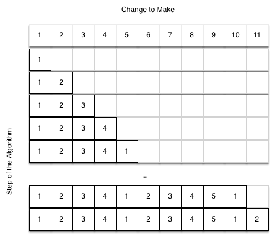

# 4.12. 动态规划

**4.12. Dynamic Programming**

=== "中文"

    计算机科学中的许多程序都是为了优化某些值而编写的，例如：在两个点之间找到最短路径，找到最适合一组点的直线，或找到满足某些条件的最小对象集合。计算机科学家们使用了多种策略来解决这些问题。本书的目标之一是向你展示几种不同的解决问题的策略。**动态规划**是一种用于这些类型优化问题的策略。
    
    一个经典的优化问题涉及使用最少数量的硬币找零。假设你是一个自动售货机制造商的程序员。你的公司希望通过为每笔交易提供尽可能少的硬币来简化工作。假设顾客投了1美元购买了一件商品，价格为37美分。你可以使用的最少硬币数是多少？答案是六枚硬币：两枚25美分的硬币、一枚10美分的硬币和三枚1美分的硬币。我们是如何得出六枚硬币的答案的？我们从我们库中的最大硬币（即25美分）开始，尽可能多地使用这些硬币，然后转到下一个较小的硬币值，尽可能多地使用这些硬币。这种方法称为**贪心算法**，因为我们尽可能地解决问题的较大部分。
    
    贪心算法在使用美国硬币时效果很好，但假设你的公司决定在下埃尔博尼亚部署其自动售货机，在那里，除了常见的1、5、10和25美分硬币之外，还存在21美分的硬币。在这种情况下，我们的贪心算法无法找到63美分找零的最优解。由于21美分硬币的加入，贪心算法仍然会发现解决方案是六枚硬币。然而，最优答案是三枚21美分的硬币。
    
    让我们看看一种可以确保找到问题最优解的方法。由于本节讨论的是递归，你可能猜到了我们将使用递归解决方案。我们从识别基本情况开始。如果我们试图找零的金额等于某种硬币的面值，那么答案很简单，就是一枚硬币。
    
    如果金额不匹配，我们有几种选择。我们想要的是硬币数的最小值，这个硬币数可以通过以下几种方式计算：用一枚1美分的硬币加上找零金额减去1美分所需的硬币数，或用一枚5美分的硬币加上找零金额减去5美分所需的硬币数，或用一枚10美分的硬币加上找零金额减去10美分所需的硬币数，等等。因此，计算找零金额所需的硬币数可以根据以下公式计算：
    
    ```plaintext
    $num\_coins = \min \begin{cases} 
    1 + num\_coins(original\ amount - 1) \\ 
    1 + num\_coins(original\ amount - 5) \\ 
    1 + num\_coins(original\ amount - 10) \\ 
    1 + num\_coins(original\ amount - 25) 
    \end{cases}
    ```
    
    `Listing 17` 显示了上述描述的算法。在第3行，我们检查基本情况；也就是说，我们试图找零的金额是否等于某种硬币的面值。如果我们没有等于找零金额的硬币，我们将对所有小于找零金额的硬币值进行递归调用。第6行显示了如何通过列表推导式过滤出小于当前找零金额的硬币列表。递归调用还会将我们需要找零的总金额减少到所选硬币的值。递归调用在第7行进行。请注意，在同一行，我们将硬币数加1，以考虑我们使用了一枚硬币。仅仅加1就等同于我们进行了一个递归调用，并立即满足基本情况条件。
    
    ```python title="**Listing 17:** 硬币优化问题的递归版本" linenums="1"
    def make_change_1(coin_denoms, change):
        if change in coin_denoms:
            return 1
        min_coins = float("inf")
        for i in [c for c in coin_denoms if c <= change]:
            num_coins = 1 + make_change_1(
                coin_denoms, change - i
            )
            min_coins = min(num_coins, min_coins)
        return min_coins
    
    
    print(make_change_1([1, 5, 10, 25], 63))
    ```
    
    `Listing 17` 中的算法的问题是效率极低。实际上，解决4种硬币、63美分问题的最优解需要67,716,925次递归调用！为了理解我们方法的致命缺陷，看看`Figure 14`，它展示了为26美分找零所需的377个函数调用中的一小部分。
    
    图中的每个节点对应一次 `make_change_1` 的调用。节点上的标签表示我们计算硬币数量的找零金额。箭头上的标签表示我们刚刚使用的硬币。通过跟踪图形，我们可以看到组合硬币的方式。主要问题在于我们重复计算了太多次。例如，图表显示算法会重新计算15美分找零的最优硬币数量至少三次。每次计算15美分的最优硬币数量本身需要52次函数调用。显然，我们在重复计算旧结果时浪费了大量时间和精力。
    
    `Figure 14: Call Tree for Listing 17`
    
    减少工作量的关键是记住一些过去的结果，以避免重新计算已经知道的结果。一种简单的解决方案是将找到的最小硬币数存储在表中。然后，在计算新的最小时，我们首先检查表中是否已经存在结果。如果表中已经有结果，我们使用表中的值，而不是重新计算。`ActiveCode 1` 显示了一个修改过的算法，采用了表查找方案。
    
    ```python title="Activity: 4.12.1 使用表查找递归计算硬币" linenums="1"
    def make_change_2(coin_value_list, change, known_results):
        min_coins = change
        if change in coin_value_list:
            known_results[change] = 1
            return 1
        elif known_results[change] > 0:
            return known_results[change]
        else:
            for i in [c for c in coin_value_list if c <= change]:
                num_coins = 1 + make_change_2(coin_value_list, change - i, known_results)
                if num_coins < min_coins:
                    min_coins = num_coins
                known_results[change] = min_coins
        return min_coins
    
    print(make_change_2([1, 5, 10, 25], 63, [0] * 64))
    ```
    
    注意在第6行我们添加了一个测试，以查看我们的表中是否包含某个金额的最小硬币数。如果表中没有，我们递归计算最小值并将计算结果存储在表中。使用这个修改后的算法，将4种硬币、63美分问题的递归调用次数减少到221次！
    
    尽管 `ActiveCode 1` 中的算法是正确的，但它看起来有点像一种权宜之计。此外，如果我们查看 `known_results` 列表，我们会发现表中存在一些空缺。实际上，我们所做的并不是动态规划，而是通过一种称为*记忆化*（或更常见的叫法是*缓存*）的技术提高了程序的性能。
    
    真正的动态规划算法将采用一种更系统的方法来解决问题。我们的动态规划解决方案将从1美分开始，系统地工作到我们需要的金额。这可以确保在算法的每一步，我们已经知道了找零所需的最小硬币数。
    
    让我们看看如何填充一个最小硬币数表来找零11美分。`Figure 15` 说明了这个过程。我们从1美分开始。唯一的解决方案是一个硬币（1美分）。下一行显示了1美分和2美分的最小硬币数。再次，唯一的解决方案是两个1美分硬币。第五行是有趣的地方。现在我们有两个选项可以考虑，五个1美分硬币或一个5美分硬币。我们如何决定哪个更好？我们查看表格，发现为了找零4美分，我们需要4个硬币，加上一个1美分硬币就是5个硬币。或者，我们可以查看0美分，加上一个5美分硬币就是1个硬币。因为1和5中的最小值是1，我们在表格中存储1。再看表格末尾，考虑11美分。`Figure 16` 显示了我们需要考虑的三种选项：
    
    1. 一枚1美分硬币加上找零金额 $11-1 = 10$ 美分的最小硬币数（1）
    2. 一枚5美分硬币加上找零金额 $11 - 5 = 6$ 美分的最小硬币数（2）
    3. 一枚10美分硬币加上找零金额 $11 - 10 = 
    
    1$ 美分的最小硬币数（1）
    
    选择1或3都能得到总共两枚硬币，这就是11美分的最小硬币数。
    
    `Listing 19` 是一个动态规划算法来解决我们的找零问题。`make_change_3` 接受三个参数：有效硬币值的列表、我们想要找零的金额，以及每个值所需的最小硬币数的列表。当函数完成时，`min_coins` 将包含从0到`change`的所有值的解决方案。
    
    ```python title="**Listing 19:** 动态规划解决方案" linenums="1"
    def make_change_3(coin_value_list, change, min_coins):
        for cents in range(change + 1):
            coin_count = cents
            for j in [c for c in coin_value_list if c <= cents]:
                if min_coins[cents - j] + 1 < coin_count:
                    coin_count = min_coins[cents - j] + 1
            min_coins[cents] = coin_count
        return min_coins[change]
    ```
    
    注意 `make_change_3` 不是递归函数，尽管我们从递归解决方案开始。重要的是要意识到，递归解决方案并不一定是最有效的解决方案。这个函数的大部分工作都由第4行开始的循环完成。在这个循环中，我们考虑使用所有可能的硬币来找零指定的金额 `cents`。就像我们为11美分找零的例子一样，我们记住最小值并将其存储在 `min_coins` 列表中。
    
    尽管我们的找零算法很好地找出了最小硬币数，但它没有帮助我们实际找零，因为我们没有记录使用的硬币。我们可以轻松地扩展 `make_change_3` 来跟踪所使用的硬币，只需记住每个 `min_coins` 表中的最后一枚硬币。如果我们知道最后添加的硬币，我们可以简单地减去硬币的值来找到表中前一个条目，该条目告诉我们为使该金额添加的最后一枚硬币。我们可以一直追溯到开始。
    
    `ActiveCode 2` 显示了 `make_change_4`，它基于 `make_change_3` 算法，但修改为跟踪所使用的硬币，以及一个 `print_coins` 函数，它通过表格向后跟踪以打印出所用的每个硬币的值。这展示了该算法在为下埃尔博尼亚的朋友解决问题时的作用。`main` 的前两行设置了要转换的金额，并创建了使用的硬币列表。接下来的两行创建了我们需要存储结果的列表。`coins_used` 是一个列表，记录用于找零的硬币，`coin_count` 是用于找零相应金额所需的最小硬币数。
    
    注意我们打印出的硬币直接来自 `coins_used` 数组。对于第一次调用，我们从数组位置63开始打印21。然后我们计算 $63 - 21 = 42$，并查看列表中第42个元素。我们发现那里也存储了21。最后，数组的第21个元素也包含21，给我们三枚21美分硬币。
    
    ```python title="Activity: 4.12.2 完整的找零问题解决方案" linenums="1"
    def make_change_4(coin_value_list, change, min_coins, coins_used):
        for cents in range(change + 1):
            coin_count = cents
            new_coin = 1
            for j in [c for c in coin_value_list if c <= cents]:
                if min_coins[cents - j] + 1 < coin_count:
                    coin_count = min_coins[cents - j] + 1
                    new_coin = j
            min_coins[cents] = coin_count
            coins_used[cents] = new_coin
        return min_coins[change]
    
    
    def print_coins(coins_used, change):
        coin = change
        while coin > 0:
            this_coin = coins_used[coin]
            print(this_coin, end=" ")
            coin = coin - this_coin
        print()
    
    
    def main():
        amnt = 63
        clist = [1, 5, 10, 21, 25]
        coins_used = [0] * (amnt + 1)
        coin_count = [0] * (amnt + 1)
    
        print(
            "Making change for {} requires the following {} coins: ".format(
                    amnt, make_change_4(clist, amnt, coin_count, coins_used)
            ),
            end="",
        )
        print_coins(coins_used, amnt)
        print("The used list is as follows:")
        print(coins_used)
    
    
    main()
    ```

=== "英文"

    Many programs in computer science are written to optimize some value; for example, find the shortest path between two points, find the line that best fits a set of points, or find the smallest set of objects that satisfies some criteria. There are many strategies that computer scientists use to solve these problems. One of the goals of this book is to expose you to several different problem-solving strategies. **Dynamic programming** is one strategy for these types of optimization problems.
    
    A classic example of an optimization problem involves making change using the fewest coins. Suppose you are a programmer for a vending machine manufacturer. Your company wants to streamline effort by giving out the fewest possible coins in change for each transaction. Suppose a customer puts in a dollar bill and purchases an item for 37 cents. What is the smallest number of coins you can use to make change? The answer is six coins: two quarters, one dime, and three pennies. How did we arrive at the answer of six coins? We start with the largest coin in our arsenal (a quarter) and use as many of those as possible, then we go to the next lowest coin value and use as many of those as possible. This first approach is called a **greedy method** because we try to solve as big a piece of the problem as possible right away.
    
    The greedy method works fine when we are using U.S. coins, but suppose that your company decides to deploy its vending machines in Lower Elbonia where, in addition to the usual 1, 5, 10, and 25 cent coins they also have a 21 cent coin. In this instance our greedy method fails to find the optimal solution for 63 cents in change. With the addition of the 21 cent coin the greedy method would still find the solution to be six coins. However, the optimal answer is three 21 cent pieces.
    
    Let’s look at a method where we could be sure that we would find the optimal answer to the problem. Since this section is about recursion, you may have guessed that we will use a recursive solution. Let’s start with identifying the base case. If we are trying to make change for the same amount as the value of one of our coins, the answer is easy, one coin.
    
    If the amount does not match we have several options. What we want is the minimum of a penny plus the number of coins needed to make change for the original amount minus a penny, or a nickel plus the number of coins needed to make change for the original amount minus five cents, or a dime plus the number of coins needed to make change for the original amount minus ten cents, and so on. So the number of coins needed to make change for the original amount can be computed according to the following:
    
    $num\_coins = min \begin{cases} 1 + num\_coins(original\ amount - 1) \\ 1 + num\_coins(original\ amount - 5) \\ 1 + num\_coins(original\ amount - 10) \\ 1 + num\_coins(original\ amount - 25) \end{cases} \label{eqn_change}$
    
    
    The algorithm for doing what we have just described is shown in `Listing 17`. In line 3 we are checking our base case; that is, we are trying to make change in the exact amount of one of our coins. If we do not have a coin equal to the amount of change, we make recursive calls for each different coin value less than the amount of change we are trying to make. Line 6 shows how we filter the list of coins to those less than the current value of change using a list comprehension. The recursive call also reduces the total amount of change we need to make by the value of the coin selected. The recursive call is made in line 7. Notice that on that same line we add 1 to our number of coins to account for the fact that we are using a coin. Just adding 1 is the same as if we had made a recursive call asking where we satisfy the base case condition immediately.
    
    ```python title="**Listing 17:** Recursive Version of Coin Optimization Problem" linenums="1"
    def make_change_1(coin_denoms, change):
        if change in coin_denoms:
            return 1
        min_coins = float("inf")
        for i in [c for c in coin_denoms if c <= change]:
            num_coins = 1 + make_change_1(
                coin_denoms, change - i
            )
            min_coins = min(num_coins, min_coins)
        return min_coins
    
    
    print(make_change_1([1, 5, 10, 25], 63))
    ```
    
    The trouble with the algorithm in `Listing 17` is that it is extremely inefficient. In fact, it takes 67,716,925 recursive calls to find the optimal solution to the 4 coins, 63 cents problem! To understand the fatal flaw in our approach look at `Figure 14`, which illustrates a small fraction of the 377 function calls needed to find the optimal set of coins to make change for 26 cents.
    
    Each node in the graph corresponds to a call to ``make_change_1``. The label on the node indicates the amount of change for which we are computing the number of coins. The label on the arrow indicates the coin that we just used. By following the graph we can see the combination of coins that got us to any point in the graph. The main problem is that we are redoing too many calculations. For example, the graph shows that the algorithm would recalculate the optimal number of coins to make change for 15 cents at least three times. Each of these computations to find the optimal number of coins for 15 cents itself takes 52 function calls. Clearly we are wasting a lot of time and effort recalculating old results.
    
    <figure markdown="span">
        
        <figcaption markdown="span">Figure 14: Call Tree for Listing 17</figcaption>
    </figure>   
    
    The key to cutting down on the amount of work we do is to remember some of the past results so we can avoid recomputing results we already know. A simple solution is to store the results for the minimum number of coins in a table when we find them. Then before we compute a new minimum, we first check the table to see if a result is already known. If there is already a result in the table, we use the value from the table rather than recomputing. `ActiveCode 1` shows a modified algorithm to incorporate our table lookup scheme.
    
    ```python title="Activity: 4.12.1 Recursively Counting Coins with Table Lookup" linenums="1"
    def make_change_2(coin_value_list, change, known_results):
        min_coins = change
        if change in coin_value_list:
            known_results[change] = 1
            return 1
        elif known_results[change] > 0:
            return known_results[change]
        else:
            for i in [c for c in coin_value_list if c <= change]:
                num_coins = 1 + make_change_2(coin_value_list, change - i, known_results)
                if num_coins < min_coins:
                    min_coins = num_coins
                known_results[change] = min_coins
        return min_coins
    
    print(make_change_2([1, 5, 10, 25], 63, [0] * 64))
    ```
    
    Notice that in line 6 we have added a test to see if our table contains the minimum number of coins for a certain amount of change. If it does not, we compute the minimum recursively and store the computed minimum in the table. Using this modified algorithm reduces the number of recursive calls we need to make for the four coin, 63 cent problem to 221 calls!
    
    Although the algorithm in `AcitveCode 1` is correct, it looks and feels like a bit of a hack.  Also, if we look at the ``known_results`` lists we can see that there are some holes in the table. In fact the term for what we have done is not dynamic programming but rather we have improved the performance of our program by using a technique known as *memoization*, or more commonly called *caching*.
    
    A truly dynamic programming algorithm will take a more systematic approach to the problem. Our dynamic programming solution is going to start with making change for one cent and systematically work its way up to the amount of change we require. This guarantees that at each step of the algorithm we already know the minimum number of coins needed to make change for any smaller amount.
    
    Let’s look at how we would fill in a table of minimum coins to use in making change for 11 cents. `Figure 15` illustrates the process. We start with one cent. The only solution possible is one coin (a penny). The next row shows the minimum for one cent and two cents. Again, the only solution is two pennies. The fifth row is where things get interesting. Now we have two options to consider, five pennies or one nickel. How do we decide which is best? We consult the table and see that the number of coins needed to make change for four cents is four, plus one more penny to make five, equals five coins. Or we can look at zero cents plus one more nickel to make five cents equals one coin. Since the minimum of one and five is one we store 1 in the table. Fast forward again to the end of the table and consider 11 cents. `Figure 16` shows the three options that we have to consider:
    
    1. A penny plus the minimum number of coins to make change for $11-1 = 10$ cents (1)
    2. A nickel plus the minimum number of coins to make change for $11 - 5 = 6$ cents (2)
    3. A dime plus the minimum number of coins to make change for $11 - 10 = 1$ cent (1)
    
    Either option 1 or 3 will give us a total of two coins which is the minimum number of coins for 11 cents.
    
    
    <figure markdown="span">
        
        <figcaption markdown="span">**Figure 15:** Minimum Number of Coins Needed to Make Change</figcaption>
    </figure>   
    
    <figure markdown="span">
        
        <figcaption markdown="span">**Figure 16:** Three Options to Consider for the Minimum Number of Coins for Eleven Cents</figcaption>
    </figure>   
    
    
    `Listing 19` is a dynamic programming algorithm to solve our change-making problem. ``make_change_3`` takes three parameters: a list of valid coin values, the amount of change we want to make, and a list of the minimum number of coins needed to make each value. When the function is done, ``min_coins`` will contain the solution for all values from 0 to the value of ``change``.
    
    ```python title="**Listing 19:** Dynamic Programming Solution"
    def make_change_3(coin_value_list, change, min_coins):
        for cents in range(change + 1):
            coin_count = cents
            for j in [c for c in coin_value_list if c <= cents]:
                if min_coins[cents - j] + 1 < coin_count:
                    coin_count = min_coins[cents - j] + 1
            min_coins[cents] = coin_count
        return min_coins[change]
    ```
    
    Note that ``make_change_3`` is not a recursive function, even though we started with a recursive solution to this problem. It is  important to realize that a recursive solution to a problem will not  necessarily be the most efficient solution. The bulk of the work in this function is done by the loop that starts on line 4. In this loop we consider using all possible coins to make change for the amount specified by ``cents``. Like we did for the 11 cent example above, we remember the minimum value and store it in our ``min_coins`` list.
    
    Although our making change algorithm does a good job of figuring out the minimum number of coins, it does not help us make change since we do not keep track of the coins we use. We can easily extend ``make_change_3`` to keep track of the coins used by simply remembering the last coin we add for each entry in the ``min_coins`` table. If we know the last coin added, we can simply subtract the value of the coin to find a previous entry in the table that tells us the last coin we added to make that amount. We can keep tracing back through the table until we get to the beginning.
    
    `ActiveCode 2` shows ``make_change_4``, based on the ``make_change_3`` algorithm but modified to keep track of the coins used, along with a function ``print_coins`` that walks backward through the table to print out the value of each coin used. This shows the algorithm in action solving the problem for our friends in Lower Elbonia. The first two lines of ``main`` set the amount to be converted and create the list of coins used. The next two lines create the lists we need to store the results. ``coins_used`` is a list of the coins used to make change, and ``coin_count`` is the minimum number of coins used to make change for the amount corresponding to the position in the list.
    
    Notice that the coins we print out come directly from the ``coins_used`` array. For the first call we start at array position 63 and print 21. Then we take $63 - 21 = 42$ and look at the 42nd element of the list. Once again we find a 21 stored there. Finally, element 21 of the array also contains 21, giving us the three 21 cent pieces.
    
    ```python title="Activity: 4.12.2 Complete Solution to the Change Problem" linenums="1"
    def make_change_4(coin_value_list, change, min_coins, coins_used):
        for cents in range(change + 1):
            coin_count = cents
            new_coin = 1
            for j in [c for c in coin_value_list if c <= cents]:
                if min_coins[cents - j] + 1 < coin_count:
                    coin_count = min_coins[cents - j] + 1
                    new_coin = j
            min_coins[cents] = coin_count
            coins_used[cents] = new_coin
        return min_coins[change]
    
    
    def print_coins(coins_used, change):
        coin = change
        while coin > 0:
            this_coin = coins_used[coin]
            print(this_coin, end=" ")
            coin = coin - this_coin
        print()
    
    
    def main():
        amnt = 63
        clist = [1, 5, 10, 21, 25]
        coins_used = [0] * (amnt + 1)
        coin_count = [0] * (amnt + 1)
    
        print(
            "Making change for {} requires the following {} coins: ".format(
                    amnt, make_change_4(clist, amnt, coin_count, coins_used)
            ),
            end="",
        )
        print_coins(coins_used, amnt)
        print("The used list is as follows:")
        print(coins_used)
    
    
    main()
    ```