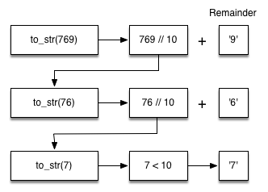
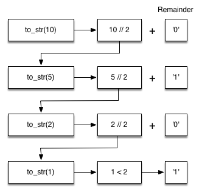

# 4.5. 将整数转换为任意进制的字符串

**4.5. Converting an Integer to a String in Any Base**

=== "中文"

    假设你想将一个整数转换为某个介于二进制和十六进制之间的字符串。例如，将整数 10 转换为其十进制字符串表示为 ``"10"``，或将其转换为二进制字符串表示为 ``"1010"``。虽然有许多算法可以解决这个问题，包括在堆栈部分讨论的算法，但问题的递归表述非常优雅。
    
    让我们看一个具体的例子，使用基数 10 和数字 769。假设我们有一个字符序列对应于前 10 个数字，例如 ``convert_string = "0123456789"``。通过查找序列，转换一个小于 10 的数字为其字符串等价物是很简单的。例如，如果数字是 9，那么字符串是 ``convert_string[9]`` 或 ``"9"``。如果我们能够将数字 769 拆分成三个单数字的数字 7、6 和 9，那么转换为字符串就很简单了。小于 10 的数字听起来像是一个很好的基本情况。
    
    知道了我们的基数，意味着整体算法将包含三个部分：
    
    1. 将原始数字缩减为一系列单数字。
    2. 使用查找将单数字转换为字符串。
    3. 将单数字字符串连接在一起形成最终结果。
    
    下一步是弄清楚如何改变状态并向基本情况迈进。由于我们正在处理整数，考虑一下哪些数学操作可能会缩减一个数字。最可能的候选是除法和减法。虽然减法可能有效，但不清楚我们应该从什么中减去。整数除法带余数给了我们明确的方向。让我们看一下如果将一个数字除以我们试图转换到的基数会发生什么。
    
    使用整数除法将 769 除以 10，我们得到 76 余 9。这给了我们两个好的结果。首先，余数是一个小于基数的数字，可以通过查找立即转换为字符串。第二，我们得到一个比原始数字小的数字，并将我们朝向基数的基本情况，即小于基数的单个数字。现在我们的任务是将 76 转换为其字符串表示。我们再次使用整数除法加余数，分别得到 7 和 6。最后，我们将问题缩减为转换 7，这很容易，因为它满足基本情况条件 $n < base$，其中 $base = 10$。我们刚刚执行的操作序列如 `Figure 4.3` 所示。注意我们要记住的数字在图右侧的余数框中。
    
    <figure markdown="span">
        
        <figcaption markdown="span">**Figure 4.3:** 将整数转换为基数 10 的字符串</figcaption>
    </figure>
    
    `ActiveCode 4.5.1` 显示了实现上述算法的 Python 代码，适用于基数 2 到 16 之间的任何基数。
    
    ```python title="Activity: 4.5.1 递归地将整数转换为字符串" linenums="1"
    def to_str(n, base):
        convert_string = "0123456789ABCDEF"
        if n < base:
            return convert_string[n]
        else:
            return to_str(n // base, base) + convert_string[n % base]
    
    print(to_str(1453, 16))
    ```
    
    注意在第 3 行我们检查基本情况，即 ``n`` 小于我们要转换到的基数。当我们检测到基本情况时，我们停止递归，直接从 ``convert_string`` 序列中返回字符串。在第 6 行，我们通过递归调用和使用除法来满足第二和第三法则。
    
    让我们再次跟踪 `ActiveCode 4.5.1` 中的算法；这次我们将数字 10 转换为基数 2 的字符串表示（``"1010"``）。
    
    <figure markdown="span">
        
        <figcaption markdown="span">**Figure 4.4:** 将数字 10 转换为基数 2 的字符串表示</figcaption>
    </figure>
    
    `Figure 4.4` 显示我们得到了所需的结果，但看起来数字的顺序是错误的。算法是正确的，因为我们首先在第 6 行进行递归调用，然后将余数的字符串表示加到结果中。如果我们将返回 ``convert_string`` 查找和返回 ``to_str`` 调用的顺序反转，那么得到的字符串将是倒置的！但通过将连接操作延迟到递归调用返回之后，我们得到了正确顺序的结果。这应该让你想起我们在前一章讨论的堆栈。
    
    !!! info "自测"
    
        编写一个函数，该函数接受一个字符串作为参数，并返回一个新字符串，该字符串是旧字符串的反转。
    
        ```python title="recursion_sc_1" linenums="1"
        from test import testEqual
    
        
        def reverse(s):
            return s
        
        testEqual(reverse("hello"), "olleh")
        testEqual(reverse("l"), "l")      
        testEqual(reverse("follow"), "wollof")
        testEqual(reverse(""), "")
        ```
        
        编写一个函数，该函数接受一个字符串作为参数，并返回 ``True`` 如果字符串是回文，``False`` 如果不是。记住，一个字符串是回文，如果它正向和反向拼写都是一样的。例如：*radar* 是一个回文。作为附加分，回文也可以是短语，但你需要在检查之前去除空格和标点符号。例如：*madam i'm adam* 是一个回文。其他有趣的回文包括：
    
        * kayak
        * aibohphobia
        * Live not on evil
        * Reviled did I live, said I, as evil I did deliver
        * Go hang a salami; I'm a lasagna hog.
        * Able was I ere I saw Elba
        * Kanakanak -- 阿拉斯加的一个城镇
        * Wassamassaw -- 南达科他州的一个城镇
    
        ```python title="recursion_sc_2" linenums="1"
        from test import testEqual
    
    
        def remove_white(s):
            return s
    
        def is_pal(s):
            return False
        
        testEqual(is_pal(remove_white("x")), True)            
        testEqual(is_pal(remove_white("radar")), True)
        testEqual(is_pal(remove_white("hello")), False)
        testEqual(is_pal(remove_white("")), True)                  
        testEqual(is_pal(remove_white("hannah")), True)      
        testEqual(is_pal(remove_white("madam i'm adam")), True)
        ```

=== "英文"

    Suppose you want to convert an integer to a string in some base between binary and hexadecimal. For example, convert the integer 10 to its string representation in decimal as ``"10"``, or to its string representation in binary as ``"1010"``. While there are many algorithms to solve this problem, including the algorithm discussed in the stack section, the recursive formulation of the problem is very elegant.
    
    Let’s look at a concrete example using base 10 and the number 769. Suppose we have a sequence of characters corresponding to the first 10 digits, like ``convert_string = "0123456789"``. It is easy to convert a number less than 10 to its string equivalent by looking it up in the sequence. For example, if the number is 9, then the string is ``convert_string[9]`` or ``"9"``. If we can arrange to break up the number 769 into three single-digit numbers, 7, 6, and 9, then converting it to a string is simple. A number less than 10 sounds like a good base case.
    
    Knowing what our base is suggests that the overall algorithm will involve three components:
    
    1. Reduce the original number to a series of single-digit numbers.
    2. Convert the single digit-number to a string using a lookup.
    3. Concatenate the single-digit strings together to form the final result.
    
    The next step is to figure out how to change state and make progress toward the base case. Since we are working with an integer, let’s consider what mathematical operations might reduce a number. The most likely candidates are division and subtraction. While subtraction might work, it is unclear what we should subtract from what. Integer division with remainders gives us a clear direction. Let’s look at what happens if we divide a number by the base we are trying to convert to.
    
    Using integer division to divide 769 by 10, we get 76 with a remainder of 9. This gives us two good results. First, the remainder is a number less than our base that can be converted to a string immediately by lookup. Second, we get a number that is smaller than our original and moves us toward the base case of having a single number less than our base. Now our job is to convert 76 to its string representation. Again we will use integer division plus remainder to get results of 7 and 6 respectively. Finally, we have reduced the problem to converting 7, which we can do easily since it satisfies the base case condition of $n < base$, where $base = 10$. The series of operations we have just performed is illustrated in `Figure 4.3`. Notice that the numbers we want to remember are in the remainder boxes along the right side of the diagram.
    
    <figure markdown="span">
        
        <figcaption markdown="span">**Figure 4.3:** Converting an Integer to a String in Base 10</figcaption>
    </figure>
    
    
    `ActiveCode 4.5.1` shows the Python code that implements the algorithm outlined above for any base between 2 and 16.
    
    ```python title="Activity: 4.5.1 Recursively Converting from Integer to String" linenums="1"
    def to_str(n, base):
        convert_string = "0123456789ABCDEF"
        if n < base:
            return convert_string[n]
        else:
            return to_str(n // base, base) + convert_string[n % base]
    
    print(to_str(1453, 16))
    ```
    
    Notice that in line 3 we check for the base case where ``n`` is less than the base we are converting to. When we detect the base case, we stop recursing and simply return the string from the ``convert_string`` sequence. In line 6 we satisfy both the second and third laws–by making the recursive call and by reducing the problem size–using division.
    
    Let’s trace the algorithm shown in `ActiveCode 4.5.1` again; this time we will convert the number 10 to its base 2 string representation (``"1010"``).
    
    <figure markdown="span">
        
        <figcaption markdown="span">**Figure 4.4:** Converting the Number 10 to its Base 2 String Representation</figcaption>
    </figure>
    
    `Figure 4.4` shows that we get the results we are looking for, but it looks like the digits are in the wrong order. The algorithm works correctly because we make the recursive call first on line 6, then we add the string representation of the remainder. If we reversed returning the ``convert_string`` lookup and returning the ``to_str`` call, the resulting string would be backward! But by delaying the concatenation operation until after the recursive call has returned, we get the result in the proper order. This should remind you of our discussion of stacks back in the previous chapter.
    
    !!! info "Self Check"
    
        Write a function that takes a string as a parameter and returns a new string that is the reverse of the old string.
    
        ```python title="recursion_sc_1" linenums="1"
        from test import testEqual
    
        
        def reverse(s):
            return s
        
        testEqual(reverse("hello"), "olleh")
        testEqual(reverse("l"), "l")      
        testEqual(reverse("follow"), "wollof")
        testEqual(reverse(""), "")
        ```
        
        Write a function that takes a string as a parameter and returns ``True`` if the string is a palindrome, ``False`` otherwise.  Remember that a string is a palindrome if it is spelled the same both forward and backward.  For example:  *radar* is a palindrome.  For bonus points palindromes can also be phrases, but you need to remove the spaces and punctuation before checking.  For example:  *madam i'm adam*  is a palindrome.  Other fun palindromes include:
        
        * kayak
        * aibohphobia
        * Live not on evil
        * Reviled did I live, said I, as evil I did deliver
        * Go hang a salami; I'm a lasagna hog.
        * Able was I ere I saw Elba
        * Kanakanak -- a town in Alaska
        * Wassamassaw -- a town in South Dakota
    
        ```python title="recursion_sc_2" linenums="1"
        from test import testEqual
    
    
        def remove_white(s):
            return s
    
        def is_pal(s):
            return False
        
        testEqual(is_pal(remove_white("x")), True)            
        testEqual(is_pal(remove_white("radar")), True)
        testEqual(is_pal(remove_white("hello")), False)
        testEqual(is_pal(removeWremove_whitehite("")), True)                  
        testEqual(is_pal(remove_white("hannah")), True)      
        testEqual(is_pal(remove_white("madam i'm adam")), True)
        ```