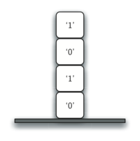
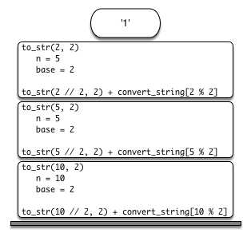

# 4.6. 栈帧：实现递归

**4.6. Stack Frames: Implementing Recursion**

=== "中文"

    假设我们不是将递归调用 ``to_str`` 的结果与 ``convert_string`` 中的字符串连接起来，而是修改算法，将字符串推送到栈上，而不是进行递归调用。这个修改后的算法的代码见 `ActiveCode 4.6.1`。
    
    ```python title="Activity: 4.6.1 使用栈将整数转换为字符串" linenums="1"
    
    from pythonds3.basic import Stack
    
    def to_str(n, base):
        r_stack = Stack()
        convert_string = "0123456789ABCDEF"
        while n > 0:
            if n < base:
                r_stack.push(convert_string[n])
            else:
                r_stack.push(convert_string[n % base])
            n = n // base
        res = ""
        while not r_stack.is_empty():
            res = res + str(r_stack.pop())
        return res
    
    print(to_str(1453, 16))
    ```
    
    每次我们调用 ``to_str`` 时，我们都会将一个字符推入栈中。返回到之前的例子，我们可以看到，在第四次调用 ``to_str`` 后，栈的状态如 `Figure 4.5` 所示。注意，现在我们可以简单地从栈中弹出字符，并将它们连接成最终结果 ``"1010"``。
    
    <figure markdown="span">
        
        <figcaption markdown="span">**Figure 4.5:** 转换过程中放置在栈上的字符串</figcaption>
    </figure>
    
    前面的例子为我们提供了一些关于 Python 如何实现递归函数调用的见解。当在 Python 中调用一个函数时，会为处理函数的局部变量分配一个 **栈帧**。当函数返回时，返回值会保留在栈顶，以供调用函数访问。`Figure 4.6` 展示了第 4 行返回语句后的调用栈。
    
    <figure markdown="span">
        
        <figcaption markdown="span">**Figure 4.6:** ``to_str(10, 2)`` 生成的调用栈</figcaption>
    </figure>
    
    注意，调用 ``to_str(2 // 2, 2)``（见 Listing 4.4）会在栈上留下返回值 ``"1"``。然后，这个返回值会在表达式 ``"1" + convert_string[2 % 2]`` 中替代函数调用（``to_str(1, 2)``），这将把字符串 ``"10"`` 留在栈顶。这样，Python 的调用栈就取代了我们在 `ActiveCode 4.6.1` 中显式使用的栈。在我们的列表求和示例中，你可以把栈上的返回值看作是累加器变量。
    
    栈帧还为函数使用的变量提供了作用域。即使我们一遍遍地调用相同的函数，每次调用都会为函数的局部变量创建一个新的作用域。

=== "英文"

    Suppose that instead of concatenating the result of the recursive call to ``to_str`` with the string from ``convert_string``, we modified our algorithm to push the strings onto a stack instead of making the recursive call. The code for this modified algorithm is shown in `ActiveCode 4.6.1`.
    
    ```python title="Activity: 4.6.1 Converting an Integer to a String Using a Stack" linenums="1"
    
    from pythonds3.basic import Stack
    
    
    def to_str(n, base):
        r_stack = Stack()
        convert_string = "0123456789ABCDEF"
        while n > 0:
            if n < base:
                r_stack.push(convert_string[n])
            else:
                r_stack.push(convert_string[n % base])
            n = n // base
        res = ""
        while not r_stack.is_empty():
            res = res + str(r_stack.pop())
        return res
    
    
    print(to_str(1453, 16))
    ```
    
    Each time we make a call to ``to_str``, we push a character on the stack. Returning to the previous example we can see that after the fourth call to ``to_str`` the stack would look like `Figure 4.5`. Notice that now we can simply pop the characters off the stack and concatenate them into the final result, ``"1010"``.
    
    <figure markdown="span">
        
        <figcaption markdown="span">**Figure 4.5:** Strings Placed on the Stack During Conversion</figcaption>
    </figure>
    
    
    The previous example gives us some insight into how Python implements a recursive function call. When a function is called in Python, a **stack frame** is allocated to handle the local variables of the function. When the function returns, the return value is left on top of the stack for the calling function to access. `Figure 4.6` illustrates the call stack after the return statement on line 4.
    
    <figure markdown="span">
        
        <figcaption markdown="span">**Figure 4.6:** Call Stack Generated from ``to_str(10, 2)``</figcaption>
    </figure>
    
    Notice that the call to ``to_str(2 // 2, 2)`` defined in Listing 4.4 leaves a return value of ``"1"`` on the stack. This return value is then used in place of the function call (``to_str(1, 2)``) in the expression ``"1" + convert_string[2 % 2]``, which will leave the string ``"10"`` on the top of the stack. In this way, the Python call stack takes the place of the stack we used explicitly in `ActiveCode 4.6.1`. In our list summing example, you can think of the return value on the stack taking the place of an accumulator variable.
    
    The stack frames also provide a scope for the variables used by the function. Even though we are calling the same function over and over, each call creates a new scope for the variables that are local to the function.