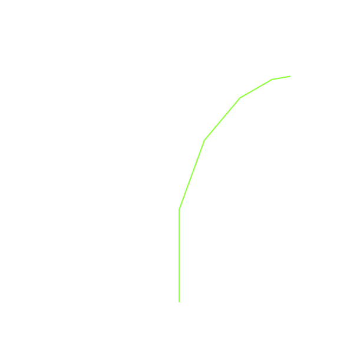

# 4.7. 递归的可视化

**4.7. Visualizing Recursion**

=== "中文"

    在前一节中，我们看到了使用递归解决的一些简单问题；然而，找到一个心智模型或可视化递归函数的运行方式仍然可能很困难。这可能会使得递归对很多人来说难以理解。在本节中，我们将通过几个示例，使用递归绘制一些有趣的图形。随着这些图形逐渐成型，你将获得对递归过程的新见解，这可能对巩固你对递归的理解有所帮助。
    
    我们将使用的工具是 Python 的 turtle 图形模块，名为 ``turtle``。``turtle`` 模块在所有版本的 Python 中都是标准配备的，使用起来非常简单。它的隐喻很简单。你可以创建一个乌龟，乌龟可以向前移动、向后移动、向左转、向右转等等。乌龟可以将尾巴抬起或放下。当乌龟的尾巴放下时，它在移动的过程中会画出一条线。为了增加乌龟的艺术价值，你可以改变尾巴的宽度以及尾巴沾染的墨水的颜色。
    
    以下是一个简单的示例，展示了一些 ``turtle`` 图形的基础知识。我们将使用 ``turtle`` 模块递归地绘制一个螺旋形。`ActiveCode 4.7.1` 展示了如何完成这项任务。导入 ``turtle`` 模块后，我们创建一个乌龟。创建乌龟时，它还会为自己创建一个绘图窗口。接下来，我们定义了 ``draw_spiral`` 函数。这个简单函数的基本情况是当我们要绘制的线段长度（由 ``len`` 参数指定）减少到零或更小。如果线段长度大于零，我们指示乌龟前进 ``len`` 单位，然后右转 90 度。递归步骤是当我们再次调用 ``draw_spiral``，并将长度减少。你会注意到 `ActiveCode 4.7.1` 的结尾，我们调用了 ``my_win.exitonclick()``。这是一个窗口的方便小方法，它将乌龟置于等待模式，直到你点击窗口内，然后程序将清理并退出。
    
    ```python title="Activity: 4.7.1 使用栈递归绘制螺旋" linenums="1"
    import turtle
    
    def draw_spiral(my_turtle, line_len):
        if line_len > 0:
            my_turtle.forward(line_len)
            my_turtle.right(90)
            draw_spiral(my_turtle, line_len - 5)
    
    my_turtle = turtle.Turtle()
    my_win = turtle.Screen()
    draw_spiral(my_turtle, 100)
    my_win.exitonclick()
    ```
    
    这基本上就是你需要了解的所有 ``turtle`` 图形知识，以便绘制一些令人印象深刻的图形。在下一个程序中，我们将转向分形。分形来自数学的一个分支，并且与递归有很多相似之处。根据定义，**分形**在不同的放大级别下都有相同的基本形状。自然界中的一些例子包括大陆的海岸线、雪花、山脉，甚至是树木或灌木。许多自然现象的分形特性使得程序员能够生成非常逼真的计算机生成图像。在下一个示例中，我们将生成一个分形树。
    
    为了理解这将如何工作，考虑如何用分形词汇来描述一棵树是很有帮助的。记住，我们在上面说过，分形在所有不同的放大级别下看起来都是相同的。如果我们将这一点转化为树木和灌木，我们可以说，即使是一个小树枝也具有与整棵树相同的形状和特征。利用这个想法，我们可以说，一棵树是一个树干，其中有一棵较小的树向右延伸，另一棵较小的树向左延伸。如果你将这个定义递归地理解，它意味着我们将递归地将树的定义应用于两个较小的左树和右树。
    
    让我们将这个想法转化为 Python 代码。`Listing 4.6` 显示了如何使用我们的乌龟生成一个分形树。让我们更详细地看一下代码。你会看到在第 5 行和第 7 行我们进行了递归调用。在第 5 行，我们在乌龟右转 20 度后进行递归调用；这就是上面提到的右侧树。然后在第 7 行，乌龟进行了另一轮递归调用，但这次是在左转 40 度之后。乌龟必须左转 40 度的原因是它需要撤销最初的 20 度右转，然后再左转额外 20 度以绘制左侧树。还要注意，每次我们递归调用 ``tree`` 时，我们都会从 ``branch_len`` 参数中减去一些量；这是为了确保递归树越来越小。你还应该认识到第 2 行的初始 ``if`` 语句作为对 ``branch_len`` 过小的基本情况的检查。
    
    ```python title="**Listing 4.6:** 分形树代码" linenums="1"
    def tree(branch_len, t):
        if branch_len > 5:
            t.forward(branch_len)
            t.right(20)
            tree(branch_len - 15, t)
            t.left(40)
            tree(branch_len - 15, t)
            t.right(20)
            t.backward(branch_len)
    ```
    
    分形树示例的完整程序见 `ActiveCode 4.7.2`。在运行代码之前，考虑一下你期望看到树的形成方式。查看递归调用，思考这棵树将如何展开。它会对称地绘制出树的左右两半吗？还是先绘制右侧再绘制左侧？
    
    ```python title="Activity: 4.7.2 递归绘制一棵树" linenums="1"
    import turtle
    
    def tree(branch_len, t):
        if branch_len > 5:
            t.forward(branch_len)
            t.right(20)
            tree(branch_len - 15, t)
            t.left(40)
            tree(branch_len - 15, t)
            t.right(20)
            t.backward(branch_len)
    
    def main():
        t = turtle.Turtle()
        my_win = turtle.Screen()
        t.left(90)
        t.up()
        t.backward(100)
        t.down()
        t.color("green")
        tree(75, t)
        my_win.exitonclick()
    
    main()
    ```
    
    注意树上的每个分支点都对应于一个递归调用，并且注意树是如何一直绘制到最短的树枝。你可以在 `Figure 4.7` 中看到这一点。现在，注意程序如何向上绘制树干，直到整个右半侧的树被绘制完成。你可以在 `Figure 4.8` 中看到右半部分的树。然后绘制左侧的树，但并不是向左尽可能远地绘制。相反，一旦绘制完成左树的右侧部分，我们才最终绘制到最小的左侧树枝。
    
    <figure markdown="span">
        
        <figcaption markdown="span">**Figure 4.7:** 分形树的开始</figcaption>
    </figure>
    
    <figure markdown="span">
        
        <figcaption markdown="span">**Figure 4.8:** 树的前半部分</figcaption>
    </figure>
    
    这个简单的树程序只是一个起点，你会发现树的外观并不特别现实，因为自然界并不像计算机程序那样对称。本章末尾的练习将给你一些想法，探索一些有趣的选项来使你的树看起来更现实。

=== "英文"

    In the previous section we looked at some problems that were easy to solve using recursion; however, it can still be difficult to find a mental model or a way of visualizing what is happening in a recursive function. This can make recursion difficult for people to grasp. In this section we will look at a couple of examples of using recursion to draw some interesting pictures. As you watch these pictures take shape you will get some new insight into the recursive process that may be helpful in cementing your understanding of recursion.
    
    The tool we will use for our illustrations is Python’s turtle graphics module called ``turtle``. The ``turtle`` module is standard with all versions of Python and is very easy to use. The metaphor is quite simple. You can create a turtle and the turtle can move forward, move backward, turn left, turn right, etc. The turtle can have its tail up or down. When the turtle’s tail is down and the turtle moves, it draws a line as it moves. To increase the artistic value of the turtle, you can change the width of the tail as well as the color of the ink the tail is dipped in.
    
    Here is a simple example to illustrate some ``turtle`` graphics basics. We will use the ``turtle`` module to draw a spiral recursively. `ActiveCode 4.7.1` shows how it is done. After importing the ``turtle`` module we create a turtle. When the turtle is created it also creates a window for itself to draw in. Next we define the ``draw_spiral`` function. The base case for this simple function is when the length of the line we want to draw, as given by the ``len`` parameter, is reduced to zero or less. If the length of the line is longer than zero, we instruct the turtle to go forward by ``len`` units and then turn right 90 degrees. The recursive step is when we call ``draw_spiral`` again with a reduced length. At the end of `ActiveCode 4.7.1` you will notice that we call the function ``my_win.exitonclick()``. This is a handy little method of the window that puts the turtle into a wait mode until you click inside the window, after which the program cleans up and exits.
    
    
    ```python title="Activity: 4.7.1 Drawing a Recursive Spiral using turtle" linenums="1"
    import turtle
    
    
    def draw_spiral(my_turtle, line_len):
        if line_len > 0:
            my_turtle.forward(line_len)
            my_turtle.right(90)
            draw_spiral(my_turtle, line_len - 5)
    
    
    my_turtle = turtle.Turtle()
    my_win = turtle.Screen()
    draw_spiral(my_turtle, 100)
    my_win.exitonclick()
    ```
    
    That is really about all the turtle graphics you need to know in order to make some pretty impressive drawings. For our next program we will turn to fractals. Fractals come from a branch of mathematics, and have much in common with recursion. By definition, a **fractal** has the same basic shape no matter how much you magnify it. Some examples from nature are the coastlines of continents, snowflakes, mountains, and even trees or shrubs. The fractal nature of many of these natural phenomena makes it possible for programmers to generate very realistic looking scenery for computer-generated movies. In our next example we will generate a fractal tree.
    
    To understand how this is going to work it is helpful to think of how we might describe a tree using a fractal vocabulary. Remember that we said above that a fractal is something that looks the same at all different levels of magnification. If we translate this to trees and shrubs, we might say that even a small twig has the same shape and characteristics as a whole tree. Using this idea we could say that a tree is a trunk, with a smaller tree going off to the right and another smaller tree going off to the left. If you think of this definition recursively, it means that we will apply the recursive definition of a tree to both of the smaller left and right trees.
    
    Let's translate this idea to some Python code. `Listing 4.6` shows how we can use our turtle to generate a fractal tree. Let's look at the code a bit more closely. You will see that on lines 5 and 7 we are making a recursive call. On line 5 we make the recursive call right after the turtle turns to the right by 20 degrees; this is the right tree mentioned above. Then in line 7 the turtle makes another recursive call, but this time after turning left by 40 degrees. The reason the turtle must turn left by 40 degrees is that it needs to undo the original 20-degree turn to the right and then do an additional 20-degree turn to the left in order to draw the left tree. Also notice that each time we make a recursive call to ``tree`` we subtract some amount from the ``branch_len`` parameter; this is to make sure that the recursive trees get smaller and smaller. You should also recognize the initial ``if`` statement on line 2 as a check for the base case of ``branch_len`` getting too small.
    
    ```python title="**Listing 4.6:** Fractal Tree Code" linenums="1"
    def tree(branch_len, t):
        if branch_len > 5:
            t.forward(branch_len)
            t.right(20)
            tree(branch_len - 15, t)
            t.left(40)
            tree(branch_len - 15, t)
            t.right(20)
            t.backward(branch_len)
    ```
    
    The complete program for this tree example is shown in `ActiveCode 4.7.2`.  Before you run the code think about how you expect to see the tree take shape. Look at the recursive calls and think about how this tree will unfold. Will it be drawn symmetrically with the right and left halves of the tree taking shape simultaneously? Will it be drawn right side first then left side?
    
    
    ```python title="Activity: 4.7.2 Recursively Drawing a Tree" linenums="1"
    import turtle
    
    
    def tree(branch_len, t):
        if branch_len > 5:
            t.forward(branch_len)
            t.right(20)
            tree(branch_len - 15, t)
            t.left(40)
            tree(branch_len - 15, t)
            t.right(20)
            t.backward(branch_len)
    
    def main():
        t = turtle.Turtle()
        my_win = turtle.Screen()
        t.left(90)
        t.up()
        t.backward(100)
        t.down()
        t.color("green")
        tree(75, t)
        my_win.exitonclick()
    
    main()
    ```
    
    Notice how each branch point on the tree corresponds to a recursive call, and notice how the tree is drawn to the right all the way down to its shortest twig. You can see this in `Figure 4.7`. Now, notice how the program works its way back up the trunk until the entire right side of the tree is drawn. You can see the right half of the tree in `Figure 4.8`. Then the left side of the tree is drawn, but not by going as far out to the left as possible. Rather, once again the entire right side of the left tree is drawn until we finally make our way out to the smallest twig on the left.
    
    <figure markdown="span">
        
        <figcaption markdown="span">**Figure 4.7:** The Beginning of a Fractal Tree</figcaption>
    </figure>
    
    <figure markdown="span">
        
        <figcaption markdown="span">**Figure 8:** The First Half of the Tree</figcaption>
    </figure>
    
    This simple tree program is just a starting point for you, and you will notice that the tree does not look particularly realistic because nature is just not as symmetrical as a computer program. The exercises at the end of the chapter will give you some ideas for how to explore some interesting options to make your tree look more realistic.
    
    !!! info "Self Check"
    
        Modify the recursive tree program using one or all of the following ideas:
    
        -  Modify the thickness of the branches so that as the ``branch_len`` gets smaller, the line gets thinner.
        -  Modify the color of the branches so that as the ``branch_len`` gets very short it is colored like a leaf.
        -  Modify the angle used in turning the turtle so that at each branch point the angle is selected at random in some range. For example choose the angle between 15 and 45 degrees. Play around to see what looks good.
        -  Modify the ``branch_len`` recursively so that instead of always subtracting the same amount you subtract a random amount in some range.