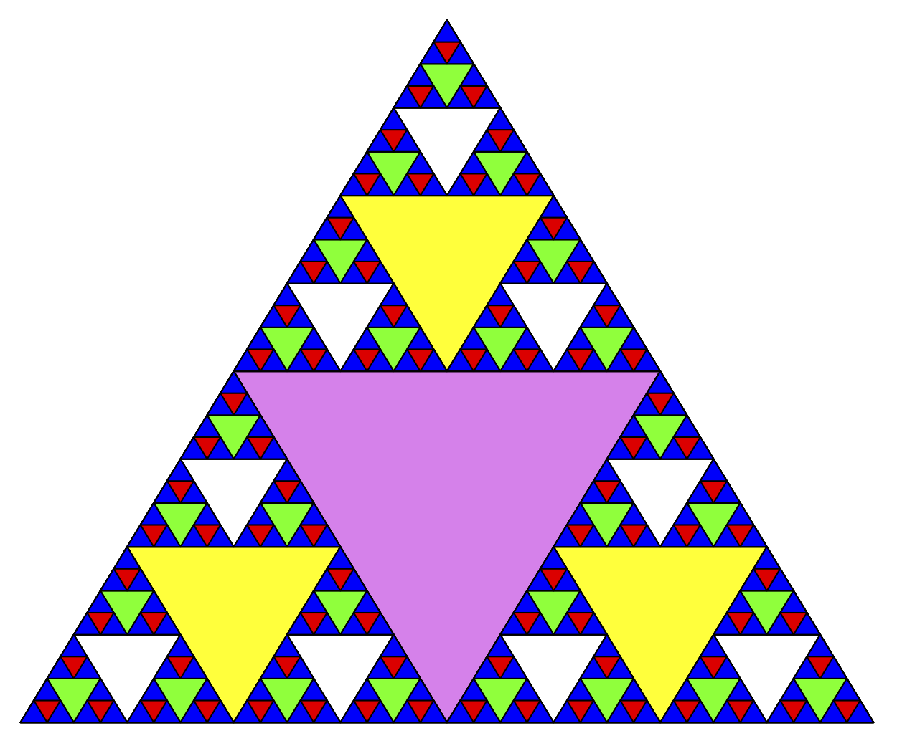
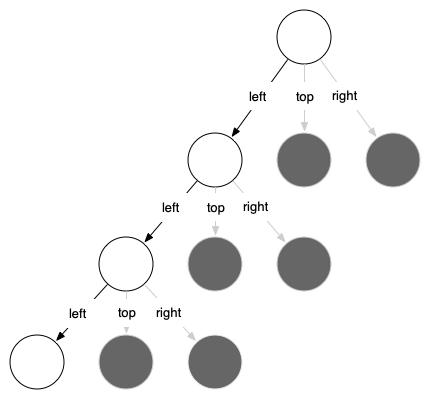

# 4.8. 谢尔宾斯基三角形

**4.8. Sierpinski Triangle**

=== "中文"

    另一个展示自相似性质的分形是谢尔宾斯基三角形。`Figure 4.9` 展示了一个例子。谢尔宾斯基三角形展示了一种三重递归算法。手动绘制谢尔宾斯基三角形的方法很简单。首先从一个大三角形开始。通过连接每条边的中点，将这个大三角形划分为四个新三角形。忽略刚刚创建的中间三角形，对其余三个角落的三角形应用相同的方法。每次创建一组新三角形时，你递归地对这三个较小的角落三角形应用这个过程。如果你有足够锋利的铅笔，你可以无限期地应用这个过程。在继续阅读之前，你可能想尝试自己用这种方法绘制谢尔宾斯基三角形。
    
    <figure markdown="span">
        
        <figcaption markdown="span">**Figure 4.9:** 谢尔宾斯基三角形</figcaption>
    </figure>
    
    由于我们可以无限期地应用这个算法，那么基本情况是什么呢？我们会看到，基本情况被任意设置为我们希望将三角形划分为多少次。有时我们称这个数字为**分形的度数**。每次进行递归调用时，我们将度数减 1，直到达到 0。当我们达到度数为 0 时，我们停止递归调用。生成 `Figure 4.9` 中的谢尔宾斯基三角形的代码见 `ActiveCode 4.8.1`。
    
    ```python title="Activity: 4.8.1 绘制谢尔宾斯基三角形" linenums="1"
    import turtle
    
    def draw_triangle(points, color, my_turtle):
        my_turtle.fillcolor(color)
        my_turtle.up()
        my_turtle.goto(points[0][0], points[0][1])
        my_turtle.down()
        my_turtle.begin_fill()
        my_turtle.goto(points[1][0], points[1][1])
        my_turtle.goto(points[2][0], points[2][1])
        my_turtle.goto(points[0][0], points[0][1])
        my_turtle.end_fill()
    
    def get_mid(p1, p2):
        return ((p1[0] + p2[0]) / 2, (p1[1] + p2[1]) / 2)
    
    def sierpinski(points, degree, my_turtle):
        colormap = ["blue", "red", "green", "white", "yellow", "violet", "orange"]
        draw_triangle(points, colormap[degree], my_turtle)
        if degree > 0:
            sierpinski(
                [points[0], get_mid(points[0], points[1]), get_mid(points[0], points[2])],
                degree - 1,
                my_turtle,
            )
            sierpinski(
                [points[1], get_mid(points[0], points[1]), get_mid(points[1], points[2])],
                degree - 1,
                my_turtle,
            )
            sierpinski(
                [points[2], get_mid(points[2], points[1]), get_mid(points[0], points[2])],
                degree - 1,
                my_turtle,
            )
    
    def main():
        my_turtle = turtle.Turtle()
        my_win = turtle.Screen()
        my_points = [[-180, -150], [0, 150], [180, -150]]
        sierpinski(my_points, 5, my_turtle)
        my_win.exitonclick()
    
    main()
    ```
    
    `ActiveCode 4.8.1` 中的程序遵循了上述思想。``sierpinski`` 首先绘制外部三角形。接下来，有三个递归调用，每个角落的三角形都对应一个递归调用。一旦再次使用了标准的 ``turtle`` 模块，你可以通过从 Python 提示符使用 ``help("turtle")`` 来学习 ``turtle`` 模块中的所有方法的详细信息。
    
    查看代码并思考三角形绘制的顺序。虽然角落的确切顺序取决于初始集合的指定方式，但我们假设角落的顺序是左下、顶部、右下。由于 ``sierpinski`` 函数调用自身的方式，``sierpinski`` 会先绘制到最小的左下角三角形，然后开始填充其余的三角形，再返回填充顶部角落的三角形，最后填充右下角，逐渐绘制到右下角的最小三角形。
    
    有时，用函数调用的图示来思考递归算法是很有帮助的。`Figure 4.10` 展示了递归调用总是向左进行。活动函数用黑色轮廓显示，非活动函数调用用灰色显示。你越往下看 `Figure 4.10`，三角形越小。函数每次完成一个级别的绘制；完成左下角后，它会转到左中间，依此类推。
    
    <figure markdown="span">
        
        <figcaption markdown="span">**Figure 4.10:** 构建谢尔宾斯基三角形</figcaption>
    </figure>
    
    ``sierpinski`` 函数在很大程度上依赖于 ``get_mid`` 函数。``get_mid`` 函数接受两个端点作为参数，并返回它们之间的中点。此外，`ActiveCode 4.8.1` 中还有一个使用 ``begin_fill`` 和 ``end_fill`` 方法绘制填充三角形的函数。

=== "英文"

    Another fractal that exhibits the property of self-similarity is the Sierpinski triangle. An example is shown in `Figure 4.9`. The Sierpinski triangle illustrates a three-way recursive algorithm. The procedure for drawing a Sierpinski triangle by hand is simple. Start with a single large triangle. Divide this large triangle into four new triangles by connecting the midpoint of each side. Ignoring the middle triangle that you just created, apply the same procedure to each of the three corner triangles. Each time you create a new set of triangles, you recursively apply this procedure to the three smaller corner triangles. You can continue to apply this procedure indefinitely if you have a sharp enough pencil. Before you continue reading, you may want to try drawing the Sierpinski triangle yourself, using the method described.
    
    <figure markdown="span">
        
        <figcaption markdown="span">**Figure 4.9:** The Sierpinski Triangle</figcaption>
    </figure>
    
    Since we can continue to apply the algorithm indefinitely, what is the base case? We will see that the base case is set arbitrarily as the number of times we want to divide the triangle into pieces. Sometimes we call this number the *degree* of the fractal. Each time we make a recursive call, we subtract 1 from the degree until we reach 0. When we reach a degree of 0, we stop making recursive calls. The code that generated the Sierpinski Triangle in `Figure 4.9` is shown in `ActiveCode 4.8.1`.
    
    ```python title="Activity: 4.8.1 Drawing a Sierpinski Triangle" linenums="1"
    import turtle
    
    
    def draw_triangle(points, color, my_turtle):
        my_turtle.fillcolor(color)
        my_turtle.up()
        my_turtle.goto(points[0][0], points[0][1])
        my_turtle.down()
        my_turtle.begin_fill()
        my_turtle.goto(points[1][0], points[1][1])
        my_turtle.goto(points[2][0], points[2][1])
        my_turtle.goto(points[0][0], points[0][1])
        my_turtle.end_fill()
    
    
    def get_mid(p1, p2):
        return ((p1[0] + p2[0]) / 2, (p1[1] + p2[1]) / 2)
    
    
    def sierpinski(points, degree, my_turtle):
        colormap = ["blue", "red", "green", "white", "yellow", "violet", "orange"]
        draw_triangle(points, colormap[degree], my_turtle)
        if degree > 0:
            sierpinski(
                [points[0], get_mid(points[0], points[1]), get_mid(points[0], points[2])],
                degree - 1,
                my_turtle,
            )
            sierpinski(
                [points[1], get_mid(points[0], points[1]), get_mid(points[1], points[2])],
                degree - 1,
                my_turtle,
            )
            sierpinski(
                [points[2], get_mid(points[2], points[1]), get_mid(points[0], points[2])],
                degree - 1,
                my_turtle,
            )
    
    
    def main():
        my_turtle = turtle.Turtle()
        my_win = turtle.Screen()
        my_points = [[-180, -150], [0, 150], [180, -150]]
        sierpinski(my_points, 5, my_turtle)
        my_win.exitonclick()
    
    
    main()
    ```
    
    The program in `ActiveCode 4.8.1` follows the ideas outlined above. The first thing ``sierpinski`` does is draw the outer triangle. Next, there are three recursive calls, one for each of the new corner triangles we get when we connect the midpoints. Once again we make use of the standard ``turtle`` module that comes with Python. You can learn all the details of the methods available in the turtle module by using ``help("turtle")`` from the Python prompt.
    
    Look at the code and think about the order in which the triangles will be drawn. While the exact order of the corners depends upon how the initial set is specified, let’s assume that the corners are ordered lower left, top, lower right. Because of the way the ``sierpinski`` function calls itself, ``sierpinski`` works its way to the smallest allowed triangle in the lower-left corner and then begins to fill out the rest of the triangles working back. Then it fills in the triangles in the top corner by working toward the smallest, topmost triangle. Finally, it fills in the lower-right corner, working its way toward the smallest triangle in the lower right.
    
    Sometimes it is helpful to think of a recursive algorithm in terms of a diagram of function calls. `Figure 4.10` shows that the recursive calls are always made going to the left. The active functions are outlined in black, and the inactive function calls are in gray. The farther you go toward the bottom of `Figure 4.10`, the smaller the triangles. The function finishes drawing one level at a time; once it is finished with the bottom left it moves to the bottom middle, and so on.
    
    <figure markdown="span">
        
        <figcaption markdown="span">**Figure 4.10:** Building a Sierpinski Triangle</figcaption>
    </figure>
    
    The ``sierpinski`` function relies heavily on the ``get_mid`` function. ``get_mid`` takes as arguments two endpoints and returns the point halfway between them. In addition, `ActiveCode 4.8.1` has a function that draws a filled triangle using the ``begin_fill`` and ``end_fill`` turtle methods.