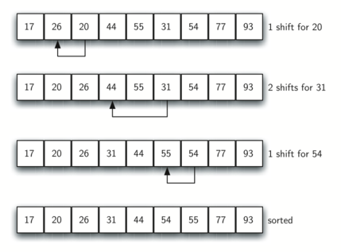

# 5.10. 希尔排序

**5.10. The Shell Sort**

<!--排序需要-->
<script src="../js/animationbase.js"></script>
<script src="../js/sortmodels.js"></script>
<script src="../js/sortviewers.js"></script>

=== "中文"

    The **Shell sort**, sometimes called the *diminishing increment sort*, improves on the insertion sort by breaking the original list into a number of smaller sublists, each of which is sorted using an insertion sort. The unique way that these sublists are chosen is the key to the Shell sort. Instead of breaking the list into sublists of contiguous items, the Shell sort uses an increment $i$, sometimes called the **gap**, to create a sublist by choosing all items that are $i$ items apart.
    
    This can be seen in `Figure 6`. This list has nine items. If we use an increment of three, there are three sublists, each of which can be sorted by an insertion sort. After completing these sorts, we get the list shown in `Figure 7`. Although the list shown in `Figure 7` is not completely sorted, something very interesting has happened. By sorting the sublists, we have moved the items closer to where they actually belong.
    
    <figure markdown="span">
        
        <figcaption markdown="span">Figure 6: A Shell Sort with Increments of Three</figcaption>
    </figure>   
    
    <figure markdown="span">
        
        <figcaption markdown="span">Figure 7: A Shell Sort after Sorting Each Sublist</figcaption>
    </figure>
    
    `Figure 8` shows a final insertion sort using an increment of one—in other words, a standard insertion sort. Note that by performing the earlier sublist sorts, we have now reduced the total number of shifting operations necessary to put the list in its final order. For this case, we need only four more shifts to complete the process.
    
    <figure markdown="span">
        
        <figcaption markdown="span">Figure 8: ShellSort: A Final Insertion Sort with Increment of 1</figcaption>
    </figure>   
    
    <figure markdown="span">
        
        <figcaption markdown="span">Figure 9: Initial Sublists for a Shell Sort</figcaption>
    </figure>   
    
    
    We said earlier that the way in which the increments are chosen is the unique feature of the Shell sort. The function shown in `ActiveCode 1` uses a different set of increments. In this case, we begin with $\frac {n}{2}$ sublists. On the next pass, $\frac {n}{4}$ sublists are sorted. Eventually, a single list is sorted with the basic insertion sort. `Figure 9` shows the first sublists for our example using this increment.
    
    The following invocation of the ``shell_sort`` function shows the partially sorted lists after each increment, with the final sort being an insertion sort with an increment of one.
    
    ```python title="Activity: 5.10.1 Shell Sort Implementation" linenums="1"
    def shell_sort(a_list):
        sublist_count = len(a_list) // 2
        while sublist_count > 0:
            for pos_start in range(sublist_count):
                gap_insertion_sort(a_list, pos_start, sublist_count)
            print("After increments of size", sublist_count, "the list is", a_list)
            sublist_count = sublist_count // 2
    
    def gap_insertion_sort(a_list, start, gap):
        for i in range(start + gap, len(a_list), gap):
            cur_val = a_list[i]
            cur_pos = i
            while cur_pos >= gap and a_list[cur_pos - gap] > cur_val:
                a_list[cur_pos] = a_list[cur_pos - gap]
                cur_pos = cur_pos - gap
            a_list[cur_pos] = cur_val
    
    
    a_list = [54, 26, 93, 17, 77, 31, 44, 55, 20]
    shell_sort(a_list)
    print(a_list)
    ```
    
    <div id="shell_anim1" class="">
        <canvas id="shell_anim1_canvas" width="400" height="400" style="border:4px solid blue"></canvas>
        <br>
        <button style="border: 1px solid black; background-color: buttonface; padding: 2px;" onclick="shell_anim1_anim = shell_anim_init('shell_anim1')">Initialize</button>
        <button style="border: 1px solid black; background-color: buttonface; padding: 2px;" onclick="shell_anim1_anim.run('shell_anim1_anim')">Run</button>
        <button style="border: 1px solid black; background-color: buttonface; padding: 2px;" onclick="shell_anim1_anim.stop()">Stop</button> <br>
        <button style="border: 1px solid black; background-color: buttonface; padding: 2px;" onclick="shell_anim1_anim.begin()">Beginning</button>
        <button style="border: 1px solid black; background-color: buttonface; padding: 2px;" onclick="shell_anim1_anim.forward()">Step Forward</button>
        <button style="border: 1px solid black; background-color: buttonface; padding: 2px;" onclick="shell_anim1_anim.backward()">Step Backward</button>
        <button style="border: 1px solid black; background-color: buttonface; padding: 2px;" onclick="shell_anim1_anim.end()">End</button>
        <script>
        shell_anim_init = function(divid)
        {
           var a = new Animator(new ShellSortModel(), new BarViewer(), divid)
           a.init()
           return a
        }
        </script>
    </div>
    
    For more detail, CodeLens 5 allows you to step through the algorithm.
    
    ```python title="Tracing the Shell Sort" linenums="1"
    def shell_sort(a_list):
        sublist_count = len(a_list) // 2
        while sublist_count > 0:
            for pos_start in range(sublist_count):
                gap_insertion_sort(a_list, pos_start, sublist_count)
            print("After increments of size", sublist_count, "the list is", a_list)
            sublist_count = sublist_count // 2
    
    
    def gap_insertion_sort(a_list, start, gap):
        for i in range(start + gap, len(a_list), gap):
            cur_val = a_list[i]
            cur_pos = i
            while cur_pos >= gap and a_list[cur_pos - gap] > cur_val:
                a_list[cur_pos] = a_list[cur_pos - gap]
                cur_pos = cur_pos - gap
            a_list[cur_pos] = cur_val
    
    
    a_list = [54, 26, 93, 17, 77, 31, 44, 55, 20]
    shell_sort(a_list)
    print(alist)
    ```
    
    At first glance you may think that a Shell sort cannot be better than an insertion sort since it does a complete insertion sort as the last step. It turns out, however, that this final insertion sort does not need to do very many comparisons (or shifts) since the list has been presorted by earlier incremental insertion sorts, as described above. In other words, each pass produces a list that is “more sorted” than the previous one. This makes the final pass very efficient.
    
    Although a general analysis of the Shell sort is well beyond the scope of this text, we can say that it tends to fall somewhere between $O(n)$ and $O(n^{2})$, based on the behavior described above. For the increments shown in `Listing 5`, the performance is $O(n^{2})$. By changing the increment, for example using $2^{k}-1$ (1, 3, 7, 15, 31, and so on), a Shell sort can perform at $O(n^{\frac {3}{2}})$.
    
    
    !!! info "Self Check"
        
        Given the following list of numbers:  [5, 16, 20, 12, 3, 8, 9, 17, 19, 7]
        Which answer illustrates the contents of the list after all swapping is complete for a gap size of 3?
    
        - answer a: [5, 3, 8, 7, 16, 19, 9, 17, 20, 12]
        - answer b: [3, 7, 5, 8, 9, 12, 19, 16, 20, 17]
        - answer c: [3, 5, 7, 8, 9, 12, 16, 17, 19, 20]
        - answer d: [5, 16, 20, 3, 8, 12, 9, 17, 20, 7]
        
        correct: a
        
        - feedback a:  Each group of numbers represented by index positions 3 apart are sorted correctly.
        - feedback b:  This solution is for a gap size of two.
        - feedback c: This is list completely sorted, you have gone too far.
        - feedback d: The gap size of three indicates that the group represented by every third number e.g. 0, 3, 6, 9  and 1, 4, 7 and 2, 5, 8 are sorted not groups of 3.

=== "英文"

    The **Shell sort**, sometimes called the *diminishing increment sort*, improves on the insertion sort by breaking the original list into a number of smaller sublists, each of which is sorted using an insertion sort. The unique way that these sublists are chosen is the key to the Shell sort. Instead of breaking the list into sublists of contiguous items, the Shell sort uses an increment $i$, sometimes called the **gap**, to create a sublist by choosing all items that are $i$ items apart.
    
    This can be seen in `Figure 6`. This list has nine items. If we use an increment of three, there are three sublists, each of which can be sorted by an insertion sort. After completing these sorts, we get the list shown in `Figure 7`. Although the list shown in `Figure 7` is not completely sorted, something very interesting has happened. By sorting the sublists, we have moved the items closer to where they actually belong.
    
    <figure markdown="span">
        
        <figcaption markdown="span">Figure 6: A Shell Sort with Increments of Three</figcaption>
    </figure>   
    
    <figure markdown="span">
        
        <figcaption markdown="span">Figure 7: A Shell Sort after Sorting Each Sublist</figcaption>
    </figure>
    
    `Figure 8` shows a final insertion sort using an increment of one—in other words, a standard insertion sort. Note that by performing the earlier sublist sorts, we have now reduced the total number of shifting operations necessary to put the list in its final order. For this case, we need only four more shifts to complete the process.
    
    <figure markdown="span">
        
        <figcaption markdown="span">Figure 8: ShellSort: A Final Insertion Sort with Increment of 1</figcaption>
    </figure>   
    
    <figure markdown="span">
        
        <figcaption markdown="span">Figure 9: Initial Sublists for a Shell Sort</figcaption>
    </figure>   
    
    
    We said earlier that the way in which the increments are chosen is the unique feature of the Shell sort. The function shown in `ActiveCode 1` uses a different set of increments. In this case, we begin with $\frac {n}{2}$ sublists. On the next pass, $\frac {n}{4}$ sublists are sorted. Eventually, a single list is sorted with the basic insertion sort. `Figure 9` shows the first sublists for our example using this increment.
    
    The following invocation of the ``shell_sort`` function shows the partially sorted lists after each increment, with the final sort being an insertion sort with an increment of one.
    
    ```python title="Activity: 5.10.1 Shell Sort Implementation" linenums="1"
    def shell_sort(a_list):
        sublist_count = len(a_list) // 2
        while sublist_count > 0:
            for pos_start in range(sublist_count):
                gap_insertion_sort(a_list, pos_start, sublist_count)
            print("After increments of size", sublist_count, "the list is", a_list)
            sublist_count = sublist_count // 2
    
    def gap_insertion_sort(a_list, start, gap):
        for i in range(start + gap, len(a_list), gap):
            cur_val = a_list[i]
            cur_pos = i
            while cur_pos >= gap and a_list[cur_pos - gap] > cur_val:
                a_list[cur_pos] = a_list[cur_pos - gap]
                cur_pos = cur_pos - gap
            a_list[cur_pos] = cur_val
    
    
    a_list = [54, 26, 93, 17, 77, 31, 44, 55, 20]
    shell_sort(a_list)
    print(a_list)
    ```

    <div id="shell_anim" class="">
        <canvas id="shell_anim_canvas" width="400" height="400" style="border:4px solid blue"></canvas>
        <br>
        <button style="border: 1px solid black; background-color: buttonface; padding: 2px;" onclick="shell_anim_anim = shell_anim_init('shell_anim')">Initialize</button>
        <button style="border: 1px solid black; background-color: buttonface; padding: 2px;" onclick="shell_anim_anim.run('shell_anim_anim')">Run</button>
        <button style="border: 1px solid black; background-color: buttonface; padding: 2px;" onclick="shell_anim_anim.stop()">Stop</button> <br>
        <button style="border: 1px solid black; background-color: buttonface; padding: 2px;" onclick="shell_anim_anim.begin()">Beginning</button>
        <button style="border: 1px solid black; background-color: buttonface; padding: 2px;" onclick="shell_anim_anim.forward()">Step Forward</button>
        <button style="border: 1px solid black; background-color: buttonface; padding: 2px;" onclick="shell_anim_anim.backward()">Step Backward</button>
        <button style="border: 1px solid black; background-color: buttonface; padding: 2px;" onclick="shell_anim_anim.end()">End</button>
        <script>
        shell_anim_init = function(divid)
        {
           var a = new Animator(new ShellSortModel(), new BarViewer(), divid)
           a.init()
           return a
        }
        </script>
    </div>
    
    For more detail, CodeLens 5 allows you to step through the algorithm.
    
    ```python title="Tracing the Shell Sort" linenums="1"
    def shell_sort(a_list):
        sublist_count = len(a_list) // 2
        while sublist_count > 0:
            for pos_start in range(sublist_count):
                gap_insertion_sort(a_list, pos_start, sublist_count)
            print("After increments of size", sublist_count, "the list is", a_list)
            sublist_count = sublist_count // 2
    
    
    def gap_insertion_sort(a_list, start, gap):
        for i in range(start + gap, len(a_list), gap):
            cur_val = a_list[i]
            cur_pos = i
            while cur_pos >= gap and a_list[cur_pos - gap] > cur_val:
                a_list[cur_pos] = a_list[cur_pos - gap]
                cur_pos = cur_pos - gap
            a_list[cur_pos] = cur_val
    
    
    a_list = [54, 26, 93, 17, 77, 31, 44, 55, 20]
    shell_sort(a_list)
    print(alist)
    ```
    
    At first glance you may think that a Shell sort cannot be better than an insertion sort since it does a complete insertion sort as the last step. It turns out, however, that this final insertion sort does not need to do very many comparisons (or shifts) since the list has been presorted by earlier incremental insertion sorts, as described above. In other words, each pass produces a list that is “more sorted” than the previous one. This makes the final pass very efficient.
    
    Although a general analysis of the Shell sort is well beyond the scope of this text, we can say that it tends to fall somewhere between $O(n)$ and $O(n^{2})$, based on the behavior described above. For the increments shown in `Listing 5`, the performance is $O(n^{2})$. By changing the increment, for example using $2^{k}-1$ (1, 3, 7, 15, 31, and so on), a Shell sort can perform at $O(n^{\frac {3}{2}})$.
    
    
    !!! info "Self Check"
        
        Given the following list of numbers:  [5, 16, 20, 12, 3, 8, 9, 17, 19, 7]
        Which answer illustrates the contents of the list after all swapping is complete for a gap size of 3?
    
        - answer a: [5, 3, 8, 7, 16, 19, 9, 17, 20, 12]
        - answer b: [3, 7, 5, 8, 9, 12, 19, 16, 20, 17]
        - answer c: [3, 5, 7, 8, 9, 12, 16, 17, 19, 20]
        - answer d: [5, 16, 20, 3, 8, 12, 9, 17, 20, 7]
        
        correct: a
        
        - feedback a:  Each group of numbers represented by index positions 3 apart are sorted correctly.
        - feedback b:  This solution is for a gap size of two.
        - feedback c: This is list completely sorted, you have gone too far.
        - feedback d: The gap size of three indicates that the group represented by every third number e.g. 0, 3, 6, 9  and 1, 4, 7 and 2, 5, 8 are sorted not groups of 3.


