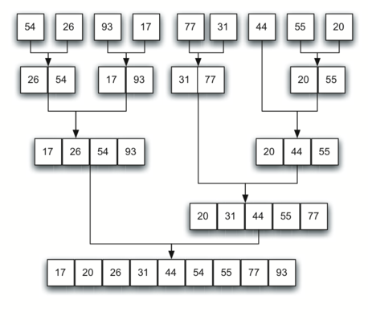

# 5.11. 归并排序

**5.11. The Merge Sort**

<!--排序需要-->
<script src="../js/animationbase.js"></script>
<script src="../js/sortmodels.js"></script>
<script src="../js/sortviewers.js"></script>

=== "中文"
    
    我们现在转向使用分治策略来提升排序算法的性能。我们将研究的第一个算法是 **归并排序**。归并排序是一种递归算法，它不断将列表一分为二。如果列表为空或只有一个项，则按定义已排序（这是基本情况）。如果列表包含多个项，则将列表分成两半，并递归地对这两半调用归并排序。一旦两半都已排序，就执行一个基本操作，称为 **归并**。归并是将两个已排序的较小列表合并为一个新的已排序列表的过程。`图 10` 显示了我们熟悉的示例列表在 ``merge_sort`` 中被拆分的过程。`图 11` 显示了这些简单的列表，经过排序后，它们如何被合并回一起。
    
    <figure markdown="span">
        
        <figcaption markdown="span">图 10: 归并排序中的列表拆分</figcaption>
    </figure>   
    
    <figure markdown="span">
        
        <figcaption markdown="span">图 11: 列表在合并后的状态</figcaption>
    </figure>   
    
    ``merge_sort`` 函数如 `ActiveCode 1` 所示，首先提出基本情况的问题。如果列表的长度小于或等于一，则我们已经有一个排序好的列表，无需进一步处理。另一方面，如果长度大于一，则使用 Python 的 ``slice`` 操作来提取左半部分和右半部分。需要注意的是，列表的项数可能不是偶数，这并不重要，因为长度最多只会相差一。
    
    ```python title="活动: 5.11.1 归并排序" linenums="1"
    def merge_sort(a_list):
        print("拆分", a_list)
        if len(a_list) > 1:
            mid = len(a_list) // 2
            left_half = a_list[:mid]
            right_half = a_list[mid:]
    
            merge_sort(left_half)
            merge_sort(right_half)
    
            i, j, k = 0, 0, 0
            while i < len(left_half) and j < len(right_half):
                if left_half[i] <= right_half[j]:
                    a_list[k] = left_half[i]
                    i = i + 1
                else:
                    a_list[k] = right_half[j]
                    j = j + 1
                k = k + 1
    
            while i < len(left_half):
                a_list[k] = left_half[i]
                i = i + 1
                k = k + 1
    
            while j < len(right_half):
                a_list[k] = right_half[j]
                j = j + 1
                k = k + 1
        print("合并", a_list)
    
    
    a_list = [54, 26, 93, 17, 77, 31, 44, 55, 20]
    merge_sort(a_list)
    print(a_list)
    ```
    
    一旦 ``merge_sort`` 函数在左半部分和右半部分上被调用（第 8-9 行），它们被假定为已排序。函数的其余部分（第 11-29 行）负责将两个较小的已排序列表合并为一个较大的已排序列表。注意，归并操作将项一个一个地放回到原始列表（``a_list``）中，通过不断从已排序的列表中取出最小的项。注意第 13 行的条件（``left_half[i] <= right_half[j]``）确保算法是稳定的。**稳定算法** 维护了列表中重复项的顺序，并且在大多数情况下更为理想。
    
    ``merge_sort`` 函数被增强了一个 ``print`` 语句（第 2 行）以显示每次调用开始时排序列表的内容。还有一个 ``print`` 语句（第 30 行）显示归并过程。下面的输出显示了在我们的示例列表上执行函数的结果。注意，列表中的 44、55 和 20 不会均匀分割。第一次分割得到 ``[44]``，第二次分割得到 ``[55, 20]``。可以很容易地看出，拆分过程最终会产生一个可以立即与其他已排序列表合并的列表。
    
    <div id="merge_anim1" class="">
        <canvas id="merge_anim1_canvas" width="400" height="400" style="border:4px solid blue"></canvas>
        <br>
        <button style="border: 1px solid black; background-color: buttonface; padding: 2px;" onclick="merge_anim1_anim = merge_anim_init('merge_anim1')">初始化</button>
        <button style="border: 1px solid black; background-color: buttonface; padding: 2px;" onclick="merge_anim1_anim.run('merge_anim1_anim')">运行</button>
        <button style="border: 1px solid black; background-color: buttonface; padding: 2px;" onclick="merge_anim1_anim.stop()">停止</button> <br>
        <button style="border: 1px solid black; background-color: buttonface; padding: 2px;" onclick="merge_anim1_anim.begin()">开始</button>
        <button style="border: 1px solid black; background-color: buttonface; padding: 2px;" onclick="merge_anim1_anim.forward()">向前一步</button>
        <button style="border: 1px solid black; background-color: buttonface; padding: 2px;" onclick="merge_anim1_anim.backward()">向后一步</button>
        <button style="border: 1px solid black; background-color: buttonface; padding: 2px;" onclick="merge_anim1_anim.end()">结束</button>
        <script>
        merge_anim_init = function(divid)
        {
            var a = new Animator(new MergeSortModel(), new BarViewer(), divid)
            a.init()
            return a
        }
        </script>
    </div>
    
    有关更多细节，CodeLens 6 允许您逐步分析算法。
    
    ```python title="追踪归并排序" linenums="1"
    def merge_sort(a_list):
        print("拆分 ",a_list)
        if len(a_list)>1:
            mid = len(a_list)//2
            left_half = a_list[:mid]
            right_half = a_list[mid:]
            merge_sort(left_half)
            merge_sort(right_half)
            i, j, k = 0, 0, 0
            while i<len(left_half) and j<len(right_half):
                if left_half[i]<=right_half[j]:
                    a_list[k]=left_half[i]
                    i=i+1
                else:
                    a_list[k]=right_half[j]
                    j=j+1
                k=k+1
            while i<len(left_half):
                a_list[k]=left_half[i]
                i=i+1
                k=k+1
            while j<len(right_half):
                a_list[k]=right_half[j]
                j=j+1
                k=k+1
        print("合并 ",a_list)
    a_list = [54,26,93,17,77,31,44,55,20]
    merge_sort(a_list)
    print(a_list)
    ```
    
    要分析 ``merge_sort`` 函数，我们需要考虑构成其实现的两个不同过程。首先，列表被分割成两半。我们已经计算过（在二分搜索中）我们可以将列表分割成 $\log{n}$ 次，其中 $n$ 是列表的长度。第二个过程是归并。列表中的每一项最终都将被处理并放入已排序的列表中。因此，结果为大小 $n$ 的列表的归并操作需要 $n$ 次操作。分析结果是 $\log{n}$ 次分割，每次分割的成本为 $n$，总共需要 $n\log{n}$ 次操作。归并排序是一个 $O(n\log{n})$ 算法。
    
    请记住，切片操作的复杂度是 $O(k)$，其中 $k$ 是切片的大小。为了确保 ``merge_sort`` 的复杂度是 $O(n\log n)$，我们需要移除切片操作。再次地，如果我们在进行递归调用时传递起始和结束索引以及列表，这将是可能的。我们留作练习。
    
    需要注意的是，``merge_sort`` 函数需要额外的空间来保存提取的两个半部分。对于大型列表来说，这额外的空间可能是一个关键因素，并且在处理大型数据集时可能会使这种排序变得有问题。
    
    !!! info "自我检测"
    
        === "question_sort_5"
    
            给定以下数字列表： <br> [21, 1, 26, 45, 29, 28, 2, 9, 16, 49, 39, 27, 43, 34, 46, 40] <br> 哪个答案说明了在 3 次递归调用后，归并排序的列表状态？
        
            - 选项 a: [16, 49, 39, 27, 43, 34, 46, 40]
            - 选项 b:
    
     [21,1]
            - 选项 c: [21, 1, 26, 45]
            - 选项 d: [21]
        
            正确答案: b
    
            - 反馈 a: 这是列表的第二半部分。
            - 反馈 b: 是的，归并排序将继续递归地向列表的开始部分移动，直到它遇到基本情况。
            - 反馈 c: 记住，归并排序在对右半部分进行操作之前，必须先完全排序左半部分。
            - 反馈 d: 这是 4 次递归调用后的列表状态。
    
        === "question_sort_6"
    
            给定以下数字列表： <br> [21, 1, 26, 45, 29, 28, 2, 9, 16, 49, 39, 27, 43, 34, 46, 40] <br> 哪个答案说明了第一个要合并的两个列表？
        
            - 选项 a: [21, 1] 和 [26, 45]
            - 选项 b: [1, 2, 9, 21, 26, 28, 29, 45] 和 [16, 27, 34, 39, 40, 43, 46, 49]]
            - 选项 c: [21] 和 [1]
            - 选项 d: [9] 和 [16]
        
            正确答案: c
        
            - 反馈 a: 第一个要合并的两个列表是基本情况列表，我们还没有达到基本情况。
            - 反馈 b: 这些将是最后两个合并的列表。
            - 反馈 c: 列表 [21] 和 [1] 是归并排序遇到的第一个基本情况列表，因此将是第一个合并的列表。
            - 反馈 d: 尽管 9 和 16 是相邻的，它们处于列表的不同半部分，从第一次分割开始。
    
    

=== "英文"
    
    We now turn our attention to using a divide and conquer strategy as a way to improve the performance of sorting algorithms. The first algorithm we will study is the **merge sort**. Merge sort is a recursive algorithm that continually splits a list in half. If the list is empty or has one item, it is sorted by definition (the base case). If the list has more than one item, we split the list and recursively invoke a merge sort on both halves. Once the two halves are sorted, the fundamental operation, called a **merge**, is performed. Merging is the process of taking two smaller sorted lists and combining them together into a single sorted new list. `Figure 10` shows our familiar example list as it is being split by ``merge_sort``. `Figure 11` shows the simple lists, now sorted, as they are merged back together.
    
    <figure markdown="span">
        
        <figcaption markdown="span">Figure 10: Splitting the List in a Merge Sort</figcaption>
    </figure>   
    
    <figure markdown="span">
        
        <figcaption markdown="span">Figure 11: Lists as They Are Merged Together</figcaption>
    </figure>   
    
    The ``merge_sort`` function shown in `ActiveCode 1` begins by asking the base case question. If the length of the list is less than or equal to one, then we already have a sorted list and no more processing is necessary. If, on the other hand, the length is greater than one, then we use the Python ``slice`` operation to extract the left and right halves. It is important to note that the list may not have an even number of items. That does not matter, as the lengths will differ by at most one.
    
    ```python title="Activity: 5.11.1 Merge Sort" linenums="1"
    def merge_sort(a_list):
        print("Splitting", a_list)
        if len(a_list) > 1:
            mid = len(a_list) // 2
            left_half = a_list[:mid]
            right_half = a_list[mid:]
    
            merge_sort(left_half)
            merge_sort(right_half)
    
            i, j, k = 0, 0, 0
            while i < len(left_half) and j < len(right_half):
                if left_half[i] <= right_half[j]:
                    a_list[k] = left_half[i]
                    i = i + 1
                else:
                    a_list[k] = right_half[j]
                    j = j + 1
                k = k + 1
    
            while i < len(left_half):
                a_list[k] = left_half[i]
                i = i + 1
                k = k + 1
    
            while j < len(right_half):
                a_list[k] = right_half[j]
                j = j + 1
                k = k + 1
        print("Merging", a_list)
    
    
    a_list = [54, 26, 93, 17, 77, 31, 44, 55, 20]
    merge_sort(a_list)
    print(a_list)
    ```
    
    
    Once the ``merge_sort`` function is invoked on the left half and the right half (lines 8–9), it is assumed they are sorted. The rest of the function (lines 11–29) is responsible for merging the two smaller sorted lists into a larger sorted list. Notice that the merge operation places the items back into the original list (``a_list``) one at a time by repeatedly taking the smallest item from the sorted lists. Note that the condition in line 13 (``left_half[i] <= right_half[j]``) ensures that the algorithm is stable. A **stable algorithm** maintains the order of duplicate items in a list and is preferred in most cases.
    
    The ``merge_sort`` function has been augmented with a ``print`` statement (line 2) to show the contents of the list being sorted at the start of each invocation. There is also a ``print`` statement (line 30) to show the merging process. The transcript shows the result of executing the function on our example list. Note that the list with 44, 55, and 20 will not divide evenly. The first split gives ``[44]`` and the second gives ``[55, 20]``. It is easy to see how the splitting process eventually yields a list that can be immediately merged with other sorted lists.
    
    
    <div id="merge_anim" class="">
        <canvas id="merge_anim_canvas" width="400" height="400" style="border:4px solid blue"></canvas>
        <br>
        <button style="border: 1px solid black; background-color: buttonface; padding: 2px;" onclick="merge_anim_anim = merge_anim_init('merge_anim')">Initialize</button>
        <button style="border: 1px solid black; background-color: buttonface; padding: 2px;" onclick="merge_anim_anim.run('merge_anim_anim')">Run</button>
        <button style="border: 1px solid black; background-color: buttonface; padding: 2px;" onclick="merge_anim_anim.stop()">Stop</button> <br>
        <button style="border: 1px solid black; background-color: buttonface; padding: 2px;" onclick="merge_anim_anim.begin()">Beginning</button>
        <button style="border: 1px solid black; background-color: buttonface; padding: 2px;" onclick="merge_anim_anim.forward()">Step Forward</button>
        <button style="border: 1px solid black; background-color: buttonface; padding: 2px;" onclick="merge_anim_anim.backward()">Step Backward</button>
        <button style="border: 1px solid black; background-color: buttonface; padding: 2px;" onclick="merge_anim_anim.end()">End</button>
        <script>
        merge_anim_init = function(divid)
        {
           var a = new Animator(new MergeSortModel(), new BarViewer(), divid)
           a.init()
           return a
        }
        </script>
    </div>
      
      
    For more detail, CodeLens 6 allows you to step through the algorithm.
    
    ```python title="Tracing the Merge Sort" linenums="1"
    def merge_sort(a_list):
        print("Splitting ",a_list)
        if len(a_list)>1:
            mid = len(a_list)//2
            left_half = a_list[:mid]
            right_half = a_list[mid:]
            merge_sort(left_half)
            merge_sort(right_half)
            i, j, k = 0, 0, 0
            while i<len(left_half) and j<len(right_half):
                if left_half[i]<=right_half[j]:
                    a_list[k]=left_half[i]
                    i=i+1
                else:
                    a_list[k]=right_half[j]
                    j=j+1
                k=k+1
            while i<len(left_half):
                a_list[k]=left_half[i]
                i=i+1
                k=k+1
            while j<len(right_half):
                a_list[k]=right_half[j]
                j=j+1
                k=k+1
        print("Merging ",a_list)
    a_list = [54,26,93,17,77,31,44,55,20]
    merge_sort(a_list)
    print(a_list)
    ```
    
    In order to analyze the ``merge_sort`` function, we need to consider the two distinct processes that make up its implementation. First, the list is split into halves. We already computed (in a binary search) that we can divide a list in half $\log{n}$ times where $n$ is the length of the list. The second process is the merge. Each item in the list will eventually be processed and placed on the sorted list. So the merge operation which results in a list of size $n$ requires $n$ operations. The result of this analysis is that $\log{n}$ splits, each of which costs $n$ for a total of $n\log{n}$ operations. A merge sort is an $O(n\log{n})$ algorithm.
    
    Recall that the slicing operator is $O(k)$ where $k$ is the size of the slice. In order to guarantee that ``merge_sort`` will be $O(n\log n)$ we will need to remove the slice operator. Again, this is possible if we simply pass the starting and ending indices along with the list when we make the recursive call. We leave this as an exercise.
    
    It is important to notice that the ``merge_sort`` function requires extra space to hold the two halves as they are extracted with the slicing operations. This additional space can be a critical factor if the list is large and can make this sort problematic when working on large data sets.
    
    
    !!! info "Self Check"
    
        === "question_sort_5"
    
            Given the following list of numbers: <br> [21, 1, 26, 45, 29, 28, 2, 9, 16, 49, 39, 27, 43, 34, 46, 40] <br> which answer illustrates the list to be sorted after 3 recursive calls to mergesort?
        
            - answer a: [16, 49, 39, 27, 43, 34, 46, 40]
            - answer b: [21,1]
            - answer c: [21, 1, 26, 45]
            - answer d: [21]
        
            correct: b
    
            - feedback a: This is the second half of the list.
            - feedback b: Yes, mergesort will continue to recursively move toward the beginning of the list until it hits a base case.
            - feedback c: Remember mergesort doesn't work on the right half of the list until the left half is completely sorted.
            - feedback d: This is the list after 4 recursive calls
    
        === "question_sort_6"
    
            Given the following list of numbers: <br> [21, 1, 26, 45, 29, 28, 2, 9, 16, 49, 39, 27, 43, 34, 46, 40] <br> which answer illustrates the first two lists to be merged?
        
            - answer a: [21, 1] and [26, 45]
            - answer b: [[1, 2, 9, 21, 26, 28, 29, 45] and [16, 27, 34, 39, 40, 43, 46, 49]
            - answer c: [21] and [1]
            - answer d: [9] and [16]
        
            correct: c
        
            - feedback a: The first two lists merged will be base case lists, we have not yet reached a base case.
            - feedback b: These will be the last two lists merged
            - feedback c: The lists [21] and [1] are the first two base cases encountered by mergesort and will therefore be the first two lists merged.
            - feedback d: Although 9 and 16 are next to each other they are in different halves of the list starting with the first split.
    
    

