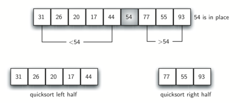

# 5.12. 快速排序

**5.12. The Quicksort**

<!--排序需要-->
<script src="../js/animationbase.js"></script>
<script src="../js/sortmodels.js"></script>
<script src="../js/sortviewers.js"></script>

=== "中文"

    **快速排序**使用分治法来获得与归并排序相同的优势，同时不使用额外的存储空间。然而，作为权衡，它可能不会将列表均匀地分成两半。当这种情况发生时，性能会受到影响。
    
    快速排序首先选择一个值，称为**基准值**。尽管有许多选择基准值的方法，我们将简单地使用列表中的第一个项。基准值的作用是帮助拆分列表。基准值在最终排序列表中的实际位置，通常称为**分割点**，将用于将列表划分为后续快速排序的两个部分。
    
    `图 12` 显示了54将作为我们的第一个基准值。由于我们已经看过这个示例几次，我们知道54最终会到达当前位置为31的位置。接下来将进行**划分**过程。它将找到分割点，同时将其他项移动到列表的适当一侧，即小于或大于基准值。
    
    <figure markdown="span">
        
        <figcaption markdown="span">图 12: 快速排序的第一个基准值</figcaption>
    </figure>   
    
    划分过程开始时，定位两个位置标记——我们称它们为 ``left_mark`` 和 ``right_mark``——位于列表中剩余项的开头和结尾（`图 13` 的位置 1 和 8）。划分过程的目标是将相对于基准值在错误一侧的项移动到正确的一侧，同时接近分割点。`图 13` 显示了在我们定位54的位置时的过程。
    
    <figure markdown="span">
        
        <figcaption markdown="span">图 13: 查找 54 的分割点</figcaption>
    </figure>      
    
    我们开始增加 ``left_mark`` 直到找到一个大于基准值的项。然后减少 ``right_mark`` 直到找到一个小于基准值的项。此时，我们发现了两个与最终分割点位置不符的项。在我们的示例中，这发生在 93 和 20。现在我们可以交换这两个项，然后再次重复这一过程。
    
    当 ``right_mark`` 小于 ``left_mark`` 时，我们停止。此时，``right_mark`` 的位置就是分割点。基准值可以与分割点的内容交换，此时基准值已在正确的位置（`图 14`）。此外，分割点左侧的所有项都小于基准值，而分割点右侧的所有项都大于基准值。列表现在可以在分割点处分割，并可以在两个部分上递归调用快速排序。
    
    <figure markdown="span">
        
        <figcaption markdown="span">图 14: 完成划分过程以找到 54 的分割点</figcaption>
    </figure>     
    
    ``quick_sort`` 函数如 `ActiveCode 1` 所示，调用了递归函数 ``quick_sort_helper``。``quick_sort_helper`` 从与归并排序相同的基本情况开始。如果列表的长度小于或等于 1，则它已排序。如果长度大于 1，则可以进行划分并递归排序。``partition`` 函数实现了前述的过程。
    
    ```python title="活动: 5.12.1 快速排序" linenums="1"
    def quick_sort(a_list):
        quick_sort_helper(a_list, 0, len(a_list) - 1)
    
    
    def quick_sort_helper(a_list, first, last):
        if first < last:
            split = partition(a_list, first, last)
            quick_sort_helper(a_list, first, split - 1)
            quick_sort_helper(a_list, split + 1, last)
    
    
    def partition(a_list, first, last):
        pivot_val = a_list[first]
        left_mark = first + 1
        right_mark = last
        done = False
    
        while not done:
            while left_mark <= right_mark and a_list[left_mark] <= pivot_val:
                left_mark = left_mark + 1
            while left_mark <= right_mark and a_list[right_mark] >= pivot_val:
                right_mark = right_mark - 1
            if right_mark < left_mark:
                done = True
            else:
                a_list[left_mark], a_list[right_mark] = (
                    a_list[right_mark],
                    a_list[left_mark],
                )
        a_list[first], a_list[right_mark] = a_list[right_mark], a_list[first]
    
        return right_mark
    
    
    a_list = [54, 26, 93, 17, 77, 31, 44, 55, 20]
    quick_sort(a_list)
    print(a_list)
    ```
    
    <div id="quick_anim1" class="">
        <canvas id="quick_anim1_canvas" width="400" height="400" style="border:4px solid blue"></canvas>
        <br>
        <button style="border: 1px solid black; background-color: buttonface; padding: 2px;" onclick="quick_anim1_anim = quick_anim_init('quick_anim1')">初始化</button>
        <button style="border: 1px solid black; background-color: buttonface; padding: 2px;" onclick="quick_anim1_anim.run('quick_anim1_anim')">运行</button>
        <button style="border: 1px solid black; background-color: buttonface; padding: 2px;" onclick="quick_anim1_anim.stop()">停止</button> <br>
        <button style="border: 1px solid black; background-color: buttonface; padding: 2px;" onclick="quick_anim1_anim.begin()">开始</button>
        <button style="border: 1px solid black; background-color: buttonface; padding: 2px;" onclick="quick_anim1_anim.forward()">向前一步</button>
        <button style="border: 1px solid black; background-color: buttonface; padding: 2px;" onclick="quick_anim1_anim.backward()">向后一步</button>
        <button style="border: 1px solid black; background-color: buttonface; padding: 2px;" onclick="quick_anim1_anim.end()">结束</button>
        <script>
        quick_anim_init = function(divid)
        {
            var a = new Animator(new QuickSortModel(), new BarViewer(), divid)
            a.init()
            return a
        }
        </script>
    </div>
    
    要分析 ``quick_sort`` 函数，需要注意的是，对于长度为 $n$ 的列表，如果每次划分都在列表的中间，则将会有 $\log{n}$ 次划分。为了找到分割点，每个 $n$ 项都需要与基准值进行比较。结果是 $n\log{n}$。此外，与归并排序过程相比，不需要额外的内存。
    
    不幸的是，在最坏情况下，分割点可能不会在中间，可能会非常偏向左侧或右侧，导致非常不均匀的划分。在这种情况下，对长度为 $n$ 的列表进行排序将划分为对 0 项的排序和对 $n - 1$ 项的排序。然后，对 $n - 1$ 项的排序将划分为对 0 项和对 $n - 2$ 项的排序，以此类推。结果是 $O(n^2)$ 的排序，所有递归所需的开销也会增加。
    
    我们之前提到过，有不同的方法来选择基准值。特别地，我们可以尝试使用称为 **三数中值法** 的技术来减轻不均匀划分的潜在问题。选择基准值时，我们将考虑列表中的第一个、中间和最后一个元素。在我们的示例中，这些是 54、77 和 20。现在选择中间值，即我们的例子中为 54，并将其用作基准值（当然，这就是我们最初使用的基准值）。其理念是，如果列表中的第一个项不适合列表的中间位置，则三数中值法将选择一个更好的“中间”值。这在原始列表已经有一定排序的情况下特别有用。我们将三数中值法的实现留作练习。
    
    !!! info "自我检测"
    
        === "question_sort_7"
    
            给定以下数字列表 [14, 17, 13, 15, 19, 10, 3, 16, 9, 12]，哪个答案显示了根据快速排序算法进行第二次划分后的列表内容？
            
            - 选项 a: [9, 3, 10, 13, 12]
            - 选项 b: [9, 3, 10, 13, 12, 14]
            - 选项 c: [9, 3, 10, 13, 12, 14, 17, 16, 15, 19]
            - 选项 d: [9, 3, 10, 13, 12, 14, 19, 16, 15, 17]
    
            正确答案: d
            
            - 反馈 a: 重要的是要记住快速排序对整个列表进行操作并原地排序。
            - 反馈 b: 记住快速
    
    排序对整个列表进行操作并原地排序。
            - 反馈 c: 第一次划分对整个列表进行操作，第二次划分对左部分进行操作，而不是右部分。
            - 反馈 d: 第一次划分对整个列表进行操作，第二次划分对左部分进行操作。
    
        === "question_sort_8"
    
            给定以下数字列表 [1, 20, 11, 5, 2, 9, 16, 14, 13, 19]，使用三数中值法选择的第一个基准值是什么？
            
            - 选项 a: 1
            - 选项 b: 9
            - 选项 c: 16
            - 选项 d: 19
        
            正确答案: b
        
            - 反馈 a: 用于选择基准的三个数字是 1、9 和 19。1 不是中值，它是列表中最小的数字，作为基准值非常糟糕。
            - 反馈 b: 干得好。
            - 反馈 c: 虽然 16 是 1、16 和 19 的中值，但中间的基准值是根据列表的长度进行选择的。
            - 反馈 d: 用于选择基准的三个数字是 1、9 和 19。9 是中值。19 是几乎最大的数字，因此作为基准值非常糟糕。
    
        === "question_sort_9"
    
            以下哪些排序算法在最坏情况下都保证是 O(n log n)？
        
            多项选择:
        
            - 选项 a: 希尔排序
            - 选项 b: 快速排序
            - 选项 c: 归并排序
            - 选项 d: 插入排序
    
            正确答案: c
            
            - 反馈 a: 希尔排序大约是 ``n^1.5``。
            - 反馈 b: 快速排序在最坏情况下可以是 O(n log n)，但如果基准点选择不佳且列表状态不佳，它可能是 O(n^2)。
            - 反馈 c: 归并排序是唯一在最坏情况下保证 O(n log n) 的排序算法。缺点是归并排序使用了更多的内存。
            - 反馈 d: 插入排序是 ``O(n^2)``。

=== "英文"

    The **quicksort** uses divide and conquer to gain the same advantages as the merge sort, while not using additional storage. As a trade-off, however, it is possible that the list may not be divided in half. When this happens, we will see that performance is diminished.
    
    A quicksort first selects a value, which is called the **pivot value**. Although there are many different ways to choose the pivot value, we will simply use the first item in the list. The role of the pivot value is to assist with splitting the list. The actual position where the pivot value belongs in the final sorted list, commonly called the **split point**, will be used to divide the list for subsequent calls to the quicksort.
    
    `Figure 12` shows that 54 will serve as our first pivot value.
    Since we have looked at this example a few times already, we know that
    54 will eventually end up in the position currently holding 31. The
    **partition** process will happen next. It will find the split point and
    at the same time move other items to the appropriate side of the list,
    either less than or greater than the pivot value.
        
    <figure markdown="span">
        
        <figcaption markdown="span">Figure 12: The First Pivot Value for a Quicksort</figcaption>
    </figure>   
    
    Partitioning begins by locating two position markers—let’s call them ``left_mark`` and ``right_mark``—at the beginning and end of the remaining items in the list (positions 1 and 8 in `Figure 13`). The goal of the partition process is to move items that are on the wrong side with respect to the pivot value while also converging on the split point. `Figure 13` shows this process as we locate the position of 54.
        
    <figure markdown="span">
        
        <figcaption markdown="span">Figure 13: Finding the Split Point for 54</figcaption>
    </figure>      
    
    We begin by incrementing ``left_mark`` until we locate a value that is greater than the pivot value. We then decrement ``right_mark`` until we find a value that is less than the pivot value. At this point we have discovered two items that are out of place with respect to the eventual split point. For our example, this occurs at 93 and 20. Now we can exchange these two items and then repeat the process again.
    
    At the point where ``right_mark`` becomes less than ``left_mark``, we stop. The position of ``right_mark`` is now the split point. The pivot value can be exchanged with the contents of the split point and the pivot value is now in place (`Figure 14`). In addition, all the items to the left of the split point are less than the pivot value, and all the items to the right of the split point are greater than the pivot value. The list can now be divided at the split point and the quicksort can be invoked recursively on the two halves.
    
    <figure markdown="span">
        
        <figcaption markdown="span">Figure 14: Completing the Partition Process to Find the Split Point for 54</figcaption>
    </figure>     
    
    The ``quick_sort`` function shown in `ActiveCode 1` invokes a recursive function, ``quick_sort_helper``. ``quick_sort_helper`` begins with the same base case as the merge sort. If the length of the list is less than or equal to one, it is already sorted. If it is greater, then it can be partitioned and recursively sorted. The ``partition`` function implements the process described earlier.
    
    ```python title="Activity: 5.12.1 Quicksort" linenums="1"
    def quick_sort(a_list):
        quick_sort_helper(a_list, 0, len(a_list) - 1)
    
    
    def quick_sort_helper(a_list, first, last):
        if first < last:
            split = partition(a_list, first, last)
            quick_sort_helper(a_list, first, split - 1)
            quick_sort_helper(a_list, split + 1, last)
    
    
    def partition(a_list, first, last):
        pivot_val = a_list[first]
        left_mark = first + 1
        right_mark = last
        done = False
    
        while not done:
            while left_mark <= right_mark and a_list[left_mark] <= pivot_val:
                left_mark = left_mark + 1
            while left_mark <= right_mark and a_list[right_mark] >= pivot_val:
                right_mark = right_mark - 1
            if right_mark < left_mark:
                done = True
            else:
                a_list[left_mark], a_list[right_mark] = (
                    a_list[right_mark],
                    a_list[left_mark],
                )
        a_list[first], a_list[right_mark] = a_list[right_mark], a_list[first]
    
        return right_mark
    
    
    a_list = [54, 26, 93, 17, 77, 31, 44, 55, 20]
    quick_sort(a_list)
    print(a_list)
    ```

    <div id="quick_anim" class="">
        <canvas id="quick_anim_canvas" width="400" height="400" style="border:4px solid blue"></canvas>
        <br>
        <button style="border: 1px solid black; background-color: buttonface; padding: 2px;" onclick="quick_anim_anim = quick_anim_init('quick_anim')">Initialize</button>
        <button style="border: 1px solid black; background-color: buttonface; padding: 2px;" onclick="quick_anim_anim.run('quick_anim_anim')">Run</button>
        <button style="border: 1px solid black; background-color: buttonface; padding: 2px;" onclick="quick_anim_anim.stop()">Stop</button> <br>
        <button style="border: 1px solid black; background-color: buttonface; padding: 2px;" onclick="quick_anim_anim.begin()">Beginning</button>
        <button style="border: 1px solid black; background-color: buttonface; padding: 2px;" onclick="quick_anim_anim.forward()">Step Forward</button>
        <button style="border: 1px solid black; background-color: buttonface; padding: 2px;" onclick="quick_anim_anim.backward()">Step Backward</button>
        <button style="border: 1px solid black; background-color: buttonface; padding: 2px;" onclick="quick_anim_anim.end()">End</button>
        <script>
        quick_anim_init = function(divid)
        {
           var a = new Animator(new QuickSortModel(), new BarViewer(), divid)
           a.init()
           return a
        }
        </script>
    </div>
    
    For more detail, CodeLens 7 lets you step through the algorithm.
    
    ```python title="Tracing the Quicksort" linenums="1"
    def quick_sort(a_list):
        quick_sort_helper(a_list, 0, len(a_list) - 1)
    
    
    def quick_sort_helper(a_list, first, last):
        if first < last:
            split = partition(a_list, first, last)
            quick_sort_helper(a_list, first, split - 1)
            quick_sort_helper(a_list, split + 1, last)
    
    
    def partition(a_list, first, last):
        pivot_val = a_list[first]
        left_mark = first + 1
        right_mark = last
        done = False
    
        while not done:
            while left_mark <= right_mark and a_list[left_mark] <= pivot_val:
                left_mark = left_mark + 1
            while left_mark <= right_mark and a_list[right_mark] >= pivot_val:
                right_mark = right_mark - 1
            if right_mark < left_mark:
                done = True
            else:
                a_list[left_mark], a_list[right_mark] = (
                    a_list[right_mark],
                    a_list[left_mark],
                )
        a_list[first], a_list[right_mark] = a_list[right_mark], a_list[first]
    
        return right_mark
    
    
    a_list = [54, 26, 93, 17, 77, 31, 44, 55, 20]
    quick_sort(a_list)
    print(a_list)
    ```
    
    To analyze the ``quick_sort`` function, note that for a list of length $n$, if the partition always occurs in the middle of the list, there will again be $\log{n}$ divisions. In order to find the split point, each of the $n$ items needs to be checked against the pivot value. The result is $n\log{n}$. In addition, there is no need for additional memory as in the merge sort process.
    
    Unfortunately, in the worst case, the split points may not be in the middle and can be very skewed to the left or the right, leaving a very uneven division. In this case, sorting a list of $n$ items divides into sorting a list of 0 items and a list of $n - 1$ items. Then sorting a list of $n - 1$ divides into a list of size 0 and a list of size $n - 2$, and so on. The result is an $O(n^{2})$ sort with all of the overhead that recursion requires.
    
    We mentioned earlier that there are different ways to choose the pivot value. In particular, we can attempt to alleviate some of the potential for an uneven division by using a technique called **median of three**. To choose the pivot value, we will consider the first, the middle, and the last element in the list. In our example, those are 54, 77, and 20. Now pick the median value, in our case 54, and use it for the pivot value (of course, that was the pivot value we used originally). The idea is that in the case where the first item in the list does not belong toward the middle of the list, the median of three will choose a better “middle” value. This will be particularly useful when the original list is somewhat sorted to begin with. We leave the implementation of this pivot value selection as an exercise.
    
    !!! info "Self Check"
    
        === "question_sort_7"
    
            Given the following list of numbers [14, 17, 13, 15, 19, 10, 3, 16, 9, 12] which answer shows the contents of the list after the second partitioning according to the quicksort algorithm?
            
            - answer_a: [9, 3, 10, 13, 12]
            - answer_b: [9, 3, 10, 13, 12, 14]
            - answer_c: [9, 3, 10, 13, 12, 14, 17, 16, 15, 19]
            - answer_d: [9, 3, 10, 13, 12, 14, 19, 16, 15, 17]
    
            correct: d
            
            - feedback_a: It's important to remember that quicksort works on the entire list and sorts it in place.
            - feedback_b: Remember quicksort works on the entire list and sorts it in place.
            - feedback_c: The first partitioning works on the entire list, and the second partitioning works on the left partition not the right.
            - feedback_d: The first partitioning works on the entire list, and the second partitioning works on the left partition.
    
        === "question_sort_8"
    
            Given the following list of numbers [1, 20, 11, 5, 2, 9, 16, 14, 13, 19] what would be the first pivot value using the median of 3 method?
            
            - answer_a: 1
            - answer_b: 9
            - answer_c: 16
            - answer_d: 19
        
            correct: b
        
            - feedback_a: The three numbers used in selecting the pivot are 1, 9, 19.  1 is not the median, and would be a very bad choice for the pivot since it is the smallest number in the list.
            - feedback b:  Good job.
            - feedback c: although 16 would be the median of 1, 16, 19 the middle is at len(list) // 2.
            - feedback d: the three numbers used in selecting the pivot are 1, 9, 19.  9 is the median.  19 would be a bad choice since it is almost the largest.
    
        === "question_sort_9"
    
            Which of the following sort algorithms are guaranteed to be O(n log n) even in the worst case?
        
            multiple_answers:
        
            - answer a: Shell Sort
            - answer b: Quick Sort
            - answer c: Merge Sort
            - answer d: Insertion Sort
    
            correct: c
            
            - feedback a: Shell sort is about ``n^1.5``
            - feedback b: Quicksort can be O(n log n), but if the pivot points are not well chosen and the list is just so, it can be O(n^2).
            - feedback c: Merge Sort is the only guaranteed O(n log n) even in the worst case.  The cost is that merge sort uses more memory.
            - feedback d: Insertion sort is ``O(n^2)``
