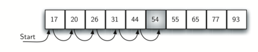

# 5.3. 顺序搜索

**5.3. The Sequential Search**

=== "中文"

    当数据项存储在像列表这样的集合中时，我们说它们具有线性或顺序的关系。每个数据项相对于其他数据项都有一个存储位置。在 Python 列表中，这些相对位置是每个项的索引值。由于这些索引值是有序的，我们可以按顺序访问它们。这一过程引出了我们的第一个搜索技术，**顺序搜索**。
    
    `图1` 显示，如果我们从列表中的第一个项开始，并逐项移动，我们遵循基础的顺序，直到找到我们正在寻找的项，或者直到列表项用完，这意味着我们寻找的项不存在。
    
    <figure markdown="span">
        
        <figcaption markdown="span">图1: 整数列表的顺序搜索</figcaption>
    </figure>
    
    这个算法的 Python 实现如 `CodeLens 1` 所示。该函数需要两个参数——列表和我们要寻找的项——并返回一个布尔值表示该项是否存在。
    
    ```python title="Activity: CodeLens 顺序搜索无序列表 (search1)" linenums="1"
    def sequential_search(a_list, item):
        pos = 0
    
        while pos < len(a_list):
            if a_list[pos] == item:
                return True
            pos = pos + 1
    
        return False
    
    
    test_list = [1, 2, 32, 8, 17, 19, 42, 13, 0]
    print(sequential_search(test_list, 3))
    print(sequential_search(test_list, 13))
    ```

=== "英文"

    When data items are stored in a collection such as a list, we say that they have a linear or sequential relationship. Each data item is stored in a position relative to the others. In Python lists, these relative positions are the index values of the individual items. Since these index values are ordered, it is possible for us to visit them in sequence. This process gives rise to our first search technique, the **sequential search**.
    
    `Figure 1`  shows that if we start  at the first item in the list and move from item to item, we follow the underlying sequential order until we either find what we are looking for or run out of items, which would mean the item we were searching for was not present.
        
    <figure markdown="span">
        
        <figcaption markdown="span">Figure 1: Sequential Search of a List of Integers</figcaption>
    </figure>
    
    
    The Python implementation for this algorithm is shown in `CodeLens 1`. The function needs two items--the list and the item we are looking for--and returns a Boolean value as to whether it is present.
    
    
    ```python title="Activity: CodeLens Sequential Search of an Unordered List (search1)" linenums="1"
    def sequential_search(a_list, item):
        pos = 0
    
        while pos < len(a_list):
            if a_list[pos] == item:
                return True
            pos = pos + 1
    
        return False
    
    
    test_list = [1, 2, 32, 8, 17, 19, 42, 13, 0]
    print(sequential_search(test_list, 3))
    print(sequential_search(test_list, 13))
    ```

## 5.3.1. 顺序搜索的分析

**5.3.1. Analysis of Sequential Search**

=== "中文"

    要分析搜索算法，我们需要确定一个基本的计算单位。回想一下，这通常是解决问题时必须重复的常见步骤。对于搜索来说，计算比较次数是合理的。每次比较可能会，也可能不会找到我们正在寻找的项。此外，我们还做了另一个假设：列表中的项是无序的，项是随机放入列表的。换句话说，我们寻找的项出现在列表中任何一个位置的概率是相同的。
    
    如果项不在列表中，唯一能确认这一点的方法是将其与列表中的每一项进行比较。如果列表有 $n$ 个项，那么顺序搜索需要进行 $n$ 次比较，才能发现该项不在列表中。而当项在列表中时，分析就不那么简单了。实际上，可能会发生三种情况。最好的情况是我们在第一次比较时就找到该项，即在列表的开头，此时只需进行一次比较。最坏的情况是我们在最后一次比较时才发现该项，也就是第 *n* 次比较。
    
    那么平均情况如何呢？平均而言，我们会在列表的中间位置找到该项；也就是说，我们会与 $\frac{n}{2}$ 个项进行比较。不过，回想一下，随着 $n$ 的增大，系数无论如何都变得无关紧要，因此顺序搜索的复杂度是 $O(n)$。`表1` 总结了这些结果。
    
    **表 1: 无序列表顺序搜索中的比较次数**
    
    | **情况** | **最佳情况** | **最坏情况** | **平均情况**  |
    | -------- | ------------ | ------------ | ------------- |
    | 项存在   | $1$          | $n$          | $\frac{n}{2}$ |
    | 项不存在 | $n$          | $n$          | $n$           |
    
    我们之前假设列表中的项是随机放置的，因此它们之间没有相对顺序。如果列表中的项是按某种顺序排列的，顺序搜索会如何变化？我们能否通过这种搜索技术获得效率的提升？
    
    假设列表中的项是按升序排列的，从低到高。如果我们寻找的项在列表中，那么它出现在列表中任一位置的概率与之前一样。我们依然需要相同数量的比较才能找到该项。然而，如果该项不在列表中，会有一点优势。`图2` 显示了算法在寻找项 50 时的过程。请注意，项依然是按顺序比较的，直到 54。但此时我们知道了一些额外的信息。不仅 54 不是我们要找的项，而且 54 之后的任何元素都不可能是我们要找的项，因为列表是排序的。在这种情况下，算法不必继续查找所有项就能报告该项未找到，它可以立即停止。`CodeLens 2` 显示了顺序搜索函数的这一变体。
    
    <figure markdown="span">
        
        <figcaption markdown="span">图2: 有序整数列表的顺序搜索</figcaption>
    </figure>
    
    ```python title="活动: CodeLens 有序列表的顺序搜索 (search2)" linenums="1"
    def ordered_sequential_search(a_list, item):
        pos = 0
    
        while pos < len(a_list):
            if a_list[pos] == item:
                return True
            if a_list[pos] > item:
                return False
            pos = pos + 1
    
        return False
    
    
    test_list = [0, 1, 2, 8, 13, 17, 19, 32, 42]
    print(ordered_sequential_search(test_list, 3))
    print(ordered_sequential_search(test_list, 13))
    ```
    
    `表2` 总结了这些结果。请注意，在最佳情况下，我们可能只需查看一个项就能发现该项不在列表中。平均而言，查看 $\frac{n}{2}$ 个项后，我们就能知道结果。然而，这种技术的复杂度依然是 $O(n)$。总结来说，排序列表的顺序搜索只有在未找到项时才有所改进。
    
    **表 2: 有序列表的顺序搜索中的比较次数**
    
    |          | **最佳情况** | **最坏情况** | **平均情况**  |
    | -------- | ------------ | ------------ | ------------- |
    | 项存在   | $1$          | $n$          | $\frac{n}{2}$ |
    | 项不存在 | $1$          | $n$          | $\frac{n}{2}$ |
    
    !!! info "自我检查"
        
        === "问题 3"
    
            假设你正在对列表 [15, 18, 2, 19, 18, 0, 8, 14, 19, 14] 进行顺序搜索。你需要进行多少次比较才能找到键 18？
    
            - 答案 a: 5
            - 答案 b: 10
            - 答案 c: 4
            - 答案 d: 2
    
            正确答案: d
    
            - 反馈 a: 进行五次比较会找到列表中的第二个 18。
            - 反馈 b: 你不需要搜索整个列表，只需找到你要找的键为止。
            - 反馈 c: 不对，记住在顺序搜索中，你从头开始检查每个键，直到找到你要找的项或者列表耗尽。
            - 反馈 d: 在这种情况下，只需要进行 2 次比较即可找到键。
    
        === "问题 4"
    
            假设你正在对有序列表 [3, 5, 6, 8, 11, 12, 14, 15, 17, 18] 进行顺序搜索。你需要进行多少次比较才能找到键 13？
    
            - 答案 a: 10
            - 答案 b: 5
            - 答案 c: 7
            - 答案 d: 6
            
            正确答案: c
        
            - 反馈 a: 你不需要搜索整个列表，因为它是有序的，当你遇到比键大的值时可以停止搜索。
            - 反馈 b: 由于 11 小于键值 13，你需要继续搜索。
            - 反馈 c: 由于 14 大于键值 13，你可以停止搜索。
            - 反馈 d: 因为 12 小于键值 13，你需要继续搜索。

=== "英文"

    To analyze searching algorithms, we need to decide on a basic unit of computation. Recall that this is typically the common step that must be repeated in order to solve the problem. For searching, it makes sense to count the number of comparisons performed. Each comparison may or may not discover the item we are looking for. In addition, we make another assumption here. The list of items is not ordered in any way. The items have been placed randomly into the list. In other words, the probability that the item we are looking for is in any particular position is exactly the same for each position of the list.
    
    If the item is not in the list, the only way to know that is to compare it against every item present. If there are $n$ items, then the sequential search requires $n$ comparisons to discover that the item is not there. In the case where the item is in the list, the analysis is not so straightforward. There are actually three different scenarios that can occur. In the best case we will find the item in the first place we look, at the beginning of the list. We will need only one comparison. In the worst case, we will not discover the item until the very last comparison, the *n*-th comparison.
    
    What about the average case? On average, we will find the item about half way into the list; that is, we will compare against $\frac{n}{2}$ items. Recall, however, that as $n$ gets large, the coefficients, no matter what they are, become insignificant in our approximation, so the complexity of the sequential search is $O(n)$. `Table 1` summarizes these results.
    
    **Table 1: Comparisons Used in a Sequential Search of an Unordered List**
    
        
    | **Case**            | **Best Case** | **Worst Case** | **Average Case** |
    | ------------------- | ------------- | -------------- | ---------------- |
    | item is present     | $1$           | $n$            | $\frac{n}{2}$    |
    | item is not present | $n$           | $n$            | $n$              |
        
    We assumed earlier that the items in our collection had been randomly placed so that there is no relative order between the items. What would happen to the sequential search if the items were ordered in some way? Would we be able to gain any efficiency in our search technique?
    
    Assume that the list of items was constructed so that the items are in ascending order, from low to high. If the item we are looking for is present in the list, the chance of it being in any one of the $n$ positions is still the same as before. We will still have the same number of comparisons to find the item. However, if the item is not present there is a slight advantage. `Figure 2` shows this process as the algorithm looks for the item 50. Notice that items are still compared in sequence until 54. At this point, however, we know something extra. Not only is 54 not the item we are looking for, but no other elements beyond 54 can work either since the list is sorted. In this case, the algorithm does not have to continue looking through all of the items to report that the item was not found. It can stop immediately. `CodeLens 2` shows this variation of the sequential search function.
            
    <figure markdown="span">
        
        <figcaption markdown="span">Figure 2: Sequential Search of an Ordered List of Integers</figcaption>
    </figure>
    
    ```python title="Activity: CodeLens Sequential Search of an Ordered List (search2)" linenums="1"
    def ordered_sequential_search(a_list, item):
        pos = 0
    
        while pos < len(a_list):
            if a_list[pos] == item:
                return True
            if a_list[pos] > item:
                return False
            pos = pos + 1
    
        return False
    
    
    test_list = [0, 1, 2, 8, 13, 17, 19, 32, 42]
    print(ordered_sequential_search(test_list, 3))
    print(ordered_sequential_search(test_list, 13))
    ```
    
    `Table 2` summarizes these results. Note that in the best case we might discover that the item is not in the list by looking at only one item. On average, we will know after looking through only $\frac {n}{2}$ items. However, this technique is still $O(n)$. In summary, a sequential search is improved by ordering the list only in the case where we do not find the item.
    
    **Table 2: Comparisons Used in Sequential Search of an Ordered List**
         
    |                  | **Best Case** | **Worst Case** | **Average Case** |
    | ---------------- | ------------- | -------------- | ---------------- |
    | item is present  | $1$           | $n$            | $\frac{n}{2}$    |
    | item not present | $1$           | $n$            | $\frac{n}{2}$    |
    
    !!! info "Self Check"
        
        === "Q 3"
    
            Suppose you are doing a sequential search of the list [15, 18, 2, 19, 18, 0, 8, 14, 19, 14].  How many comparisons would you need to do in order to find the key 18?
    
            - answer a: 5
            - answer b: 10
            - answer c: 4
            - answer d: 2
    
            correct: d
    
            - feedback a: Five comparisons would get the second 18 in the list.
            - feedback b: You do not need to search the entire list, only until you find the key you are looking for.
            - feedback c: No, remember in a sequential search you start at the beginning and check each key until you find what you are looking for or exhaust the list.
            - feedback d: In this case only 2 comparisons were needed to find the key.
        
        === "Q 4"
    
            Suppose you are doing a sequential search of the ordered list [3, 5, 6, 8, 11, 12, 14, 15, 17, 18].  How many comparisons would you need to do in order to find the key 13?
    
            - answer a: 10
            - answer b: 5
            - answer c: 7
            - answer d: 6
           
            correct: c
        
            - feedback a:  You do not need to search the entire list, since it is ordered you can stop searching when you have compared with a value larger than the key.
            - feedback b: Since 11 is less than the key value 13 you need to keep searching.
            - feedback c: Since 14 is greater than the key value 13 you can stop.
            - feedback d: Because 12 is less than the key value 13 you need to keep going.

    