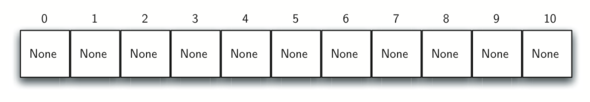

# 5.5. 哈希

**5.5. Hashing**

=== "中文"

    在前面的章节中，我们通过利用集合中各项之间的存储信息改进了搜索算法。例如，通过知道列表是有序的，我们可以使用二分搜索在对数时间内查找。在本节中，我们将尝试更进一步，构建一个可以在 \(O(1)\) 时间内搜索的数据结构。这一概念被称为**哈希**。
    
    为了做到这一点，我们需要更多地了解当我们查找集合中的某个项时它可能位于何处。如果每个项都位于应该在的位置，那么搜索只需一次比较即可找到该项。然而，实际上情况通常并非如此。
    
    **哈希表**是一种存储项的集合，其存储方式便于日后查找。哈希表的每个位置，通常称为**槽**，可以存放一个项，并由从 0 开始的整数命名。例如，我们将有一个名为 0 的槽，一个名为 1 的槽，依此类推。最初，哈希表没有存放任何项，所以每个槽都是空的。我们可以通过使用列表并将每个元素初始化为特殊的 Python 值 `None` 来实现哈希表。`图4` 显示了大小为 \(m = 11\) 的哈希表。换句话说，表中有 11 个槽，编号从 0 到 10。
    
    <figure markdown="span">
    
    <figcaption markdown="span">图4：拥有11个空槽的哈希表</figcaption>
    </figure>
    
    项与哈希表中该项应存储的槽之间的映射称为**哈希函数**。哈希函数将集合中的任何项映射到槽名称范围内的整数，即从 0 到 \(m-1\) 之间的值。假设我们有一组整数项 54、26、93、17、77 和 31。我们的第一个哈希函数，有时称为**余数法**，只是将一项除以表的大小，并将余数作为其哈希值（\(h(item) = item \% 11\)）。`表4` 给出了我们示例项的所有哈希值。注意，这种余数法（取模）通常会以某种形式出现在所有哈希函数中，因为结果必须在槽名称的范围内。
    
    **表4：使用余数的简单哈希函数**
    
    | **项** | **哈希值** |
    | ------ | ---------- |
    | 54     | 10         |
    | 26     | 4          |
    | 93     | 5          |
    | 17     | 6          |
    | 77     | 0          |
    | 31     | 9          |
    
    计算出哈希值后，我们可以将每个项插入到指定位置的哈希表中，如 `图5` 所示。注意，此时 11 个槽中已有 6 个被占用。这被称为**负载因子**，通常记作 \(\lambda = \frac{number\_of\_items}{table\_size}\)。对于这个例子，\(\lambda = \frac{6}{11}\)。
    
    <figure markdown="span">
    
    <figcaption markdown="span">图5：拥有6个项的哈希表</figcaption>
    </figure>
    
    现在，当我们想要查找某个项时，我们只需使用哈希函数计算该项的槽名称，然后检查哈希表中该位置是否存在该项。这个搜索操作的时间复杂度为 \(O(1)\)，因为计算哈希值和在相应位置索引哈希表所需的时间是常量时间。如果每个项都在它应该在的位置上，我们就得到了一个常量时间的搜索算法。
    
    你可能已经意识到，这种技术只有在每个项都映射到哈希表中的唯一位置时才有效。例如，如果集合中的下一个项是 44，它的哈希值将是 0（\(44\ \%\ 11 = 0\)）。由于 77 的哈希值也是 0，这就会产生问题。根据哈希函数的结果，两个或更多项需要存储在同一个槽中。这种情况被称为**冲突**（也可能被称为**碰撞**）。显然，冲突会为哈希技术带来问题。我们将在后面详细讨论冲突。

=== "英文"

    In previous sections we were able to make improvements in our search algorithms by taking advantage of information about where items are stored in the collection with respect to one another. For example, by knowing that a list was ordered, we could search in logarithmic time using a binary search. In this section we will attempt to go one step further by building a data structure that can be searched in $O(1)$ time. This concept is referred to as **hashing**.
    
    In order to do this, we will need to know even more about where the items might be when we go to look for them in the collection. If every item is where it should be, then the search can use a single comparison to discover the presence of an item. We will see, however, that this is typically not the case.
    
    A **hash table** is a collection of items which are stored in such a way as to make it easy to find them later. Each position of the hash table, often called a **slot**, can hold an item and is named by an integer value starting at 0. For example, we will have a slot named 0, a slot named 1, a slot named 2, and so on. Initially, the hash table contains no items so every slot is empty. We can implement a hash table by using a list with each element initialized to the special Python value ``None``. `Figure 4` shows a hash table of size $m = 11$. In other words, there are $m$ slots in the table, named 0 through 10.
                
    <figure markdown="span">
        
        <figcaption markdown="span">Figure 4: Hash Table with 11 Empty Slots</figcaption>
    </figure>
    
    The mapping between an item and the slot where that item belongs in the hash table is called the **hash function**. The hash function will take any item in the collection and return an integer in the range of slot names between 0 and $m - 1$. Assume that we have the set of integer items 54, 26, 93, 17, 77, and 31. Our first hash function, sometimes referred to as the *remainder method*, simply takes an item and divides it by the table size, returning the remainder as its hash value ($h(item)=item \% 11$). $Table 4$ gives all of the hash values for our example items. Note that this remainder method (modulo) will typically be present in some form in all hash functions since the result must be in the range of slot names.
    
    **Table 4: Simple Hash Function Using Remainders**
    
    | **Item** | **Hash Value** |
    | -------- | -------------- |
    | 54       | 10             |
    | 26       | 4              |
    | 93       | 5              |
    | 17       | 6              |
    | 77       | 0              |
    | 31       | 9              |
        
    
    
    Once the hash values have been computed, we can insert each item into the hash table at the designated position as shown in `Figure 5`. Note that 6 of the 11 slots are now occupied. This is referred to as the **load factor**, and is commonly denoted by $\lambda = \frac {number\_of\_items}{table\_size}$. For this example, $\lambda = \frac {6}{11}$.
    
                
    <figure markdown="span">
        
        <figcaption markdown="span">Figure 5: Hash Table with Six Items</figcaption>
    </figure>
    
    Now when we want to search for an item, we simply use the hash function to compute the slot name for the item and then check the hash table to see if it is present. This searching operation is $O(1)$ since a constant amount of time is required to compute the hash value and then index the hash table at that location. If everything is where it should be, we have found a constant time search algorithm.
    
    You can probably already see that this technique is going to work only if each item maps to a unique location in the hash table. For example, if the item 44 had been the next item in our collection, it would have a hash value of 0 ($44\ \%\ 11 = 0$). Since 77 also had a hash value of 0, we would have a problem. According to the hash function, two or more items would need to be in the same slot. This is referred to as a **collision** (it may also be called a *clash*). Clearly, collisions create a problem for the hashing technique. We will discuss them in detail later.

## 5.5.1. 哈希函数

**5.5.1. Hash Functions**

=== "中文"

    给定一个项的集合，如果一个哈希函数能够将每个项映射到唯一的槽位上，那么该函数被称为**完美哈希函数**。如果我们已知这些项并且集合不会改变，那么构建一个完美哈希函数是可能的。然而，对于任意集合，没有系统化的方法可以构建完美哈希函数。幸运的是，即使哈希函数并不完美，我们仍然可以通过它来提高性能效率。
    
    一种始终保持哈希函数完美的方法是增加哈希表的大小，以便能够容纳项范围内的每个可能值。这就保证了每个项都有唯一的槽位。尽管这种方法对少量项是可行的，但当项的数量非常大时就不太现实了。例如，如果项是九位数的社会安全号码，那么这种方法将需要近十亿个槽位。而如果我们只想存储一个班级25个学生的数据，这种方式将浪费大量内存。
    
    我们的目标是创建一个可以最小化碰撞、易于计算并能将项均匀分布在哈希表中的哈希函数。为此，有一些常见的方法可以扩展简单的余数法。我们在这里将讨论其中的几种。
    
    **折叠法**（folding method）构建哈希函数的方式是先将项划分为相同大小的部分（最后一部分的大小可能不同）。然后，将这些部分相加得到最终的哈希值。例如，如果项是电话号码 436-555-4601，我们可以将数字分成两个一组（43, 65, 55, 46, 01）。将这些数字相加得到 \(43 + 65 + 55 + 46 + 01 = 210\)。假设哈希表有 11 个槽，我们还需要进行额外的一步，即对 11 取余数。在这种情况下，\(210\ \%\ 11 = 1\)，所以电话号码 436-555-4601 映射到槽位1。某些折叠方法会进一步在相加之前将每隔一部分的数字反转。对于上述例子，反转后得到 \(43 + 56 + 55 + 64 + 01 = 219\)，并且 \(219\ \%\ 11 = 10\)。
    
    另一种构建哈希函数的数值技术称为**中平方法**（mid-square method）。我们首先将项平方，然后提取平方结果中的一部分数字。例如，如果项是 44，首先计算 \(44^{2} = 1936\)。提取中间两位数字93，接着取余数得到 \(93\ \%\ 11 = 5\)。`表5` 显示了余数法和中平方法下项的计算结果。你可以验证是否理解这些值是如何计算的。
    
    **表5：余数法和中平法的对比**
    
    | **项** | **余数法** | **中平法** |
    | ------ | ---------- | ---------- |
    | 54     | 10         | 3          |
    | 26     | 4          | 7          |
    | 93     | 5          | 9          |
    | 17     | 6          | 8          |
    | 77     | 0          | 4          |
    | 31     | 9          | 6          |
    
    我们还可以为基于字符的项（如字符串）创建哈希函数。例如，单词 *cat* 可以看作是一系列字符的编码值。
    
    ```pycon
    >>> ord("c")
    99
    >>> ord("a")
    97
    >>> ord("t")
    116
    ```
    
    然后我们可以将这些编码值相加，再使用余数法来得到哈希值（见 `图6`）。`代码清单1` 显示了一个名为 `hash_str` 的函数，它接收一个字符串和一个表的大小，并返回范围在 0 到 `table_size-1` 之间的哈希值。
    
    <figure markdown="span">
    
    <figcaption markdown="span">图6：使用编码值对字符串进行哈希</figcaption>
    </figure>
    
    ```python title="**代码清单1**" linenums="1"
    def hash_str(a_string, table_size):
        return sum([ord(c) for c in a_string]) % table_size
    ```
    
    有趣的是，当使用此哈希函数时，同字母异序词（如 *cat* 和 *act*）将始终生成相同的哈希值。为了解决这一问题，我们可以使用字符的位置作为权重。`图7` 显示了一种可能的方式，即使用位置值作为权重因子。如何修改 `hash_str` 函数是留给读者的练习。
    
    <figure markdown="span">
    
    <figcaption markdown="span">图7：使用编码值和权重对字符串进行哈希</figcaption>
    </figure>
    
    你可能还能够想到其他许多方法来为集合中的项计算哈希值。重要的是要记住，哈希函数必须是高效的，以免成为存储和搜索过程中的瓶颈。如果哈希函数过于复杂，计算槽名称的工作量将超过执行基本的顺序或二分搜索的工作量，这样就会使哈希技术失去意义。

=== "英文"

    Given a collection of items, a hash function that maps each item into a unique slot is referred to as a **perfect hash function**. If we know the items and the collection will never change, then it is possible to construct a perfect hash function. Unfortunately, given an arbitrary collection of items, there is no systematic way to construct a perfect hash function. Luckily, we do not need the hash function to be perfect to still gain performance efficiency.
    
    One way to always have a perfect hash function is to increase the size of the hash table so that each possible value in the item range can be accommodated. This guarantees that each item will have a unique slot. Although this is practical for small numbers of items, it is not feasible when the number of possible items is large. For example, if the items were nine-digit Social Security numbers, this method would require almost one billion slots. If we only want to store data for a class of 25 students, we will be wasting an enormous amount of memory.
    
    Our goal is to create a hash function that minimizes the number of collisions, is easy to compute, and evenly distributes the items in the hash table. To that end, there are a number of common ways to extend the simple remainder method. We will consider a few of them here.
    
    The **folding method** for constructing hash functions begins by dividing the item into equal-sized pieces (the last piece may not be of equal size). These pieces are then added together to give the resulting hash value. For example, if our item was the phone number 436-555-4601, we would take the digits and divide them into groups of 2 (43, 65, 55, 46, 01). After the addition, $43 + 65 + 55 + 46 + 01$, we get 1.   If we assume our hash table has 11 slots, then we need to perform the extra step of dividing by 11 and keeping the remainder. In this case $210\ \%\ 11$ is 1, so the phone number 436-555-4601 hashes to slot 1. Some folding methods go one step further and reverse every other piece before the addition. For the above example, we get $43 + 56 + 55 + 64 + 01 = 219$ which gives $219\ \%\ 11 = 10$.
    
    Another numerical technique for constructing a hash function is called the **mid-square method**. We first square the item, and then extract some portion of the resulting digits. For example, if the item were 44, we would first compute $44 ^{2} = 1936$. By extracting the middle two digits, 93, and performing the remainder step, we get 5 ($93\ \%\ 11$). `Table 5` shows items under both the remainder method and the mid-square method. You should verify that you understand how these values were computed.
    
    **Table 5: Comparison of Remainder and Mid-Square Methods**
    
    | **Item** | **Remainder** | **Mid-Square** |
    | -------- | ------------- | -------------- |
    | 54       | 10            | 3              |
    | 26       | 4             | 7              |
    | 93       | 5             | 9              |
    | 17       | 6             | 8              |
    | 77       | 0             | 4              |
    | 31       | 9             | 6              |
        
    
    
    We can also create hash functions for character-based items such as strings. For example, the word *cat* can be thought of as a sequence of ordinal values.
    
    ```pycon
    >>> ord("c")
    99
    >>> ord("a")
    97
    >>> ord("t")
    116
    ```
    
    We can then take these three ordinal values, add them up, and use the remainder method to get a hash value (see `Figure 6`). `Listing 1` shows a function called ``hash_str`` that takes a string and a table size and returns the hash value in the range from 0 to ``table_size``-1.
    
    <figure markdown="span">
        
        <figcaption markdown="span">Figure 6: Hashing a String Using Ordinal Values</figcaption>
    </figure>
    
    ```python title="**Listing 1**" linenums="1"
    def hash_str(a_string, table_size):
        return sum([ord(c) for c in a_string]) % table_size
    ```
    
    It is interesting to note that when using this hash function, anagrams will always be given the same hash value. To remedy this, we could use the position of the character as a weight. `Figure 7` shows one possible way to use the positional value as a weighting factor. The modification to the ``hash_str`` function is left as an exercise.
    
    <figure markdown="span">
        
        <figcaption markdown="span">Figure 7: Hashing a String Using Ordinal Values with Weighting</figcaption>
    </figure>
    
    You may be able to think of a number of additional ways to compute hash values for items in a collection. The important thing to remember is that the hash function has to be efficient so that it does not become the dominant part of the storage and search process. If the hash function is too complex, then it becomes more work to compute the slot name than it would be to simply do a basic sequential or binary search as described earlier. This would quickly defeat the purpose of hashing.

## 5.5.2. 碰撞解决

**5.5.2. Collision Resolution**

=== "中文"

    现在我们回到碰撞问题。当两个项哈希到相同的槽时，我们必须有一个系统化的方法来将第二个项放入哈希表中。这个过程称为**碰撞解决**。正如我们之前提到的，如果哈希函数是完美的，碰撞将永远不会发生。然而，由于这通常是不可能的，碰撞解决成为哈希过程中的一个非常重要的部分。
    
    一种解决碰撞的方法是查看哈希表，尝试找到另一个空槽来容纳引发碰撞的项。一种简单的方式是从最初的哈希值位置开始，然后依次顺序移动到槽位，直到找到第一个空槽。注意，我们可能需要循环回到第一个槽来覆盖整个哈希表。这个碰撞解决过程称为**开放寻址**，因为它尝试在哈希表中找到下一个空槽或地址。通过系统地一次访问每个槽，我们执行了一种称为**线性探测**的开放寻址技术。
    
    `图8` 显示了使用简单余数法的扩展整数项集（54, 26, 93, 17, 77, 31, 44, 55, 20）。`表4` 显示了前六个项的哈希值，`图5` 显示了包含这六个项的哈希表内容。让我们看看当我们尝试将额外的三个项放入表中时会发生什么。当我们尝试将 44 放入槽位 0 时，发生碰撞。在线性探测下，我们依次顺序查看槽位，直到找到空位置。在这种情况下，我们找到了槽位 1。
    
    同样，55 应该放入槽位 0，但必须放在槽位 2，因为这是下一个空位置。最后，值 20 的哈希结果为槽位 9。由于槽位 9 已满，我们开始进行线性探测。我们依次访问槽位 10、0、1 和 2，最终在槽位 3 找到空槽。
    
    <figure markdown="span">
        
        <figcaption markdown="span">图8：使用线性探测解决碰撞</figcaption>
    </figure>
    
    一旦我们使用开放寻址和线性探测构建了一个哈希表，在搜索项时我们必须使用相同的方法。假设我们要查找项 93。当我们计算哈希值时，得到 5。在槽位 5 找到 93，我们可以返回 `True`。如果我们在查找 20，现在的哈希值为 9，而槽位 9 当前存储的是 31。我们不能简单返回 `False`，因为我们知道可能发生了碰撞。此时，我们必须进行顺序搜索，从位置 10 开始查找，直到找到项 20 或找到一个空槽。
    
    线性探测的一个缺点是有**聚集**的趋势；项在表中会变得聚集。这意味着如果在同一个哈希值发生了许多碰撞，周围的一些槽位将被线性探测解决所填满。正如我们在上面尝试添加项 20 时看到的那样，一个哈希为 0 的值集群必须被跳过，才能最终找到空位置。`图9` 显示了这个值集群。
    
    <figure markdown="span">
        
        <figcaption markdown="span">图9：槽位 0 的项集群</figcaption>
    </figure>
    
    解决聚集问题的一种方法是扩展线性探测技术，而不是顺序查找下一个空槽，我们跳过槽位，从而更均匀地分布发生碰撞的项。这将有助于减少发生的聚集。`图10` 显示了当使用我们称之为“加3”探测法进行碰撞解决时的项情况。这意味着一旦发生碰撞，我们将查看每隔三个槽，直到找到一个空槽。
    
    <figure markdown="span">
        
        <figcaption markdown="span">图10：使用加3探测法解决碰撞</figcaption>
    </figure>
    
    这种在发生碰撞后寻找另一个槽位的过程一般称为**重哈希**。使用简单线性探测时，重哈希函数是 $new\_hash = rehash(old\_hash)$，其中 $rehash(pos) = (pos + 1) \% size$。加3重哈希可以定义为 $rehash(pos) = (pos + 3) \% size$。一般情况下，$rehash(pos) = (pos + skip) \% size$。重要的是要注意，跳过的大小必须保证哈希表中的所有槽最终都被访问到。否则，表的一部分将未被使用。为了确保这一点，通常建议哈希表的大小为质数。这就是我们在例子中使用11的原因。
    
    线性探测技术的一个变体称为**二次探测**。我们不再使用恒定的跳过值，而是使用一个重哈希函数，该函数按1、3、5、7、9等方式增加哈希值。这意味着如果第一个哈希值是 $h$，后续的值是 $h + 1$，$h + 4$，$h + 9$，$h + 16$，依此类推。一般来说，$i$ 的值是 $i ^ {2}$，$rehash(pos) = (h + i ^ {2}) \% size$。换句话说，二次探测使用的是连续的完全平方数作为跳过值。`图11` 显示了使用这种技术放置项后的示例值。
    
    <figure markdown="span">
        
        <figcaption markdown="span">图11：使用二次探测解决碰撞</figcaption>
    </figure>
    
    解决碰撞问题的另一种方法是允许每个槽位持有一个项的集合（或链）的引用。**链式解决**允许多个项存在于哈希表的同一个位置。当发生碰撞时，该项仍然被放置在哈希表的正确槽位中。随着越来越多的项哈希到同一个位置，搜索集合中的项的难度会增加。`图12` 显示了使用链式解决方法的哈希表中的项。
    
    <figure markdown="span">
        
        <figcaption markdown="span">图12：使用链式解决碰撞</figcaption>
    </figure>
    
    当我们想要搜索某个项时，我们使用哈希函数生成该项应该位于的槽位。由于链式解决每个槽位都持有一个集合，我们使用搜索技术来判断该项是否存在。其优点是，平均而言，每个槽中的项数量会少得多，因此搜索可能更高效。我们将在本节结束时分析哈希技术的效率。
    
    !!! info "自检"
    
        === "HASH_1"
        
            在一个大小为13的哈希表中，以下两个键将映射到哪些索引位置？ 27, 130
            
            - 答案 a: 1, 10
            - 答案 b: 13, 0
            - 答案 c: 1, 0
            - 答案 d: 2, 3
        
            正确答案: c
            
            - 反馈 a: 注意使用取模运算而不是整数除法
            - 反馈 b: 不要用除法，要用取模运算。
            - 反馈 c: 27 % 13 == 1 且 130 % 13 == 0
            - 反馈 d: 使用取模运算
    
        === "HASH_2"
        
            假设你被给了一组键，要将它们插入一个恰好能容纳11个值的哈希表中：113, 117, 97, 100, 114, 108, 116, 105, 99。下列哪个选项最好地展示了使用线性探测法插入所有键后的哈希表内容？
        
            - 答案 a: 100, __, __, 113, 114, 105, 116, 117, 97, 108, 99
            - 答案 b: 99, 100, __, 113, 114, __, 116, 117, 105, 97, 108
            - 答案 c: 100, 113, 117, 97, 14, 108, 116, 105, 99, __, __
            - 答案 d: 117, 114, 108, 116, 105, 99, __, __, 97, 100, 113
            
            正确答案: b
        
            - 反馈 a: 看起来你可能使用了取模2的算术。你需要使用哈希表大小作为取模值。
            - 反馈 b: 使用模
    
    11算术和线性探测法得出这些值
            - 反馈 c: 看起来你使用了模10的算术，应该使用表的大小。
            - 反馈 d: 注意使用取模运算而不是整数除法。

=== "英文"

    We now return to the problem of collisions. When two items hash to the same slot, we must have a systematic method for placing the second item in the hash table. This process is called **collision resolution**. As we stated earlier, if the hash function is perfect, collisions will never occur. However, since this is often not possible, collision resolution becomes a very important part of hashing.
    
    One method for resolving collisions looks into the hash table and tries to find another open slot to hold the item that caused the collision. A simple way to do this is to start at the original hash value position and then move in a sequential manner through the slots until we encounter the first slot that is empty. Note that we may need to go back to the first slot (circularly) to cover the entire hash table. This collision resolution process is referred to as **open addressing** in that it tries to find the next open slot or address in the hash table. By systematically visiting each slot one at a time, we are performing an open addressing technique called **linear probing**.
    
    `Figure 8` shows an extended set of integer items under the simple remainder method hash function (54, 26, 93, 17, 77, 31, 44, 55, 20). `Table 4` above shows the hash values for the original six items and `Figure 5` shows the contents of a hash table with those six items. Let's see what happens when we attempt to place the additional three items into the table. When we attempt to place 44 into slot 0, a collision occurs. Under linear probing, we look sequentially, slot by slot, until we find an open position. In this case, we find slot 1.
    
    Again, 55 should go in slot 0 but must be placed in slot 2 since it is the next open position. The final value of 20 hashes to slot 9. Since slot 9 is full, we begin to do linear probing. We visit slots 10, 0, 1, and 2, and finally find an empty slot at position 3.
    
    <figure markdown="span">
        
        <figcaption markdown="span">Figure 8: Collision Resolution with Linear Probing</figcaption>
    </figure>
    
    Once we have built a hash table using open addressing and linear probing, it is essential that we utilize the same methods to search for items. Assume we want to look up the item 93. When we compute the hash value, we get 5. Looking in slot 5 reveals 93, and we can return ``True``. What if we are looking for 20? Now the hash value is 9, and slot 9 is currently holding 31. We cannot simply return ``False`` since we know that there could have been collisions. We are now forced to do a sequential search, starting at position 10, looking until either we find the item 20 or we find an empty slot.
    
    A disadvantage to linear probing is the tendency for **clustering**; items become clustered in the table. This means that if many collisions occur at the same hash value, a number of surrounding slots will be filled by the linear probing resolution. This will have an impact on other items that are being inserted, as we saw when we tried to add the item 20 above. A cluster of values hashing to 0 had to be skipped to finally find an open position. This cluster is shown in `Figure 9`.
    
    <figure markdown="span">
        
        <figcaption markdown="span">Figure 9: A Cluster of Items for Slot 0</figcaption>
    </figure>
    
    One way to deal with clustering is to extend the linear probing technique so that instead of looking sequentially for the next open slot, we skip slots, thereby more evenly distributing the items that have caused collisions. This will potentially reduce the clustering that occurs. `Figure 10` shows the items when collision resolution is done with what we will call a “plus 3” probe. This means that once a collision occurs, we will look at every third slot until we find one that is empty.
    
    <figure markdown="span">
        
        <figcaption markdown="span">Figure 10: Collision Resolution Using a Plus 3 Probe</figcaption>
    </figure>
    
    The general name for this process of looking for another slot after a collision is **rehashing**. With simple linear probing, the rehash function is $new\_hash = rehash(old\_hash)$ where $rehash(pos) = (pos + 1) \% size$. The plus 3 rehash can be defined as $rehash(pos) = (pos + 3) \% size$. In general, $rehash(pos) = (pos + skip) \% size$. It is important to note that the size of the skip must be such that all the slots in the table will eventually be visited. Otherwise, part of the table will be unused. To ensure this, it is often suggested that the table size be a prime number. This is the reason we have been using 11 in our examples.
    
    A variation of the linear probing idea is called **quadratic probing**. Instead of using a constant skip value, we use a rehash function that increments the hash value by 1, 3, 5, 7, 9, and so on. This means that if the first hash value is $h$, the successive values are $h + 1$, $h + 4$, $h + 9$, $h + 16$, and so on. In general, the $i$ will be $i ^ {2}$ and $rehash(pos) = (h + i ^ {2}) \% size$. In other words, quadratic probing uses a skip consisting of successive perfect squares. `Figure 11` shows our example values after they are placed using this technique.
    
    <figure markdown="span">
        
        <figcaption markdown="span">Figure 11: Collision Resolution with Quadratic Probing</figcaption>
    </figure>
    
    An alternative method for handling the collision problem is to allow each slot to hold a reference to a collection (or chain) of items. **Chaining** allows many items to exist at the same location in the hash table. When collisions happen, the item is still placed in the proper slot of the hash table. As more and more items hash to the same location, the difficulty of searching for the item in the collection increases. `Figure 12` shows the items as they are added to a hash table that uses chaining to resolve collisions.
    
    <figure markdown="span">
        
        <figcaption markdown="span">Figure 12: Collision Resolution with Chaining</figcaption>
    </figure>
    
    When we want to search for an item, we use the hash function to generate the slot where it should reside. Since with chaining each slot holds a collection, we use a searching technique to decide whether the item is present. The advantage is that on the average there are likely to be many fewer items in each slot, so the search is perhaps more efficient. We will look at the analysis for hashing at the end of this section.
    
    !!! info "Self Check"
    
        === "HASH_1"
        
            In a hash table of size 13 which index positions would the following two keys map to?  27,  130
            
            - answer a: 1, 10
            - answer b: 13, 0
            - answer c: 1, 0
            - answer d: 2, 3
        
            correct: c
            
            - feedback a:  Be careful to use modulo not integer division
            - feedback b:  Don't divide by two, use the modulo operator.
            - feedback c: 27 % 13 == 1 and 130 % 13 == 0
            - feedback d: Use the modulo operator
    
        === "HASH_2"
        
            Suppose you are given the following set of keys to insert into a hash table that holds exactly 11 values:  113 , 117 , 97 , 100 , 114 , 108 , 116 , 105 , 99 Which of the following best demonstrates the contents of the hash table after all the keys have been inserted using linear probing?
        
            - answer a: 100, __, __, 113, 114, 105, 116, 117, 97, 108, 99
            - answer b: 99, 100, __, 113, 114, __, 116, 117, 105, 97, 108
            - answer c: 100, 113, 117, 97, 14, 108, 116, 105, 99, __, __
            - answer d: 117, 114, 108, 116, 105, 99, __, __, 97, 100, 113
            
            correct: b
        
            - feedback a:  It looks like you may have been doing modulo 2 arithmentic.  You need to use the hash table size as the modulo value.
            - feedback b:  Using modulo 11 arithmetic and linear probing gives these values
            - feedback c: It looks like you are using modulo 10 arithmetic, use the table size.
            - feedback d: Be careful to use modulo not integer division.

## 5.5.3. 实现Map抽象数据类型

**5.5.3. Implementing the Map Abstract Data Type**

=== "中文"

    Python 中最有用的集合之一是字典。回顾一下，字典是一种关联数据类型，您可以在其中存储键-值对。键用于查找关联的数据值。我们通常将这种思想称为**映射**。
    
    映射抽象数据类型的定义如下。该结构是一个无序的键和值之间的关联集合。映射中的键都是唯一的，因此键和值之间是一对一的关系。操作如下：
    
    - ``Map()`` 创建一个新的空映射。
    - ``put(key, val)`` 向映射中添加一个新的键-值对。如果键已经存在于映射中，它将用新值替换旧值。
    - ``get(key)`` 通过键查找并返回存储在映射中的匹配值，否则返回 ``None``。
    - ``del`` 使用 ``del map[key]`` 形式的语句删除映射中的键-值对。
    - ``size()`` 返回映射中存储的键-值对的数量。
    - ``in`` 如果给定的键在映射中存在，则 ``key in map`` 语句返回 ``True``，否则返回 ``False``。
    
    字典的一大优点是，给定一个键时，我们可以非常快速地查找关联的数据值。为了提供这种快速查找能力，我们需要一个支持高效搜索的实现。我们可以使用列表进行顺序或二分查找，但更好的方法是使用上文描述的哈希表，因为在哈希表中查找项的性能接近 $O(1)$。
    
    在 `示例 2` 中，我们使用两个列表创建了一个实现映射抽象数据类型的 ``HashTable`` 类。一个列表称为 ``slots``，用于存储键项，另一个平行的列表称为 ``data``，用于存储数据值。当我们查找一个键时，数据列表中的相应位置将存储关联的数据值。我们将键列表视为一个哈希表，使用前面介绍的思想。注意，哈希表的初始大小为 11。虽然这个大小是任意选择的，但重要的是哈希表的大小应为质数，以便碰撞解决算法尽可能高效。
    
    ```python title="**示例 2**" linenums="1"
    class HashTable:
        def __init__(self):
            self.size = 11
            self.slots = [None] * self.size
            self.data = [None] * self.size
    ```
    
    如 `示例 3` 所示，``hash_function`` 实现了简单的取余法。碰撞解决技术使用线性探测法，重新哈希值为“加 1”。``put`` 函数（见 `示例 3`）假设最终会有一个空槽，除非键已经存在于 ``self.slots`` 中。它计算出原始哈希值，如果该槽不是空的，则调用 ``rehash`` 函数，直到找到一个空槽。如果非空槽已经包含该键，则旧的数据值将被新数据值替换。
    
    ```python title="**示例 3**" linenums="1"
    def put(self, key, data):
        hash_value = self.hash_function(key, len(self.slots))
    
        if self.slots[hash_value] is None:
            self.slots[hash_value] = key
            self.data[hash_value] = data
        else:
            if self.slots[hash_value] == key:
                self.data[hash_value] = data  # 替换
            else:
                next_slot = self.rehash(hash_value, len(self.slots))
                while (
                    self.slots[next_slot] is not None
                    and self.slots[next_slot] != key
                ):
                    next_slot = self.rehash(next_slot, len(self.slots))
    
                if self.slots[next_slot] is None:
                    self.slots[next_slot] = key
                    self.data[next_slot] = data
                else:
                    self.data[next_slot] = data
    
    def hash_function(self, key, size):
        return key % size
    
    def rehash(self, old_hash, size):
        return (old_hash + 1) % size
    ```
    
    ``get`` 函数（见 `示例 4`）首先计算初始哈希值。如果该值不在初始槽位中，则使用 ``rehash`` 定位下一个可能的位置。注意第 14 行通过检查确保我们没有返回到初始槽，从而保证了搜索将会终止。如果发生这种情况，我们已经遍历了所有可能的槽，说明该项不存在。
    
    ``HashTable`` 类的最后几个方法提供了额外的字典功能。我们重载了 ``__getitem__`` 和 ``__setitem__`` 方法，以允许使用 ``[]`` 进行访问。这意味着一旦创建了 ``HashTable``，熟悉的索引操作符就可以使用了。我们将其余方法作为练习留给读者。
    
    ```python title="**示例 4**" linenums="1"
    def get(self, key):
        start_slot = self.hash_function(key, len(self.slots))
    
        position = start_slot
        while self.slots[position] is not None:
            if self.slots[position] == key:
                return self.data[position]
            else:
                position = self.rehash(position, len(self.slots))
                if position == start_slot:
                    return None
    
    def __getitem__(self, key):
        return self.get(key)
    
    def __setitem__(self, key, data):
        self.put(key, data)
    ```
    
    下面的会话展示了 ``HashTable`` 类的实际应用。首先，我们将创建一个哈希表，并使用整数键和字符串数据值存储一些项。
    
    ```pycon
    >>> h = HashTable()
    >>> h[54] = "cat"
    >>> h[26] = "dog"
    >>> h[93] = "lion"
    >>> h[17] = "tiger"
    >>> h[77] = "bird"
    >>> h[31] = "cow"
    >>> h[44] = "goat"
    >>> h[55] = "pig"
    >>> h[20] = "chicken"
    >>> h.slots
    [77, 44, 55, 20, 26, 93, 17, None, None, 31, 54]
    >>> h.data
    ['bird', 'goat', 'pig', 'chicken', 'dog', 'lion',
            'tiger', None, None, 'cow', 'cat']
    ```
    
    接下来，我们将访问和修改哈希表中的一些项。注意，键为 20 的值被替换了。
    
    ```pycon
    >>> h[20]
    'chicken'
    >>> h[17]
    'tiger'
    >>> h[20] = "duck"
    >>> h[20]
    'duck'
    >>> h.data
    ['bird', 'goat', 'pig', 'duck', 'dog', 'lion',
            'tiger', None, None, 'cow', 'cat']
    >>> print(h[99])
    None
    ```
    
    完整的哈希表示例可以在 ActiveCode 1 中找到。
    
    ```python title="活动：5.5.3.1 完整哈希表示例" linenums="1"
    class HashTable:
        def __init__(self):
            self.size = 11
            self.slots = [None] * self.size
            self.data = [None] * self.size
    
        def put(self, key, data):
            hash_value = self.hash_function(key, len(self.slots))
    
            if self.slots[hash_value] is None:
                self.slots[hash_value] = key
                self.data[hash_value] = data
            else:
                if self.slots[hash_value] == key:
                    self.data[hash_value] = data  # 替换
                else:
                    next_slot = self.rehash(hash_value, len(self.slots))
                    while (
                        self.slots[next_slot] is not None
                        and self.slots[next_slot] != key
                    ):
                        next_slot = self.rehash(next_slot, len(self.slots))
    
                    if self.slots[next_slot] is None:
                        self.slots[next_slot] = key
                        self.data[next_slot] = data
                    else:
                        self.data[next_slot] = data
    
        def hash_function(self, key, size):
            return key % size
    
        def rehash(self, old_hash, size):
            return (old_hash + 1) % size
    
        def get(self, key):
            start_slot = self.hash_function(key, len(self.slots))
    
            position = start_slot
            while self.slots[position] is not None:
                if self.slots[position] == key:
                    return self.data[position]
                else:
                    position = self.rehash(position, len(self.slots))
                    if position == start_slot:
                        return None
    
        def __getitem__(self, key):
            return self.get(key)
    
        def __setitem__(self, key, data):
            self.put(key, data)
    
    h = HashTable()
    h[54] = "cat"
    h[26] = "dog"
    h[93] = "lion"
    h[17] = "tiger"
    h[77] = "bird"
    h[31] = "cow"
    h[44] = "goat"
    h[55] = "pig"
    h[20] = "chicken"
    print(h.slots)
    print(h.data)
    print(h[20])
    print(h[17])
    h[20] = "duck"
    print(h[20])
    print(h[99])
    ```

=== "英文"

    One of the most useful Python collections is the dictionary. Recall that a dictionary is an associative data type where you can store key-data pairs. The key is used to look up the associated data value. We often refer to this idea as a **map**.
    
    The map abstract data type is defined as follows. The structure is an unordered collection of associations between a key and a data value. The keys in a map are all unique so that there is a one-to-one relationship between a key and a value. The operations are given below.
    
    -  ``Map()`` creates a new empty map.
    -  ``put(key, val)`` adds a new key--value pair to the map. If the key is already in the map, it replaces the old value with the new value.
    -  ``get(key)`` takes a key and returns the matching value stored in the map or ``None`` otherwise.
    -  ``del`` deletes the key--value pair from the map using a statement of the form ``del map[key]``.
    -  ``size()`` returns the number of key--value pairs stored in the map.
    -  ``in`` return ``True`` for a statement of the form ``key in map`` if the given key is in the map, ``False`` otherwise.
    
    One of the great benefits of a dictionary is the fact that given a key, we can look up the associated data value very quickly. In order to provide this fast look-up capability, we need an implementation that supports an efficient search. We could use a list with sequential or binary search, but it would be even better to use a hash table as described above since looking up an item in a hash table can approach $O(1)` performance.
    
    In `Listing 2` we use two lists to create a ``HashTable`` class that implements the map abstract data type. One list, called ``slots``, will hold the key items and a parallel list, called ``data``, will hold the data values. When we look up a key, the corresponding position in the data list will hold the associated data value. We will treat the key list as a hash table using the ideas presented earlier. Note that the initial size for the hash table has been chosen to be 11. Although this is arbitrary, it is important that the size be a prime number so that the collision resolution algorithm can be as efficient as possible.
    
    ```python title="**Listing 2**" linenums="1"
    class HashTable:
        def __init__(self):
            self.size = 11
            self.slots = [None] * self.size
            self.data = [None] * self.size
    ```
    
    As seen in `Listing 3`, ``hash_function`` implements the simple remainder method. The collision resolution technique is linear probing with a “plus 1” rehash value. The ``put`` function (see `Listing 3`) assumes that there will eventually be an empty slot unless the key is already present in the ``self.slots``. It computes the original hash value and if that slot is not empty, iterates the ``rehash`` function until an empty slot occurs. If a nonempty slot already contains the key, the old data value is replaced with the new data value.
    
    
    ```python title="**Listing 3**" linenums="1"
    def put(self, key, data):
        hash_value = self.hash_function(key, len(self.slots))
    
        if self.slots[hash_value] is None:
            self.slots[hash_value] = key
            self.data[hash_value] = data
        else:
            if self.slots[hash_value] == key:
                self.data[hash_value] = data  # replace
            else:
                next_slot = self.rehash(hash_value, len(self.slots))
                while (
                    self.slots[next_slot] is not None
                    and self.slots[next_slot] != key
                ):
                    next_slot = self.rehash(next_slot, len(self.slots))
    
                if self.slots[next_slot] is None:
                    self.slots[next_slot] = key
                    self.data[next_slot] = data
                else:
                    self.data[next_slot] = data
    
    def hash_function(self, key, size):
        return key % size
    
    def rehash(self, old_hash, size):
        return (old_hash + 1) % size
    ```
    
    
    The ``get`` function (see `Listing 4`) begins by computing the initial hash value. If the value is not in the initial slot, ``rehash`` is used to locate the next possible position. Notice that line 14 guarantees that the search will terminate by checking to make sure that we have not returned to the initial slot. If that happens, we have exhausted all possible slots and the item must not be present.
    
    The final methods of the ``HashTable`` class provide additional dictionary functionality. We overload the ``__getitem__`` and ``__setitem__`` methods to allow access using ``[]``. This means that once a ``HashTable`` has been created, the familiar index operator will be available. We leave the remaining methods as exercises.
    
    
    ```python title="**Listing 4**" linenums="1"
    def get(self, key):
        start_slot = self.hash_function(key, len(self.slots))
    
        position = start_slot
        while self.slots[position] is not None:
            if self.slots[position] == key:
                return self.data[position]
            else:
                position = self.rehash(position, len(self.slots))
                if position == start_slot:
                    return None
    
    def __getitem__(self, key):
        return self.get(key)
    
    def __setitem__(self, key, data):
        self.put(key, data)
    ```
    
    The following session shows the ``HashTable`` class in action. First we will create a hash table and store some items with integer keys and string data values.
    
    ```pycon
    >>> h = HashTable()
    >>> h[54] = "cat"
    >>> h[26] = "dog"
    >>> h[93] = "lion"
    >>> h[17] = "tiger"
    >>> h[77] = "bird"
    >>> h[31] = "cow"
    >>> h[44] = "goat"
    >>> h[55] = "pig"
    >>> h[20] = "chicken"
    >>> h.slots
    [77, 44, 55, 20, 26, 93, 17, None, None, 31, 54]
    >>> h.data
    ['bird', 'goat', 'pig', 'chicken', 'dog', 'lion',
            'tiger', None, None, 'cow', 'cat']
    ```
    
    Next we will access and modify some items in the hash table. Note that the value for the key 20 is being replaced.
    
    ```pycon
    >>> h[20]
    'chicken'
    >>> h[17]
    'tiger'
    >>> h[20] = "duck"
    >>> h[20]
    'duck'
    >>> h.data
    ['bird', 'goat', 'pig', 'duck', 'dog', 'lion',
            'tiger', None, None, 'cow', 'cat']
    >> print(h[99])
    None
    ```
    
    The complete hash table example can be found in ActiveCode 1.
    
    ```python title="Activity: 5.5.3.1 Complete Hash Table Example" linenums="1"
    class HashTable:
        def __init__(self):
            self.size = 11
            self.slots = [None] * self.size
            self.data = [None] * self.size
    
        def put(self, key, data):
            hash_value = self.hash_function(key, len(self.slots))
    
            if self.slots[hash_value] is None:
                self.slots[hash_value] = key
                self.data[hash_value] = data
            else:
                if self.slots[hash_value] == key:
                    self.data[hash_value] = data  # replace
                else:
                    next_slot = self.rehash(hash_value, len(self.slots))
                    while (
                        self.slots[next_slot] is not None
                        and self.slots[next_slot] != key
                    ):
                        next_slot = self.rehash(next_slot, len(self.slots))
    
                    if self.slots[next_slot] is None:
                        self.slots[next_slot] = key
                        self.data[next_slot] = data
                    else:
                        self.data[next_slot] = data
    
        def hash_function(self, key, size):
            return key % size
    
        def rehash(self, old_hash, size):
            return (old_hash + 1) % size
    
        def get(self, key):
            start_slot = self.hash_function(key, len(self.slots))
    
            position = start_slot
            while self.slots[position] is not None:
                if self.slots[position] == key:
                    return self.data[position]
                else:
                    position = self.rehash(position, len(self.slots))
                    if position == start_slot:
                        return None
    
        def __getitem__(self, key):
            return self.get(key)
    
        def __setitem__(self, key, data):
            self.put(key, data)
    
    h = HashTable()
    h[54] = "cat"
    h[26] = "dog"
    h[93] = "lion"
    h[17] = "tiger"
    h[77] = "bird"
    h[31] = "cow"
    h[44] = "goat"
    h[55] = "pig"
    h[20] = "chicken"
    print(h.slots)
    print(h.data)
    print(h[20])
    print(h[17])
    h[20] = "duck"
    print(h[20])
    print(h[99])
    ```

## 5.5.4. 哈希分析

**5.5.4. Analysis of Hashing**

=== "中文"

    我们之前提到，在最佳情况下，哈希能够提供 $O(1)$ 的常量时间搜索技术。然而，由于碰撞，比较的数量通常并不像简单那样。尽管对哈希的完整分析超出了本文的范围，我们可以说明一些已知的结果，这些结果可以估算搜索项所需的比较数量。
    
    分析哈希表使用的最重要信息是负载因子 $\lambda$。从概念上讲，如果 $\lambda$ 较小，则发生碰撞的可能性较低，这意味着项更可能位于它们应该在的槽中。如果 $\lambda$ 较大，即表格正在填充，那么碰撞会越来越多。这意味着碰撞解决更困难，需要更多的比较才能找到一个空槽。使用链地址法时，碰撞增加意味着每条链上的项数增加。
    
    与之前一样，我们将为成功和不成功的搜索分别提供结果。对于使用开放地址法和线性探测的成功搜索，平均比较次数大约为 $\frac{1}{2}\left(1+\frac{1}{1-\lambda}\right)$，而不成功搜索的比较次数为 $\frac{1}{2}\left(1+\left(\frac{1}{1-\lambda}\right)^2\right)$。如果我们使用链地址法，成功情况的平均比较次数为 $1 + \frac{\lambda}{2}$，如果搜索不成功，则比较次数为 $\lambda$。

=== "英文"

    We stated earlier that in the best case hashing would provide an $O(1)$, constant time search technique. However, due to collisions, the number of comparisons is typically not so simple. Even though a complete analysis of hashing is beyond the scope of this text, we can state some well-known results that approximate the number of comparisons necessary to search for an item.
    
    The most important piece of information we need to analyze the use of a hash table is the load factor, $\lambda$. Conceptually, if $\lambda$ is small, then there is a lower chance of collisions, meaning that items are more likely to be in the slots where they belong. If $\lambda$ is large, meaning that the table is filling up, then there are more and more collisions. This means that collision resolution is more difficult, requiring more comparisons to find an empty slot. With chaining, increased collisions means an increased number of items on each chain.
    
    As before, we will have a result for both a successful and an unsuccessful search. For a successful search using open addressing with linear probing, the average number of comparisons is approximately $\frac{1}{2}\left(1+\frac{1}{1-\lambda}\right)$ and an unsuccessful search gives $\frac{1}{2}\left(1+\left(\frac{1}{1-\lambda}\right)^2\right)$ If we are using chaining, the average number of comparisons is $1 + \frac {\lambda}{2}$ for the successful case, and simply $\lambda$ comparisons if the search is unsuccessful.