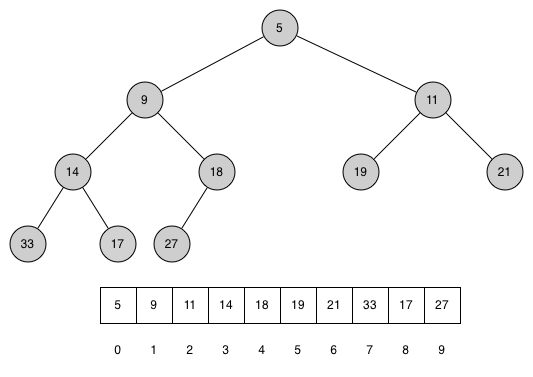
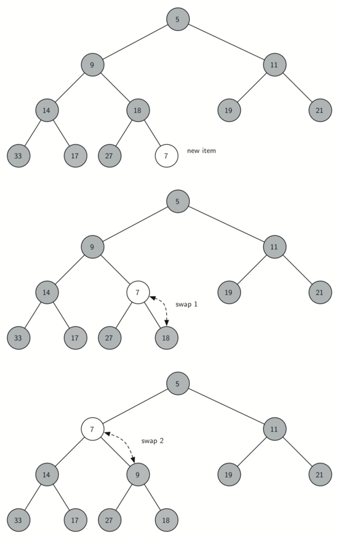
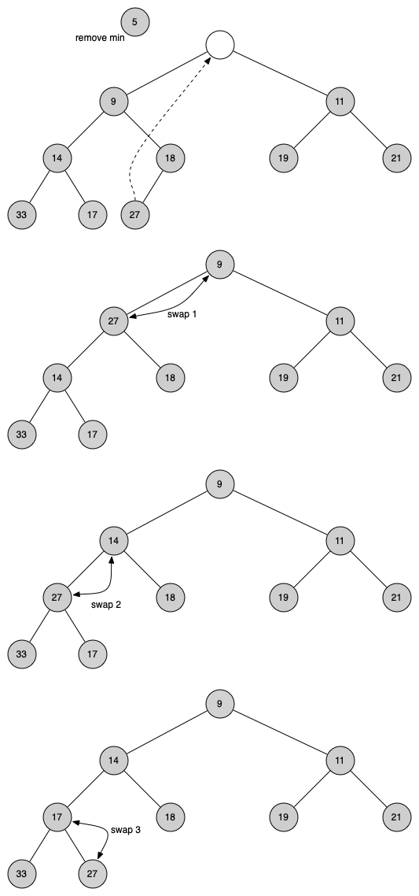
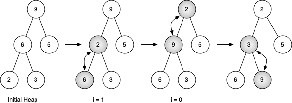

# 6.11. 二叉堆实现

**6.11. Binary Heap Implementation**

## 6.11.1. 结构属性

**6.11.1. The Structure Property**

=== "中文"

    为了使我们的堆高效运行，我们将利用二叉树的对数性质来表示堆。为了保证对数性能，我们必须保持树的平衡。一个平衡的二叉树在根的左子树和右子树中大致包含相同数量的节点。在我们的堆实现中，我们通过创建一个**完全二叉树**来保持树的平衡。完全二叉树是指每一层的节点都是满的，唯一的例外是树的底层，我们从左到右填充该层。`图 1` 显示了一个完全二叉树的示例。

    <figure markdown="span">
        
        <figcaption markdown="span">图 1: 一个完全二叉树</figcaption>
    </figure>
    
    完全树的另一个有趣的属性是，我们可以使用一个单一的列表来表示它。我们不需要使用节点和引用，甚至不需要使用列表的列表。因为树是完全的，父节点（在位置 $p$）的左子节点在列表中的位置是 $2p + 1$。同样，父节点的右子节点在列表中的位置是 $2p + 2$。要找到树中任何节点的父节点，我们只需使用 Python 的整数除法。给定一个节点在列表中的位置 $n$，父节点的位置是 $(n - 1) // 2$。`图 2` 显示了一个完全二叉树，并给出了树的列表表示。请注意父节点和子节点之间的 $2p + 1$ 和 $2p + 2$ 的关系。树的列表表示以及完全结构的属性，使我们能够仅使用几个简单的数学操作来高效遍历一个完全二叉树。这也使得我们可以高效实现二叉堆。

=== "英文"

    In order to make our heap work efficiently, we will take advantage of the logarithmic nature of the binary tree to represent our heap. In order to guarantee logarithmic performance, we must keep our tree balanced. A balanced binary tree has roughly the same number of nodes in the left and right subtrees of the root. In our heap implementation we keep the tree balanced by creating a **complete binary tree**. A complete binary tree is a tree in which each level has all of its nodes. The exception to this is the bottom level of the tree, which we fill in from left to right. `Figure 1` shows an example of a complete binary tree.
                            
    <figure markdown="span">
        
        <figcaption markdown="span">Figure 1: A Complete Binary Tree</figcaption>
    </figure>
    
    Another interesting property of a complete tree is that we can represent it using a single list. We do not need to use nodes and references or even lists of lists. Because the tree is complete, the left child of a parent (at position $p$) is the node that is found in position $2p + 1$ in the list. Similarly, the right child of the parent is at position $2p + 2$ in the list. To find the parent of any node in the tree, we can simply use Python’s integer division. Given that a node is at position $n$ in the list, the parent is at position $(n - 1) // 2`. `Figure 2$ shows a complete binary tree and also gives the list representation of the tree.  Note the $2p + 1$ and $2p + 2$ relationship between parent and children. The list representation of the tree, along with the full structure property, allows us to efficiently traverse a complete binary tree using only a few simple mathematical operations. We will see that this also leads to an efficient implementation of our binary heap.


## 6.11.2. 堆序属性

**6.11.2. The Heap Order Property**

=== "中文"
    
    我们将用来存储堆中项目的方法依赖于保持堆的顺序属性。**堆顺序属性**如下：在一个堆中，对于每个节点 $x$ 及其父节点 $p$，$p$ 中的键值小于或等于 $x$ 中的键值。`图 2` 还展示了一个具有堆顺序属性的完全二叉树。
    
    <figure markdown="span">
        
        <figcaption markdown="span">图 2: 一个完全二叉树及其列表表示</figcaption>
    </figure>

=== "英文"

    The method that we will use to store items in a heap relies on maintaining the heap order property. The **heap order property** is as follows: in a heap, for every node $x$ with parent $p$, the key in $p$ is smaller than or equal to the key in $x$. `Figure 2` also illustrates a complete binary tree that has the heap order property.
                            
    <figure markdown="span">
        
        <figcaption markdown="span">Figure 2: A Complete Binary Tree, along with Its List Representation</figcaption>
    </figure>


## 6.11.3. 堆操作

**6.11.3. Heap Operations**

=== "中文"

    我们将从构造函数开始实现二叉堆。由于整个二叉堆可以用一个单一的列表来表示，因此构造函数只需初始化这个列表。`列表 1` 显示了构造函数的 Python 代码。
    
    ```python title="列表 1"
    class BinaryHeap:
        def __init__(self):
            self._heap = []
    ```
    
    接下来我们将实现 `insert` 方法。向列表中添加项目的最简单和最有效的方法是将项目直接附加到列表末尾。附加操作的好处是，它可以保证我们保持完全树的属性。附加操作的坏处是，我们很可能会破坏堆的结构属性。然而，可以编写一个方法，通过比较新添加的项目与其父节点来恢复堆的结构属性。如果新添加的项目小于其父节点，则可以交换这个项目与其父节点的位置。`图 2` 显示了将新添加的项目上升到树中适当位置所需的一系列交换操作。
    
    <figure markdown="span">
        
        <figcaption markdown="span">图 2: 将新节点上升到其适当位置</figcaption>
    </figure>
    
    注意，当我们将项目上升时，我们是在恢复新添加的项目与其父节点之间的堆属性。我们也在保持任何兄弟节点的堆属性。当然，如果新添加的项目非常小，我们可能仍需将其上升到另一层。实际上，我们可能需要不断交换直到到达树的顶端。`列表 2` 显示了 `_perc_up` 方法，它会将新项目尽可能地上升到保持堆属性的位置。我们在方法名前使用了一个前导下划线 (`_`)，因为这是一个内部操作。当前节点的父节点可以通过从当前节点的索引中减去 1 并将结果除以 2 来计算。
    
    现在我们可以编写 `insert` 方法了（见 `列表 3`）。`insert` 方法的大部分工作实际上由 `_perc_up` 完成。一旦将新项目附加到树中，`_perc_up` 就会接管并正确定位新项目。
    
    ```python title="列表 2"
    def _perc_up(self, i):
        while (i - 1) // 2 >= 0:
            parent_idx = (i - 1) // 2
            if self._heap[i] < self._heap[parent_idx]:
                self._heap[i], self._heap[parent_idx] = (
                    self._heap[parent_idx],
                    self._heap[i],
                )
            i = parent_idx
    ```
    
    ```python title="列表 3"
    def insert(self, item):
        self._heap.append(item)
        self._perc_up(len(self._heap) - 1)
    ```
    
    定义了 `insert` 方法后，我们现在可以看一下 `delete` 方法。由于堆属性要求树的根是树中最小的项目，找到最小项很简单。`delete` 方法的难点在于在根节点被移除后恢复完全符合堆结构和堆顺序属性。我们可以通过两个步骤恢复堆。首先，我们通过将列表中的最后一个项目移到根位置来恢复根节点。移动最后一个项目保持了我们的堆结构属性。然而，我们很可能破坏了二叉堆的堆顺序属性。第二，我们通过将新的根节点向下推到树中的适当位置来恢复堆顺序属性。`图 3` 显示了将新根节点移动到堆中适当位置所需的一系列交换操作。
    
    <figure markdown="span">
        
        <figcaption markdown="span">图 3: 将根节点向下推到树中</figcaption>
    </figure>
    
    为了保持堆顺序属性，我们只需将根节点与其比根节点小的子节点交换。在初始交换后，我们可能需要重复交换过程，将节点与其子节点交换，直到节点交换到树中的位置，在这个位置它已经小于两个子节点。下树节点的代码在 `列表 4` 中的 `_perc_down` 和 `_get_min_child` 方法中。
    
    ```python title="列表 4"
    def _perc_down(self, i):
        while 2 * i + 1 < len(self._heap):
            sm_child = self._get_min_child(i)
            if self._heap[i] > self._heap[sm_child]:
                self._heap[i], self._heap[sm_child] = (
                    self._heap[sm_child],
                    self._heap[i],
                )
            else:
                break
            i = sm_child
    
    def _get_min_child(self, i):
        if 2 * i + 2 > len(self._heap) - 1:
            return 2 * i + 1
        if self._heap[2 * i + 1] < self._heap[2 * i + 2]:
            return 2 * i + 1
        return 2 * i + 2
    ```
    
    `delete` 操作的代码在 `列表 5` 中。注意一如既往，艰难的工作是由一个辅助函数 ` _perc_down` 处理的。
    
    ```python title="列表 5"
    def delete(self):
        self._heap[0], self._heap[-1] = self._heap[-1], self._heap[0]
        result = self._heap.pop()
        self._perc_down(0)
        return result
    ```
    
    为了完成对二叉堆的讨论，我们将看一下从一个键值列表构建整个堆的方法。你可能首先想到的方法是如下的。给定一个键值列表，你可以通过一次插入每个键值来轻松构建堆。由于你是从一个空列表开始的，因此列表是有序的，你可以使用二分查找找到插入下一个键值的位置，成本大约是 $O(\log{n})$ 操作。然而，请记住，在列表中间插入一个项目可能需要 $O(n)$ 的操作来移动列表的其余部分以为新键值腾出空间。因此，将 $n$ 个键值插入堆中总共需要 $O(n \log{n})$ 的操作。然而，如果我们从一个完整的列表开始，我们可以在 $O(n)$ 操作中构建整个堆。`列表 6` 显示了构建整个堆的代码。
    
    ```python title="列表 6"
    def heapify(self, not_a_heap):
        self._heap = not_a_heap[:]
        i = len(self._heap) // 2 - 1
        while i >= 0:
            self._perc_down(i)
            i = i - 1
    ```
    
    <figure markdown="span">
        
        <figcaption markdown="span">图 4: 从列表 [9, 6, 5, 2, 3] 构建堆</figcaption>
    </figure>
    
    `图 4` 显示了 `heapify` 方法在将初始树 [9, 6, 5, 2, 3] 的节点移动到其适当位置时所做的交换操作。虽然我们从树的中间开始并向根部推进，`_perc_down` 方法确保最大子节点始终被向下移动到树中。由于堆是一个完全二叉树，任何经过中点的节点都会是叶子节点，因此没有子节点。注意，当 `i = 0` 时，我们是从树的根开始向下渗透，因此这可能需要多次交换。正如你在 `图 4` 的最右边两个树中看到的那样，首先 9 被移动出根位置，但在 9 被移动到树的下一层后，`_perc_down` 确保我们检查树中更深处的下一组子节点，以确保它被推到尽可能低的位置。在这个例子中，这导致了与 3 的第二次交换。现在 9 已经被移动到树的最低层，不再需要进一步交换。比较这个交换序列的列表表示与 `图 4` 中显示的树表示是很有用的。
    
    ```pycon
    开始  [9, 6, 5, 2, 3]
    i = 1  [9, 2, 5, 6, 3]
    i = 0  [2, 3, 5, 6, 9]
    ```
    
    完整的二叉堆实现可以在 ActiveCode 1 中看到。
    
    ```python title="活动: 6.11.3.1 完整的二叉堆示例" linenums="1"
    class BinaryHeap:
        def __init__(self):
            self._heap = []
    
        def _perc_up(self, cur_idx):
            while (cur_idx - 1) // 2 >= 0:
                parent_idx = (cur_idx - 1) // 2
                if self._heap[cur_idx] < self._heap[parent_idx]:
                    self._heap[cur_idx], self._heap[parent_idx] = (
                        self._heap[parent_idx],
                        self._heap[cur_idx],
                    )
                cur_idx = parent_idx
    
        def _perc_down(self, cur_idx):
            while 2 *
    
     cur_idx + 1 < len(self._heap):
                min_child_idx = self._get_min_child(cur_idx)
                if self._heap[cur_idx] > self._heap[min_child_idx]:
                    self._heap[cur_idx], self._heap[min_child_idx] = (
                        self._heap[min_child_idx],
                        self._heap[cur_idx],
                    )
                else:
                    return
                cur_idx = min_child_idx
    
        def _get_min_child(self, parent_idx):
            if 2 * parent_idx + 2 > len(self._heap) - 1:
                return 2 * parent_idx + 1
            if self._heap[2 * parent_idx + 1] < self._heap[2 * parent_idx + 2]:
                return 2 * parent_idx + 1
            return 2 * parent_idx + 2
    
        def heapify(self, not_a_heap):
            self._heap = not_a_heap[:]
            cur_idx = len(self._heap) // 2 - 1
            while cur_idx >= 0:
                self._perc_down(cur_idx)
                cur_idx = cur_idx - 1
    
        def get_min(self):
            return self._heap[0]
    
        def insert(self, item):
            self._heap.append(item)
            self._perc_up(len(self._heap) - 1)
    
        def delete(self):
            self._heap[0], self._heap[-1] = self._heap[-1], self._heap[0]
            result = self._heap.pop()
            self._perc_down(0)
            return result
    
        def is_empty(self):
            return not bool(self._heap)
    
        def __len__(self):
            return len(self._heap)
    
        def __str__(self):
            return str(self._heap)
    
    a_heap = BinaryHeap()
    a_heap.heapify([9, 5, 6, 2, 3])
    
    while not a_heap.is_empty():
        print(a_heap.delete())
    ```
    
    关于我们可以在 $O(n)$ 时间内构建堆的断言，乍一看可能有点神秘，且证明超出了本书的范围。然而，理解你可以在 $O(n)$ 时间内构建堆的关键是要记住 $\log{n}$ 因子来源于树的高度。在 `heapify` 的大部分工作中，树的高度低于 $\log{n}$。
    
    利用你可以在 $O(n)$ 时间内从列表中构建堆的事实，你将在本章末尾作为练习构建一个使用堆的排序算法，该算法以 $O(n \log{n})$ 的时间复杂度对列表进行排序。

=== "英文"

    We will begin our implementation of a binary heap with the constructor. Since the entire binary heap can be represented by a single list, all the constructor will do is initialize the list. `Listing 1` shows the Python code for the constructor.
    
    ```python title="Listing 1"
    class BinaryHeap:
        def __init__(self):
            self._heap = []
    ```
    
    The next method we will implement is ``insert``. The easiest, and most efficient, way to add an item to a list is to simply append the item to the end of the list. The good news about appending is that it guarantees that we will maintain the complete tree property. The bad news about appending is that we will very likely violate the heap structure property. However, it is possible to write a method that will allow us to regain the heap structure property by comparing the newly added item with its parent. If the newly added item is less than its parent, then we can swap the item with its parent. `Figure 2` shows the series of swaps needed to percolate the newly added item up to its proper position in the tree.
                            
    <figure markdown="span">
        
        <figcaption markdown="span">Figure 2: Percolate the New Node up to Its Proper Position</figcaption>
    </figure>   
    
    Notice that when we percolate an item up, we are restoring the heap property between the newly added item and the parent. We are also preserving the heap property for any siblings. Of course, if the newly added item is very small, we may still need to swap it up another level. In fact, we may need to keep swapping until we get to the top of the tree. `Listing 2` shows the ``_perc_up`` method, which percolates a new item as far up in the tree as it needs to go to maintain the heap property. We used a leading underscore (``_``) in  the name of the method as it is an internal operation. The parent of the current node can be computed by subtracting 1 from the index of the current node and dividing the result by 2.
    
    We are now ready to write the ``insert`` method (see `Listing 3`). Most of the work in the ``insert`` method is really done by ``_perc_up``. Once a new item is appended to the tree, ``_perc_up`` takes over and positions the new item properly.
    
    
    ```python title="Listing 2"
    def _perc_up(self, i):
        while (i - 1) // 2 >= 0:
            parent_idx = (i - 1) // 2
            if self._heap[i] < self._heap[parent_idx]:
                self._heap[i], self._heap[parent_idx] = (
                    self._heap[parent_idx],
                    self._heap[i],
                )
            i = parent_idx
    ```
    
    
    ```python title="Listing 3"
    def insert(self, item):
        self._heap.append(item)
        self._perc_up(len(self._heap) - 1)
    ```
    
    With the ``insert`` method properly defined, we can now look at the ``delete`` method. Since the heap property requires that the root of the tree be the smallest item in the tree, finding the minimum item is easy. The hard part of ``delete`` is restoring full compliance with the heap structure and heap order properties after the root has been removed. We can restore our heap in two steps. First, we will restore the root item by taking the last item in the list and moving it to the root position. Moving the last item maintains our heap structure property. However, we have probably destroyed the heap order property of our binary heap. Second, we will restore the heap order property by pushing the new root node down the tree to its proper position. `Figure 3` shows the series of swaps needed to move the new root node to its proper position in the heap.
                            
    <figure markdown="span">
        
        <figcaption markdown="span">Figure 3: Percolating the Root Node down the Tree</figcaption>
    </figure>
    
    In order to maintain the heap order property, all we need to do is swap the root with its smaller child that is less than the root. After the initial swap, we may repeat the swapping process with a node and its children until the node is swapped into a position on the tree where it is already less than both children. The code for percolating a node down the tree is found in the ``_perc_down`` and ``_get_min_child`` methods in `Listing 4`.
    
    
    ```python title="Listing 4"
    def _perc_down(self, i):
        while 2 * i + 1 < len(self._heap):
            sm_child = self._get_min_child(i)
            if self._heap[i] > self._heap[sm_child]:
                self._heap[i], self._heap[sm_child] = (
                    self._heap[sm_child],
                    self._heap[i],
                )
            else:
                break
            i = sm_child
    
    def _get_min_child(self, i):
        if 2 * i + 2 > len(self._heap) - 1:
            return 2 * i + 1
        if self._heap[2 * i + 1] < self._heap[2 * i + 2]:
            return 2 * i + 1
        return 2 * i + 2
    ```
    
    The code for the ``delete`` operation is in `Listing 5`. Note that once again the hard work is handled by a helper function, in this case ``_perc_down``.
    
    ```python title="Listing 5"
    def delete(self):
        self._heap[0], self._heap[-1] = self._heap[-1], self._heap[0]
        result = self._heap.pop()
        self._perc_down(0)
        return result
    ```
    
    To finish our discussion of binary heaps, we will look at a method to build an entire heap from a list of keys. The first method you might think of may be like the following. Given a list of keys, you could easily build a heap by inserting each key one at a time. Since you are starting with an empy list, it is sorted and you could use binary search to find the right position to insert the next key at a cost of approximately $O(\log{n})$ operations. However, remember that inserting an item in the middle of the list may require $O(n)$ operations to shift the rest of the list over to make room for the new key. Therefore, to insert $n$ keys into the heap would require a total of $O(n \log{n})$ operations. However, if we start with an entire list then we can build the whole heap in $O(n)$ operations. `Listing 6` shows the code to build the entire heap.
    
    
    ```python title="Listing 6"
    def heapify(self, not_a_heap):
        self._heap = not_a_heap[:]
        i = len(self._heap) // 2 - 1
        while i >= 0:
            self._perc_down(i)
            i = i - 1
    ```
                            
    <figure markdown="span">
        
        <figcaption markdown="span">Figure 4: Building a Heap from the List [9, 6, 5, 2, 3]</figcaption>
    </figure>   
    
    `Figure 4` shows the swaps that the ``hepify`` method makes as it moves the nodes in an initial tree of [9, 6, 5, 2, 3] into their proper positions. Although we start out in the middle of the tree and work our way back toward the root, the ``_perc_down`` method ensures that the largest child is always moved down the tree. Because the heap is a complete binary tree, any nodes past the halfway point will be leaves and therefore have no children. Notice that when ``i = 0``, we are percolating down from the root of the tree, so this may require multiple swaps. As you can see in the rightmost two trees of `Figure 4`, first the 9 is moved out of the root position, but after 9 is moved down one level in the tree, ``_perc_down`` ensures that we check the next set of children farther down in the tree to ensure that it is pushed as low as it can go. In this case it results in a second swap with 3. Now that 9 has been moved to the lowest level of the tree, no further swapping can be done. It is useful to compare the list representation of this series of swaps with the tree representation shown in `Figure 4`
    
    ```pycon
    start  [9, 6, 5, 2, 3]
    i = 1  [9, 2, 5, 6, 3]
    i = 0  [2, 3, 5, 6, 9]
    ```
    
    The complete binary heap implementation can be seen in ActiveCode 1.
    
    ```python title="Activity: 6.11.3.1 The Complete Binary Heap Example" linenums="1"
    class BinaryHeap:
        def __init__(self):
            self._heap = []
    
        def _perc_up(self, cur_idx):
            while (cur_idx - 1) // 2 >= 0:
                parent_idx = (cur_idx - 1) // 2
                if self._heap[cur_idx] < self._heap[parent_idx]:
                    self._heap[cur_idx], self._heap[parent_idx] = (
                        self._heap[parent_idx],
                        self._heap[cur_idx],
                    )
                cur_idx = parent_idx
    
        def _perc_down(self, cur_idx):
            while 2 * cur_idx + 1 < len(self._heap):
                min_child_idx = self._get_min_child(cur_idx)
                if self._heap[cur_idx] > self._heap[min_child_idx]:
                    self._heap[cur_idx], self._heap[min_child_idx] = (
                        self._heap[min_child_idx],
                        self._heap[cur_idx],
                    )
                else:
                    return
                cur_idx = min_child_idx
    
        def _get_min_child(self, parent_idx):
            if 2 * parent_idx + 2 > len(self._heap) - 1:
                return 2 * parent_idx + 1
            if self._heap[2 * parent_idx + 1] < self._heap[2 * parent_idx + 2]:
                return 2 * parent_idx + 1
            return 2 * parent_idx + 2
    
        def heapify(self, not_a_heap):
            self._heap = not_a_heap[:]
            cur_idx = len(self._heap) // 2 - 1
            while cur_idx >= 0:
                self._perc_down(cur_idx)
                cur_idx = cur_idx - 1
    
        def get_min(self):
            return self._heap[0]
    
        def insert(self, item):
            self._heap.append(item)
            self._perc_up(len(self._heap) - 1)
    
        def delete(self):
            self._heap[0], self._heap[-1] = self._heap[-1], self._heap[0]
            result = self._heap.pop()
            self._perc_down(0)
            return result
    
        def is_empty(self):
            return not bool(self._heap)
    
        def __len__(self):
            return len(self._heap)
    
        def __str__(self):
            return str(self._heap)
    
    a_heap = BinaryHeap()
    a_heap.heapify([9, 5, 6, 2, 3])
    
    while not a_heap.is_empty():
        print(a_heap.delete())
    ```
    
    The assertion that we can build the heap in $O(n)$ may seem a bit mysterious at first, and a proof is beyond the scope of this book. However, the key to understanding that you can build the heap in $O(n)$ is to remember that the $\log{n}$ factor is derived from the height of the tree. For most of the work in ``heapify``, the tree is shorter than $\log{n}$.
    
    Using the fact that you can build a heap from a list in $O(n)$ time, you will construct a sorting algorithm that uses a heap and sorts a list in $O(n\log{n})$ as an exercise at the end of this chapter.