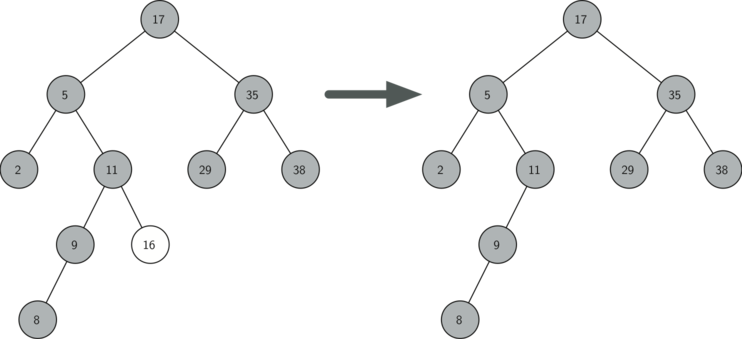

# 6.14. 搜索树实现

**6.14. Search Tree Implementation**

=== "中文"

    二叉搜索树（BST）依赖于以下属性：小于父节点的键位于左子树中，大于父节点的键位于右子树中。我们称之为 **BST 属性**。在实现上述 `Map` 接口时，BST 属性将指导我们的实现。`Figure 1` 说明了二叉搜索树的这一属性，显示了不带任何关联值的键。请注意，该属性在每个父节点和子节点之间都成立。所有左子树中的键都小于根节点中的键。所有右子树中的键都大于根节点中的键。
    
    <figure markdown="span">
        
        <figcaption markdown="span">Figure 1: 简单的二叉搜索树</figcaption>
    </figure>  
    
    现在你已经了解了二叉搜索树，我们将研究如何构建一个二叉搜索树。`Figure 1` 中的搜索树代表了我们按以下顺序插入键后的节点：$70, 31, 93, 94, 14, 23, 73$。由于 70 是第一个插入树中的键，它是根节点。接着，31 小于 70，所以它成为 70 的左子节点。然后，93 大于 70，因此它成为 70 的右子节点。现在树已经填充了两个层级，因此下一个键将成为 31 或 93 的左或右子节点。由于 94 大于 70 和 93，它成为 93 的右子节点。同样，14 小于 70 和 31，所以它成为 31 的左子节点。23 也小于 31，因此它必须在 31 的左子树中。然而，它大于 14，所以它成为 14 的右子节点。
    
    为了实现二叉搜索树，我们将使用类似于实现链表和表达式树时使用的节点和引用的方法。然而，由于我们必须能够创建和处理一个空的二叉搜索树，我们的实现将使用两个类。第一个类我们称之为 ``BinarySearchTree``，第二个类我们称之为 ``TreeNode``。``BinarySearchTree`` 类有一个指向二叉搜索树根节点的 ``TreeNode`` 引用。在大多数情况下，外部类中定义的方法只是检查树是否为空。如果树中有节点，则请求会传递给 ``BinarySearchTree`` 类中定义的一个私有方法，该方法以根节点作为参数。在树为空或我们想删除根节点的键的情况下，我们必须采取特殊措施。``BinarySearchTree`` 类构造函数及其他一些杂项方法的代码显示在 `Listing 1` 中。
    
    ```python title="Listing 1"
    class BinarySearchTree:
        def __init__(self):
            self.root = None
            self.size = 0
    
        def __len__(self):
            return self.size
    
        def __iter__(self):
            return self.root.__iter__()
    ```
    
    ``TreeNode`` 类提供了许多帮助方法，使得 ``BinarySearchTree`` 类方法中的工作变得更加容易。``TreeNode`` 的构造函数以及这些帮助方法显示在 `Listing 2` 中。如列表所示，这些帮助方法有助于根据节点的位置（左或右子节点）以及节点的子节点类型对节点进行分类。``TreeNode`` 类还将明确跟踪每个节点的父节点。你会在我们讨论 ``del`` 运算符的实现时看到这点的重要性。
    
    `Listing 2` 中 ``TreeNode`` 的另一个有趣方面是我们使用了 Python 的可选参数。可选参数使我们能够在多种情况下创建 ``TreeNode``。有时我们需要构造一个已经有父节点和子节点（例如左子节点）的新 ``TreeNode``，在这种情况下，我们可以将 ``parent`` 和 ``left_child`` 作为参数传递。其他时候，我们只需创建一个带有键值对的 ``TreeNode``，而不传递任何 ``parent`` 或 ``child`` 参数。在这种情况下，将使用可选参数的默认值。
    
    ```python title="Listing 2"
    class TreeNode:
        def __init__(self, key, value, left=None, right=None, parent=None):
            self.key = key
            self.value = value
            self.left_child = left
            self.right_child = right
            self.parent = parent
    
        def is_left_child(self):
            return self.parent and self.parent.left_child is self
    
        def is_right_child(self):
            return self.parent and self.parent.right_child is self
    
        def is_root(self):
            return not self.parent
    
        def is_leaf(self):
            return not (self.right_child or self.left_child)
    
        def has_any_child(self):
            return self.right_child or self.left_child
    
        def has_children(self):
            return self.right_child and self.left_child
    
        def replace_value(self, key, value, left, right):
            self.key = key
            self.value = value
            self.left_child = left
            self.right_child = right
            if self.left_child:
                self.left_child.parent = self
            if self.right_child:
                self.right_child.parent = self
    ```
    
    现在我们已经有了 ``BinarySearchTree`` 外壳和 ``TreeNode``，接下来是编写 ``put`` 方法，它将允许我们构建二叉搜索树。``put`` 方法是 ``BinarySearchTree`` 类的一个方法。该方法将检查树是否已有根节点。如果没有根节点，则 ``put`` 将创建一个新的 ``TreeNode`` 并将其安装为树的根节点。如果已经有根节点，则 ``put`` 调用私有递归辅助方法 ``_put``，按照以下算法搜索树：
    
    - 从树的根节点开始，比较新键与当前节点的键。如果新键小于当前节点的键，则搜索左子树。如果新键大于当前节点的键，则搜索右子树。
    - 当没有左或右子节点可以搜索时，我们就找到了树中应该安装新节点的位置。
    - 要将节点添加到树中，创建一个新的 ``TreeNode`` 对象，并将该对象插入到前一步骤中发现的位置。
    
    `Listing 3` 显示了将新节点插入树中的 Python 代码。``_put`` 方法是递归编写的，遵循上述步骤。请注意，当新子节点插入树中时，``current_node`` 被传递给新树作为父节点。
    
    我们实现插入的一个重要问题是重复的键没有得到正确处理。由于我们的树实现，重复的键将创建一个具有相同键值的新节点，该节点位于具有原始键的节点的右子树中。这导致新键的节点在搜索过程中永远找不到。处理重复键的更好方法是将与新键相关联的值替换旧值。我们将修复此错误留给你作为练习。
    
    ```python title="Listing 3"
    def put(self, key, value):
        if self.root:
            self._put(key, value, self.root)
        else:
            self.root = TreeNode(key, value)
        self.size = self.size + 1
    
    def _put(self, key, value, current_node):
        if key < current_node.key:
            if current_node.left_child:
                self._put(key, value, current_node.left_child)
            else:
                current_node.left_child = TreeNode(key, value, parent=current_node)
        else:
            if current_node.right_child:
                self._put(key, value, current_node.right_child)
            else:
                current_node.right_child = TreeNode(key, value, parent=current_node)
    ```
    
    定义了 ``put`` 方法后，我们可以通过让 ``__setitem__`` 方法调用 ``put`` 方法来轻松重载 ``[]`` 运算符（见 `Listing 4`）。这使我们可以像 Python 字典一样编写 Python 语句，例如 ``my_zip_tree['Plymouth'] = 55446``。
    
    ```python title="Listing 4"
        def __setitem__(self, key, value):
            self.put(key, value)
    ```
    
    `Figure 2` 说明了将新节点插入二叉搜索树的过程。浅色节点表示在插入过程中访问的节点。
    
    <figure markdown="span">
        
        <figcaption markdown="span">Figure 2: 插入键为 19 的节点</figcaption>
    </figure>  
    
    !!! info "自我检查"
    
        下列树中哪一棵是正确的二叉搜索树，前提是键按照以下顺序插入：5, 30, 2, 40, 25, 4。
    
        - answer_a: 
        - answer_b: 
        - answer_c: 
        
        correct: b
    
        - feedback a: 记住，从根节点开始，键小于根节点的必须在左子树中，而大于根节点的键则在右子树中。
        - feedback b: 做得好。
        - feedback c: 这看起来像是满足堆所需的完整树属性的二叉树。
    
    树构建完成后，接下来的任务是实现对给定键值的检索。``get``
    
     方法比 ``put`` 方法更简单，因为它只是递归地搜索树，直到到达不匹配的叶节点或找到匹配的键。当找到匹配的键时，返回存储在节点负载中的值。
    
    `Listing 5` 显示了 ``get`` 和 ``_get`` 的代码。``_get`` 方法中的搜索代码使用与 ``_put`` 方法相同的逻辑来选择左或右子节点。请注意，``_get`` 方法返回一个 ``TreeNode`` 给 ``get``，这使得 ``_get`` 可以作为其他 ``BinarySearchTree`` 方法的灵活辅助方法，这些方法可能需要使用 ``TreeNode`` 的其他数据，而不仅仅是负载。
    
    ```python title="Listing 5"
    def get(self, key):
        if self.root:
            result = self._get(key, self.root)
            if result:
                return result.value
        return None
    
    def _get(self, key, current_node):
        if not current_node:
            return None
        if current_node.key == key:
            return current_node
        elif key < current_node.key:
            return self._get(key, current_node.left_child)
        else:
            return self._get(key, current_node.right_child)
    ```
    
    通过实现 ``__getitem__`` 方法，我们可以编写一个看起来像是在访问字典的 Python 语句，但实际上我们在使用一个二叉搜索树，例如 ``z = my_zip_tree["Fargo"]``。正如 `Listing 6` 中所示，``__getitem__`` 方法只调用 ``get``。
    
    ```python title="Listing 6"
        def __getitem__(self, key):
            return self.get(key)
    ```
    
    使用 ``get``，我们可以通过为 ``BinarySearchTree`` 编写 ``__contains__`` 方法来实现 ``in`` 操作。``__contains__`` 方法将简单地调用 ``get`` 并返回 ``True`` 如果 ``get`` 返回值，或者返回 ``False`` 如果 ``get`` 返回 ``None``。``__contains__`` 的代码显示在 `Listing 7` 中。
    
    ```python title="Listing 7"
        def __contains__(self, key):
            return bool(self._get(key, self.root))
    ```
    
    请记住，``__contains__`` 重载了 ``in`` 运算符，允许我们编写诸如 ``"Northfield" in my_zip_tree`` 这样的语句。
    
    最后，我们将关注二叉搜索树上最具挑战性的操作——键的删除（见 `Listing 8`）。首先的任务是通过搜索树找到要删除的节点。如果树中有多个节点，我们使用 ``_get`` 方法来找到需要删除的 ``TreeNode``。如果树中只有一个节点，这意味着我们要删除树的根节点，但我们仍然必须检查根节点的键是否与要删除的键匹配。在这两种情况下，如果未找到键，``del`` 运算符将引发错误。
    
    ```python title="Listing 8"
    def delete(self, key):
        if self.size > 1:
            node_to_remove = self._get(key, self.root)
            if node_to_remove:
                self._delete(node_to_remove)
                self.size = self.size - 1
            else:
                raise KeyError("Error, key not in tree")
        elif self.size == 1 and self.root.key == key:
            self.root = None
            self.size = self.size - 1
        else:
            raise KeyError("Error, key not in tree")
    ```
    
    找到包含要删除的键的节点后，我们必须考虑三种情况：
    
    1. 要删除的节点没有子节点（见 `Figure 3`）。
    2. 要删除的节点只有一个子节点（见 `Figure 4`）。
    3. 要删除的节点有两个子节点（见 `Figure 5`）。
    
    <figure markdown="span">
        
        <figcaption markdown="span">Figure 3: 删除没有子节点的节点 16</figcaption>
    </figure>  
    
    <figure markdown="span">
        
        <figcaption markdown="span">Figure 4: 删除有一个子节点的节点 25</figcaption>
    </figure>  
    
    <figure markdown="span">
        
        <figcaption markdown="span">Figure 5: 删除有两个子节点的节点 5</figcaption>
    </figure>  
    
    第一种情况很简单。如果当前节点没有子节点，我们只需要删除该节点并在父节点中删除对该节点的引用。这种情况的代码显示在 `Listing 9` 中。
    
    ```python title="Listing 9"
    if current_node.is_leaf():
        if current_node == current_node.parent.left_child:
            current_node.parent.left_child = None
        else:
            current_node.parent.right_child = None
    ```
    
    第二种情况稍微复杂一些。如果一个节点只有一个子节点，我们可以简单地提升该子节点以取代其父节点。该情况的代码显示在 `Listing 10` 中。查看这段代码，你会发现有六种情况需要考虑。由于这些情况是关于是否有左子节点或右子节点的对称情况，我们将只讨论当前节点有左子节点的情况。决策过程如下：
    
    1. 如果当前节点是左子节点，则只需将左子节点的父节点引用更新为指向当前节点的父节点，然后更新父节点的左子节点引用为指向当前节点的左子节点。
    2. 如果当前节点是右子节点，则只需将左子节点的父节点引用更新为指向当前节点的父节点，然后更新父节点的右子节点引用为指向当前节点的左子节点。
    3. 如果当前节点没有父节点，则它必须是根节点。在这种情况下，我们将通过调用根节点上的 ``replace_value`` 方法来替换 ``key``、``value``、``left_child`` 和 ``right_child`` 数据。
    
    ```python title="Listing 10"
    else:  # removing a node with one child
        if current_node.get_left_child():
            if current_node.is_left_child():
                current_node.left_child.parent = current_node.parent
                current_node.parent.left_child = current_node.left_child
            elif current_node.is_right_child():
                current_node.left_child.parent = current_node.parent
                current_node.parent.right_child = current_node.left_child
            else:
                current_node.replace_value(
                    current_node.left_child.key,
                    current_node.left_child.value,
                    current_node.left_child.left_child,
                    current_node.left_child.right_child,
                )
        else:
            if current_node.is_left_child():
                current_node.right_child.parent = current_node.parent
                current_node.parent.left_child = current_node.right_child
            elif current_node.is_right_child():
                current_node.right_child.parent = current_node.parent
                current_node.parent.right_child = current_node.right_child
            else:
                current_node.replace_value(
                    current_node.right_child.key,
                    current_node.right_child.value,
                    current_node.right_child.left_child,
                    current_node.right_child.right_child,
                )
    ```
    
    第三种情况是最复杂的。如果一个节点有两个子节点，那么简单地提升其中一个节点来代替待删除的节点通常是不够的。我们需要在树中寻找一个可以替代待删除节点的节点，这个节点需要保持现有左右子树的二叉搜索树关系。这个节点是树中具有下一个最大键的节点。我们称这个节点为 **后继节点**，稍后我们将讨论如何找到后继节点。后继节点保证最多只有一个子节点，因此我们可以使用已经实现的删除两种情况来删除它。一旦后继节点被删除，我们只需将其放回树中以取代待删除的节点。处理第三种情况的代码见 `Listing 11`。
    
    在 `Listing 11` 中，我们使用了辅助方法 `find_successor` 和 `splice_out` 来找到和删除后继节点。我们使用 `splice_out` 是因为它直接处理我们要移除的节点并做出相应的修改。我们也可以递归调用 `delete`，但这样会浪费时间重新查找键节点。
    
    ```python title="Listing 11"
    elif current_node.has_children():  # 删除有两个子节点的节点
        successor = current_node.find_successor()
        successor.splice_out()
        current_node.key = successor.key
        current_node.value = successor.value
    ```
    
    下面的代码显示了找到后继节点的方法（见 `Listing 12`），它是 `TreeNode` 类中的一个方法。这个代码利用了二叉搜索树的属性，使得中序遍历可以按从最小到最大的顺序打印出树中的节点。查找后继节点时有三种情况需要考虑：
    
    1. 如果节点有右子节点，则后继节点是右子树中的最小键。
    2. 如果节点没有右子节点且是其父节点的左子节点，则父节点是后继节点。
    3. 如果节点是其父节点的右子节点，并且自身没有右子节点，则该节点的后继节点是其父节点的后继节点，排除该节点。
    
    对于我们在删除二叉搜索树中的节点时，只有第一种情况是重要的。然而，`find_successor` 方法还有其他用途，我们将在本章末尾的练习中探讨。
    
    `find_min` 方法被调用来查找子树中的最小键。你应该确认任何二叉搜索树中最小的键值就是树的最左子节点。因此，`find_min` 方法简单地沿着子树中每个节点的 `left_child` 引用，直到到达没有左子节点的节点。
    
    ```python title="Listing 12"
    def find_successor(self):
        successor = None
        if self.right_child:
            successor = self.right_child.find_min()
        else:
            if self.parent:
                if self.is_left_child():
                    successor = self.parent
                else:
                    self.parent.right_child = None
                    successor = self.parent.find_successor()
                    self.parent.right_child = self
        return successor
    
    def find_min(self):
        current = self
        while current.left_child:
            current = current.left_child
        return current
    
    def splice_out(self):
        if self.is_leaf():
            if self.is_left_child():
                self.parent.left_child = None
            else:
                self.parent.right_child = None
        elif self.has_any_child():
            if self.left_child:
                if self.is_left_child():
                    self.parent.left_child = self.left_child
                else:
                    self.parent.right_child = self.left_child
                self.left_child.parent = self.parent
            else:
                if self.is_left_child():
                    self.parent.left_child = self.right_child
                else:
                    self.parent.right_child = self.right_child
                self.right_child.parent = self.parent
    ```
    
    我们可以通过为 `BinarySearchTree` 编写 `__delete__` 方法来实现 `del` 运算符，如 `Listing 13` 所示。这是一个包装方法，允许我们通过编写 `del my_zip_tree["NYC"]` 从映射中删除一个键。
    
    ```python title="Listing 13"
    def __delitem__(self, key):
        self.delete(key)
    ```
    
    我们还需要查看二叉搜索树的最后一个接口方法。假设我们想要按顺序遍历树中的所有键。这在字典中我们已经做过了，那么为什么不在树中做呢？你已经知道如何使用中序遍历算法遍历二叉树。然而，编写一个迭代器需要更多的工作，因为一个迭代器每次调用时只返回一个节点。
    
    Python 提供了一个非常强大的函数来创建迭代器。这个函数叫做 `yield`。`yield` 类似于 `return`，它将一个值返回给调用者。然而，`yield` 还会冻结函数的状态，以便下次调用函数时可以从中断的地方继续执行。创建可以被迭代的对象的函数称为 *生成器函数*。
    
    二叉树中序迭代器的代码如下所示。仔细查看这段代码；乍一看，你可能认为这段代码不是递归的。然而，记住 `__iter__` 重载了 `for ... in` 操作，因此它确实是递归的！由于它是对 `TreeNode` 实例的递归，因此 `__iter__` 方法定义在 `TreeNode` 类中。
    
    ```python
    def __iter__(self):
        if self:
            if self.left_child:
                for elem in self.left_child:
                    yield elem
            yield self.key
            if self.right_child:
                for elem in self.right_child:
                    yield elem
    ```
    
    此时，你可能会想下载包含 `BinarySearchTree` 和 `TreeNode` 类完整版本的整个文件。


    ```python title="Activity: 6.14.2 ActiveCode" linenums="1"
    class TreeNode:
        def __init__(self, key, value, left=None, right=None, parent=None):
            self.key = key
            self.value = value
            self.left_child = left
            self.right_child = right
            self.parent = parent
    
        def is_left_child(self):
            return self.parent and self.parent.left_child is self
    
        def is_right_child(self):
            return self.parent and self.parent.right_child is self
    
        def is_root(self):
            return not self.parent
    
        def is_leaf(self):
            return not (self.right_child or self.left_child)
    
        def has_any_child(self):
            return self.right_child or self.left_child
    
        def has_children(self):
            return self.right_child and self.left_child
    
        def replace_value(self, key, value, left, right):
            self.key = key
            self.value = value
            self.left_child = left
            self.right_child = right
            if self.left_child:
                self.left_child.parent = self
            if self.right_child:
                self.right_child.parent = self
    
        def find_successor(self):
            successor = None
            if self.right_child:
                successor = self.right_child.find_min()
            else:
                if self.parent:
                    if self.is_left_child():
                        successor = self.parent
                    else:
                        self.parent.right_child = None
                        successor = self.parent.find_successor()
                        self.parent.right_child = self
            return successor
    
        def find_min(self):
            current = self
            while current.left_child:
                current = current.left_child
            return current
    
        def splice_out(self):
            if self.is_leaf():
                if self.is_left_child():
                    self.parent.left_child = None
                else:
                    self.parent.right_child = None
            elif self.has_any_child():
                if self.left_child:
                    if self.is_left_child():
                        self.parent.left_child = self.left_child
                    else:
                        self.parent.right_child = self.left_child
                    self.left_child.parent = self.parent
                else:
                    if self.is_left_child():
                        self.parent.left_child = self.right_child
                    else:
                        self.parent.right_child = self.right_child
                    self.right_child.parent = self.parent
    
        def __iter__(self):
            if self:
                if self.left_child:
                    for elem in self.left_child:
                        yield elem
                yield self.key
                if self.right_child:
                    for elem in self.right_child:
                        yield elem
    
    
    class BinarySearchTree:
        def __init__(self):
            self.root = None
            self.size = 0
    
        def __len__(self):
            return self.size
    
        def __iter__(self):
            return self.root.__iter__()
    
        def put(self, key, value):
            if self.root:
                self._put(key, value, self.root)
            else:
                self.root = TreeNode(key, value)
            self.size = self.size + 1
    
        def _put(self, key, value, current_node):
            if key < current_node.key:
                if current_node.left_child:
                    self._put(key, value, current_node.left_child)
                else:
                    current_node.left_child = TreeNode(
                        key, value, parent=current_node
                    )
            else:
                if current_node.right_child:
                    self._put(key, value, current_node.right_child)
                else:
                    current_node.right_child = TreeNode(
                        key, value, parent=current_node
                    )
    
        def __setitem__(self, key, value):
            self.put(key, value)
    
        def get(self, key):
            if self.root:
                result = self._get(key, self.root)
                if result:
                    return result.value
            return None
    
        def _get(self, key, current_node):
            if not current_node:
                return None
            if current_node.key == key:
                return current_node
            elif key < current_node.key:
                return self._get(key, current_node.left_child)
            else:
                return self._get(key, current_node.right_child)
    
        def __getitem__(self, key):
            return self.get(key)
    
        def __contains__(self, key):
            return bool(self._get(key, self.root))
    
        def delete(self, key):
            if self.size > 1:
                node_to_remove = self._get(key, self.root)
                if node_to_remove:
                    self._delete(node_to_remove)
                    self.size = self.size - 1
                else:
                    raise KeyError("Error, key not in tree")
            elif self.size == 1 and self.root.key == key:
                self.root = None
                self.size = self.size - 1
            else:
                raise KeyError("Error, key not in tree")
    
        def _delete(self, current_node):
            if current_node.is_leaf():  # removing a leaf
                if current_node == current_node.parent.left_child:
                    current_node.parent.left_child = None
                else:
                    current_node.parent.right_child = None
            elif current_node.has_children():  # removing a node with two children
                successor = current_node.find_successor()
                successor.splice_out()
                current_node.key = successor.key
                current_node.value = successor.value
            else:  # removing a node with one child
                if current_node.left_child:
                    if current_node.is_left_child():
                        current_node.left_child.parent = current_node.parent
                        current_node.parent.left_child = current_node.left_child
                    elif current_node.is_right_child():
                        current_node.left_child.parent = current_node.parent
                        current_node.parent.right_child = current_node.left_child
                    else:
                        current_node.replace_value(
                            current_node.left_child.key,
                            current_node.left_child.value,
                            current_node.left_child.left_child,
                            current_node.left_child.right_child,
                        )
                else:
                    if current_node.is_left_child():
                        current_node.right_child.parent = current_node.parent
                        current_node.parent.left_child = current_node.right_child
                    elif current_node.is_right_child():
                        current_node.right_child.parent = current_node.parent
                        current_node.parent.right_child = current_node.right_child
                    else:
                        current_node.replace_value(
                            current_node.right_child.key,
                            current_node.right_child.value,
                            current_node.right_child.left_child,
                            current_node.right_child.right_child,
                        )
    
        def __delitem__(self, key):
            self.delete(key)
    
    
    my_tree = BinarySearchTree()
    my_tree["a"] = "a"
    my_tree["q"] = "quick"
    my_tree["b"] = "brown"
    my_tree["f"] = "fox"
    my_tree["j"] = "jumps"
    my_tree["o"] = "over"
    my_tree["t"] = "the"
    my_tree["l"] = "lazy"
    my_tree["d"] = "dog"
    
    print(my_tree["q"])
    print(my_tree["l"])
    print("There are {} items in this tree".format(len(my_tree)))
    my_tree.delete("a")
    print("There are {} items in this tree".format(len(my_tree)))
    
    for node in my_tree:
        print(my_tree[node], end=" ")
    print()
    ```

=== "英文"

    A binary search tree (BST) relies on the property that keys that are less than the parent are found in the left subtree, and keys that are greater than the parent are found in the right subtree. We will call this the **BST property**. As we implement the ``Map`` interface as described above, the BST property will guide our implementation. `Figure 1` illustrates this property of a binary search tree, showing the keys without any associated values. Notice that the property holds for each parent and child. All of the keys in the left subtree are less than the key in the root. All of the keys in the right subtree are greater than the root.
                                
    <figure markdown="span">
        
        <figcaption markdown="span">Figure 1: A Simple Binary Search Tree</figcaption>
    </figure>  
    
    Now that you know what a binary search tree is, we will look at how a binary search tree is constructed. The search tree in `Figure 1` represents the nodes that exist after we have inserted the following keys in the order shown: $70, 31, 93, 94, 14, 23, 73$. Since 70 was the first key inserted into the tree, it is the root. Next, 31 is less than 70, so it becomes the left child of 70. Next, 93 is greater than 70, so it becomes the right child of 70. Now we have two levels of the tree filled, so the next key is going to be the left or right child of either 31 or 93. Since 94 is greater than 70 and 93, it becomes the right child of 93. Similarly 14 is less than 70 and 31, so it becomes the left child of 31. 23 is also less than 31, so it must be in the left subtree of 31. However, it is greater than 14, so it becomes the right child of 14.
    
    To implement the binary search tree, we will use the nodes and references approach similar to the one we used to implement the linked list and the expression tree. However, because we must be able create and work with a binary search tree that is empty, our implementation will use two classes. The first class we will call ``BinarySearchTree``, and the second class we will call ``TreeNode``. The ``BinarySearchTree`` class has a reference to the ``TreeNode`` that is the root of the binary search tree. In most cases the external methods defined in the outer class simply check to see if the tree is empty. If there are nodes in the tree, the request is just passed on to a private method defined in the ``BinarySearchTree`` class that takes the root as a parameter. In the case where the tree is empty or we want to delete the key at the root of the tree, we must take special action. The code for the ``BinarySearchTree`` class constructor along with a few other miscellaneous methods is shown in `Listing 1`.
    
    ```python title="Listing 1"
    class BinarySearchTree:
        def __init__(self):
            self.root = None
            self.size = 0
    
        def __len__(self):
            return self.size
    
        def __iter__(self):
            return self.root.__iter__()
    ```
    
    The ``TreeNode`` class provides many helper methods that make the work done in the ``BinarySearchTree`` class methods much easier. The constructor for a ``TreeNode``, along with these helper methods, is shown in `Listing 2`. As you can see in the listing many of these helper methods help to classify a node according to its own position as a child (left or right) and the kind of children the node has. The ``TreeNode`` class will also explicitly keep track of the parent as an attribute of each node. You will see why this is important when we discuss the implementation for the ``del`` operator.
    
    Another interesting aspect of the implementation of ``TreeNode`` in `Listing 2` is that we use Python’s optional parameters. Optional parameters make it easy for us to create a ``TreeNode`` under several different circumstances. Sometimes we will want to construct a new ``TreeNode`` that already has both a parent and a child (e.g. left) and in that case we can pass ``parent`` and ``left_child`` as parameters. At other times we will just create a ``TreeNode`` with the key-value pair, and we will not pass any parameters for ``parent`` or ``child``. In this case, the default values of the optional parameters are used.
    
    ```python title="Listing 2"
    class TreeNode:
        def __init__(self, key, value, left=None, right=None, parent=None):
            self.key = key
            self.value = value
            self.left_child = left
            self.right_child = right
            self.parent = parent
    
        def is_left_child(self):
            return self.parent and self.parent.left_child is self
    
        def is_right_child(self):
            return self.parent and self.parent.right_child is self
    
        def is_root(self):
            return not self.parent
    
        def is_leaf(self):
            return not (self.right_child or self.left_child)
    
        def has_any_child(self):
            return self.right_child or self.left_child
    
        def has_children(self):
            return self.right_child and self.left_child
    
        def replace_value(self, key, value, left, right):
            self.key = key
            self.value = value
            self.left_child = left
            self.right_child = right
            if self.left_child:
                self.left_child.parent = self
            if self.right_child:
                self.right_child.parent = self
    ```
    
    Now that we have the ``BinarySearchTree`` shell and the ``TreeNode``, it is time to write the ``put`` method that will allow us to build our binary search tree. The ``put`` method is a method of the ``BinarySearchTree`` class. This method will check to see if the tree already has a root. If there is not a root, then ``put`` will create a new ``TreeNode`` and install it as the root of the tree. If a root node is already in place, then ``put`` calls the private recursive helper method ``_put`` to search the tree according to the following algorithm:
    
    -  Starting at the root of the tree, search the binary tree comparing the new key to the key in the current node. If the new key is less than the current node, search the left subtree. If the new key is greater than the current node, search the right subtree.
    -  When there is no left or right child to search, we have found the position in the tree where the new node should be installed.
    -  To add a node to the tree, create a new ``TreeNode`` object and insert the object at the point discovered in the previous step.
    
    `Listing 3` shows the Python code for inserting a new node in the tree. The ``_put`` method is written recursively following the steps outlined above. Notice that when a new child is inserted into the tree, the ``current_node`` is passed to the new tree as the parent.
    
    One important problem with our implementation of insertion is that duplicate keys are not handled properly. As our tree is implemented, a duplicate key will create a new node with the same key value in the right subtree of the node having the original key. The result of this is that the node with the new key will never be found during a search. A better way to handle the insertion of a duplicate key is for the value associated with the new key to replace the old value. We leave fixing this bug as an exercise for you.
    
    
    ```python title="Listing 3"
    def put(self, key, value):
        if self.root:
            self._put(key, value, self.root)
        else:
            self.root = TreeNode(key, value)
        self.size = self.size + 1
    
    def _put(self, key, value, current_node):
        if key < current_node.key:
            if current_node.left_child:
                self._put(key, value, current_node.left_child)
            else:
                current_node.left_child = TreeNode(key, value, parent=current_node)
        else:
            if current_node.right_child:
                self._put(key, value, current_node.right_child)
            else:
                current_node.right_child = TreeNode(key, value, parent=current_node)
    ```
    
    With the ``put`` method defined, we can easily overload the ``[]`` operator for assignment by having the ``__setitem__`` method call the ``put`` method (see `Listing 4`). This allows us to write Python statements like ``my_zip_tree['Plymouth'] = 55446``, just like a Python dictionary.
    
    
    ```python title="Listing 4"
        def __setitem__(self, key, value):
            self.put(key, value)
    ```
    
    `Figure 2` illustrates the process for inserting a new node into a binary search tree. The lightly shaded nodes indicate the nodes that were visited during the insertion process.
                                
    <figure markdown="span">
        
        <figcaption markdown="span">Figure 2: Inserting a Node with Key = 19</figcaption>
    </figure>  
    
    !!! info "Self Check"
    
        Which of the trees shows a correct binary search tree given that the keys were inserted in the following order 5, 30, 2, 40, 25, 4.
    
        - answer_a: 
        - answer_b: 
        - answer_c: 
        
        correct: b
    
        - feedback a: Remember, starting at the root keys less than the root must be in the left subtree, while keys greater than the root go in the right subtree.
        - feedback b: good job.
        - feedback c: This looks like a binary tree that satisfies the full tree property needed for a heap.
            
    Once the tree is constructed, the next task is to implement the retrieval of a value for a given key. The ``get`` method is even easier than the ``put`` method because it simply searches the tree recursively until it gets to a non-matching leaf node or finds a matching key. When a matching key is found, the value stored in the payload of the node is returned.
    
    `Listing 5` shows the code for ``get`` and ``_get``. The search code in the ``_get`` method uses the same logic for choosing the left or right child as the ``_put`` method. Notice that the ``_get`` method returns a ``TreeNode`` to ``get``, this allows ``_get`` to be used as a flexible helper method for other ``BinarySearchTree`` methods that may need to make use of other data from the ``TreeNode`` besides the payload.
    
    ```python title="Listing 5"
    def get(self, key):
        if self.root:
            result = self._get(key, self.root)
            if result:
                return result.value
        return None
    
    def _get(self, key, current_node):
        if not current_node:
            return None
        if current_node.key == key:
            return current_node
        elif key < current_node.key:
            return self._get(key, current_node.left_child)
        else:
            return self._get(key, current_node.right_child)
    ```
    
    By implementing the ``__getitem__`` method we can write a Python statement that looks just like we are accessing a dictionary, when in fact we are using a binary search tree, for example ``z = my_zip_tree["Fargo"]``.  As you can see in `Listing 6`, all the ``__getitem__`` method does is call ``get``.
    
    ```python title="Listing 6"
        def __getitem__(self, key):
            return self.get(key)
    ```
    
    Using ``get``, we can implement the ``in`` operation by writing a ``__contains__`` method for the ``BinarySearchTree``. The ``__contains__`` method will simply call ``get`` and return ``True`` if ``get`` returns a value, or ``False`` if it returns ``None``. The code for ``__contains__`` is shown in `Listing 7`.
    
    ```python title="Listing 7"
        def __contains__(self, key):
            return bool(self._get(key, self.root))
    ```
    
    Recall that ``__contains__`` overloads the ``in`` operator and allows us to write statements such as ``"Northfield" in my_zip_tree``.
    
    Finally, we turn our attention to the most challenging operation on the binary search tree, the deletion of a key (see `Listing 8`). The first task is to find the node to delete by searching the tree. If the tree has more than one node we search using the ``_get`` method to find the ``TreeNode`` that needs to be removed. If the tree only has a single node, that means we are removing the root of the tree, but we still must check to make sure the key of the root matches the key that is to be deleted. In either case if the key is not found the ``del`` operator raises an error.
    
    ```python title="Listing 8"
    def delete(self, key):
        if self.size > 1:
            node_to_remove = self._get(key, self.root)
            if node_to_remove:
                self._delete(node_to_remove)
                self.size = self.size - 1
            else:
                raise KeyError("Error, key not in tree")
        elif self.size == 1 and self.root.key == key:
            self.root = None
            self.size = self.size - 1
        else:
            raise KeyError("Error, key not in tree")
    ```
    
    Once we’ve found the node containing the key we want to delete, there are three cases that we must consider:
    
    1. The node to be deleted has no children (see `Figure 3`).
    2. The node to be deleted has only one child (see `Figure 4`).
    3. The node to be deleted has two children (see `Figure 5`).
                                
    <figure markdown="span">
        
        <figcaption markdown="span">Figure 3: Deleting Node 16, a Node without Children</figcaption>
    </figure>  
    
                                
    <figure markdown="span">
        
        <figcaption markdown="span">Figure 4: Deleting Node 25, a Node That Has a Single Child</figcaption>
    </figure>  
    
                                
    <figure markdown="span">
        
        <figcaption markdown="span">Figure 5: Deleting Node 5, a Node with Two Children</figcaption>
    </figure>  
    
    The first case is straightforward. If the current node has no children, all we need to do is delete the node and remove the reference to this node in the parent. The code for this case is shown in `Listing 9`.
    
    
    ```python title="Listing 9"
    if current_node.is_leaf():
        if current_node == current_node.parent.left_child:
            current_node.parent.left_child = None
        else:
            current_node.parent.right_child = None
    ```
    
    The second case is only slightly more complicated. If a node has only a single child, then we can simply promote the child to take the place of its parent. The code for this case is shown in `Listing 10`. As you look at this code, you will see that there are six cases to consider. Since the cases are symmetric with respect to either having a left or right child, we will just discuss the case where the current node has a left child. The decision proceeds as follows:
    
    1. If the current node is a left child, then we only need to update the parent reference of the left child to point to the parent of the current node, and then update the left child reference of the parent to point to the current node’s left child.
    2. If the current node is a right child, then we only need to update the parent reference of the left child to point to the parent of the current node, and then update the right child reference of the parent to point to the current node’s left child.
    
    3. If the current node has no parent, it must be the root. In this case we will just replace the ``key``, ``value``, ``left_child``, and ``right_child`` data by calling the ``replace_value`` method on the root
    
    ```python title="Listing 10"
    else:  # removing a node with one child
        if current_node.get_left_child():
            if current_node.is_left_child():
                current_node.left_child.parent = current_node.parent
                current_node.parent.left_child = current_node.left_child
            elif current_node.is_right_child():
                current_node.left_child.parent = current_node.parent
                current_node.parent.right_child = current_node.left_child
            else:
                current_node.replace_value(
                    current_node.left_child.key,
                    current_node.left_child.value,
                    current_node.left_child.left_child,
                    current_node.left_child.right_child,
                )
        else:
            if current_node.is_left_child():
                current_node.right_child.parent = current_node.parent
                current_node.parent.left_child = current_node.right_child
            elif current_node.is_right_child():
                current_node.right_child.parent = current_node.parent
                current_node.parent.right_child = current_node.right_child
            else:
                current_node.replace_value(
                    current_node.right_child.key,
                    current_node.right_child.value,
                    current_node.right_child.left_child,
                    current_node.right_child.right_child,
                )
    ```
    
    The third case is the most difficult case to handle. If a node has two children, then it is unlikely that we can simply promote one of them to take the node’s place. We can, however, search the tree for a node that can be used to replace the one scheduled for deletion. What we need is a node that will preserve the binary search tree relationships for both of the existing left and right subtrees. The node that will do this is the node that has the next-largest key in the tree. We call this node the **successor**, and we will look at a way to find the successor shortly. The successor is guaranteed to have no more than one child, so we know how to remove it using the two cases for deletion that we have already implemented. Once the successor has been removed, we simply put it in the tree in place of the node to be deleted. The code  to handle the third case is shown in `Listing 11`.
    
    In `Listing 11` we make use of the helper methods ``find_successor`` and ``splice_out`` to find and remove the successor. The reason we use ``splice_out`` is that it goes directly to the node we want to splice out and makes the right changes. We could call ``delete`` recursively, but then we would waste time searching again for the key node.
    
    
    ```python title="Listing 11"
    elif current_node.has_children():  # removing a node with two children
        successor = current_node.find_successor()
        successor.splice_out()
        current_node.key = successor.key
        current_node.value = successor.value
    ```
    
    The code to find the successor is shown below (see `Listing 12`) and as you can see is a method of the ``TreeNode`` class. This code makes use of the same properties of binary search trees that cause an inorder traversal to print out the nodes in the tree from smallest to largest. There are three cases to consider when looking for the successor:
    
    1. If the node has a right child, then the successor is the smallest key in the right subtree.
    2. If the node has no right child and is the left child of its parent, then the parent is the successor.
    3. If the node is the right child of its parent, and itself has no right child, then the successor to this node is the successor of its parent, excluding this node.
    
    The first condition is the only one that matters for us when deleting a node from a binary search tree. However, the ``find_successor`` method has other uses that we will explore in the exercises at the end of this chapter.
    
    The ``find_min`` method is called to find the minimum key in a subtree. You should convince yourself that the minimum value key in any binary search tree is the leftmost child of the tree. Therefore the ``find_min`` method simply follows the ``left_child`` references in each node of the subtree until it reaches a node that does not have a left child.
    
    ```python title="Listing 12"
    def find_successor(self):
        successor = None
        if self.right_child:
            successor = self.right_child.find_min()
        else:
            if self.parent:
                if self.is_left_child():
                    successor = self.parent
                else:
                    self.parent.right_child = None
                    successor = self.parent.find_successor()
                    self.parent.right_child = self
        return successor
    
    def find_min(self):
        current = self
        while current.left_child:
            current = current.left_child
        return current
    
    def splice_out(self):
        if self.is_leaf():
            if self.is_left_child():
                self.parent.left_child = None
            else:
                self.parent.right_child = None
        elif self.has_any_child():
            if self.left_child:
                if self.is_left_child():
                    self.parent.left_child = self.left_child
                else:
                    self.parent.right_child = self.left_child
                self.left_child.parent = self.parent
            else:
                if self.is_left_child():
                    self.parent.left_child = self.right_child
                else:
                    self.parent.right_child = self.right_child
                self.right_child.parent = self.parent
    ```
    
    We can implement the ``del`` operator by writing a ``__delete__`` method for the ``BinarySearchTree`` as shown in `Listing 13`. It is a wrapper method that allows us to remove a key from the map by writing ``del my_zip_tree["NYC"]``.
    
    ```python title="Listing 13"
    def __delitem__(self, key):
        self.delete(key)
    ```
    
    We need to look at one last interface method for the binary search tree. Suppose that we would like to simply iterate over all the keys in the tree in order. This is definitely something we have done with dictionaries, so why not trees? You already know how to traverse a binary tree in order, using the ``inorder`` traversal algorithm. However, writing an iterator requires a bit more work since an iterator should return only one node each time the iterator is called.
    
    Python provides us with a very powerful function to use when creating an iterator. The function is called ``yield``. ``yield`` is similar to ``return`` in that it returns a value to the caller. However, ``yield`` also takes the additional step of freezing the state of the function so that the next time the function is called it continues executing from the exact point it left off earlier. Functions that create objects that can be iterated are called *generator functions*.
    
    The code for an ``inorder`` iterator of a binary tree is shown in the next listing. Look at this code carefully; at first glance you might think that the code is not recursive. However, remember that ``__iter__`` overrides the ``for ... in`` operation for iteration, so it really is recursive! Because it is recursive over ``TreeNode`` instances, the ``__iter__`` method is defined in the ``TreeNode`` class.
    
    
    ```python
    def __iter__(self):
        if self:
            if self.left_child:
                for elem in self.left_child:
                    yield elem
            yield self.key
            if self.right_child:
                for elem in self.right_child:
                    yield elem
    ```
    
    At this point you may want to download the entire file containing the full version of the ``BinarySearchTree`` and ``TreeNode`` classes.
    
    
    ```python title="Activity: 6.14.2 ActiveCode" linenums="1"
    class TreeNode:
        def __init__(self, key, value, left=None, right=None, parent=None):
            self.key = key
            self.value = value
            self.left_child = left
            self.right_child = right
            self.parent = parent
    
        def is_left_child(self):
            return self.parent and self.parent.left_child is self
    
        def is_right_child(self):
            return self.parent and self.parent.right_child is self
    
        def is_root(self):
            return not self.parent
    
        def is_leaf(self):
            return not (self.right_child or self.left_child)
    
        def has_any_child(self):
            return self.right_child or self.left_child
    
        def has_children(self):
            return self.right_child and self.left_child
    
        def replace_value(self, key, value, left, right):
            self.key = key
            self.value = value
            self.left_child = left
            self.right_child = right
            if self.left_child:
                self.left_child.parent = self
            if self.right_child:
                self.right_child.parent = self
    
        def find_successor(self):
            successor = None
            if self.right_child:
                successor = self.right_child.find_min()
            else:
                if self.parent:
                    if self.is_left_child():
                        successor = self.parent
                    else:
                        self.parent.right_child = None
                        successor = self.parent.find_successor()
                        self.parent.right_child = self
            return successor
    
        def find_min(self):
            current = self
            while current.left_child:
                current = current.left_child
            return current
    
        def splice_out(self):
            if self.is_leaf():
                if self.is_left_child():
                    self.parent.left_child = None
                else:
                    self.parent.right_child = None
            elif self.has_any_child():
                if self.left_child:
                    if self.is_left_child():
                        self.parent.left_child = self.left_child
                    else:
                        self.parent.right_child = self.left_child
                    self.left_child.parent = self.parent
                else:
                    if self.is_left_child():
                        self.parent.left_child = self.right_child
                    else:
                        self.parent.right_child = self.right_child
                    self.right_child.parent = self.parent
    
        def __iter__(self):
            if self:
                if self.left_child:
                    for elem in self.left_child:
                        yield elem
                yield self.key
                if self.right_child:
                    for elem in self.right_child:
                        yield elem
    
    
    class BinarySearchTree:
        def __init__(self):
            self.root = None
            self.size = 0
    
        def __len__(self):
            return self.size
    
        def __iter__(self):
            return self.root.__iter__()
    
        def put(self, key, value):
            if self.root:
                self._put(key, value, self.root)
            else:
                self.root = TreeNode(key, value)
            self.size = self.size + 1
    
        def _put(self, key, value, current_node):
            if key < current_node.key:
                if current_node.left_child:
                    self._put(key, value, current_node.left_child)
                else:
                    current_node.left_child = TreeNode(
                        key, value, parent=current_node
                    )
            else:
                if current_node.right_child:
                    self._put(key, value, current_node.right_child)
                else:
                    current_node.right_child = TreeNode(
                        key, value, parent=current_node
                    )
    
        def __setitem__(self, key, value):
            self.put(key, value)
    
        def get(self, key):
            if self.root:
                result = self._get(key, self.root)
                if result:
                    return result.value
            return None
    
        def _get(self, key, current_node):
            if not current_node:
                return None
            if current_node.key == key:
                return current_node
            elif key < current_node.key:
                return self._get(key, current_node.left_child)
            else:
                return self._get(key, current_node.right_child)
    
        def __getitem__(self, key):
            return self.get(key)
    
        def __contains__(self, key):
            return bool(self._get(key, self.root))
    
        def delete(self, key):
            if self.size > 1:
                node_to_remove = self._get(key, self.root)
                if node_to_remove:
                    self._delete(node_to_remove)
                    self.size = self.size - 1
                else:
                    raise KeyError("Error, key not in tree")
            elif self.size == 1 and self.root.key == key:
                self.root = None
                self.size = self.size - 1
            else:
                raise KeyError("Error, key not in tree")
    
        def _delete(self, current_node):
            if current_node.is_leaf():  # removing a leaf
                if current_node == current_node.parent.left_child:
                    current_node.parent.left_child = None
                else:
                    current_node.parent.right_child = None
            elif current_node.has_children():  # removing a node with two children
                successor = current_node.find_successor()
                successor.splice_out()
                current_node.key = successor.key
                current_node.value = successor.value
            else:  # removing a node with one child
                if current_node.left_child:
                    if current_node.is_left_child():
                        current_node.left_child.parent = current_node.parent
                        current_node.parent.left_child = current_node.left_child
                    elif current_node.is_right_child():
                        current_node.left_child.parent = current_node.parent
                        current_node.parent.right_child = current_node.left_child
                    else:
                        current_node.replace_value(
                            current_node.left_child.key,
                            current_node.left_child.value,
                            current_node.left_child.left_child,
                            current_node.left_child.right_child,
                        )
                else:
                    if current_node.is_left_child():
                        current_node.right_child.parent = current_node.parent
                        current_node.parent.left_child = current_node.right_child
                    elif current_node.is_right_child():
                        current_node.right_child.parent = current_node.parent
                        current_node.parent.right_child = current_node.right_child
                    else:
                        current_node.replace_value(
                            current_node.right_child.key,
                            current_node.right_child.value,
                            current_node.right_child.left_child,
                            current_node.right_child.right_child,
                        )
    
        def __delitem__(self, key):
            self.delete(key)
    
    
    my_tree = BinarySearchTree()
    my_tree["a"] = "a"
    my_tree["q"] = "quick"
    my_tree["b"] = "brown"
    my_tree["f"] = "fox"
    my_tree["j"] = "jumps"
    my_tree["o"] = "over"
    my_tree["t"] = "the"
    my_tree["l"] = "lazy"
    my_tree["d"] = "dog"
    
    print(my_tree["q"])
    print(my_tree["l"])
    print("There are {} items in this tree".format(len(my_tree)))
    my_tree.delete("a")
    print("There are {} items in this tree".format(len(my_tree)))
    
    for node in my_tree:
        print(my_tree[node], end=" ")
    print()
    ```