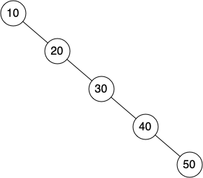

# 6.15. 搜索树分析

**6.15. Search Tree Analysis**

=== "中文"

    在完成了二叉搜索树的实现后，我们将对已实现的方法进行快速分析。首先来看一下 `put` 方法。其性能的限制因素是二叉树的高度。回顾词汇部分，树的高度是指根节点与最深叶节点之间的边的数量。高度是限制因素，因为在寻找将节点插入树中的适当位置时，我们在树的每一层最多只需进行一次比较。
    
    二叉树的高度可能是多少？这个问题的答案取决于键的添加顺序。如果键是以随机顺序添加的，那么树的高度大约是 $\log_2{n}$，其中 $n$ 是树中节点的数量。这是因为如果键是随机分布的，大约一半的键会小于根节点，另一半会大于根节点。记住，在二叉树中，根节点所在的层有一个节点，下一层有两个节点，再下一层有四个节点。任何特定层的节点数量是 $2^d$，其中 $d$ 是该层的深度。完全平衡的二叉树中的节点总数是 $2^{h+1}-1$，其中 $h$ 表示树的高度。
    
    完全平衡的树的左右子树中的节点数量相同。在平衡的二叉树中，`put` 方法的最坏情况性能是 $O(\log_2{n})$，其中 $n$ 是树中节点的数量。请注意，这与前一段的计算关系相反。因此，$\log_2{n}$ 给出了树的高度，并表示 `put` 在搜索合适的插入位置时需要进行的最大比较次数。
    
    不幸的是，通过以排序顺序插入键，可能会构造出一个高度为 $n$ 的搜索树！这种情况的一个示例见 `Figure 6`。在这种情况下，`put` 方法的性能是 $O(n)$。
    
    <figure markdown="span">
        
        <figcaption markdown="span">Figure 6: 一个倾斜的二叉搜索树会导致较差的性能</figcaption>
    </figure>
    
    现在你理解了 `put` 方法的性能受到树的高度限制，你可能也能猜到其他方法，如 `get`、`in` 和 `del` 也受到类似的限制。由于 `get` 方法在树中搜索键，最坏情况下需要搜索到树的底部才可能找到键。乍一看，`del` 可能看起来更复杂，因为它可能需要在完成删除操作之前寻找后继节点。但记住，寻找后继节点的最坏情况也是树的高度，这意味着你只是增加了工作量的倍数。由于倍数是一个常数因子，它不会改变不平衡树的 $O(n)$ 最坏情况分析。

=== "英文"

    With the implementation of a binary search tree now complete, we will do a quick analysis of the methods we have implemented. Let’s first look at the ``put`` method. The limiting factor on its performance is the height of the binary tree. Recall from the vocabulary section that the height of a tree is the number of edges between the root and the deepest leaf node. The height is the limiting factor because when we are searching for the appropriate place to insert a node into the tree, we will need to do at most one comparison at each level of the tree.
    
    What is the height of a binary tree likely to be? The answer to this question depends on how the keys are added to the tree. If the keys are added in a random order, the height of the tree is going to be around $\log_2{n}$ where $n$ is the number of nodes in the tree. This is because if the keys are randomly distributed, about half of them will be less than the root and about half will be greater than the root. Remember that in a binary tree there is one node at the root, two nodes in the next level, and four at the next. The number of nodes at any particular level is $2^d$ where $d$ is the depth of the level. The total number of nodes in a perfectly balanced binary tree is $2^{h+1}-1$, where $h$ represents the height of the tree.
    
    A perfectly balanced tree has the same number of nodes in the left subtree as the right subtree. In a balanced binary tree, the worst-case performance of ``put`` is $O(\log_2{n})$, where $n$ is the number of nodes in the tree. Notice that this is the inverse relationship to the calculation in the previous paragraph. So $\log_2{n}$ gives us the height of the tree and represents the maximum number of comparisons that ``put`` will need to do as it searches for the proper place to insert a new node.
    
    Unfortunately it is possible to construct a search tree that has height $n$ simply by inserting the keys in sorted order! An example of this is shown in `Figure 6`. In this case the performance of the ``put`` method is $O(n)$.
                                    
    <figure markdown="span">
        
        <figcaption markdown="span">Figure 6: A skewed binary search tree would give poor performance</figcaption>
    </figure>
    
    Now that you understand that the performance of the ``put`` method is limited by the height of the tree, you can probably guess that other methods, ``get``, ``in``, and ``del``, are limited as well. Since ``get`` searches the tree to find the key, in the worst case the tree is searched all the way to the bottom and no key is found. At first glance ``del`` might seem more complicated since it may need to search for the successor before the deletion operation can complete. But remember that the worst-case scenario to find the successor is also just the height of the tree which means that you would simply double the work. Since doubling is a constant factor, it does not change worst-case analysis of $O(n)$ for an unbalanced tree.