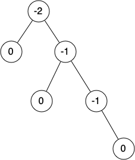

# 6.16. 平衡二叉搜索树

**6.16. Balanced Binary Search Trees**

=== "中文"

    在前一节中，我们讨论了如何构建一个二叉搜索树。正如我们所了解到的，当树变得不平衡时，二叉搜索树的操作性能可能会退化到 $O(n)$，例如 `get` 和 `put` 操作。在本节中，我们将介绍一种特殊的二叉搜索树，它可以自动确保树始终保持平衡。这种树称为 **AVL 树**，以其发明者 G.M. Adelson-Velskii 和 E.M. Landis 的名字命名。
    
    AVL 树像普通的二叉搜索树一样实现了 Map 抽象数据类型；唯一的区别在于树的性能。为了实现我们的 AVL 树，我们需要跟踪树中每个节点的 **平衡因子**。我们通过查看每个节点的左子树和右子树的高度来完成这一点。更正式地，我们将节点的平衡因子定义为左子树的高度与右子树的高度之间的差值。
    
    $balance\_factor = height(left\_subtree) - height(right\_subtree)$
    
    根据上述平衡因子的定义，我们说如果平衡因子大于零，则子树是左重的。如果平衡因子小于零，则子树是右重的。如果平衡因子为零，则树是完全平衡的。为了实现 AVL 树并获得平衡树的好处，我们将定义树为平衡的条件是平衡因子为 -1、0 或 1。一旦树中某个节点的平衡因子超出了这个范围，我们就需要有一个过程来将树恢复到平衡状态。`Figure 1` 显示了一个不平衡的右重树及每个节点的平衡因子。
    
    <figure markdown="span">
        
        <figcaption markdown="span">Figure 1: 一个不平衡的右重树及其平衡因子</figcaption>
    </figure>

=== "英文"

    In the previous section we looked at building a binary search tree. As we learned, the performance of the binary search tree can degrade to $O(n)$ for operations like ``get`` and ``put`` when the tree becomes unbalanced. In this section we will look at a special kind of binary search tree that automatically makes sure that the tree remains balanced at all times. This tree is called an **AVL tree** and is named for its inventors: G.M. Adelson-Velskii and E.M. Landis.
    
    An AVL tree implements the Map abstract data type just like a regular binary search tree; the only difference is in how the tree performs. To implement our AVL tree we need to keep track of a **balance factor** for each node in the tree. We do this by looking at the heights of the left and right subtrees for each node. More formally, we define the balance factor for a node as the difference between the height of the left subtree and the height of the right subtree.
    
    $balance\_factor = height(left\_subtree) - height(right\_subtree)$
    
    Using the definition for balance factor given above, we say that a subtree is left-heavy if the balance factor is greater than zero. If the balance factor is less than zero, then the subtree is right-heavy. If the balance factor is zero, then the tree is perfectly in balance. For purposes of implementing an AVL tree and gaining the benefit of having a balanced tree, we will define a tree to be in balance if the balance factor is -1, 0, or 1. Once the balance factor of a node in a tree is outside this range we will need to have a procedure to bring the tree back into balance. `Figure 1` shows an example of an unbalanced right-heavy tree and the balance factors of each node.
                                    
    <figure markdown="span">
        
        <figcaption markdown="span">Figure 1: An Unbalanced Right-Heavy Tree with Balance Factors</figcaption>
    </figure>  