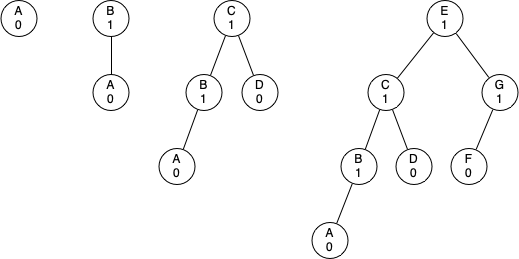

# 6.17. AVL树性能

**6.17. AVL Tree Performance**

=== "中文"

    在我们继续之前，让我们看看强制执行这个新平衡因子要求的结果。我们的观点是，通过确保树始终保持平衡因子在 -1、0 或 1 范围内，我们可以获得更好的 Big-O 性能。让我们首先考虑这种平衡条件如何改变最坏情况的树。我们需要考虑两种可能性：左重树和右重树。如果我们考虑高度为 0、1、2 和 3 的树，`Figure 2` 展示了在新规则下最不平衡的左重树。
    
    <figure markdown="span">
        
        <figcaption markdown="span">Figure 2: 最坏情况下的左重 AVL 树</figcaption>
    </figure>
    
    查看树中的节点总数，我们可以看到，对于高度为 0 的树，有 1 个节点；对于高度为 1 的树，有 $1 + 1 = 2$ 个节点；对于高度为 2 的树，有 $1 + 1 + 2 = 4$ 个节点；对于高度为 3 的树，有 $1 + 2 + 4 = 7$ 个节点。更一般地，对于高度为 $h$ 的树，节点数（$N_h$）的模式是：
    
    $N_h = 1 + N_{h-1} + N_{h-2}$
    
    这个递推公式可能对你来说很熟悉，因为它与斐波那契数列非常相似。我们可以利用这个事实推导出一个公式，用于根据树中节点的数量来计算 AVL 树的高度。回忆一下，对于斐波那契数列，第 $i$ 个斐波那契数由以下公式给出：
    
    $\begin{align} F_0 & = 0 \\ F_1 & = 1 \\ F_i & = F_{i-1} + F_{i-2}  \text{ for all } i \ge 2 \end{align}$
    
    一个重要的数学结果是，当斐波那契数变得越来越大时，$F_i / F_{i-1}$ 的比例越来越接近黄金比例 $\Phi$，其定义为 $\Phi = \frac{1 + \sqrt{5}}{2}$。如果你想查看前述方程的推导，可以参考数学教材。我们将简单地使用这个方程来近似 $F_i$ 为 $F_i = \Phi^i / \sqrt{5}$。如果我们利用这个近似值，可以将 $N_h$ 的方程重写为：
    
    $N_h = F_{h+3} - 1, h \ge 1$
    
    通过将斐波那契数列的引用替换为其黄金比例近似值，我们得到：
    
    $N_h = \frac{\Phi^{h+2}}{\sqrt{5}} - 1$
    
    如果我们重新排列项，对两边取对数，并解出 $h$，我们得到以下推导：
    
    $\begin{align}\log{N_h+1} &  = (h+2)\log{\Phi} - \frac{1}{2} \log{5} \\ h & = \frac{\log{(N_h+1)} - 2 \log{\Phi} + \frac{1}{2} \log{5}}{\log{\Phi}} \\ h &  = 1.44 \log{N_h}\end{align}$
    
    这个推导告诉我们，在任何时候，我们的 AVL 树的高度等于常数（1.44）乘以树中节点数量的对数。这对于搜索我们的 AVL 树是好消息，因为它将搜索限制在 $O(\log{n})$。

=== "英文"

    Before we proceed any further let's look at the result of enforcing this new balance factor requirement. Our claim is that by ensuring that a tree always has a balance factor of -1, 0, or 1 we can get better Big-O performance of key operations. Let us start by thinking about how this balance condition changes the worst-case tree. There are two possibilities to consider, a left-heavy tree and a right-heavy tree. If we consider trees of heights 0, 1, 2, and 3, `Figure 2` illustrates the most unbalanced left-heavy tree possible under the new rules.
                                        
    <figure markdown="span">
        
        <figcaption markdown="span">Figure 2: Worst-Case Left-Heavy AVL Trees</figcaption>
    </figure>     
    
    Looking at the total number of nodes in the tree we see that for a tree of height 0 there is 1 node, for a tree of height 1 there is $1 + 1 = 2$ nodes, for a tree of height 2 there are $1 + 1 + 2 = 4$, and for a tree of height 3 there are $1 + 2 + 4 = 7$. More generally the pattern we see for the number of nodes in a tree of height $h$ ($N_h$) is:
    
    $N_h = 1 + N_{h-1} + N_{h-2}$
    
    
    This recurrence may look familiar to you because it is very similar to the Fibonacci sequence. We can use this fact to derive a formula for the height of an AVL tree given the number of nodes in the tree. Recall that for the Fibonacci sequence the $i^{th}$ Fibonacci number is given by:
    
    $F_0 & = 0 \\ F_1 & = 1 \\ F_i & = F_{i-1} + F_{i-2}  \text{ for all } i \ge 2$
    
    
    An important mathematical result is that as the numbers of the Fibonacci sequence get larger and larger the ratio of $F_i / F_{i-1}$ becomes closer and closer to approximating the golden ratio $\Phi$ which is defined as $\Phi = \frac{1 + \sqrt{5}}{2}$. You can consult a math text if you want to see a derivation of the previous equation. We will simply use this equation to approximate $F_i$ as $F_i = \Phi^i/\sqrt{5}$. If we make use of this approximation we can rewrite the equation for $N_h$ as:
    
    $N_h = F_{h+3} - 1, h \ge 1$
    
    
    By replacing the Fibonacci reference with its golden ratio approximation
    we get: 
       
    $N_h = \frac{\Phi^{h+2}}{\sqrt{5}} - 1$
    
    If we rearrange the terms, take the base 2 log of both sides, and
    then solve for $h$, we get the following derivation:
    
    $\log{N_h+1} &  = (h+2)\log{\Phi} - \frac{1}{2} \log{5} \\ h & = \frac{\log{(N_h+1)} - 2 \log{\Phi} + \frac{1}{2} \log{5}}{\log{\Phi}} \\ h &  = 1.44 \log{N_h}$
    
    This derivation shows us that at any time the height of our AVL tree is equal to a constant (1.44) times the log of the number of nodes in the tree. This is great news for searching our AVL tree because it limits the search to $O(\log{n})$.