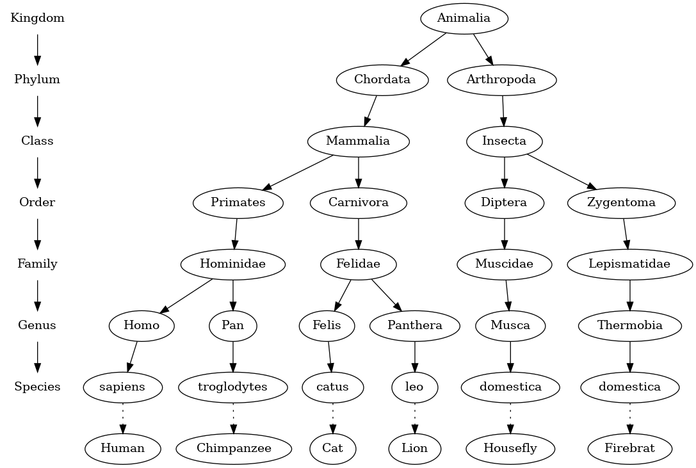
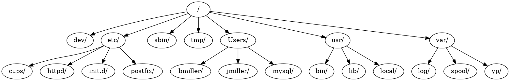

# 6.2. 树的示例

**6.2. Examples of Trees**

=== "中文"

    在学习了线性数据结构如栈和队列，并有了一些递归的经验之后，我们将研究一种常见的数据结构——**树**。树在计算机科学的许多领域中都有应用，包括操作系统、图形学、数据库系统和计算机网络。树数据结构与其植物学的亲戚有很多相似之处。树数据结构有一个根节点、分支和叶子。自然界中的树和计算机科学中的树的区别在于，树数据结构的根节点在顶部，叶子在底部。
    
    在开始研究树数据结构之前，让我们先看一些常见的例子。我们第一个例子是生物学中的分类树。`图 1` 显示了某些动物的生物学分类示例。通过这个简单的例子，我们可以了解树的一些属性。第一个属性是树是分层的。所谓分层，指的是树在结构上是分层的，较为一般的概念在顶部，较为具体的概念在底部。层次的顶端是界（kingdom），下一层是门（phylum），然后是纲（class），以此类推。然而，无论我们在分类树中深入到什么层次，所有的生物仍然是动物。
    
    <figure markdown="span">
        
        <figcaption markdown="span">图 1: 显示为树形结构的常见动物分类</figcaption>
    </figure>
    
    请注意，你可以从树的顶部开始，沿着圆圈和箭头组成的路径一直走到底。在树的每一层，我们可能会问自己一个问题，然后沿着与我们答案一致的路径走。例如，我们可能会问：“这只动物是脊索动物还是节肢动物？”如果答案是“脊索动物”，那么我们沿着这条路径继续，问：“这个脊索动物是哺乳动物吗？”如果不是，我们就停下来（但仅在这个简化的例子中）。当我们到达哺乳动物层时，我们问：“这个哺乳动物是灵长类动物还是食肉动物？”我们可以继续沿着路径走，直到到达树的最底部，即常见的名称。
    
    树的第二个属性是一个节点的所有子节点与另一个节点的子节点是独立的。例如，属 *Thermobia* 有一个子节点 *domestica*。属 *Musca* 也有一个名为 *domestica* 的子节点，但它是不同的节点，与 *Thermobia* 的 *domestica* 子节点是独立的。这意味着我们可以更改 *Musca* 的子节点，而不会影响 *Thermobia* 的 *domestica* 子节点。
    
    第三个属性是每个叶子节点是唯一的。我们可以指定一条从树根到叶子的路径，这条路径唯一地标识了动物界中的每一个物种，例如 Animalia $\rightarrow$ Chordata $\rightarrow$ Mammalia $\rightarrow$ Carnivora $\rightarrow$ Felidae $\rightarrow$ *Felis* $\rightarrow$ *catus*。
    
    另一个你可能每天都使用的树结构的例子是文件系统。在文件系统中，目录或文件夹被结构化为树形结构。`图 2` 显示了 Unix 文件系统层次结构的一小部分。
    
    <figure markdown="span">
        
        <figcaption markdown="span">图 2: Unix 文件系统层次结构的一小部分</figcaption>
    </figure>
    
    与生物分类树一样，文件系统树使你能够从根目录跟踪到任何目录。该路径将唯一标识该子目录（以及其中的所有文件）。树的另一个重要属性是，由于其分层性质，你可以将整个树的一部分（称为子树）移动到树中的不同位置，而不会影响层次结构的较低层级。例如，我们可以将以 /etc/ 开头的整个子树从根节点分离，然后重新附加到 /usr/ 下。这将把 httpd 的唯一路径从 /etc/httpd 更改为 /usr/etc/httpd，但不会影响 httpd 目录的内容或任何子目录。
    
    最后一个树的例子是网页。`图 3` 显示了一个简单的 HTML 网页代码；`图 3` 显示了与创建该页面的 HTML 标签对应的树形结构。
    
    ```html
    <html lang="en">
        <head>
            <meta charset="utf-8" />
            <title>simple</title>
        </head>
        <body>
            <h1>A simple web page</h1>
            <ul>
                <li>List item one</li>
                <li>List item two</li>
            </ul>
            <h2><a href="https://www.luther.edu">Luther College</a></h2>
        </body>
    </html>
    ```
    
    <figure markdown="span">
        
        <figcaption markdown="span">图 3: 与网页标记元素对应的树形结构</figcaption>
    </figure>
    
    HTML 源代码及其对应的树形结构展示了另一种层次结构。注意，树的每一层对应于 HTML 标签中的嵌套层次。源代码中的第一个标签是 ``<html>``，最后一个是 ``</html>``。所有其他的标签都在这对标签内。如果你检查，会发现这种嵌套属性在树的所有层级都成立。
    

=== "英文"

    Now that we have studied linear data structures like stacks and queues and have some experience with recursion, we will look at a common data structure called the **tree**. Trees are used in many areas of computer science, including operating systems, graphics, database systems, and computer networking. Tree data structures have many things in common with their botanical cousins. A tree data structure has a root, branches, and leaves. The difference between a tree in nature and a tree in computer science is that a tree data structure has its root at the top and its leaves on the bottom.
    
    Before we begin our study of tree data structures, let’s look at a few common examples. Our first example of a tree is a classification tree from biology. `Figure 1` shows an example of the biological classification of some animals. From this simple example, we can learn about several properties of trees. The first property this example demonstrates is that trees are hierarchical. By hierarchical, we mean that trees are structured in layers with the more general things near the top and the more specific things near the bottom. The top of the hierarchy is the kingdom, the next layer of the tree (the “children” of the layer above) is the phylum, then the class, and so on. However, no matter how deep we go in the classification tree, all the organisms are still animals.
            
    <figure markdown="span">
        
        <figcaption markdown="span">Figure 1: Taxonomy of Some Common Animals Shown as a Tree</figcaption>
    </figure>
    
    Notice that you can start at the top of the tree and follow a path made of circles and arrows all the way to the bottom. At each level of the tree we might ask ourselves a question and then follow the path that agrees with our answer. For example we might ask, “Is this animal a chordate or an arthropod?” If the answer is “chordate,” then we follow that path and ask, “Is this chordate a mammal?” If not, we are stuck (but only in this simplified example). When we are at the mammal level we ask, “Is this mammal a primate or a carnivore?” We can keep following paths until we get to the very bottom of the tree where we have the common name.
    
    A second property of trees is that all of the children of one node are independent of the children of another node. For example, the genus *Thermobia* has a children *domestica*. The genus *Musca* also has a child named *domestica*, but it is a different node and is independent of the *domestica* child of *Thermobia*. This means that we can change the node that is the child of *Musca* without affecting the child of *Thermobia*.
    
    A third property is that each leaf node is unique. We can specify a path from the root of the tree to a leaf that uniquely identifies each species in the animal kingdom, for example Animalia $\rightarrow$ Chordata $\rightarrow$ Mammalia $\rightarrow$ Carnivora $\rightarrow$ Felidae $\rightarrow$ *Felis* $\rightarrow$ *catus*.
    
    Another example of a tree structure that you probably use every day is a file system. In a file system, directories, or folders, are structured as a tree. `Figure 2 <fig_filetree>` illustrates a small part of a Unix file system hierarchy.
            
    <figure markdown="span">
        
        <figcaption markdown="span">Figure 2: A Small Part of the Unix File System Hierarchy</figcaption>
    </figure>
       
    
    Like the biological classification tree, the file system tree enables you to follow a path from the root to any directory. That path will  uniquely identify that subdirectory (and all the files in it). Another important property of trees, derived from their hierarchical nature, is that you can move entire sections of a tree (called a subtree) to a different position in the tree without affecting the lower levels of the hierarchy. For example, we could take the entire subtree staring with /etc/, detach etc/ from the root and reattach it under usr/. This would change the unique pathname to httpd from /etc/httpd to /usr/etc/httpd, but would not affect the contents or any children of the httpd directory.
    
    A final example of a tree is a web page. The code that precedes `Figure 3` is an example of a simple web page using HTML; `Figure 3` shows the tree  that corresponds to each of the HTML tags used to create the page.
    
    ```html
    <html lang="en">
        <head>
            <meta charset=utf-8" />
            <title>simple</title>
        </head>
        <body>
            <h1>A simple web page</h1>
            <ul>
                <li>List item one</li>
                <li>List item two</li>
            </ul>
            <h2><a href="https://www.luther.edu">Luther College</a><h2>
        </body>
    </html>
    ```
            
    <figure markdown="span">
        
        <figcaption markdown="span">Figure 3: A Tree Corresponding to the Markup Elements of a Web Page</figcaption>
    </figure>
    
    The HTML source code and the tree accompanying the source illustrate another hierarchy. Notice that each level of the tree corresponds to a level of nesting inside the HTML tags. The first tag in the source is ``<html>`` and the last is ``</html>``. All the rest of the tags in the page are inside the pair. If you check, you will see that this nesting property is true at all levels of the tree.
    
