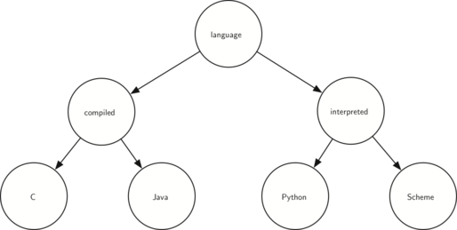

# 6.22. 练习

**6.22. Exercises**

=== "中文"
    
    1. **绘制以下树函数调用产生的树结构：**
    
        ```pycon
        >>> r = BinaryTree(3)
        >>> insert_left(r, 4)
        [3, [4, [], []], []]
        >>> insert_left(r, 5)
        [3, [5, [4, [], []], []], []]
        >>> insert_right(r, 6)
        [3, [5, [4, [], []], []], [6, [], []]]
        >>> insert_right(r, 7)
        [3, [5, [4, [], []], []], [7, [], [6, [], []]]]
        >>> set_root_val(r, 9)
        >>> insert_left(r, 11)
        [9, [11, [5, [4, [], []], []], []], [7, [], [6, [], []]]]
        ```
    
    2. **追踪创建表达式树的算法，表达式为 :math:`(4 * 8) / 6 - 3`。**
    
    3. **考虑以下整数列表：[1, 2, 3, 4, 5, 6, 7, 8, 9, 10]。展示插入这些整数后的二叉搜索树。**
    
    4. **考虑以下整数列表：[10, 9, 8, 7, 6, 5, 4, 3, 2, 1]。展示插入这些整数后的二叉搜索树。**
    
    5. **生成一个随机整数列表。展示插入这些整数后的二叉堆树。**
    
    6. **使用上一个问题中的列表，展示使用该列表作为 ``heapify`` 方法参数后得到的二叉堆树。展示树的形式和列表形式。**
    
    7. **绘制以下键按给定顺序插入后的二叉搜索树：68, 88, 61, 89, 94, 50, 4, 76, 66 和 82。**
    
    8. **生成一个随机整数列表。绘制插入这些整数后的二叉搜索树。**
    
    9. **考虑以下整数列表：[1, 2, 3, 4, 5, 6, 7, 8, 9, 10]。展示插入这些整数后的二叉堆。**
    
    10. **考虑以下整数列表：[10, 9, 8, 7, 6, 5, 4, 3, 2, 1]。展示插入这些整数后的二叉堆。**
    
    11. **考虑我们用于实现二叉树遍历的两种不同技术。为什么在将 ``preorder`` 实现为方法时必须在调用之前进行检查，而当将其实现为函数时可以在调用内部进行检查？**
    
    12. **展示构建以下二叉树所需的函数调用。**
    
        <figure markdown="span">
            
        </figure>
    
    13. **给定以下树，执行适当的旋转操作使其恢复平衡。**
    
        <figure markdown="span">
            
        </figure>
    
    14. **使用以下内容作为起点，推导出节点 D 更新后的平衡因子的方程。**
    
        <figure markdown="span">
            
        </figure>
    
    15. **扩展 ``build_parse_tree`` 函数以处理数学表达式中没有每个字符之间的空格的情况。**
    
    16. **修改 ``build_parse_tree`` 和 ``evaluate`` 函数以处理布尔语句（``and``, ``or`` 和 ``not``）。请记住，``not`` 是一个一元操作符，因此这会使您的代码变得复杂一些。**
    
    17. **使用 ``find_successor`` 方法，编写一个非递归的二叉搜索树中序遍历。**
    
    18. **一个 *线程化* 二叉树为每个节点维护到其后继的引用。修改二叉搜索树的代码以使其成为线程化的，然后为线程化的二叉搜索树编写一个非递归的中序遍历方法。**
    
    19. **修改我们对二叉搜索树的实现，以正确处理重复的键。也就是说，如果树中已经存在一个键，那么新的负载应该替换旧的负载，而不是添加另一个具有相同键的节点。**
    
    20. **创建一个具有有限堆大小的二叉堆。换句话说，堆只跟踪最重要的 :math:`n` 项。如果堆的大小增长到超过 :math:`n` 项，则最不重要的项将被丢弃。**
    
    21. **清理 ``print_exp`` 函数，以便它不再在每个数字周围包含额外的一对括号。**
    
    22. **使用 ``heapify`` 方法，编写一个排序函数，该函数可以在 :math:`O(n\log{n})` 时间内对列表进行排序。**
    
    23. **编写一个函数，该函数接受一个数学表达式的解析树，并计算该表达式相对于某个变量的导数。**
    
    24. **实现一个作为最大堆的二叉堆。**
    
    25. **使用 ``BinaryHeap`` 类，实现一个名为 ``PriorityQueue`` 的新类。您的 ``PriorityQueue`` 类应实现构造函数以及 ``enqueue`` 和 ``dequeue`` 方法。**
    
    26. **为 AVL 树实现 ``delete`` 方法。**

=== "英文"

    1. Draw the tree structure resulting from the following set of tree function calls:

        ```pycon
        >>> r = BinaryTree(3)
        >>> insert_left(r, 4)
        [3, [4, [], []], []]
        >>> insert_left(r, 5)
        [3, [5, [4, [], []], []], []]
        >>> insert_right(r, 6)
        [3, [5, [4, [], []], []], [6, [], []]]
        >>> insert_right(r, 7)
        [3, [5, [4, [], []], []], [7, [], [6, [], []]]]
        >>> set_root_val(r, 9)
        >>> insert_left(r, 11)
        [9, [11, [5, [4, [], []], []], []], [7, [], [6, [], []]]]
        ```	      

    2. Trace the algorithm for creating an expression tree for the expression :math:`(4 * 8) / 6 - 3`.
    3. Consider the following list of integers: [1, 2, 3, 4, 5, 6, 7, 8, 9, 10]. Show the binary search tree resulting from inserting the integers in the list.
    4. Consider the following list of integers: [10, 9, 8, 7, 6, 5, 4, 3, 2, 1]. Show the binary search tree resulting from inserting the integers in the list.
    5. Generate a random list of integers. Show the binary heap tree resulting from inserting the integers on the list one at a time.
    6. Using the list from the previous question, show the binary heap tree resulting from using the list as a parameter to the ``heapify`` method. Show both the tree and list form.
    7. Draw the binary search tree that results from inserting the following keys in the order given: 68, 88, 61, 89, 94, 50, 4, 76, 66, and 82.
    8. Generate a random list of integers. Draw the binary search tree resulting from inserting the integers on the list.
    9. Consider the following list of integers: [1, 2, 3, 4, 5, 6, 7, 8, 9, 10]. Show the binary heap resulting from inserting the integers one at a time.
    10. Consider the following list of integers: [10, 9, 8, 7, 6, 5, 4, 3, 2, 1]. Show the binary heap resulting from inserting the integers one at a time.
    11. Consider the two different techniques we used for implementing traversals of a binary tree. Why must we check before the call to ``preorder`` when implementing it as a method, whereas we could check inside the call when implementing it as a function?

    12. Show the function calls needed to build the following binary tree.
                                        
        <figure markdown="span">
            
        </figure>  

    13. Given the following tree, perform the appropriate rotations to bring it back into balance.
                                        
        <figure markdown="span">
            
        </figure>  

    14. Using the following as a starting point, derive the equation that gives the updated balance factor for node D.
                                        
        <figure markdown="span">
            
        </figure>  

    15. Extend the ``build_parse_tree`` function to handle mathematical expressions that do not have spaces between every character.
    16. Modify the ``build_parse_tree`` and ``evaluate`` functions to handle Boolean statements (``and``, ``or``, and ``not``). Remember that ``not`` is a unary operator, so this will complicate your code somewhat.
    17. Using the ``find_successor`` method, write a non-recursive inorder traversal for a binary search tree.
    18. A *threaded* binary tree maintains a reference from each node to its successor. Modify the code for a binary search tree to make it threaded, then write a non-recursive inorder traversal method for the threaded binary search tree.
    19. Modify our implementation of the binary search tree so that it handles duplicate keys properly. That is, if a key is already in the tree then the new payload should replace the old rather than add another node with the same key.
    20. Create a binary heap with a limited heap size. In other words, the heap only keeps track of the :math:`n` most important items. If the heap grows in size to more than :math:`n` items the least important item is dropped.
    21. Clean up the ``print_exp`` function so that it does not include an extra set of parentheses around each number.
    22. Using the ``heapify`` method, write a sorting function that cansort a list in :math:`O(n\log{n})` time.
    23. Write a function that takes a parse tree for a mathematical expression and calculates the derivative of the expression with respect to some variable.
    24. Implement a binary heap as a max heap.
    25. Using the ``BinaryHeap`` class, implement a new class called ``PriorityQueue``. Your ``PriorityQueue`` class should implement the constructor plus the ``enqueue`` and ``dequeue`` methods.
    26. Implement the ``delete`` method for an AVL tree.