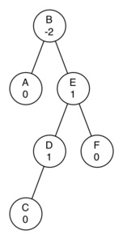

# 6.22. 练习

**6.22. Exercises**

=== "中文"

    1. Draw the tree structure resulting from the following set of tree function calls:

        ```pycon
        >>> r = BinaryTree(3)
        >>> insert_left(r, 4)
        [3, [4, [], []], []]
        >>> insert_left(r, 5)
        [3, [5, [4, [], []], []], []]
        >>> insert_right(r, 6)
        [3, [5, [4, [], []], []], [6, [], []]]
        >>> insert_right(r, 7)
        [3, [5, [4, [], []], []], [7, [], [6, [], []]]]
        >>> set_root_val(r, 9)
        >>> insert_left(r, 11)
        [9, [11, [5, [4, [], []], []], []], [7, [], [6, [], []]]]
        ```	      

    2. Trace the algorithm for creating an expression tree for the expression :math:`(4 * 8) / 6 - 3`.
    3. Consider the following list of integers: [1, 2, 3, 4, 5, 6, 7, 8, 9, 10]. Show the binary search tree resulting from inserting the integers in the list.
    4. Consider the following list of integers: [10, 9, 8, 7, 6, 5, 4, 3, 2, 1]. Show the binary search tree resulting from inserting the integers in the list.
    5. Generate a random list of integers. Show the binary heap tree resulting from inserting the integers on the list one at a time.
    6. Using the list from the previous question, show the binary heap tree resulting from using the list as a parameter to the ``heapify`` method. Show both the tree and list form.
    7. Draw the binary search tree that results from inserting the following keys in the order given: 68, 88, 61, 89, 94, 50, 4, 76, 66, and 82.
    8. Generate a random list of integers. Draw the binary search tree resulting from inserting the integers on the list.
    9. Consider the following list of integers: [1, 2, 3, 4, 5, 6, 7, 8, 9, 10]. Show the binary heap resulting from inserting the integers one at a time.
    10. Consider the following list of integers: [10, 9, 8, 7, 6, 5, 4, 3, 2, 1]. Show the binary heap resulting from inserting the integers one at a time.
    11. Consider the two different techniques we used for implementing traversals of a binary tree. Why must we check before the call to ``preorder`` when implementing it as a method, whereas we could check inside the call when implementing it as a function?

    12. Show the function calls needed to build the following binary tree.
                                        
        <figure markdown="span">
            
        </figure>  

    13. Given the following tree, perform the appropriate rotations to bring it back into balance.
                                        
        <figure markdown="span">
            
        </figure>  

    14. Using the following as a starting point, derive the equation that gives the updated balance factor for node D.
                                        
        <figure markdown="span">
            
        </figure>  

    15. Extend the ``build_parse_tree`` function to handle mathematical expressions that do not have spaces between every character.
    16. Modify the ``build_parse_tree`` and ``evaluate`` functions to handle Boolean statements (``and``, ``or``, and ``not``). Remember that ``not`` is a unary operator, so this will complicate your code somewhat.
    17. Using the ``find_successor`` method, write a non-recursive inorder traversal for a binary search tree.
    18. A *threaded* binary tree maintains a reference from each node to its successor. Modify the code for a binary search tree to make it threaded, then write a non-recursive inorder traversal method for the threaded binary search tree.
    19. Modify our implementation of the binary search tree so that it handles duplicate keys properly. That is, if a key is already in the tree then the new payload should replace the old rather than add another node with the same key.
    20. Create a binary heap with a limited heap size. In other words, the heap only keeps track of the :math:`n` most important items. If the heap grows in size to more than :math:`n` items the least important item is dropped.
    21. Clean up the ``print_exp`` function so that it does not include an extra set of parentheses around each number.
    22. Using the ``heapify`` method, write a sorting function that cansort a list in :math:`O(n\log{n})` time.
    23. Write a function that takes a parse tree for a mathematical expression and calculates the derivative of the expression with respect to some variable.
    24. Implement a binary heap as a max heap.
    25. Using the ``BinaryHeap`` class, implement a new class called ``PriorityQueue``. Your ``PriorityQueue`` class should implement the constructor plus the ``enqueue`` and ``dequeue`` methods.
    26. Implement the ``delete`` method for an AVL tree.

=== "英文"

    1. Draw the tree structure resulting from the following set of tree function calls:

        ```pycon
        >>> r = BinaryTree(3)
        >>> insert_left(r, 4)
        [3, [4, [], []], []]
        >>> insert_left(r, 5)
        [3, [5, [4, [], []], []], []]
        >>> insert_right(r, 6)
        [3, [5, [4, [], []], []], [6, [], []]]
        >>> insert_right(r, 7)
        [3, [5, [4, [], []], []], [7, [], [6, [], []]]]
        >>> set_root_val(r, 9)
        >>> insert_left(r, 11)
        [9, [11, [5, [4, [], []], []], []], [7, [], [6, [], []]]]
        ```	      

    2. Trace the algorithm for creating an expression tree for the expression :math:`(4 * 8) / 6 - 3`.
    3. Consider the following list of integers: [1, 2, 3, 4, 5, 6, 7, 8, 9, 10]. Show the binary search tree resulting from inserting the integers in the list.
    4. Consider the following list of integers: [10, 9, 8, 7, 6, 5, 4, 3, 2, 1]. Show the binary search tree resulting from inserting the integers in the list.
    5. Generate a random list of integers. Show the binary heap tree resulting from inserting the integers on the list one at a time.
    6. Using the list from the previous question, show the binary heap tree resulting from using the list as a parameter to the ``heapify`` method. Show both the tree and list form.
    7. Draw the binary search tree that results from inserting the following keys in the order given: 68, 88, 61, 89, 94, 50, 4, 76, 66, and 82.
    8. Generate a random list of integers. Draw the binary search tree resulting from inserting the integers on the list.
    9. Consider the following list of integers: [1, 2, 3, 4, 5, 6, 7, 8, 9, 10]. Show the binary heap resulting from inserting the integers one at a time.
    10. Consider the following list of integers: [10, 9, 8, 7, 6, 5, 4, 3, 2, 1]. Show the binary heap resulting from inserting the integers one at a time.
    11. Consider the two different techniques we used for implementing traversals of a binary tree. Why must we check before the call to ``preorder`` when implementing it as a method, whereas we could check inside the call when implementing it as a function?

    12. Show the function calls needed to build the following binary tree.
                                        
        <figure markdown="span">
            
        </figure>  

    13. Given the following tree, perform the appropriate rotations to bring it back into balance.
                                        
        <figure markdown="span">
            
        </figure>  

    14. Using the following as a starting point, derive the equation that gives the updated balance factor for node D.
                                        
        <figure markdown="span">
            
        </figure>  

    15. Extend the ``build_parse_tree`` function to handle mathematical expressions that do not have spaces between every character.
    16. Modify the ``build_parse_tree`` and ``evaluate`` functions to handle Boolean statements (``and``, ``or``, and ``not``). Remember that ``not`` is a unary operator, so this will complicate your code somewhat.
    17. Using the ``find_successor`` method, write a non-recursive inorder traversal for a binary search tree.
    18. A *threaded* binary tree maintains a reference from each node to its successor. Modify the code for a binary search tree to make it threaded, then write a non-recursive inorder traversal method for the threaded binary search tree.
    19. Modify our implementation of the binary search tree so that it handles duplicate keys properly. That is, if a key is already in the tree then the new payload should replace the old rather than add another node with the same key.
    20. Create a binary heap with a limited heap size. In other words, the heap only keeps track of the :math:`n` most important items. If the heap grows in size to more than :math:`n` items the least important item is dropped.
    21. Clean up the ``print_exp`` function so that it does not include an extra set of parentheses around each number.
    22. Using the ``heapify`` method, write a sorting function that cansort a list in :math:`O(n\log{n})` time.
    23. Write a function that takes a parse tree for a mathematical expression and calculates the derivative of the expression with respect to some variable.
    24. Implement a binary heap as a max heap.
    25. Using the ``BinaryHeap`` class, implement a new class called ``PriorityQueue``. Your ``PriorityQueue`` class should implement the constructor plus the ``enqueue`` and ``dequeue`` methods.
    26. Implement the ``delete`` method for an AVL tree.