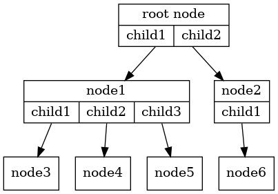
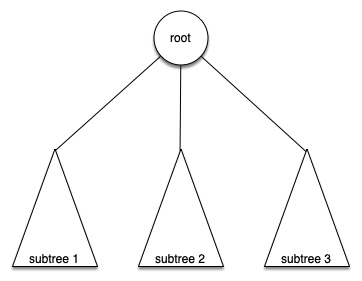

# 6.3. 词汇和定义

**6.3. Vocabulary and Definitions**

=== "中文"

    现在我们已经看过树的例子，接下来我们将正式定义树及其组成部分。
    
    - **节点**：**节点**是树的基本部分。它可以有一个名称，我们称之为*键*。节点还可以有附加信息。我们称这些附加信息为*值*或*有效负载*。虽然有效负载信息对许多树算法并不是核心的，但在使用树的应用程序中，它通常是至关重要的。
    
    - **边**：**边**是树的另一个基本部分。边连接两个节点，表示它们之间存在关系。每个节点（根节点除外）由一个来自另一个节点的入边连接。每个节点可能有多个出边。
    
    - **根**：树的**根**是树中唯一一个没有入边的节点。在`图 2`中，根节点是 /。
    
    - **路径**：**路径**是由边连接的节点的有序列表，例如，
      Mammalia $\rightarrow$ Carnivora $\rightarrow$ Felidae $\rightarrow$ *Felis* $\rightarrow$ *catus*
      是一条路径。
    
    - **子节点**：从同一个节点有入边的节点集合被称为该节点的**子节点**。在`图 2`中，节点 log/、spool/ 和 yp/ 是节点 var/ 的子节点。
    
    - **父节点**：一个节点是所有与它通过出边连接的节点的**父节点**。在`图 2`中，节点 var/ 是节点 log/、spool/ 和 yp/ 的父节点。
    
    - **兄弟节点**：树中同一个父节点的子节点被称为**兄弟节点**。在`图 2`中，节点 etc/ 和 usr/ 是文件系统树中的兄弟节点。
    
    - **子树**：**子树**是由一个父节点及其所有后代节点和边组成的节点和边的集合。
    
    - **叶子节点**：**叶子节点**是没有子节点的节点。例如，人类和黑猩猩在`图 1`中是叶子节点。
    
    - **层级**：节点 $n$ 的**层级**是从根节点到 $n$ 的路径上边的数量。例如，`图 1` 中 Felis 节点的层级是五。根据定义，根节点的层级为零。
    
    - **高度**：树的**高度**等于树中任何节点的最大层级。在`图 2`中，树的高度为二。
    
    定义了基本词汇后，我们可以继续对树进行正式的定义。实际上，我们将提供两个定义。第一个定义涉及节点和边。第二个定义将非常有用，是一个递归定义。
    
    **定义一**：树由一组节点和一组连接节点对的边组成。树具有以下属性：
    
    - 树中的一个节点被指定为根节点。
    - 每个节点 $n$（根节点除外）由来自一个其他节点 $p$ 的边连接，其中 $p$ 是 $n$ 的父节点。
    - 从根节点到每个节点都有一条唯一的路径。
    - 如果树中的每个节点最多有两个子节点，则我们称该树为**二叉树**。
    
    `图 3` 说明了符合定义一的树。边上的箭头指示连接的方向。
    
    <figure markdown="span">
       
       <figcaption markdown="span">图 3: 由一组节点和边组成的树</figcaption>
    </figure>
    
    **定义二**：树要么为空，要么由一个根节点和零个或多个子树组成，每个子树也是一棵树。每个子树的根节点通过一条边连接到父树的根节点。`图 4` 说明了这种树的递归定义。使用递归定义，我们知道 `图 4` 中的树至少有四个节点，因为每个表示子树的三角形都必须有一个根节点。它可能还有更多节点，但我们不能确定，除非我们深入查看树的内部。
    
    <figure markdown="span">
       
       <figcaption markdown="span">图 4: 树的递归定义</figcaption>
    </figure>
    
       

=== "英文"

    Now that we have looked at examples of trees, we will formally define a tree and its components.
    
    Node
       : A **node** is a fundamental part of a tree. It can have a name, which we call the *key*. A node may also have additional information. We call this additional information the *value* or *payload*. While the payload information is not central to many tree algorithms, it is often critical in applications that make use of trees.
    
    Edge
       : An **edge** is another fundamental part of a tree. An edge connects two
        nodes to show that there is a relationship between them. Every node
        (except the root) is connected by exactly one incoming edge from
        another node. Each node may have several outgoing edges.
    
    Root
       : The **root** of the tree is the only node in the tree that has no
        incoming edges. In `Figure 2`, / is the root of the tree.
    
    Path
       : A **path** is an ordered list of nodes that are connected by edges, for
        example,
        Mammalia $\rightarrow$ Carnivora $\rightarrow$ Felidae $\rightarrow$ *Felis* $\rightarrow$ *catus*
        is a path.
    
    Children
       : The set of nodes that have incoming edges from the same
        node are said to be the **children** of that node. In `Figure 2`,
        nodes log/, spool/, and yp/ are the children of node var/.
    
    Parent
       : A node is the **parent** of all the nodes it connects to with outgoing edges. In `Figure 2` the node var/ is the parent of nodes log/, spool/, and yp/.
    
    Sibling
       : Nodes in the tree that are children of the same parent are said to be **siblings**. The nodes etc/ and usr/ are siblings in the file system tree shown in `Figure 2`.
    
    Subtree
       : A **subtree** is a set of nodes and edges comprised of a parent and allthe descendants of that parent.
    
    Leaf Node
       : 
        A **leaf node** is a node that has no children. For example, Human and
        Chimpanzee are leaf nodes in `Figure 1`.
    
    Level
       : The **level** of a node $n$ is the number of edges on the path from the root node to $n$. For example, the level of the Felis node in `Figure 1` is five. By definition, the level of the root node is zero.
    
    Height
       : The **height** of a tree is equal to the maximum level of any node in the tree. The height of the tree in `Figure 2$ is two.
    
    With the basic vocabulary now defined, we can move on to a formal definition of a tree. In fact, we will provide two definitions of a tree. One definition involves nodes and edges. The second definition, which will prove to be very useful, is a recursive definition.
    
    *Definition One:* A tree consists of a set of nodes and a set of edges that connect pairs of nodes. A tree has the following properties:
    
    -  One node of the tree is designated as the root node.
    -  Every node $n$, except the root node, is connected by an edge from exactly one other node $p$, where $p$ is the parent of $n$.
    -  A unique path traverses from the root to each node.
    -  If each node in the tree has a maximum of two children, we say that the tree is a **binary tree**.
    
    `Figure 3` illustrates a tree that fits definition one. The arrowheads on the edges indicate the direction of the connection.
                
    <figure markdown="span">
        
        <figcaption markdown="span">Figure 3: A Tree Consisting of a Set of Nodes and Edges</figcaption>
    </figure>
    
    *Definition Two:* A tree is either empty or consists of a root and zero or more subtrees, each of which is also a tree. The root of each subtree is connected to the root of the parent tree by an edge. `Figure 4` illustrates this recursive definition of a tree. Using the recursive definition of a tree, we know that the tree in `Figure 4` has at least four nodes since each of the triangles representing a subtree must have a root. It may have many more nodes than that, but we do not know unless we look deeper into the tree.
                
    <figure markdown="span">
        
        <figcaption markdown="span">Figure 4: A Recursive Definition of a Tree</figcaption>
    </figure>
    
       