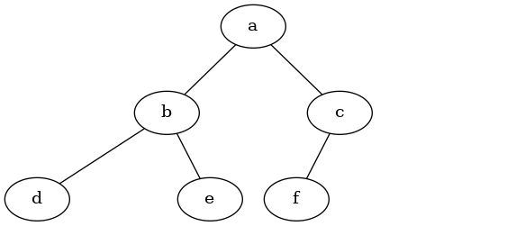

# 6.5. 列表表示法

**6.5. List of Lists Representation**

=== "中文"

    在用列表的列表表示树时，我们将从 Python 的列表数据结构开始，并编写上述定义的函数。虽然将接口编写为对列表的操作有点不同于我们实现的其他抽象数据类型，但这样做很有趣，因为它为我们提供了一个简单的递归数据结构，我们可以直接查看和研究。在列表的列表树中，我们将把根节点的值存储为列表的第一个元素。列表的第二个元素将是一个表示左子树的列表。列表的第三个元素将是另一个表示右子树的列表。为了说明这种存储技术，让我们看一个例子。`图 1` 显示了一个简单的树及其对应的列表实现。
    
    ```python
    my_tree = [
        "a",  # 根节点
            ["b",  # 左子树
                ["d", [], []],
                ["e", [], []]
            ],
            ["c",  # 右子树
                ["f", [], []], 
                []
            ],
        ]
    ```
    
    注意，我们可以使用标准列表索引访问子树。树的根是 ``my_tree[0]``，根的左子树是 ``my_tree[1]``，右子树是 ``my_tree[2]``。`ActiveCode 1` 演示了如何使用列表创建一个简单的树。一旦树被构造，我们可以访问根节点以及左子树和右子树。这个列表的列表方法的一个非常好的特性是，表示子树的列表结构符合树的定义；结构本身是递归的！一个具有根值和两个空列表的子树是一个叶子节点。列表的列表方法的另一个好处是，它可以推广到具有多个子树的树。在树不是二叉树的情况下，另一个子树只是另一个列表。
    
    ```python title="Activity: 6.5.1 使用索引访问子树" linenums="1"
    my_tree = ["a", ["b", ["d", [], []], ["e", [], []]], ["c", ["f", [], []], []]]
    print(my_tree)
    print("左子树 = ", my_tree[1])
    print("根节点 = ", my_tree[0])
    print("右子树 = ", my_tree[2])
    ```
    
    让我们通过提供一些函数来正式化树数据结构的定义，这些函数使我们能够方便地将列表用作树。请注意，我们不会定义一个二叉树类。我们编写的函数只是帮助我们将标准列表作为树进行操作。
    
    ```python
    def make_binary_tree(root):
        return [root, [], []]
    ```
    
    ``make_binary_tree`` 函数只是构造一个具有根节点和两个空子列表的列表。为了向树的根节点添加左子树，我们需要将一个新列表插入到根列表的第二个位置。然而，我们必须小心。如果列表中已经在第二个位置有东西，我们需要跟踪它，并将其作为我们正在添加的列表的左子节点推下树。`Listing 1` 显示了插入左子节点的 Python 代码。
    
    ```python title="**Listing 1**"
    def insert_left(root, new_child):
        old_child = root.pop(1)
        if len(old_child) > 1:
            root.insert(1, [new_child, old_child, []])
        else:
            root.insert(1, [new_child, [], []])
        return root
    ```
    
    注意，为了插入左子节点，我们首先获取对应于当前左子节点的（可能为空的）列表。然后我们添加新的左子节点，将旧的左子节点安装为新节点的左子节点。这允许我们将新节点拼接到树中的任何位置。``insert_right`` 的代码与 ``insert_left`` 类似，如 `Listing 2` 所示。
    
    ```python title="**Listing 2**"
    def insert_right(root, new_child):
        old_child = root.pop(2)
        if len(old_child) > 1:
            root.insert(2, [new_child, [], old_child])
        else:
            root.insert(2, [new_child, [], []])
        return root
    ```
    
    为了完成这组创建树的函数，让我们编写几个访问函数，用于获取和设置根值，以及获取左子树或右子树。这些函数可以在 `Listing 3` 中看到。
    
    ```python title="**Listing 3**"
    def get_root_val(root):
        return root[0]
    
    
    def set_root_val(root, new_value):
        root[0] = new_value
    
    
    def get_left_child(root):
        return root[1]
    
    
    def get_right_child(root):
        return root[2]
    ```
    
    `ActiveCode 2` 使用了我们刚刚编写的树函数。你应该亲自试一下。章节末尾的一个练习要求你绘制这组调用所产生的树结构。
    
    ```python title="Activity: 6.5.2 一个 Python 会话来演示基本树函数" linenums="1"
    def make_binary_tree(root):
        return [root, [], []]
    
    
    def insert_left(root, new_child):
        old_child = root.pop(1)
        if len(old_child) > 1:
            root.insert(1, [new_child, old_child, []])
        else:
            root.insert(1, [new_child, [], []])
        return root
    
    
    def insert_right(root, new_child):
        old_child = root.pop(2)
        if len(old_child) > 1:
            root.insert(2, [new_child, [], old_child])
        else:
            root.insert(2, [new_child, [], []])
        return root
    
    
    def get_root_val(root):
        return root[0]
    
    
    def set_root_val(root, new_value):
        root[0] = new_value
    
    
    def get_left_child(root):
        return root[1]
    
    
    def get_right_child(root):
        return root[2]
    
    
    a_tree = make_binary_tree(3)
    insert_left(a_tree, 4)
    insert_left(a_tree, 5)
    insert_right(a_tree, 6)
    insert_right(a_tree, 7)
    left_child = get_left_child(a_tree)
    print(left_child)
    
    set_root_val(left_child, 9)
    print(a_tree)
    insert_left(left_child, 11)
    print(a_tree)
    print(get_right_child(get_right_child(a_tree)))
    ```
    
    !!! info "自我检查"
    
        === "mctree_1"
        
            给定以下语句：
        
            ```python
            x = make_binary_tree("a")
            insert_left(x, "b")
            insert_right(x, "c")
            insert_right(get_right_child(x), "d")
            insert_left(get_right_child(get_right_child(x)), "e")
            ``` 
        
            下面哪个答案是正确的树表示？
            
            选项 a: ["a", ["b", [], []], ["c", [], ["d", [], []]]]
            选项 b: ["a", ["c", [], ["d", ["e", [], []], []]], ["b", [], []]]
            选项 c: ["a", ["b", [], []], ["c", [], ["d", ["e", [], []], []]]]
            选项 d: ["a", ["b", [], ["d", ["e", [], []], []]], ["c", [], []]]
    
            正确答案: c
    
            反馈 a: 不完全正确，这棵树缺少 "e" 节点。
            反馈 b: 这很接近，但仔细看看，你会发现根的左子节点和右子节点被交换了。
            反馈 c: 很好
            反馈 d: 这很接近，但左右子节点名称和底层结构被交换了。
    
        === "mctree_2"
    
            编写一个 ``build_tree`` 函数，该函数使用列表的列表函数返回如下树：
                    
            <figure markdown="span">
                
            </figure>
        
        
            ???- 提示 "提示"
    
                ```python
                from test import testEqual
                
                def build_tree():
                    pass
                    
                ttree = build_tree()
                testEqual(get_root_val(get_right_child(ttree)), "c")
                testEqual(get_root_val(get_right_child(get_left_child(ttree))), "d")      
                testEqual(get_root_val(get_right_child(get_right_child(ttree))), "f")            
                ```
    

=== "英文"

    In a tree represented by a list of lists, we will begin with Python’s list data structure and write the functions defined above. Although writing the interface as a set of operations on a list is a bit different from the other abstract data types we have implemented, it is interesting to do so because it provides us with a simple recursive data structure that we can look at and examine directly. In a list of lists tree, we will store the value of the root node as the first element of the list. The second element of the list will itself be a list that represents the left subtree. The third element of the list will be another list that represents the right subtree. To illustrate this storage technique, let’s look at an example. `Figure 1` shows a simple tree and the corresponding list implementation.
                
    <figure markdown="span">
        
        <figcaption markdown="span">Figure 1: A Small Tree</figcaption>
    </figure>
    
    ```python
    my_tree = [
        "a",  # root
            ["b",  # left subtree
                ["d", [], []],
                ["e", [], []]
            ],
            ["c",  # right subtree
                ["f", [], []], 
                []
            ],
        ]
    ```
    
    
    Notice that we can access subtrees of the list using standard list indexing. The root of the tree is ``my_tree[0]``, the left subtree of the root is ``my_tree[1]``, and the right subtree is ``my_tree[2]``. `ActiveCode 1` illustrates creating a simple tree using a list. Once the tree is constructed, we can access the root and the left and right subtrees. One very nice property of this list of lists approach is that the structure of a list representing a subtree adheres to the structure defined for a tree; the structure itself is recursive! A subtree that has a root value and two empty lists is a leaf node. Another nice feature of the list of lists approach is that it generalizes to a tree that has many subtrees. In the case where the tree is more than a binary tree, another subtree is just another list.
    
    ```python title="Activity: 6.5.1 Using Indexing to Access Subtrees" linenums="1"
    my_tree = ["a", ["b", ["d", [], []], ["e", [], []]], ["c", ["f", [], []], []]]
    print(my_tree)
    print("left subtree = ", my_tree[1])
    print("root = ", my_tree[0])
    print("right subtree = ", my_tree[2])
    ```
    
    Let’s formalize this definition of the tree data structure by providing some functions that make it easy for us to use lists as trees. Note that we are not going to define a binary tree class. The functions we will write will just help us manipulate a standard list as though we are working with a tree.
    
    ```python
        def make_binary_tree(root):
            return [root, [], []]
    ```
    
    The ``make_binary_tree`` function simply constructs a list with a root node and two empty sublists for the children. To add a left subtree to the root of a tree, we need to insert a new list into the second position of the root list. We must be careful, however. If the list already has something in the second position, we need to keep track of it and push it down the tree as the left child of the list we are adding. `Listing 1` shows the Python code for inserting a left child.
    
    ```python title="**Listing 1**"
    def insert_left(root, new_child):
        old_child = root.pop(1)
        if len(old_child) > 1:
            root.insert(1, [new_child, old_child, []])
        else:
            root.insert(1, [new_child, [], []])
        return root
    ```
    
    Notice that to insert a left child, we first obtain the (possibly empty) list that corresponds to the current left child. We then add the new left child, installing the old left child as the left child of the new one. This allows us to splice a new node into the tree at any position. The code for ``insert_right`` is similar to ``insert_left`` and is shown in `Listing 2`.
    
    ```python title="**Listing 2**"
        def insert_right(root, new_child):
            old_child = root.pop(2)
            if len(old_child) > 1:
                root.insert(2, [new_child, [], old_child])
            else:
                root.insert(2, [new_child, [], []])
            return root
    ```
    
    To round out this set of tree-making functions, let’s write a couple of access functions for getting and setting the root value, as well as getting the left or right subtrees. These functions can be seen in `Listing 3`.
    
    ```python title="**Listing 3**"
    def get_root_val(root):
        return root[0]
    
    
    def set_root_val(root, new_value):
        root[0] = new_value
    
    
    def get_left_child(root):
        return root[1]
    
    
    def get_right_child(root):
        return root[2]
    ```
    
    `ActiveCode 2` makes use of the tree functions we have just written. You should try it out for yourself. One of the exercises at the end of this chapter asks you to draw the tree structure resulting from this set of calls.
    
    ```python title="Activity: 6.5.2 A Python Session to Illustrate Basic Tree Functions" linenums="1"
    def make_binary_tree(root):
        return [root, [], []]
    
    
    def insert_left(root, new_child):
        old_child = root.pop(1)
        if len(old_child) > 1:
            root.insert(1, [new_child, old_child, []])
        else:
            root.insert(1, [new_child, [], []])
        return root
    
    
    def insert_right(root, new_child):
        old_child = root.pop(2)
        if len(old_child) > 1:
            root.insert(2, [new_child, [], old_child])
        else:
            root.insert(2, [new_child, [], []])
        return root
    
    
    def get_root_val(root):
        return root[0]
    
    
    def set_root_val(root, new_value):
        root[0] = new_value
    
    
    def get_left_child(root):
        return root[1]
    
    
    def get_right_child(root):
        return root[2]
    
    
    a_tree = make_binary_tree(3)
    insert_left(a_tree, 4)
    insert_left(a_tree, 5)
    insert_right(a_tree, 6)
    insert_right(a_tree, 7)
    left_child = get_left_child(a_tree)
    print(left_child)
    
    set_root_val(left_child, 9)
    print(a_tree)
    insert_left(left_child, 11)
    print(a_tree)
    print(get_right_child(get_right_child(a_tree)))
    ```
    
    !!! info "Self Check"
    
        === "mctree_1"
        
            Given the following statments:
        
            ```python
            x = make_binary_tree("a")
            insert_left(x, "b")
            insert_right(x, "c")
            insert_right(get_right_child(x), "d")
            insert_left(get_right_child(get_right_child(x)), "e")
            ``` 
        
            Which of the answers is the correct representation of the tree?
            
            answer a: ["a", ["b", [], []], ["c", [], ["d", [], []]]]
            answer b: ["a", ["c", [], ["d", ["e", [], []], []]], ["b", [], []]]
            answer c: ["a", ["b", [], []], ["c", [], ["d", ["e", [], []], []]]]
            answer d: ["a", ["b", [], ["d", ["e", [], []], []]], ["c", [], []]]
    
            correct: c
    
            feedback a: Not quite, this tree is missing the "e" node.
            feedback b: This is close, but if you carefully you will see that the left and right children of the root are swapped.
            feedback c: Very good
            feedback d: This is close, but the left and right child names have been swapped along with the underlying structures.
    
        === "mctree_2"
    
            Write a function ``build_tree`` that returns a tree using the list of lists functions that looks like this:
                    
            <figure markdown="span">
                
            </figure>
        
        
            ???- tip "Tip"
            
                ```python
                from test import testEqual
                
                def build_tree():
                    pass
                    
                ttree = build_tree()
                testEqual(get_root_val(get_right_child(ttree)), "c")
                testEqual(get_root_val(get_right_child(get_left_child(ttree))), "d")      
                testEqual(get_root_val(get_right_child(get_right_child(ttree))), "f")            
                ```
    