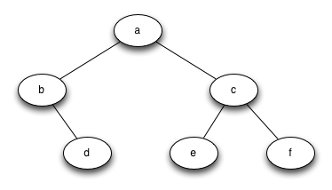

# 6.6. 节点与引用

**6.6. Nodes and References**

=== "中文"

    我们第二种表示树的方法使用节点和引用。在这种情况下，我们将定义一个具有根值属性以及左右子树属性的类。使用节点和引用，我们可以将树看作类似于 `图 2` 所示的结构。由于这种表示方法更符合面向对象编程的范式，我们将在本章的剩余部分继续使用这种表示方法。
    
    <figure markdown="span">
        
        <figcaption markdown="span">图 2: 使用节点和引用方法的简单树</figcaption>
    </figure>   
    
    我们将从 `Listing 4` 中展示的简单类定义开始。关于这种表示方法，重要的是要记住，属性 ``left_child`` 和 ``right_child`` 将成为对其他 ``BinaryTree`` 类实例的引用。例如，当我们向树中插入新的左子节点时，我们会创建另一个 ``BinaryTree`` 实例，并修改根节点的 ``self.left_child`` 以引用新树。
    
    ```python title="**Listing 4**" 
    class BinaryTree:
        def __init__(self, root_obj):
            self.key = root_obj
            self.left_child = None
            self.right_child = None
    ```     
    
    注意，在 `Listing 4` 中，构造函数期望获得某种对象以存储在根节点中。就像你可以在列表中存储任何对象一样，树的根对象可以是对任何对象的引用。在我们的早期示例中，我们将节点的名称存储为根值。使用节点和引用来表示 `图 2` 中的树，我们将创建六个 ``BinaryTree`` 类的实例。
    
    接下来，让我们看看我们需要什么函数来构建树的根节点以外的部分。为了向树中添加左子节点，我们将创建一个新的二叉树对象，并将根节点的 ``left_child`` 属性设置为指向这个新对象。``insert_left`` 的代码如 `Listing 5` 所示。
    
    ```python title="**Listing 5**" 
    def insert_left(self, new_node):
        if self.left_child is None:
            self.left_child = BinaryTree(new_node)
        else:
            new_child = BinaryTree(new_node)
            new_child.left_child = self.left_child
            self.left_child = new_child
    ```
    
    我们必须考虑两种插入情况。第一种情况是节点没有现有的左子节点。当没有左子节点时，简单地将一个节点添加到树中。第二种情况是节点有一个现有的左子节点。在第二种情况下，我们插入一个新节点，并将现有的子节点向下推一层。第二种情况由 `Listing 5` 第 4 行的 ``else`` 语句处理。
    
    ``insert_right`` 的代码必须考虑一组对称的情况。要么没有右子节点，要么我们必须将节点插入到根节点和现有右子节点之间。插入代码如 `Listing 6` 所示。
    
    ```python title="**Listing 6**" 
    def insert_right(self, new_node):
        if self.right_child == None:
            self.right_child = BinaryTree(new_node)
        else:
            new_child = BinaryTree(new_node)
            new_child.right_child = self.right_child
            self.right_child = new_child
    ```
    
    为了完成简单二叉树数据结构的定义，我们将编写访问方法，用于获取左子节点和右子节点以及根值（见 `Listing 7`）。
    
    ```python title="**Listing 7**" 
    def get_root_val(self):
        return self.key
    
    def set_root_val(self, new_obj):
        self.key = new_obj
    
    def get_left_child(self):
        return self.left_child
    
    def get_right_child(self):
        return self.right_child
    ```        
    
    现在我们拥有了创建和操作二叉树的所有组件，让我们使用它们进一步检查结构。我们将创建一个以节点 "a" 作为根的简单树，并添加节点 "b" 和 "c" 作为子节点。`ActiveCode 1` 创建了树，并查看 ``key``、``left_child`` 和 ``right_child`` 中存储的一些值。注意，根节点的左右子节点本身都是 ``BinaryTree`` 类的不同实例。正如我们在树的原始递归定义中所说的，这使我们能够将任何二叉树的子节点视为二叉树本身。
    
    ```python title="Activity: 6.6.1 练习节点和引用实现" linenums="1"
    class BinaryTree:
        def __init__(self, root_obj):
            self.key = root_obj
            self.left_child = None
            self.right_child = None
    
        def insert_left(self, new_node):
            if self.left_child is None:
                self.left_child = BinaryTree(new_node)
            else:
                new_child = BinaryTree(new_node)
                new_child.left_child = self.left_child
                self.left_child = new_child
    
        def insert_right(self, new_node):
            if self.right_child == None:
                self.right_child = BinaryTree(new_node)
            else:
                new_child = BinaryTree(new_node)
                new_child.right_child = self.right_child
                self.right_child = new_child
    
        def get_root_val(self):
            return self.key
    
        def set_root_val(self, new_obj):
            self.key = new_obj
    
        def get_left_child(self):
            return self.left_child
    
        def get_right_child(self):
            return self.right_child             
    
    
    a_tree = BinaryTree("a")
    print(a_tree.get_root_val())
    print(a_tree.get_left_child())
    a_tree.insert_left("b")
    print(a_tree.get_left_child())
    print(a_tree.get_left_child().get_root_val())
    a_tree.insert_right("c")
    print(a_tree.get_right_child())
    print(a_tree.get_right_child().get_root_val())
    a_tree.get_right_child().set_root_val("hello")
    print(a_tree.get_right_child().get_root_val())
    ```
    
    !!! info "自我检查"
    
    
        === "mctree_3"
        
            编写一个 ``build_tree`` 函数，该函数使用节点和引用实现返回如下树：
                        
            <figure markdown="span">
                
            </figure>
            
            ???- 提示 "提示"
            
                ```python
                from test import testEqual
                
                def build_tree():
                    pass
            
                ttree = build_tree()
            
                testEqual(ttree.get_right_child().get_root_val(), "c")
                testEqual(ttree.get_left_child().get_right_child().get_root_val(), "d")
                testEqual(ttree.get_right_child().get_left_child().get_root_val(), "e")
                ```

=== "英文"

    Our second method to represent a tree uses nodes and references. In this case we will define a class that has attributes for the root value as well as the left and right subtrees. Using nodes and references, we might think of the tree as being structured like the one shown in `Figure 2`. Since this representation more closely follows the object-oriented programming paradigm, we will continue to use this representation for the remainder of the chapter.
                    
    <figure markdown="span">
        
        <figcaption markdown="span">Figure 2: A Simple Tree Using a Nodes and References Approach</figcaption>
    </figure>   
    
    We will start out with a simple class definition for the nodes and references approach as shown in `Listing 4`. The important thing to remember about this representation is that the attributes ``left_child`` and ``right_child`` will become references to other instances of the ``BinaryTree`` class. For example, when we insert a new left child into the tree, we create another instance of ``BinaryTree`` and modify ``self.left_child`` in the root to reference the new tree.
    
    ```python title="**Listing 4**" 
    class BinaryTree:
        def __init__(self, root_obj):
            self.key = root_obj
            self.left_child = None
            self.right_child = None
    ```     
    
    Notice that in `Listing 4`, the constructor function expects to get some kind of object to store in the root. Just as you can store any object you like in a list, the root object of a tree can be a reference to any object. For our early examples, we will store the name of the node as the root value. Using nodes and references to represent the tree in `Figure 2`, we would create six instances of the ``BinaryTree`` class.
    
    Next let’s look at the functions we need to build the tree beyond the root node. To add a left child to the tree, we will create a new binary tree object and set the ``left_child`` attribute of the root to refer to this new object. The code for ``insert_left`` is shown in `Listing 5`.
    
    
    ```python title="**Listing 5**" 
        def insert_left(self, new_node):
            if self.left_child is None:
                self.left_child = BinaryTree(new_node)
            else:
                new_child = BinaryTree(new_node)
                new_child.left_child = self.left_child
                self.left_child = new_child
    ```
    
    We must consider two cases for insertion. The first case is characterized by a node with no existing left child. When there is no left child, simply add a node to the tree. The second case is characterized by a node with an existing left child. In the second case, we insert a node and push the existing child down one level in the tree. The second case is handled by the ``else`` statement on line 4 of `Listing 5`.
    
    The code for ``insert_right`` must consider a symmetric set of cases. There will either be no right child, or we must insert the node between the root and an existing right child. The insertion code is shown in `Listing 6`.
    
    
    ```python title="**Listing 6**" 
        def insert_right(self, new_node):
            if self.right_child == None:
                self.right_child = BinaryTree(new_node)
            else:
                new_child = BinaryTree(new_node)
                new_child.right_child = self.right_child
                self.right_child = new_child
    ```
    
    To round out the definition for a simple binary tree data structure, we will write accessor methods for the left and right children and for the root values (see `Listing 7`) .
    
    
    ```python title="**Listing 7**" 
    def get_root_val(self):
        return self.key
    
    def set_root_val(self, new_obj):
        self.key = new_obj
    
    def get_left_child(self):
        return self.left_child
    
    def get_right_child(self):
        return self.right_child
    ```        
    
    Now that we have all the pieces to create and manipulate a binary tree, let’s use them to check on the structure a bit more. Let’s make a simple tree with node a as the root, and add nodes "b" and "c" as children. `ActiveCode 1` creates the tree and looks at the some of the values stored in ``key``, ``left_child``, and ``right_child``. Notice that both the left and right children of the root are themselves distinct instances of the ``BinaryTree`` class. As we said in our original recursive definition for a tree, this allows us to treat any child of a binary tree as a binary tree itself.
    
    ```python title="Activity: 6.6.1 Exercising the Node and Reference Implementation" linenums="1"
    class BinaryTree:
        def __init__(self, root_obj):
            self.key = root_obj
            self.left_child = None
            self.right_child = None
    
        def insert_left(self, new_node):
            if self.left_child is None:
                self.left_child = BinaryTree(new_node)
            else:
                new_child = BinaryTree(new_node)
                new_child.left_child = self.left_child
                self.left_child = new_child
    
        def insert_right(self, new_node):
            if self.right_child == None:
                self.right_child = BinaryTree(new_node)
            else:
                new_child = BinaryTree(new_node)
                new_child.right_child = self.right_child
                self.right_child = new_child
    
        def get_root_val(self):
            return self.key
    
        def set_root_val(self, new_obj):
            self.key = new_obj
    
        def get_left_child(self):
            return self.left_child
    
        def get_right_child(self):
            return self.right_child             
    
    
    a_tree = BinaryTree("a")
    print(a_tree.get_root_val())
    print(a_tree.get_left_child())
    a_tree.insert_left("b")
    print(a_tree.get_left_child())
    print(a_tree.get_left_child().get_root_val())
    a_tree.insert_right("c")
    print(a_tree.get_right_child())
    print(a_tree.get_right_child().get_root_val())
    a_tree.get_right_child().set_root_val("hello")
    print(a_tree.get_right_child().get_root_val())
    ```
    
    !!! info "Self Check"
    
    
        === "mctree_3"
        
            Write a function ``build_tree`` that returns a tree using the nodes and references implementation that looks like this:
                        
            <figure markdown="span">
                
            </figure>
            
            ???- tip "Tip"
            
                ```python
                from test import testEqual
                
                def build_tree():
                    pass
            
                ttree = build_tree()
            
                testEqual(ttree.get_right_child().get_root_val(), "c")
                testEqual(ttree.get_left_child().get_right_child().get_root_val(), "d")
                testEqual(ttree.get_right_child().get_left_child().get_root_val(), "e")
                ```