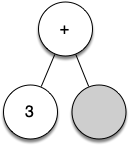

# 6.7. 解析树

**6.7. Parse Tree**

=== "中文"

    在我们完成了树数据结构的实现之后，我们现在来看一个树如何用于解决一些实际问题的示例。在这一部分中，我们将探讨**解析树**。解析树可以用来表示现实世界中的构造，比如句子或数学表达式。
    
    `Figure 1` 显示了一个简单句子的层次结构。将句子表示为树形结构允许我们通过使用子树来处理句子的各个部分。
    
    <figure markdown="span">
        
        <figcaption markdown="span">Figure 1: 一个简单句子的解析树</figcaption>
    </figure>
    
    我们也可以将数学表达式例如 $((7 + 3) \cdot (5 - 2))$ 表示为解析树，如 `Figure 2` 所示。我们已经了解了完全括号化的表达式，那么我们对这个表达式知道些什么呢？我们知道乘法的优先级高于加法或减法。由于括号的存在，我们知道在进行乘法之前必须先计算括号内的加法和减法表达式。树的层次结构帮助我们理解整个表达式的求值顺序。在计算顶层的乘法之前，我们必须计算子树中的加法和减法。加法，即左子树，计算结果为 10。减法，即右子树，计算结果为 3。利用树的层次结构，一旦我们计算了子节点中的表达式，我们可以简单地用一个节点替换整个子树。应用这一替换程序得到的简化树如 `Figure 3` 所示。
    
    <figure markdown="span">
        
        <figcaption markdown="span">Figure 3: $((7 + 3) \cdot (5 - 2))$ 的简化解析树</figcaption>
    </figure>
    
    在本节的剩余部分，我们将更详细地研究解析树。特别是我们将关注：
    
    - 如何从完全括号化的数学表达式构建解析树。
    - 如何计算存储在解析树中的表达式。
    - 如何从解析树中恢复原始数学表达式。
    
    构建解析树的第一步是将表达式字符串分解为一个令牌列表。需要考虑四种不同类型的令牌：左括号、右括号、运算符和操作数。我们知道，每当我们读取到左括号时，我们就开始了一个新表达式，因此我们应该创建一个新的树来对应这个表达式。相反，每当我们读取到右括号时，我们就完成了一个表达式。我们还知道，操作数将成为叶子节点，并且是其运算符的子节点。最后，我们知道每个运算符将有一个左子节点和一个右子节点。
    
    根据上述信息，我们可以定义四条规则如下：
    
    1. 如果当前令牌是 ``"("``，则在当前节点的左子节点上添加一个新节点，并下降到左子节点。
    2. 如果当前令牌在 ``["+", "-", "/", "*"]`` 列表中，将当前节点的根值设置为当前令牌所代表的运算符。将一个新节点添加为当前节点的右子节点，并下降到右子节点。
    3. 如果当前令牌是一个数字，将当前节点的根值设置为该数字，并返回到父节点。
    4. 如果当前令牌是 ``")"`，则回到当前节点的父节点。
    
    在编写 Python 代码之前，让我们来看一下上述规则的实际应用示例。我们将使用表达式 $(3 + (4 * 5))$。我们将把这个表达式解析为以下字符令牌列表： ``["(", "3", "+", "(", "4", "*", "5", ")", ")"]``。最初我们将开始构建一个包含空根节点的解析树。`Figure 4` 说明了每处理一个新令牌时解析树的结构和内容。
    
    <figure markdown="span">
        
        
        
        
        
        
        
        
        <figcaption markdown="span">Figure 4: 解析树构建过程</figcaption>
    </figure>
    
    使用 `Figure 4` 和前一段的示例表达式，让我们逐步分析这个示例：
    
    a) 创建一个空树。
    
    b) 读取 ``(`` 作为第一个令牌。根据规则 1，在根节点的左子节点上创建一个新节点。将当前节点设置为这个新子节点。
    
    c) 读取 ``3`` 作为下一个令牌。根据规则 3，将当前节点的根值设置为 3，并回到树的父节点。
    
    d) 读取 ``+`` 作为下一个令牌。根据规则 2，将当前节点的根值设置为 + 并添加一个新节点作为右子节点。新右子节点成为当前节点。
    
    e) 读取 ``(`` 作为下一个令牌。根据规则 1，在当前节点的左子节点上创建一个新节点。新的左子节点成为当前节点。
    
    f) 读取 ``4`` 作为下一个令牌。根据规则 3，将当前节点的值设置为 4。将 4 的父节点设置为当前节点。
    
    g) 读取 ``*`` 作为下一个令牌。根据规则 2，将当前节点的根值设置为 * 并创建一个新的右子节点。新的右子节点成为当前节点。
    
    h) 读取 ``5`` 作为下一个令牌。根据规则 3，将当前节点的根值设置为 5。将 5 的父节点设置为当前节点。
    
    i) 读取 ``)`` 作为下一个令牌。根据规则 4，将当前节点设置为 * 的父节点。
    
    j) 读取 ``)`` 作为下一个令牌。根据规则 4，将当前节点设置为 + 的父节点。此时 + 没有父节点，所以完成了。
    
    从上述示例可以看出，我们需要跟踪当前节点以及当前节点的父节点。树接口提供了获取节点子节点的方法，通过 ``get_left_child`` 和 ``get_right_child`` 方法，但我们如何跟踪父节点呢？一种简单的解决方案是使用栈。在我们想下降到当前节点的子节点时，我们首先将当前节点推入栈中。当我们想返回到当前节点的父节点时，我们从栈中弹出父节点。
    
    使用上述规则以及 ``Stack`` 和 ``BinaryTree`` 操作，我们现在准备编写一个 Python 函数来创建解析树。我们解析树构建的代码如 `ActiveCode 1` 所示。
    
    ```python title="Activity: 6.7.1 构建解析树" linenums="1"
    from pythonds3.basic import Stack
    from pythonds3.trees import BinaryTree
    
    
    def build_parse_tree(fp_expr):
        fp_list = fp_expr.split()
        p_stack = Stack()
        expr_tree = BinaryTree("")
        p_stack.push(expr_tree)
        current_tree = expr_tree
    
        for i in fp_list:
            if i == "(":
                current_tree.insert_left("")
                p_stack.push(current_tree)
                current_tree = current_tree.left_child
            elif i in ["+", "-", "*", "/"]:
                current_tree.root = i
                current_tree.insert_right("")
                p_stack.push(current_tree)
                current_tree = current_tree.right_child
            elif i.isdigit():
                    current_tree.root = int(i)
                    parent = p_stack.pop()
                    current_tree = parent
            elif i == ")":
                    current_tree = p_stack.pop()
            else:
                    raise ValueError(f"Unknown operator '{i}'")
    
        return expr_tree
    
    
    pt = build_parse_tree("( ( 10 + 5 ) * 3 )")
    pt.postorder()  # 在下一节中定义并解释
    ```
    
    构建解析树的四条规则在 `ActiveCode 1` 的 ``if..elif`` 语句的前四个分句中实现。在每种情况下，你可以看到代码实现了规则，如上所述，通过几次调用 ``BinaryTree`` 或 ``Stack`` 方法。我们在这个函数中唯一的错误检查是在 ``else`` 子句中，如果我们得到一个我们不认识的令牌，将引发 ``ValueError`` 异常。
    
    现在我们已经构建了一个解析树，我们可以用它做什么呢？作为第一个示例，我们将编写一个函数来计算解析树并返回数值结果。为了编写这个函数，我们将利用树的层次结构。回顾一下 `Figure 2`。回忆一下，我们可以用简化树替代原始树，如 `Figure 3` 所示。这表明我们可以编写一个算法，通过递归地计算每个子树来评估解析树。
    
    正如我们在以往的递归算法中所做的那样，我们将通过识别基本情况来开始递归计算函数的设计。对树操作的递归算法来说，一个自然的基本情况是检查叶子节点。在解析树
    
    中，叶子节点将始终是操作数。由于整数和浮点数等数值对象不需要进一步解释，``evaluate`` 函数可以简单地返回存储在叶子节点中的值。递归步骤则是对当前节点的左右子节点调用 ``evaluate``。递归调用有效地将我们向下移动到树的叶子节点。
    
    为了将两个递归调用的结果结合起来，我们可以简单地将父节点中存储的运算符应用于计算左右子节点的结果。在 `Figure 3` 的示例中，我们看到根节点的两个子节点的计算结果分别是 10 和 3。应用乘法运算符得到最终结果 30。
    
    递归 ``evaluate`` 函数的代码如 `Listing 1` 所示。首先，我们获取当前节点的左子节点和右子节点的引用。如果左右子节点都评估为 ``None``，则说明当前节点实际上是叶子节点。这项检查在第 7 行进行。如果当前节点不是叶子节点，则查找当前节点中的运算符并将其应用于递归计算左右子节点的结果。
    
    ```python title="**Listing 1**"
    import operator
    
    
    def evaluate(parse_tree):
        operators = {
            "+": operator.add,
            "-": operator.sub,
            "*": operator.mul,
            "/": operator.truediv,
        }
    
        left_child = parse_tree.left_child
        right_child = parse_tree.right_child
    
        if left_child and right_child:
            fn = operators[parse_tree.root]
            return fn(evaluate(left_child), evaluate(right_child))
        else:
            return parse_tree.root
    ```
    
    为了实现算术操作，我们使用一个字典，字典的键为 ``"+"``, ``"-"``, ``"*"``, 和 ``"/"``。字典中存储的值是 Python 的 operator 模块中的函数。operator 模块提供了许多常用运算符的函数版本。当我们查找一个运算符时，检索到的对象是函数对象。由于检索到的对象是函数，我们可以像平常一样调用它： ``function(param1, param2)``。因此，查找 ``operators["+"](2, 2)`` 相当于 ``operator.add(2, 2)``。
    
    最后，我们将对 `Figure 4` 中创建的解析树进行 ``evaluate`` 函数的跟踪。当我们第一次调用 ``evaluate`` 时，我们将整个树的根作为参数 ``parse_tree`` 传递。然后我们获取左子节点和右子节点的引用，以确保它们存在。递归调用发生在第 17 行。我们首先查看树根中的运算符，即 ``"+"``。 ``"+"`` 运算符映射到 ``operator.add`` 函数调用，该函数接受两个参数。像往常一样，Python 首先计算传递给函数的参数。在这个例子中，两个参数都是对我们 ``evaluate`` 函数的递归调用。按照从左到右的评估顺序，第一个递归调用将进行左子树。在第一个递归调用中，``evaluate`` 函数得到左子树。我们发现该节点没有左子节点或右子节点，因此我们在叶子节点。当我们在叶子节点时，我们只需返回存储在叶子节点中的值作为计算结果。在这个例子中，我们返回整数 3。
    
    此时我们已经为顶级 ``"+"`` 运算符计算了一个参数，但还未完成。继续按照从左到右的顺序评估参数，我们现在对根节点的右子节点进行递归调用。我们发现该节点有左右子节点，因此我们查找该节点中存储的运算符 ``"*"``，并使用左子节点和右子节点作为参数调用该函数。此时你可以看到两个递归调用将到达叶子节点，分别计算为整数 4 和 5。得到两个参数后，我们返回 ``operator.mul(4, 5)`` 的结果。此时，我们已经计算了顶层 ``"+"`` 运算符的操作数，剩下的就是完成对 ``operator.add(3, 20)`` 的调用。整个表达式树的计算结果是 23。

=== "英文"

    With the implementation of our tree data structure complete, we now look at an example of how a tree can be used to solve some real problems. In this section we will look at **parse trees**. Parse trees can be used to represent real-world constructions like sentences or mathematical expressions.
                        
    <figure markdown="span">
        
        <figcaption markdown="span">Figure 1: A Parse Tree for a Simple Sentence</figcaption>
    </figure>
       
    
    `Figure 1` shows the hierarchical structure of a simple sentence. Representing a sentence as a tree structure allows us to work with the individual parts of the sentence by using subtrees.
                        
    <figure markdown="span">
        
        <figcaption markdown="span">Figure 2: Parse Tree for $((7 + 3) \cdot (5 - 2))$</figcaption>
    </figure>
    
    We can also represent a mathematical expression such as $((7 + 3) \cdot (5 - 2))$ as a parse tree, as shown in `Figure 2`. We have already looked at fully parenthesized expressions, so what do we know about this expression? We know that multiplication has a higher precedence than either addition or subtraction. Because of the parentheses, we know that before we can do the multiplication we must evaluate the parenthesized addition and subtraction expressions. The hierarchy of the tree helps us understand the order of evaluation for the whole expression. Before we can evaluate the top-level multiplication, we must evaluate the addition and the subtraction in the subtrees. The addition, which is the left subtree, evaluates to 10. The subtraction, which is the right subtree, evaluates to 3. Using the hierarchical structure of trees, we can simply replace an entire subtree with one node once we have evaluated the expressions in the children. Applying this replacement procedure gives us the simplified tree shown in `Figure 3`.
    
                        
    <figure markdown="span">
        
        <figcaption markdown="span">Figuer 3: A Simplified Parse Tree for $((7 + 3) \cdot (5 - 2))$</figcaption>
    </figure>
    
    In the rest of this section we are going to examine parse trees in more detail. In particular we will look at
    
    -  How to build a parse tree from a fully parenthesized mathematical expression.
    -  How to evaluate the expression stored in a parse tree.
    -  How to recover the original mathematical expression from a parse tree.
    
    The first step in building a parse tree is to break up the expression string into a list of tokens. There are four different kinds of tokens to consider: left parentheses, right parentheses, operators, and operands. We know that whenever we read a left parenthesis we are starting a new expression, and hence we should create a new tree to correspond to that expression. Conversely, whenever we read a right parenthesis, we have finished an expression. We also know that operands are going to be leaf nodes and children of their operators. Finally, we know that every operator is going to have both a left and a right child.
    
    Using the information from above we can define four rules as follows:
    
    1. If the current token is a ``"("``, add a new node as the left child of the current node, and descend to the left child.
    1. If the current token is in the list ``["+", "-", "/", "*"]``, set the root value of the current node to the operator represented by the current token. Add a new node as the right child of the current node and descend to the right child.
    1. If the current token is a number, set the root value of the current node to the number and return to the parent.
    1. If the current token is a ``")"``, go to the parent of the current node.
    
    Before writing the Python code, let’s look at an example of the rules outlined above in action. We will use the expression $(3 + (4 * 5))$. We will parse this expression into the following list of character tokens: ``["(", "3", "+", "(", "4", "*", "5", ")", ")"]``. Initially we will start out with a parse tree that consists of an empty root node. `Figure 4` illustrates the structure and contents of the parse tree as each new token is processed.
     
    <figure markdown="span">
        
        
        
        
        
        
        
        
        <figcaption markdown="span">Figure 4: Tracing Parse Tree Construction$</figcaption>
    </figure>
    
    
    Using `Figure 4` and the example expression from the previous paragraph, let’s walk through the example step by step:
    
    a) Create an empty tree.
    
    b) Read ``(`` as the first token. By rule 1, create a new node as the left child of the root. Make the current node this new child.
    
    c) Read ``3`` as the next token. By rule 3, set the root value of the current node to 3 and go back up the tree to the parent.
    
    d) Read ``+`` as the next token. By rule 2, set the root value of the current node to + and add a new node as the right child. The new right child becomes the current node.
    
    e) Read ``(`` as the next token. By rule 1, create a new node as the left child of the current node. The new left child becomes the current node.
    
    f) Read ``4`` as the next token. By rule 3, set the value of the current node to 4. Make the parent of 4 the current node.
    
    g) Read ``*`` as the next token. By rule 2, set the root value of the current node to \* and create a new right child. The new right child becomes the current node.
    
    h) Read ``5`` as the next token. By rule 3, set the root value of the current node to 5. Make the parent of 5 the current node.
    
    i) Read ``)`` as the next token. By rule 4 we make the parent of \* the current node.
    
    j) Read ``)`` as the next token. By rule 4 we make the parent of + the current node. At this point there is no parent for +, so we are done.
    
    From the example above, it is clear that we need to keep track of the current node as well as the parent of the current node. The tree interface provides us with a way to get children of a node, through the ``get_left_child`` and ``get_right_child`` methods, but how can we keep track of the parent? A simple solution to keeping track of parents as we traverse the tree is to use a stack. Whenever we want to descend to a child of the current node, we first push the current node on the stack. When we want to return to the parent of the current node, we pop the parent off the stack.
    
    Using the rules described above, along with the ``Stack`` and ``BinaryTree`` operations, we are now ready to write a Python function to create a parse tree. The code for our parse tree builder is presented in `ActiveCode 1`.
    
    ```python title="Activity: 6.7.1 Building a Parse Tree" linenums="1"
    from pythonds3.basic import Stack
    from pythonds3.trees import BinaryTree
    
    
    def build_parse_tree(fp_expr):
        fp_list = fp_expr.split()
        p_stack = Stack()
        expr_tree = BinaryTree("")
        p_stack.push(expr_tree)
        current_tree = expr_tree
    
        for i in fp_list:
            if i == "(":
                current_tree.insert_left("")
                p_stack.push(current_tree)
                current_tree = current_tree.left_child
            elif i in ["+", "-", "*", "/"]:
                current_tree.root = i
                current_tree.insert_right("")
                p_stack.push(current_tree)
                current_tree = current_tree.right_child
            elif i.isdigit():
                    current_tree.root = int(i)
                    parent = p_stack.pop()
                    current_tree = parent
            elif i == ")":
                    current_tree = p_stack.pop()
            else:
                    raise ValueError(f"Unknown operator '{i}'")
    
        return expr_tree
    
    
    pt = build_parse_tree("( ( 10 + 5 ) * 3 )")
    pt.postorder()  # defined and explained in the next section
    ```
    
    
    The four rules for building a parse tree are coded as the first four clauses of the ``if..elif`` statements on lines 13, 17, 22, and 26 of `ActiveCode 1`. In each case you can see that the code implements the rule, as described above, with a few calls to the ``BinaryTree`` or ``Stack`` methods. The only error checking we do in this function is in the ``else`` clause where a ``ValueError`` exception will be raised if we get a token from the list that we do not recognize.
    
    Now that we have built a parse tree, what can we do with it? As a first example, we will write a function to evaluate the parse tree and return the numerical result. To write this function, we will make use of the hierarchical nature of the tree. Look back at `Figure 2`. Recall that we can replace the original tree with the simplified tree shown in `Figure 3`. This suggests that we can write an algorithm that evaluates a parse tree by recursively evaluating each subtree.
    
    As we have done with past recursive algorithms, we will begin the design for the recursive evaluation function by identifying the base case. A natural base case for recursive algorithms that operate on trees is to check for a leaf node. In a parse tree, the leaf nodes will always be operands. Since numerical objects like integers and floating points require no further interpretation, the ``evaluate`` function can simply return the value stored in the leaf node. The recursive step that moves the function toward the base case is to call ``evaluate`` on both the left and the right children of the current node. The recursive call effectively moves us down the tree, toward a leaf node.
    
    To put the results of the two recursive calls together, we can simply apply the operator stored in the parent node to the results returned from evaluating both children. In the example from `Figure 3` we see that the two children of the root evaluate to themselves, namely 10 and 3. Applying the multiplication operator gives us a final result of 30.
    
    The code for a recursive ``evaluate`` function is shown in `Listing 1`. First, we obtain references to the left and the right children of the current node. If both the left and right children evaluate to ``None``, then we know that the current node is really a leaf node. This check is on line 7. If the current node is not a leaf node, look up the operator in the current node and apply it to the results from recursively evaluating the left and right children.
    
    ```python title="**Listing 1**"
    import operator
    
    
    def evaluate(parse_tree):
        operators = {
            "+": operator.add,
            "-": operator.sub,
            "*": operator.mul,
            "/": operator.truediv,
        }
    
        left_child = parse_tree.left_child
        right_child = parse_tree.right_child
    
        if left_child and right_child:
            fn = operators[parse_tree.root]
            return fn(evaluate(left_child), evaluate(right_child))
        else:
            return parse_tree.root
    ```
    
    To implement the arithmetic, we use a dictionary with the keys ``"+"``, ``"-"``, ``"*"``, and ``"/"``. The values stored in the dictionary are functions from Python’s operator module. The operator module provides us with the function versions of many commonly used operators. When we look up an operator in the dictionary, the corresponding function object is retrieved. Since the retrieved object is a function, we can call it in the usual way: ``function(param1, param2)``. So the lookup ``operators["+"](2, 2)`` is equivalent to ``operator.add(2, 2)``.
    
    Finally, we will trace the ``evaluate`` function on the parse tree we created in `Figure 4`. When we first call ``evaluate``, we pass the root of the entire tree as the parameter ``parse_tree``. Then we obtain references to the left and right children to make sure they exist. The recursive call takes place on line 17. We begin by looking up the operator in the root of the tree, which is ``"+"``. The ``"+"`` operator maps to the ``operator.add`` function call, which takes two parameters. As usual for a Python function call, the first thing Python does is to evaluate the parameters that are passed to the function. In this case both parameters are recursive function calls to our ``evaluate`` function. Using left-to-right evaluation, the first recursive call goes to the left. In the first recursive call the ``evaluate`` function is given the left subtree. We find that the node has no left or right children, so we are in a leaf node. When we are in a leaf node, we just return the value stored in the leaf node as the result of the evaluation. In this case we return the integer 3.
    
    At this point we have one parameter evaluated for our top-level call to ``operator.add``. But we are not done yet. Continuing the left-to-right evaluation of the parameters, we now make a recursive call to evaluate the right child of the root. We find that the node has both a left and a right child so we look up the operator stored in this node, ``"*"``, and call this function using the left and right children as the parameters. At this point you can see that both recursive calls will be to leaf nodes, which will evaluate to the integers 4 and 5 respectively. With the two parameters evaluated, we return the result of ``operator.mul(4, 5)``. At this point we have evaluated the operands for the top level ``"+"`` operator and all that is left to do is finish the call to ``operator.add(3, 20)``. The result of the evaluation of the entire expression tree for $(3 + (4 * 5))$ is 23.