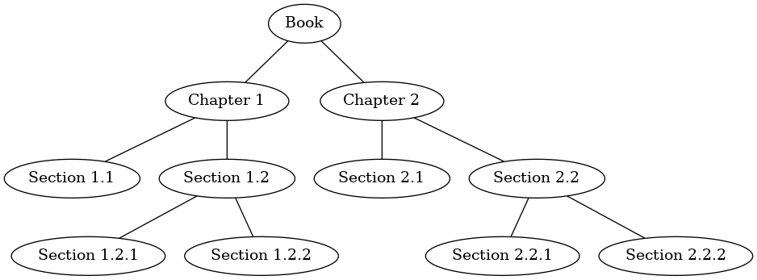

# 6.8. 树遍历

**6.8. Tree Traversals**

=== "中文"

    既然我们已经检查了树数据结构的基本功能，接下来就来看看树的一些额外使用模式。这些使用模式可以分为三种常见的遍历模式，用于访问树中的所有节点。这些遍历模式的区别在于访问每个节点的顺序。我们将这些访问节点的方式称为**树遍历**。我们将要探讨的三种遍历分别是前序遍历、中序遍历和后序遍历。首先，我们将更详细地定义这三种遍历，然后看看这些模式在实际应用中的作用。
    
    **前序遍历**
    
    在**前序遍历**中，我们首先访问根节点，然后递归地对左子树进行前序遍历，再对右子树进行递归的前序遍历。
    
    **中序遍历**
    
    在**中序遍历**中，我们递归地对左子树进行中序遍历，访问根节点，最后对右子树进行递归的中序遍历。
    
    **后序遍历**
    
    在**后序遍历**中，我们递归地对左子树和右子树进行后序遍历，然后访问根节点。
    
    让我们看一些示例来说明这三种遍历的应用。首先，以一本书作为示例树来展示前序遍历。书籍是树的根节点，每章是根节点的子节点。每章中的每节是该章节的子节点，每节中的每个子节是该节的子节点，依此类推。`Figure 5` 显示了一本仅有两章的简化版书籍。请注意，遍历算法适用于任何子节点数量的树，但我们现在将继续使用二叉树。
    
    <figure markdown="span">
        
        <figcaption markdown="span">Figure 5: 将书籍表示为树</figcaption>
    </figure>
    
    假设你想从头到尾阅读这本书。前序遍历正好符合这种顺序。从树的根节点（书籍节点）开始，我们将按照前序遍历的指示进行。我们递归调用 ``preorder`` 方法来处理左子节点，在这个例子中是章节 1。我们再次递归调用 ``preorder`` 处理左子节点，直到到达第 1.1 节。由于第 1.1 节没有子节点，我们不需要进行额外的递归调用。当我们完成第 1.1 节后，我们返回到第 1 章。此时，我们仍需要访问第 1 章的右子树，即第 1.2 节。与之前一样，我们访问左子树，这使我们到达第 1.2.1 节，然后访问第 1.2.2 节。完成第 1.2 节后，我们返回到第 1 章，然后回到书籍节点，并对第 2 章进行相同的操作。
    
    编写树遍历的代码非常简洁，这主要是因为遍历是递归编写的。你可能会想，编写像前序遍历这样的算法的最佳方式是什么？是将其作为一个独立的函数，还是作为树数据结构本身的方法？`Listing 2` 显示了将前序遍历作为一个外部函数实现的版本，该函数接受一个二叉树作为参数。外部函数特别简洁，因为我们的基本情况只是检查树是否存在。如果树参数为 ``None``，则函数直接返回而不采取任何行动。
    
    ```python title="Listing 2"
    def preorder(tree):
        if tree:
            print(tree.key)
            preorder(tree.left_child)
            preorder(tree.right_child)
    ```
    
    我们也可以将 ``preorder`` 实现为 ``BinaryTree`` 类的方法。`Listing 3` 显示了将 ``preorder`` 实现为内部方法的代码。注意当我们将代码从外部转到内部时发生了什么。一般来说，我们只需将 ``tree`` 替换为 ``self``。然而，我们还需要修改基本情况。内部方法必须在递归调用 ``preorder`` 之前检查左子节点和右子节点的存在性。
    
    ```python title="Listing 3"
    def preorder(self):
        print(self.key)
        if self.left_child:
            self.left_child.preorder()
        if self.right_child:
            self.right_child.preorder()
    ```
    
    这两种实现 ``preorder`` 的方法哪个更好？答案是，在这种情况下，将 ``preorder`` 实现为外部函数可能更好。原因是你很少只是想遍历树。大多数情况下，你会希望在使用基本遍历模式的同时完成其他操作。实际上，在下一个示例中，我们将看到 ``postorder`` 遍历模式与我们之前编写的解析树评估代码非常接近。因此，我们将把其余的遍历实现为外部函数。
    
    ``postorder`` 遍历的算法，如 `Listing 4` 所示，与 ``preorder`` 函数几乎相同，只是我们将打印调用移到了函数的末尾。
    
    ```python title="Listing 4"
    def postorder(tree):
        if tree:
            postorder(tree.left_child)
            postorder(tree.right_child)
            print(tree.key)
    ```
    
    我们已经看到 ``postorder`` 遍历的一个常见用途，即评估解析树。再看一下 `Listing 1`。该算法评估左子树，评估右子树，并通过调用运算符函数将它们组合到根节点中。假设我们的二叉树只存储表达式树数据，那么请重写评估函数，使其更接近于 `Listing 4` 中的 ``postorder`` 代码。
    
    ```python title="Listing 5"
    def postordereval(tree):
        operators = {
            "+": operator.add,
            "-": operator.sub,
            "*": operator.mul,
            "/": operator.truediv,
        }
        result_1 = None
        result_2 = None
        if tree:
            result_1 = postordereval(tree.left_child)
            result_2 = postordereval(tree.right_child)
            if result_1 and result_2:
                return operators[tree.key](result_1, result_2)
            return tree.key
    ```
    
    注意 `Listing 4` 和 `Listing 5` 的形式相同，只是我们在函数的末尾不是打印键值，而是返回它。这允许我们保存从递归调用中返回的值，然后将这些值与第 14 行的运算符一起使用。
    
    最后，我们将查看中序遍历。在中序遍历中，我们访问左子树，然后访问根节点，最后访问右子树。`Listing 6` 显示了我们的中序遍历代码。注意，在这三种遍历函数中，我们只是改变了 ``print`` 函数相对于两个递归函数调用的位置。
    
    ```python title="Listing 6"
    def inorder(tree):
        if tree:
            inorder(tree.left_child)
            print(tree.key)
            inorder(tree.right_child)
    ```
    
    如果我们对解析树执行简单的中序遍历，我们将得到没有任何括号的原始表达式。让我们修改基本的中序算法，以便恢复完整的括号化表达式。我们对基本模板进行的唯一修改是：在递归调用左子树之前打印一个左括号，并在递归调用右子树之后打印一个右括号。修改后的代码如 `Listing 7` 所示。
    
    ```python title="Listing 7"
    def print_exp(tree):
        result = ""
        if tree:
            result = "(" + print_exp(tree.left_child)
            result = result + str(tree.key)
            result = result + print_exp(tree.right_child) + ")"
        return result
    ```
    
    注意我们实现的 ``print_exp`` 函数会在每个数字周围加上括号。虽然这样做没有错，但显然这些括号是不必要的。在本章末尾的练习中，你将被要求修改 ``print_exp`` 函数以去掉这组括号。

=== "英文"

    Now that we have examined the basic functionality of our tree data structure, it is time to look at some additional usage patterns for trees. These usage patterns can be divided into three commonly used patterns to visit all the nodes in a tree. The difference between these patterns is the order in which each node is visited. We call this visitation of the nodes a **tree traversal**. The three traversals we will look at are called preorder, inorder, and postorder. Let’s start out by defining these three traversals more carefully, then look at some examples where these patterns are useful.
    
    **Preorder**
    
    In a **preorder traversal**, we visit the root node first, then recursively do a preorder traversal of the left subtree, followed by a recursive preorder traversal of the right subtree.
    
    **Inorder**
    
    In an **inorder traversal**, we recursively do an inorder traversal on the left subtree, visit the root node, and finally do a recursive inorder traversal of the right subtree.
    
    **Postorder**
    
    In a **postorder traversal**, we recursively do a postorder traversal of the left subtree and the right subtree followed by a visit to the root node.
    
    Let’s look at some examples that illustrate each of these three kinds of traversals. First let’s look at the preorder traversal using a book as an example tree. The book is the root of the tree, and each chapter is a child of the root. Each section within a chapter is a child of the chapter, each subsection is a child of its section, and so on. `Figure 5` shows a limited version of a book with only two chapters. Note that the traversal algorithm works for trees with any number of children, but we will stick with binary trees for now.
        
                        
    <figure markdown="span">
        
        <figcaption markdown="span">Figure 5: Representing a Book as a Tree</figcaption>
    </figure>
    
    Suppose that you wanted to read this book from front to back. The preorder traversal gives you exactly that ordering. Starting at the root of the tree (the Book node) we will follow the preorder traversal instructions. We recursively call ``preorder`` on the left child, in this case Chapter1. We again recursively call ``preorder`` on the left child to get to Section 1.1. Since Section 1.1 has no children, we do not make any additional recursive calls. When we are finished with Section 1.1, we move up the tree to Chapter 1. At this point we still need to visit the right subtree of Chapter 1, which is Section 1.2. As before we visit the left subtree, which brings us to Section 1.2.1, then we visit the node for Section 1.2.2. With Section 1.2 finished, we return to Chapter 1. Then we return to the Book node and follow the same procedure for Chapter 2.
    
    The code for writing tree traversals is surprisingly elegant, largely because the traversals are written recursively. You may wonder,  what is the best way to write an algorithm like preorder traversal? Should it be a function that simply uses a tree as a data structure, or should it be a method of the tree data structure itself? `Listing 2` shows a version of the preorder traversal written as an external function that takes a binary tree as a parameter. The external function is particularly elegant because our base case is simply to check if the tree exists. If the tree parameter is ``None``, then the function returns without taking any action.
    
    ```python title="Listing 2"
    def preorder(tree):
        if tree:
            print(tree.key)
            preorder(tree.left_child)
            preorder(tree.right_child)
    ```
    
    We can also implement ``preorder`` as a method of the ``BinaryTree`` class. The code for implementing ``preorder`` as an internal method is shown in `Listing 3`. Notice what happens when we move the code from external to internal. In general, we just replace ``tree`` with ``self``. However, we also need to modify the base case. The internal method must check for the existence of the left and the right children *before* making the recursive call to ``preorder``.
    
    
    ```python title="Listing 3"
    def preorder(self):
        print(self.key)
        if self.left_child:
            self.left_child.preorder()
        if self.right_child:
            self.right_child.preorder()
    ```
    
    Which of these two ways to implement ``preorder`` is best? The answer is that implementing ``preorder`` as an external function is probably better in this case. The reason is that you very rarely want to just traverse the tree. In most cases you are going to want to accomplish something else while using one of the basic traversal patterns. In fact, we will see in the next example that the ``postorder`` traversal pattern follows very closely with the code we wrote earlier to evaluate a parse tree. Therefore we will write the rest of the traversals as external functions.
    
    The algorithm for the ``postorder`` traversal, shown in `Listing 4`, is nearly identical to ``preorder`` except that we move the call to print to the end of the function.
    
    
    ```python title="Listing 4"
    def postorder(tree):
        if tree:
            postorder(tree.left_child)
            postorder(tree.right_child)
            print(tree.key)
    ```
    
    We have already seen a common use for the postorder traversal, namely evaluating a parse tree. Look back at `Listing 1` again. The algorithm evaluates the left subtree, evaluates the right subtree,  and combines them in the root through the function call to an operator. Assuming our binary tree is going to store only expression tree data, rewrite the evaluation function, but model it even more closely on the postorder code in `Listing 4`.
    
    ```python title="Listing 5"
    def postordereval(tree):
        operators = {
            "+": operator.add,
            "-": operator.sub,
            "*": operator.mul,
            "/": operator.truediv,
        }
        result_1 = None
        result_2 = None
        if tree:
            result_1 = postordereval(tree.left_child)
            result_2 = postordereval(tree.right_child)
            if result_1 and result_2:
                return operators[tree.key](result_1, result_2)
            return tree.key
    ```                
    
    Notice that the form in `Listing 4` is the same as the form in `Listing 5`, except that instead of printing the key at the end of the function, we return it. This allows us to save the values returned from the recursive calls in lines 11 and 12. We then use these saved values along with the operator on line 14.
    
    The final traversal we will look at in this section is the inorder traversal. In the inorder traversal we visit the left subtree, followed by the root, and finally the right subtree. `Listing 6` shows our code for the inorder traversal. Notice that in all three of the traversal functions we are simply changing the position of the ``print`` function with respect to the two recursive function calls.
    
    ```python title="Listing 6"
    def inorder(tree):
        if tree:
            inorder(tree.left_child)
            print(tree.key)
            inorder(tree.right_child)
    ```
    
    If we perform a simple inorder traversal of a parse tree, we get our original expression back without any parentheses. Let’s modify the basic inorder algorithm to allow us to recover the fully parenthesized version of the expression. The only modifications we will make to the basic template are as follows: print a left parenthesis *before* the recursive call to the left subtree, and print a right parenthesis *after* the recursive call to the right subtree. The modified code is shown in `Listing 7`.
    
    ```python title="Listing 7"
    def print_exp(tree):
        result = ""
        if tree:
            result = "(" + print_exp(tree.left_child)
            result = result + str(tree.key)
            result = result + print_exp(tree.right_child) + ")"
        return result
    ```
    
    Notice that the ``print_exp`` function as we have implemented it puts parentheses around each number. While not incorrect, the parentheses are clearly not needed. In the exercises at the end of this chapter you are asked to modify the ``print_exp`` function to remove this set of parentheses.