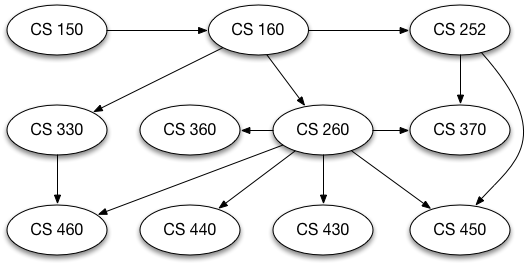

# 7.1. 目标

**7.1. Objectives**

=== "中文"

    -  学习图是什么以及如何使用它。
    -  使用多种内部表示法实现 **图** 抽象数据类型。
    -  了解图如何用于解决各种问题。

    在本章中，我们将研究图。图是一种比我们在上一章中研究的树更为通用的结构；事实上，你可以将树视为一种特殊类型的图。图可以用来表示我们世界上的许多有趣的事物，包括道路系统、城市间的航空航班、互联网的连接方式，甚至是完成计算机科学专业所需的课程顺序。我们将在本章中看到，一旦我们为一个问题找到合适的表示方法，我们可以使用一些标准的图算法来解决看似非常困难的问题。

    虽然人类相对容易查看路网图并理解不同地点之间的关系，但计算机却没有这种知识。然而，我们也可以将路网图视为一种图。当我们这样做时，我们可以让计算机为我们完成一些有趣的事情。如果你曾经使用过互联网地图网站，你会知道计算机可以找到从一个地方到另一个地方的最短、最快或最简单的路径。

    作为计算机科学的学生，你可能会对完成专业所需的课程产生疑问。图是一种很好的方式来表示课程之间的先决条件和其他相互依赖关系。`图 1` 展示了这样的图。它表示了在Luther学院完成计算机科学专业所需的课程及其顺序。

    <figure markdown="span">
    { width="300" }
    <figcaption markdown="span">图 1: 计算机科学专业的先决课程</figcaption>
    </figure>

=== "英文"

    -  To learn what a graph is and how it is used.
    -  To implement the **graph** abstract data type using multiple internal representations.
    -  To see how graphs can be used to solve a wide variety of problems.

    In this chapter we will study graphs. Graphs are a more general structure than the trees we studied in the last chapter; in fact, you can think of a tree as a special kind of graph. Graphs can be used to represent many interesting things about our world, including systems of roads, airline flights from city to city, how the internet is connected, or even the sequence of classes you must take to complete a major in computer science. We will see in this chapter that once we have a good representation for a problem, we can use some standard graph algorithms to solve what otherwise might seem to be a very difficult problem.

    While it is relatively easy for humans to look at a road map and understand the relationships between different places, a computer has no such knowledge. However, we can also think of a road map as a graph. When we do so we can have our computer do interesting things for us. If you have ever used one of the internet map sites, you know that a computer can find the shortest, quickest, or easiest path from one place to another.

    As a student of computer science you may wonder about the courses you must take for your major. A graph is good way to represent the prerequisites and other interdependencies among courses. `Figure 1` shows such a graph. It represents the courses and the order in which they must be taken to complete a major in computer science at Luther College.

    <figure markdown="span">
    { width="300" }
    <figcaption markdown="span">Figure 1: Prerequisites for a Computer Science Major</figcaption>
    </figure>
