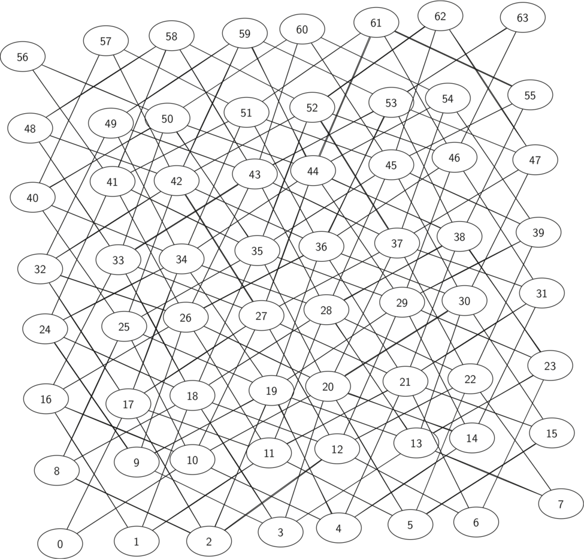

# 7.12. 构建骑士巡游图

**7.12. Building the Knight’s Tour Graph**

=== "中文"

    To represent the knight’s tour problem as a graph we will use the following two ideas: each square on the chessboard can be represented as a node in the graph and each legal move by the knight can be represented as an edge in the graph. `Figure 1` illustrates the legal moves by a knight and the corresponding edges in a graph.
     
    <figure markdown="span">
        
        <figcaption markdown="span">Figure 1: Legal Moves for a Knight on Square 12 and the Corresponding Graph</figcaption>
    </figure>
    
    To build the full graph for an *n*-by-*n* board, we can use the Python function shown in `Listing 1`. The ``knight_graph`` function makes one pass over the entire board. At each square on the board the ``knight_graph`` function calls a helper, ``gen_legal_moves``, to create a list of legal moves for that position on the board. All legal moves are then converted into edges in the graph. Each location on the board is converted into a linear vertex number similar to the vertex numbers shown in `Figure 1`.
    
    ```python title="Listing 1"
    from pythonds3.graphs import Graph
    
    
    def knight_graph(board_size):
        kt_graph = Graph()
        for row in range(board_size):
            for col in range(board_size):
                node_id = row * board_size + col
                new_positions = gen_legal_moves(row, col, board_size)
                for row2, col2 in new_positions:
                    other_node_id = row2 * board_size + col2
                    kt_graph.add_edge(node_id, other_node_id)
        return kt_graph
    ```
    
    The ``gen_legal_moves`` function (`Listing 2`) takes the position of the knight on the board and generates each of the eight possible moves, making sure those moves are still within the board.
    
    ```python title="Listing 2"
    def gen_legal_moves(row, col, board_size):
        new_moves = []
        move_offsets = [
            (-1, -2),  # left-down-down
            (-1, 2),   # left-up-up
            (-2, -1),  # left-left-down
            (-2, 1),   # left-left-up
            (1, -2),   # right-down-down
            (1, 2),    # right-up-up
            (2, -1),   # right-right-down 
            (2, 1),    # right-right-up
        ]
        for r_off, c_off in move_offsets:
            if 0 <= row + r_off < board_size and 0 <= col + c_off < board_size:
                new_moves.append((row + r_off, col + c_off))
        return new_moves
    ```
    
    `Figure 2` shows the complete graph of possible moves on an $8 \times 8$ board. There are exactly 336 edges in the graph. Notice that the vertices corresponding to the edges of the board have fewer connections (legal moves) than the vertices in the middle of the board. Once again we can see how sparse the graph is. If the graph was fully connected there would be 4,096 edges. Since there are only 336 edges, the adjacency matrix would be only 8.2 percent full.
     
    <figure markdown="span">
        
        <figcaption markdown="span">Figure 2: All Legal Moves for a Knight on an :math:`8 \times 8` Chessboard</figcaption>
    </figure>

=== "英文"

    To represent the knight’s tour problem as a graph we will use the following two ideas: each square on the chessboard can be represented as a node in the graph and each legal move by the knight can be represented as an edge in the graph. `Figure 1` illustrates the legal moves by a knight and the corresponding edges in a graph.
     
    <figure markdown="span">
        
        <figcaption markdown="span">Figure 1: Legal Moves for a Knight on Square 12 and the Corresponding Graph</figcaption>
    </figure>
    
    To build the full graph for an *n*-by-*n* board, we can use the Python function shown in `Listing 1`. The ``knight_graph`` function makes one pass over the entire board. At each square on the board the ``knight_graph`` function calls a helper, ``gen_legal_moves``, to create a list of legal moves for that position on the board. All legal moves are then converted into edges in the graph. Each location on the board is converted into a linear vertex number similar to the vertex numbers shown in `Figure 1`.
    
    ```python title="Listing 1"
    from pythonds3.graphs import Graph
    
    
    def knight_graph(board_size):
        kt_graph = Graph()
        for row in range(board_size):
            for col in range(board_size):
                node_id = row * board_size + col
                new_positions = gen_legal_moves(row, col, board_size)
                for row2, col2 in new_positions:
                    other_node_id = row2 * board_size + col2
                    kt_graph.add_edge(node_id, other_node_id)
        return kt_graph
    ```
    
    The ``gen_legal_moves`` function (`Listing 2`) takes the position of the knight on the board and generates each of the eight possible moves, making sure those moves are still within the board.
    
    ```python title="Listing 2"
    def gen_legal_moves(row, col, board_size):
        new_moves = []
        move_offsets = [
            (-1, -2),  # left-down-down
            (-1, 2),   # left-up-up
            (-2, -1),  # left-left-down
            (-2, 1),   # left-left-up
            (1, -2),   # right-down-down
            (1, 2),    # right-up-up
            (2, -1),   # right-right-down 
            (2, 1),    # right-right-up
        ]
        for r_off, c_off in move_offsets:
            if 0 <= row + r_off < board_size and 0 <= col + c_off < board_size:
                new_moves.append((row + r_off, col + c_off))
        return new_moves
    ```
    
    `Figure 2` shows the complete graph of possible moves on an $8 \times 8$ board. There are exactly 336 edges in the graph. Notice that the vertices corresponding to the edges of the board have fewer connections (legal moves) than the vertices in the middle of the board. Once again we can see how sparse the graph is. If the graph was fully connected there would be 4,096 edges. Since there are only 336 edges, the adjacency matrix would be only 8.2 percent full.
     
    <figure markdown="span">
        
        <figcaption markdown="span">Figure 2: All Legal Moves for a Knight on an :math:`8 \times 8` Chessboard</figcaption>
    </figure>