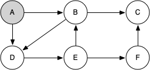
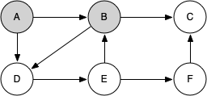
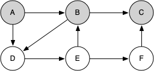
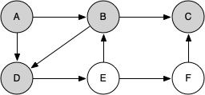
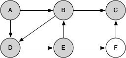
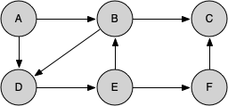

# 7.13. 实现骑士巡游

**7.13. Implementing Knight’s Tour**

=== "中文"

    The search algorithm we will use to solve the knight’s tour problem is called **depth-first search** (**DFS**).  Whereas the breadth-first search algorithm builds a search tree one level at a time, a depth-first search creates a search tree by exploring one branch of the tree as deeply as possible. In this section we will look at two algorithms that implement a depth-first search. The first algorithm we will look at specifically solves the knight’s tour problem by explicitly forbidding a node to be visited more than once. The second implementation is more general, but allows nodes to be visited more than once as the tree is constructed. The second version is used in subsequent sections to develop additional graph algorithms.
    
    The depth-first exploration of the graph is exactly what we need in order to find a path through 64 vertices (one for each square on the chessboard) and 63 edges. We will see that when the depth-first search algorithm finds a dead end (a place in the graph where there are no more moves possible) it backs up the tree to the next deepest vertex that allows it to make a legal move.
    
    The ``knight_tour`` function shown in `Listing 3` takes four parameters: ``n``, the current depth in the search tree; ``path``, a list of vertices visited up to this point; ``u``, the vertex in the graph we wish to explore; and ``limit``, the number of nodes in the path. The ``knight_tour`` function is recursive. When the ``knight_tour`` function is called, it first checks the base case condition. If we have a path that contains 64 vertices, we return from ``knight_tour`` with a status of ``True``, indicating that we have found a successful tour. If the path is not long enough, we continue to explore one level deeper by choosing a new vertex to explore and calling ``knight_tour`` recursively for that vertex.
    
    ```python title="Listing 3"
    from pythonds3.graphs import Graph
    
    
    def knight_tour(n, path, u, limit):
        u.color = "gray"
        path.append(u)
        if n < limit:
            neighbors = sorted(list(u.get_neighbors()))
            i = 0
            done = False
            while i < len(neighbors) and not done:
                if neighbors[i].color == "white":
                    done = knight_tour(n + 1, path, neighbors[i], limit)
                i = i + 1
            if not done:  # prepare to backtrack
                path.pop()
                u.color = "white"
        else:
            done = True
        return done
    ```
    
    DFS also uses colors to keep track of which vertices in the graph have been visited. Unvisited vertices are colored white, and visited vertices are colored gray. If all neighbors of a particular vertex have been explored and we have not yet reached our goal length of 64 vertices, we have reached a dead end and must backtrack. Backtracking happens when we return from ``knight_tour`` with a status of ``False``. In the breadth-first search we used a queue to keep track of which vertex to visit next. Since depth-first search is recursive, we are implicitly using a stack to help us with our backtracking. When we return from a call to ``knight_tour`` with a status of ``False``, in line 11,  we remain inside the ``while`` loop and look at the next vertex in ``neighbors``.
    
    Let's look at a simple example of ``knight_tour`` (`Listing 3`) in action. You can refer to the figures below to follow the steps of the search. For this example we will assume that the call to the ``get_neighbors`` method on line 6 orders the nodes in alphabetical order. We begin by calling ``knight_tour(0, path, A, 6)``.
    
    
    <figure markdown="span">
        
        <figcaption markdown="span">Figure 3: Start with Node A</figcaption>
    </figure>
    
    <figure markdown="span">
        
        <figcaption markdown="span">Figure 4: Explore B</figcaption>
    </figure>
    
    <figure markdown="span">
        
        <figcaption markdown="span">Figure 5: Node C is a Dead End</figcaption>
    </figure>
    
    <figure markdown="span">
        
        <figcaption markdown="span">Figure 6: Backtrack to B</figcaption>
    </figure>
    
    <figure markdown="span">
        
        <figcaption markdown="span">Figure 7: Explore D</figcaption>
    </figure>
    
    <figure markdown="span">
        
        <figcaption markdown="span">Figure 8: Explore E</figcaption>
    </figure>
    
    <figure markdown="span">
        
        <figcaption markdown="span">Figure 9: Explore F</figcaption>
    </figure>
    
    <figure markdown="span">
        
        <figcaption markdown="span">Figure 10: Finish</figcaption>
    </figure>
    
    ``knight_tour`` starts with node A in `Figure 3`. The nodes adjacent to A are B and D. Since B is before D alphabetically, DFS selects B to expand next as shown in `Figure 4`. Exploring B happens when ``knight_tour`` is called recursively. B is adjacent to C and D, so ``knight_tour`` elects to explore C next. However, as you can see in `Figure 5` node C is a dead end with no adjacent white nodes. At this point we change the color of node C back to white. The call to ``knight_tour`` returns a value of ``False``. The return from the recursive call effectively backtracks the search to vertex B (see `Figure 6`). The next vertex on the list to explore is vertex D, so ``knight_tour`` makes a recursive call moving to node D (see `Figure 7`). From vertex D on, ``knight_tour`` can continue to make recursive calls until we get to node C again (see `Figure 8`, `Figure 9`, and  `Figure 10`).  However, this time when we get to node C the test ``n < limit`` fails so we know that we have exhausted all the nodes in the graph. At this point we can return ``True`` to indicate that we have made a successful tour of the graph. When we return the list, ``path`` has the values ``[A, B, D, E, F, C]``, which is the order we need to traverse the graph to visit each node exactly once.
    
    
    `Figure 11` shows you what a complete tour around an $8 \times 8$ board looks like. There are many possible tours; some are symmetric. With some modification you can make circular tours that start and end at the same square.
    
    <figure markdown="span">
        
        <figcaption markdown="span">Figure 11: A Complete Tour of the Board Found by ``knight_tour``</figcaption>
    </figure>

=== "英文"

    The search algorithm we will use to solve the knight’s tour problem is called **depth-first search** (**DFS**).  Whereas the breadth-first search algorithm builds a search tree one level at a time, a depth-first search creates a search tree by exploring one branch of the tree as deeply as possible. In this section we will look at two algorithms that implement a depth-first search. The first algorithm we will look at specifically solves the knight’s tour problem by explicitly forbidding a node to be visited more than once. The second implementation is more general, but allows nodes to be visited more than once as the tree is constructed. The second version is used in subsequent sections to develop additional graph algorithms.
    
    The depth-first exploration of the graph is exactly what we need in order to find a path through 64 vertices (one for each square on the chessboard) and 63 edges. We will see that when the depth-first search algorithm finds a dead end (a place in the graph where there are no more moves possible) it backs up the tree to the next deepest vertex that allows it to make a legal move.
    
    The ``knight_tour`` function shown in `Listing 3` takes four parameters: ``n``, the current depth in the search tree; ``path``, a list of vertices visited up to this point; ``u``, the vertex in the graph we wish to explore; and ``limit``, the number of nodes in the path. The ``knight_tour`` function is recursive. When the ``knight_tour`` function is called, it first checks the base case condition. If we have a path that contains 64 vertices, we return from ``knight_tour`` with a status of ``True``, indicating that we have found a successful tour. If the path is not long enough, we continue to explore one level deeper by choosing a new vertex to explore and calling ``knight_tour`` recursively for that vertex.
    
    ```python title="Listing 3"
    from pythonds3.graphs import Graph
    
    
    def knight_tour(n, path, u, limit):
        u.color = "gray"
        path.append(u)
        if n < limit:
            neighbors = sorted(list(u.get_neighbors()))
            i = 0
            done = False
            while i < len(neighbors) and not done:
                if neighbors[i].color == "white":
                    done = knight_tour(n + 1, path, neighbors[i], limit)
                i = i + 1
            if not done:  # prepare to backtrack
                path.pop()
                u.color = "white"
        else:
            done = True
        return done
    ```
    
    DFS also uses colors to keep track of which vertices in the graph have been visited. Unvisited vertices are colored white, and visited vertices are colored gray. If all neighbors of a particular vertex have been explored and we have not yet reached our goal length of 64 vertices, we have reached a dead end and must backtrack. Backtracking happens when we return from ``knight_tour`` with a status of ``False``. In the breadth-first search we used a queue to keep track of which vertex to visit next. Since depth-first search is recursive, we are implicitly using a stack to help us with our backtracking. When we return from a call to ``knight_tour`` with a status of ``False``, in line 11,  we remain inside the ``while`` loop and look at the next vertex in ``neighbors``.
    
    Let's look at a simple example of ``knight_tour`` (`Listing 3`) in action. You can refer to the figures below to follow the steps of the search. For this example we will assume that the call to the ``get_neighbors`` method on line 6 orders the nodes in alphabetical order. We begin by calling ``knight_tour(0, path, A, 6)``.
    
    
    <figure markdown="span">
        
        <figcaption markdown="span">Figure 3: Start with Node A</figcaption>
    </figure>
    
    <figure markdown="span">
        
        <figcaption markdown="span">Figure 4: Explore B</figcaption>
    </figure>
    
    <figure markdown="span">
        
        <figcaption markdown="span">Figure 5: Node C is a Dead End</figcaption>
    </figure>
    
    <figure markdown="span">
        
        <figcaption markdown="span">Figure 6: Backtrack to B</figcaption>
    </figure>
    
    <figure markdown="span">
        
        <figcaption markdown="span">Figure 7: Explore D</figcaption>
    </figure>
    
    <figure markdown="span">
        
        <figcaption markdown="span">Figure 8: Explore E</figcaption>
    </figure>
    
    <figure markdown="span">
        
        <figcaption markdown="span">Figure 9: Explore F</figcaption>
    </figure>
    
    <figure markdown="span">
        
        <figcaption markdown="span">Figure 10: Finish</figcaption>
    </figure>
    
    ``knight_tour`` starts with node A in `Figure 3`. The nodes adjacent to A are B and D. Since B is before D alphabetically, DFS selects B to expand next as shown in `Figure 4`. Exploring B happens when ``knight_tour`` is called recursively. B is adjacent to C and D, so ``knight_tour`` elects to explore C next. However, as you can see in `Figure 5` node C is a dead end with no adjacent white nodes. At this point we change the color of node C back to white. The call to ``knight_tour`` returns a value of ``False``. The return from the recursive call effectively backtracks the search to vertex B (see `Figure 6`). The next vertex on the list to explore is vertex D, so ``knight_tour`` makes a recursive call moving to node D (see `Figure 7`). From vertex D on, ``knight_tour`` can continue to make recursive calls until we get to node C again (see `Figure 8`, `Figure 9`, and  `Figure 10`).  However, this time when we get to node C the test ``n < limit`` fails so we know that we have exhausted all the nodes in the graph. At this point we can return ``True`` to indicate that we have made a successful tour of the graph. When we return the list, ``path`` has the values ``[A, B, D, E, F, C]``, which is the order we need to traverse the graph to visit each node exactly once.
    
    
    `Figure 11` shows you what a complete tour around an $8 \times 8$ board looks like. There are many possible tours; some are symmetric. With some modification you can make circular tours that start and end at the same square.
    
    <figure markdown="span">
        
        <figcaption markdown="span">Figure 11: A Complete Tour of the Board Found by ``knight_tour``</figcaption>
    </figure>