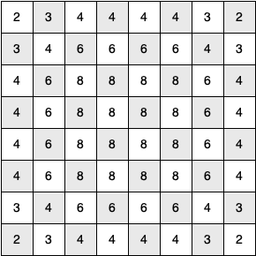

# 7.14. 骑士巡游分析

**7.14. Knight’s Tour Analysis**

=== "中文"

    关于骑士巡游问题还有一个最后有趣的话题，然后我们将进入深度优先搜索的一般版本。这个话题是性能。特别是，`knight_tour` 对选择下一个要访问的顶点的方法非常敏感。例如，在一个 $5 \times 5$ 的棋盘上，你可以在大约1.5秒内生成一个路径，在一台速度合理的计算机上。但是，如果你尝试一个 $8 \times 8$ 的棋盘，会发生什么呢？在这种情况下，取决于计算机的速度，你可能需要等待最长达半小时才能得到结果！原因是我们目前实现的骑士巡游问题是一个指数算法，大小为 $O(k^N)$，其中 $N$ 是棋盘上的方格数量，$k$ 是一个小常数。`图12` 可以帮助我们可视化为什么会这样。树的根表示搜索的起点。从那里，算法生成并检查骑士可以做出的每一个可能的移动。正如我们之前所提到的，可能的移动数量取决于骑士在棋盘上的位置。在角落处只有两个合法移动，在靠近角落的方格上有三个，在棋盘的中央有八个。`图13` 显示了每个位置的可能移动数量。在树的下一个层级，从我们当前探索的位置再次有两个到八个可能的下一个移动。可能要检查的位置数量对应于搜索树中的节点数量。
    
    <figure markdown="span">
        
        <figcaption markdown="span">图12：骑士巡游的搜索树</figcaption>
    </figure>
    
    <figure markdown="span">
        
        <figcaption markdown="span">图13：每个方格的可能移动数量</figcaption>
    </figure>
    
    我们已经看到，二叉树的节点数量是 $2^{N+1}-1$。对于每个节点最多有八个子节点的树，节点数量要大得多。由于每个节点的分支因子是可变的，我们可以使用平均分支因子来估算节点数量。需要注意的是，这个算法是指数级的：$k^{N+1}-1$，其中 $k$ 是棋盘的平均分支因子。让我们看看这种增长速度有多快！对于一个 $5 \times 5$ 的棋盘，树将有25层深，或者 $N = 24$，第一层计为0层。平均分支因子是 $k = 3.8$，所以搜索树中的节点数量是 $3.8^{25}-1$ 或 $3.12 \times 10^{14}$。对于一个 $6 \times 6$ 的棋盘，$k = 4.4$，节点数量是 $1.5 \times 10^{23}$，而对于一个常规的 $8 \times 8$ 棋盘，$k = 5.25$，节点数量是 $1.3 \times 10^{46}$。当然，由于问题有多个解决方案，我们不需要探索每一个节点，但我们必须探索的节点的分数部分只是一个常数倍数，这并不会改变问题的指数特性。我们将留给你一个练习，看看你是否能将 $k$ 表达为棋盘大小的函数。
    
    幸运的是，有一种方法可以加速 $8 \times 8$ 的情况，使其在不到一秒钟内完成。在 `Listing 4` 中，我们展示了加速 `knight_tour` 的代码。这个函数叫做 `order_by_avail`，将代替 `Listing 3` 中第8行的 `u.get_neighbors` 调用。`order_by_avail` 函数中的关键行是第10行。这一行确保我们选择下一个移动中可用的移动最少的顶点。你可能会觉得这样做真的不合逻辑；为什么不选择可用移动最多的节点呢？你可以通过自己运行程序并在排序后插入 `res_list.reverse()` 行来尝试这种方法。
    
    使用可用移动最多的顶点作为路径上的下一个顶点的问题在于，它倾向于使骑士在巡游的早期访问棋盘的中心方格。当这种情况发生时，骑士很容易被困在棋盘的一侧，无法到达棋盘另一侧未访问的方格。另一方面，首先访问可用移动最少的方格将推动骑士首先访问棋盘边缘的方格。这可以确保骑士在早期访问难以到达的角落，并且只有在必要时才使用中间方格跨越棋盘。
    
    利用这种知识来加速算法被称为 *启发式*。人们每天都使用启发式方法来帮助决策，而启发式搜索常用于人工智能领域。这种特定的启发式方法叫做 Warnsdorff 算法，以 H. C. von Warnsdorff 的名字命名，他在1823年发表了这个想法。
    
    ```python title="Listing 4" linenums="1"
    def order_by_avail(n):
        res_list = []
        for v in n.get_neighbors():
            if v.color == "white":
                c = 0
                for w in v.get_neighbors():
                    if w.color == "white":
                        c = c + 1
                res_list.append((c, v))
        res_list.sort(key=lambda x: x[0])
        return [y[1] for y in res_list]
    ```

=== "英文"


    There is one last interesting topic regarding the knight’s tour problem, then we will move on to the general version of the depth-first search. The topic is performance. In particular, ``knight_tour`` is very sensitive to the method you use to select the next vertex to visit. For example, on a $5 \times 5$ board you can produce a path in about 1.5 seconds on a reasonably fast computer. But what happens if you try an $8 \times 8$ board? In this case, depending on the speed of your computer, you may have to wait up to a half hour to get the results! The reason for this is that the knight’s tour problem as we have implemented it so far is an exponential algorithm of size $O(k^N)$, where $N$ is the number of squares on the chess board, and $k$ is a small constant. `Figure 12` can help us visualize why this is so. The root of the tree represents the starting point of the search. From there the algorithm generates and checks each of the possible moves the knight can make. As we have noted before, the number of moves possible depends on the position of the knight on the board. In the corners there are only two legal moves, on the squares adjacent to the corners there are three, and in the middle of the board there are eight. `Figure 13` shows the number of moves possible for each position on a board. At the next level of the tree there are once again between two and eight possible next moves from the position we are currently exploring. The number of possible positions to examine corresponds to the number of nodes in the search tree.
    
    <figure markdown="span">
        
        <figcaption markdown="span">Figure 12: A Search Tree for the Knight’s Tour </figcaption>
    </figure>
    
    <figure markdown="span">
        
        <figcaption markdown="span">Figure 13: The Number of Possible Moves for Each Square</figcaption>
    </figure>
    
    We have already seen that the number of nodes in a binary tree of height $N$ is $2^{N+1}-1$. For a tree with nodes that may have up to eight children instead of two, the number of nodes is much larger. Because the branching factor of each node is variable, we could estimate the number of nodes using an average branching factor. The important thing to note is that this algorithm is exponential: $k^{N+1}-1$, where $k$ is the average branching factor for the board. Let’s look at how rapidly this grows! For a board that is $5 \times 5$ the tree will be 25 levels deep, or $N = 24$ counting the first level as level 0. The average branching factor is $k = 3.8$ so the number of nodes in the search tree is $3.8^{25}-1$ or $3.12 \times 10^{14}$. For a $6 \times 6$ board, $k = 4.4$, there are $1.5 \times 10^{23}$ nodes, and for a regular $8 \times 8$ chess board, $k = 5.25$, there are $1.3 \times 10^{46}$. Of course, since there are multiple solutions to the problem we won’t have to explore every single node, but the fractional part of the nodes we do have to explore is just a constant multiplier which does not change the exponential nature of the problem. We will leave it as an exercise for you to see if you can express $k$ as a function of the board size.
    
    Luckily there is a way to speed up the $8 \times 8$ case so that it runs in under one second. In the `Listing 4` we show the code that speeds up the ``knight_tour``. This function, called ``order_by_avail``, will be used in place of the call to ``u.get_neighbors`` at line 8 in `Listing 3`. The critical line in the ``order_by_avail`` function is line 10. This line ensures that we select the vertex that has the fewest available moves to go next. You might think this is really counterproductive; why not select the node that has the most available moves? You can try that approach easily by running the program yourself and inserting the line ``res_list.reverse()`` right after the sort.
    
    The problem with using the vertex with the most available moves as your next vertex on the path is that it tends to have the knight visit the middle squares early on in the tour. When this happens it is easy for the knight to get stranded on one side of the board where it cannot reach unvisited squares on the other side of the board. On the other hand, visiting the squares with the fewest available moves first pushes the knight to visit the squares around the edges of the board first. This ensures that the knight will visit the hard-to-reach corners early and can use the middle squares to hop across the board only when necessary.
    
    Utilizing this kind of knowledge to speed up an algorithm is called a *heuristic*. Humans use heuristics every day to help make decisions, and heuristic searches are often used in the field of artificial intelligence. This particular heuristic is called Warnsdorff’s algorithm, named after H. C. von Warnsdorff who published his idea in 1823.
    
    ```python title="Listing 4" linenums="1"
    def order_by_avail(n):
        res_list = []
        for v in n.get_neighbors():
            if v.color == "white":
                c = 0
                for w in v.get_neighbors():
                    if w.color == "white":
                        c = c + 1
                res_list.append((c, v))
        res_list.sort(key=lambda x: x[0])
        return [y[1] for y in res_list]
    ``` 

