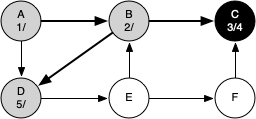
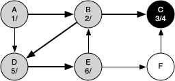
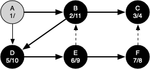

# 7.15. 一般的深度优先搜索

**7.15. General Depth-First Search**

=== "中文"


    The knight’s tour is a special case of a depth-first search where the goal is to create the deepest depth-first tree without any branches. The more general depth-first search is actually easier. Its goal is to search as deeply as possible, connecting as many nodes in the graph as possible and branching where necessary.
    
    It is even possible that a depth-first search will create more than one tree. When the depth-first search algorithm creates a group of trees we call this a **depth-first forest**. As with the breadth-first search, our depth-first search makes use of predecessor links to construct the tree. In addition, the depth-first search will make use of two additional instance variables in the ``Vertex`` class. The new instance variables are the discovery and closing times. The discovery time tracks the number of steps in the algorithm before a vertex is first encountered. The closing time is the number of steps in the algorithm before a vertex is colored black. As we will see after looking at the algorithm, the discovery and closing times of the nodes provide some interesting properties we can use in later algorithms.
    
    The code for our depth-first search is shown in `Listing 5 <lst_dfsgeneral>`. Since the two functions ``dfs`` and its helper ``dfs_visit`` use a variable to keep track of the time across calls to ``dfs_visit``, we chose to implement the code as methods of a class that inherits from the ``Graph`` class. This implementation extends the graph class by adding a ``time`` instance variable and the two methods ``dfs`` and ``dfs_visit``. Looking at line 11 you will notice that the ``dfs`` method iterates over all of the vertices in the graph calling ``dfs_visit`` on the nodes that are white. The reason we iterate over all the nodes, rather than simply searching from a chosen starting node, is to make sure that all nodes in the graph are considered and that no vertices are left out of the depth-first forest. It may look unusual to see the statement ``for vertex in self``, but remember that in this case ``self`` is an instance of the ``DFSGraph`` class, and iterating over all the vertices in an instance of a graph is a natural thing to do.
    
    ```python title="Listing 5" linenums="1"
    from pythonds3.graphs import Graph
    
    
    class DFSGraph(Graph):
        def __init__(self):
            super().__init__()
            self.time = 0
    
        def dfs(self):
            for vertex in self:
                vertex.color = "white"
                vertex.previous = -1
            for vertex in self:
                if vertex.color == "white":
                    self.dfs_visit(vertex)
    
        def dfs_visit(self, start_vertex):
            start_vertex.color = "gray"
            self.time = self.time + 1
            start_vertex.discovery_time = self.time
            for next_vertex in start_vertex.get_neighbors():
                if next_vertex.color == "white":
                    next_vertex.previous = start_vertex
                    self.dfs_visit(next_vertex)
            start_vertex.color = "black"
            self.time = self.time + 1
            start_vertex.closing_time = self.time
    ```
    
    Although our implementation of ``bfs`` is only interested in considering nodes for which there is a path leading back to the start, it is possible to create a breadth-first forest that represents the shortest path between all pairs of nodes in the graph. We leave this as an exercise. In our next two algorithms we will see why keeping track of the depth-first forest is important.
    
    The ``dfs_visit`` method starts with a single vertex called ``start_vertex`` and explores all of the neighboring white vertices as deeply as possible. If you look carefully at the code for ``dfs_visit`` and compare it to breadth-first search, what you should notice is that the ``dfs_visit`` algorithm is almost identical to ``bfs`` except that on the last line of the inner ``for`` loop, ``dfs_visit`` calls itself recursively to continue the search at a deeper level, whereas ``bfs`` adds the node to a queue for later exploration. It is interesting to note that where ``bfs`` uses a queue, ``dfs_visit`` uses a stack. You don’t see a stack in the code, but it is implicit in the recursive call to ``dfs_visit``.
    
    The following sequence of figures illustrates the depth-first search algorithm in action for a small graph. In these figures, the dotted lines indicate edges that are checked, but the node at the other end of the edge has already been added to the depth-first tree. In the code this test is done by checking that the color of the other node is not white.
    
    
    <figure markdown="span">
        
        <figcaption markdown="span">Figure 14: Constructing the Depth-First Search Tree-10</figcaption>
    </figure>
    
    <figure markdown="span">
        
        <figcaption markdown="span">Figure 15: Constructing the Depth-First Search Tree-11</figcaption>
    </figure>
    
    <figure markdown="span">
        
        <figcaption markdown="span">Figure 16: Constructing the Depth-First Search Tree-12</figcaption>
    </figure>
    
    <figure markdown="span">
        
        <figcaption markdown="span">Figure 17: Constructing the Depth-First Search Tree-13</figcaption>
    </figure>
    
    <figure markdown="span">
        
        <figcaption markdown="span">Figure 18: Constructing the Depth-First Search Tree-14</figcaption>
    </figure>
    
    <figure markdown="span">
        
        <figcaption markdown="span">Figure 19: Constructing the Depth-First Search Tree-15</figcaption>
    </figure>
    
    <figure markdown="span">
        
        <figcaption markdown="span">Figure 20: Constructing the Depth-First Search Tree-16</figcaption>
    </figure>
    
    <figure markdown="span">
        
        <figcaption markdown="span">Figure 21: Constructing the Depth-First Search Tree-17</figcaption>
    </figure>
    
    
    <figure markdown="span">
        
        <figcaption markdown="span">Figure 22: Constructing the Depth-First Search Tree-18</figcaption>
    </figure>
    
    <figure markdown="span">
        
        <figcaption markdown="span">Figure 23: Constructing the Depth-First Search Tree-19</figcaption>
    </figure>
    
    <figure markdown="span">
        
        <figcaption markdown="span">Figure 24: Constructing the Depth-First Search Tree-20</figcaption>
    </figure>
    
    <figure markdown="span">
        
        <figcaption markdown="span">Figure 25: Constructing the Depth-First Search Tree-21</figcaption>
    </figure>
    
    The search begins at vertex A of the graph (`Figure 14`). Since all of the vertices are white at the beginning of the search the algorithm visits vertex A. The first step in visiting a vertex is to set the color to gray, which indicates that the vertex is being explored, and the discovery time is set to 1. Since vertex A has two adjacent vertices (B, D) each of those need to be visited as well. We’ll make the arbitrary decision that we will visit the adjacent vertices in alphabetical order.
    
    Vertex B is visited next (`Figure 15`), so its color is set to gray and its discovery time is set to 2. Vertex B is also adjacent to two other nodes (C, D) so we will follow the alphabetical order and visit node C next.
    
    Visiting vertex C (`Figure 16`) brings us to the end of one branch of the tree. After coloring the node gray and setting its discovery time to 3, the algorithm also determines that there are no adjacent vertices to C. This means that we are done exploring node C and so we can color the vertex black and set the closing time to 4. You can see the state of our search at this point in `Figure 17`.
    
    Since vertex C is the end of one branch, we now return to vertex B and continue exploring the nodes adjacent to B. The only additional vertex to explore from B is D, so we can now visit D (`Figure 18`) and continue our search from vertex D. Vertex D quickly leads us to vertex E (`Figure 19`). Vertex E has two adjacent vertices, B and F. Normally we would explore these adjacent vertices alphabetically, but since B is already colored gray the algorithm recognizes that it should not visit B since doing so would put the algorithm in a loop! So exploration continues with the next vertex in the list, namely F (`Figure 20`).
    
    Vertex F has only one adjacent vertex, C, but since C is colored black there is nothing else to explore, and the algorithm has reached the end of another branch. From here on, you will see in `Figure 21` through `Figure 25` that the algorithm works its way back to the first node, setting closing times and coloring vertices black.
         
    The discovery and closing times for each node display a property called the **parenthesis property**. This property means that all the children of a particular node in the depth-first tree have a later discovery time and an earlier closing time than their parent. `Figure 26` shows the tree constructed by the depth-first search algorithm.
    
    <figure markdown="span">
        
        <figcaption markdown="span">Figure 26: The Resulting Depth-First Search Tree</figcaption>
    </figure>

=== "英文"


    The knight’s tour is a special case of a depth-first search where the goal is to create the deepest depth-first tree without any branches. The more general depth-first search is actually easier. Its goal is to search as deeply as possible, connecting as many nodes in the graph as possible and branching where necessary.
    
    It is even possible that a depth-first search will create more than one tree. When the depth-first search algorithm creates a group of trees we call this a **depth-first forest**. As with the breadth-first search, our depth-first search makes use of predecessor links to construct the tree. In addition, the depth-first search will make use of two additional instance variables in the ``Vertex`` class. The new instance variables are the discovery and closing times. The discovery time tracks the number of steps in the algorithm before a vertex is first encountered. The closing time is the number of steps in the algorithm before a vertex is colored black. As we will see after looking at the algorithm, the discovery and closing times of the nodes provide some interesting properties we can use in later algorithms.
    
    The code for our depth-first search is shown in `Listing 5 <lst_dfsgeneral>`. Since the two functions ``dfs`` and its helper ``dfs_visit`` use a variable to keep track of the time across calls to ``dfs_visit``, we chose to implement the code as methods of a class that inherits from the ``Graph`` class. This implementation extends the graph class by adding a ``time`` instance variable and the two methods ``dfs`` and ``dfs_visit``. Looking at line 11 you will notice that the ``dfs`` method iterates over all of the vertices in the graph calling ``dfs_visit`` on the nodes that are white. The reason we iterate over all the nodes, rather than simply searching from a chosen starting node, is to make sure that all nodes in the graph are considered and that no vertices are left out of the depth-first forest. It may look unusual to see the statement ``for vertex in self``, but remember that in this case ``self`` is an instance of the ``DFSGraph`` class, and iterating over all the vertices in an instance of a graph is a natural thing to do.
    
    ```python title="Listing 5" linenums="1"
    from pythonds3.graphs import Graph
    
    
    class DFSGraph(Graph):
        def __init__(self):
            super().__init__()
            self.time = 0
    
        def dfs(self):
            for vertex in self:
                vertex.color = "white"
                vertex.previous = -1
            for vertex in self:
                if vertex.color == "white":
                    self.dfs_visit(vertex)
    
        def dfs_visit(self, start_vertex):
            start_vertex.color = "gray"
            self.time = self.time + 1
            start_vertex.discovery_time = self.time
            for next_vertex in start_vertex.get_neighbors():
                if next_vertex.color == "white":
                    next_vertex.previous = start_vertex
                    self.dfs_visit(next_vertex)
            start_vertex.color = "black"
            self.time = self.time + 1
            start_vertex.closing_time = self.time
    ```
    
    Although our implementation of ``bfs`` is only interested in considering nodes for which there is a path leading back to the start, it is possible to create a breadth-first forest that represents the shortest path between all pairs of nodes in the graph. We leave this as an exercise. In our next two algorithms we will see why keeping track of the depth-first forest is important.
    
    The ``dfs_visit`` method starts with a single vertex called ``start_vertex`` and explores all of the neighboring white vertices as deeply as possible. If you look carefully at the code for ``dfs_visit`` and compare it to breadth-first search, what you should notice is that the ``dfs_visit`` algorithm is almost identical to ``bfs`` except that on the last line of the inner ``for`` loop, ``dfs_visit`` calls itself recursively to continue the search at a deeper level, whereas ``bfs`` adds the node to a queue for later exploration. It is interesting to note that where ``bfs`` uses a queue, ``dfs_visit`` uses a stack. You don’t see a stack in the code, but it is implicit in the recursive call to ``dfs_visit``.
    
    The following sequence of figures illustrates the depth-first search algorithm in action for a small graph. In these figures, the dotted lines indicate edges that are checked, but the node at the other end of the edge has already been added to the depth-first tree. In the code this test is done by checking that the color of the other node is not white.
    
    
    <figure markdown="span">
        
        <figcaption markdown="span">Figure 14: Constructing the Depth-First Search Tree-10</figcaption>
    </figure>
    
    <figure markdown="span">
        
        <figcaption markdown="span">Figure 15: Constructing the Depth-First Search Tree-11</figcaption>
    </figure>
    
    <figure markdown="span">
        
        <figcaption markdown="span">Figure 16: Constructing the Depth-First Search Tree-12</figcaption>
    </figure>
    
    <figure markdown="span">
        
        <figcaption markdown="span">Figure 17: Constructing the Depth-First Search Tree-13</figcaption>
    </figure>
    
    <figure markdown="span">
        
        <figcaption markdown="span">Figure 18: Constructing the Depth-First Search Tree-14</figcaption>
    </figure>
    
    <figure markdown="span">
        
        <figcaption markdown="span">Figure 19: Constructing the Depth-First Search Tree-15</figcaption>
    </figure>
    
    <figure markdown="span">
        
        <figcaption markdown="span">Figure 20: Constructing the Depth-First Search Tree-16</figcaption>
    </figure>
    
    <figure markdown="span">
        
        <figcaption markdown="span">Figure 21: Constructing the Depth-First Search Tree-17</figcaption>
    </figure>
    
    
    <figure markdown="span">
        
        <figcaption markdown="span">Figure 22: Constructing the Depth-First Search Tree-18</figcaption>
    </figure>
    
    <figure markdown="span">
        
        <figcaption markdown="span">Figure 23: Constructing the Depth-First Search Tree-19</figcaption>
    </figure>
    
    <figure markdown="span">
        
        <figcaption markdown="span">Figure 24: Constructing the Depth-First Search Tree-20</figcaption>
    </figure>
    
    <figure markdown="span">
        
        <figcaption markdown="span">Figure 25: Constructing the Depth-First Search Tree-21</figcaption>
    </figure>
    
    The search begins at vertex A of the graph (`Figure 14`). Since all of the vertices are white at the beginning of the search the algorithm visits vertex A. The first step in visiting a vertex is to set the color to gray, which indicates that the vertex is being explored, and the discovery time is set to 1. Since vertex A has two adjacent vertices (B, D) each of those need to be visited as well. We’ll make the arbitrary decision that we will visit the adjacent vertices in alphabetical order.
    
    Vertex B is visited next (`Figure 15`), so its color is set to gray and its discovery time is set to 2. Vertex B is also adjacent to two other nodes (C, D) so we will follow the alphabetical order and visit node C next.
    
    Visiting vertex C (`Figure 16`) brings us to the end of one branch of the tree. After coloring the node gray and setting its discovery time to 3, the algorithm also determines that there are no adjacent vertices to C. This means that we are done exploring node C and so we can color the vertex black and set the closing time to 4. You can see the state of our search at this point in `Figure 17`.
    
    Since vertex C is the end of one branch, we now return to vertex B and continue exploring the nodes adjacent to B. The only additional vertex to explore from B is D, so we can now visit D (`Figure 18`) and continue our search from vertex D. Vertex D quickly leads us to vertex E (`Figure 19`). Vertex E has two adjacent vertices, B and F. Normally we would explore these adjacent vertices alphabetically, but since B is already colored gray the algorithm recognizes that it should not visit B since doing so would put the algorithm in a loop! So exploration continues with the next vertex in the list, namely F (`Figure 20`).
    
    Vertex F has only one adjacent vertex, C, but since C is colored black there is nothing else to explore, and the algorithm has reached the end of another branch. From here on, you will see in `Figure 21` through `Figure 25` that the algorithm works its way back to the first node, setting closing times and coloring vertices black.
         
    The discovery and closing times for each node display a property called the **parenthesis property**. This property means that all the children of a particular node in the depth-first tree have a later discovery time and an earlier closing time than their parent. `Figure 26` shows the tree constructed by the depth-first search algorithm.
    
    <figure markdown="span">
        
        <figcaption markdown="span">Figure 26: The Resulting Depth-First Search Tree</figcaption>
    </figure>
