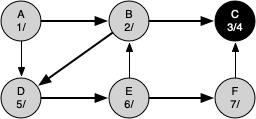

# 7.15. 一般的深度优先搜索

**7.15. General Depth-First Search**

=== "中文"

    骑士巡游问题是深度优先搜索（DFS）的一个特例，其目标是创建一个最深的深度优先树而没有任何分支。更一般的深度优先搜索其实更简单。它的目标是尽可能深地搜索，连接图中尽可能多的节点，并在必要时进行分支。
    
    甚至有可能深度优先搜索会创建多个树。当深度优先搜索算法创建一组树时，我们称之为**深度优先森林**。与广度优先搜索类似，我们的深度优先搜索使用前驱链接来构造树。此外，深度优先搜索将使用 `Vertex` 类中的两个额外实例变量。新的实例变量是发现时间和结束时间。发现时间记录算法在第一次遇到一个顶点之前经过的步骤数。结束时间是算法在一个顶点被染成黑色之前经过的步骤数。正如我们在查看算法后将看到的，节点的发现时间和结束时间提供了一些有趣的属性，我们可以在后续算法中使用。
    
    我们的深度优先搜索代码在 `Listing 5` 中展示。由于两个函数 `dfs` 和它的辅助函数 `dfs_visit` 使用一个变量来跟踪跨调用 `dfs_visit` 的时间，我们选择将代码实现为继承自 `Graph` 类的一个类的方法。这种实现通过添加 `time` 实例变量和两个方法 `dfs` 和 `dfs_visit` 来扩展图类。查看第11行，你会发现 `dfs` 方法遍历图中的所有顶点，对每个白色节点调用 `dfs_visit`。我们遍历所有节点，而不是仅从选定的起始节点开始搜索，是为了确保图中的所有节点都被考虑到，并且没有顶点被遗漏在深度优先森林之外。看到 `for vertex in self` 这样的语句可能会觉得不寻常，但请记住，在这种情况下，`self` 是 `DFSGraph` 类的一个实例，在图的实例中遍历所有顶点是自然的操作。
    
    ```python title="Listing 5" linenums="1"
    from pythonds3.graphs import Graph
    
    
    class DFSGraph(Graph):
        def __init__(self):
            super().__init__()
            self.time = 0
    
        def dfs(self):
            for vertex in self:
                vertex.color = "white"
                vertex.previous = -1
            for vertex in self:
                if vertex.color == "white":
                    self.dfs_visit(vertex)
    
        def dfs_visit(self, start_vertex):
            start_vertex.color = "gray"
            self.time = self.time + 1
            start_vertex.discovery_time = self.time
            for next_vertex in start_vertex.get_neighbors():
                if next_vertex.color == "white":
                    next_vertex.previous = start_vertex
                    self.dfs_visit(next_vertex)
            start_vertex.color = "black"
            self.time = self.time + 1
            start_vertex.closing_time = self.time
    ```
    
    尽管我们对 `bfs` 的实现只关注那些可以通过路径返回起始点的节点，但实际上可以创建一个广度优先森林，表示图中所有节点对之间的最短路径。我们将此留作练习。在接下来的两个算法中，我们将看到跟踪深度优先森林为什么很重要。
    
    `dfs_visit` 方法从一个名为 `start_vertex` 的顶点开始，尽可能深地探索所有邻近的白色顶点。如果你仔细查看 `dfs_visit` 的代码并与广度优先搜索比较，你会发现 `dfs_visit` 算法几乎与 `bfs` 相同，除了在内层 `for` 循环的最后一行，`dfs_visit` 递归调用自身以继续在更深层次进行搜索，而 `bfs` 则将节点添加到队列中以便稍后探索。值得注意的是，`bfs` 使用队列，而 `dfs_visit` 使用栈。你在代码中看不到栈，但它在递归调用 `dfs_visit` 中是隐式存在的。
    
    以下一系列图示例演示了深度优先搜索算法在小型图上的实际操作。在这些图中，虚线表示已检查的边，但边的另一端的节点已经被添加到深度优先树中。在代码中，这个测试是通过检查另一个节点的颜色是否不是白色来完成的。
    
    <figure markdown="span">
        
        <figcaption markdown="span">图14：构造深度优先搜索树-10</figcaption>
    </figure>
    
    <figure markdown="span">
        
        <figcaption markdown="span">图15：构造深度优先搜索树-11</figcaption>
    </figure>
    
    <figure markdown="span">
        
        <figcaption markdown="span">图16：构造深度优先搜索树-12</figcaption>
    </figure>
    
    <figure markdown="span">
        
        <figcaption markdown="span">图17：构造深度优先搜索树-13</figcaption>
    </figure>
    
    <figure markdown="span">
        
        <figcaption markdown="span">图18：构造深度优先搜索树-14</figcaption>
    </figure>
    
    <figure markdown="span">
        
        <figcaption markdown="span">图19：构造深度优先搜索树-15</figcaption>
    </figure>
    
    <figure markdown="span">
        
        <figcaption markdown="span">图20：构造深度优先搜索树-16</figcaption>
    </figure>
    
    <figure markdown="span">
        
        <figcaption markdown="span">图21：构造深度优先搜索树-17</figcaption>
    </figure>
    
    <figure markdown="span">
        
        <figcaption markdown="span">图22：构造深度优先搜索树-18</figcaption>
    </figure>
    
    <figure markdown="span">
        
        <figcaption markdown="span">图23：构造深度优先搜索树-19</figcaption>
    </figure>
    
    <figure markdown="span">
        
        <figcaption markdown="span">图24：构造深度优先搜索树-20</figcaption>
    </figure>
    
    <figure markdown="span">
        
        <figcaption markdown="span">图25：构造深度优先搜索树-21</figcaption>
    </figure>
    
    搜索从图中的顶点 A 开始（`图14`）。由于在搜索开始时所有顶点都是白色的，因此算法访问顶点 A。访问顶点的第一步是将颜色设置为灰色，这表示该顶点正在被探索，同时将发现时间设置为 1。由于顶点 A 有两个相邻顶点（B 和 D），所以这些顶点也需要被访问。我们将任意决定按字母顺序访问相邻的顶点。
    
    接下来访问顶点 B（`图15`），将其颜色设置为灰色，发现时间设置为 2。顶点 B 也与两个其他节点（C 和 D）相邻，因此我们将按字母顺序访问节点 C。
    
    访问顶点 C（`图16`）使我们到达树的一个分支的末端。将节点颜色设置为灰色并将其发现时间设置为 3 后，算法还确定 C 没有相邻的顶点。这意味着我们已经完成了对节点 C 的探索，因此可以将顶点的颜色设置为黑色，并将结束时间设置为 4。你可以在此时在 `图17` 中看到我们搜索的状态。
    
    由于顶点 C 是一个分支的末端，我们现在返回到顶点 B，继续探索 B 的相邻节点。从 B 探索的唯一额外顶点是 D，因此我们现在可以访问 D（`图18`），并从顶点 D 继续搜索。顶点 D 很快将我们引导到顶点 E（`图19`）。顶点 E 有两个相邻的顶点，B 和 F。通常我们会按字母顺序探索这些相邻顶点，但由于 B 已经被染成灰色，算法识别到不应访问 B，因为这样会使算法陷入循环！因此探索继续进行下一个顶点，即 F（`图20`）。
    
    顶点 F 只有一个相邻的顶点 C，但由于 C 已经被染成黑色，因此没有其他需要探索的内容，算法已经到达另一个分支的末端。从这里开始，你将看到 `图21` 到 `图25` 中，算法将逐步回到第一个节点，设置结束时间并将顶点染成黑色。
    
    每个节点的发现时间和结束时间展示了一个称为**括号性质**的属性。这个属性
    
    意味着深度优先树中特定节点的所有子节点都有比其父节点晚的发现时间和早的结束时间。`图26` 显示了由深度优先搜索算法构造的树。

=== "英文"


    The knight’s tour is a special case of a depth-first search where the goal is to create the deepest depth-first tree without any branches. The more general depth-first search is actually easier. Its goal is to search as deeply as possible, connecting as many nodes in the graph as possible and branching where necessary.
    
    It is even possible that a depth-first search will create more than one tree. When the depth-first search algorithm creates a group of trees we call this a **depth-first forest**. As with the breadth-first search, our depth-first search makes use of predecessor links to construct the tree. In addition, the depth-first search will make use of two additional instance variables in the ``Vertex`` class. The new instance variables are the discovery and closing times. The discovery time tracks the number of steps in the algorithm before a vertex is first encountered. The closing time is the number of steps in the algorithm before a vertex is colored black. As we will see after looking at the algorithm, the discovery and closing times of the nodes provide some interesting properties we can use in later algorithms.
    
    The code for our depth-first search is shown in `Listing 5 <lst_dfsgeneral>`. Since the two functions ``dfs`` and its helper ``dfs_visit`` use a variable to keep track of the time across calls to ``dfs_visit``, we chose to implement the code as methods of a class that inherits from the ``Graph`` class. This implementation extends the graph class by adding a ``time`` instance variable and the two methods ``dfs`` and ``dfs_visit``. Looking at line 11 you will notice that the ``dfs`` method iterates over all of the vertices in the graph calling ``dfs_visit`` on the nodes that are white. The reason we iterate over all the nodes, rather than simply searching from a chosen starting node, is to make sure that all nodes in the graph are considered and that no vertices are left out of the depth-first forest. It may look unusual to see the statement ``for vertex in self``, but remember that in this case ``self`` is an instance of the ``DFSGraph`` class, and iterating over all the vertices in an instance of a graph is a natural thing to do.
    
    ```python title="Listing 5" linenums="1"
    from pythonds3.graphs import Graph
    
    
    class DFSGraph(Graph):
        def __init__(self):
            super().__init__()
            self.time = 0
    
        def dfs(self):
            for vertex in self:
                vertex.color = "white"
                vertex.previous = -1
            for vertex in self:
                if vertex.color == "white":
                    self.dfs_visit(vertex)
    
        def dfs_visit(self, start_vertex):
            start_vertex.color = "gray"
            self.time = self.time + 1
            start_vertex.discovery_time = self.time
            for next_vertex in start_vertex.get_neighbors():
                if next_vertex.color == "white":
                    next_vertex.previous = start_vertex
                    self.dfs_visit(next_vertex)
            start_vertex.color = "black"
            self.time = self.time + 1
            start_vertex.closing_time = self.time
    ```
    
    Although our implementation of ``bfs`` is only interested in considering nodes for which there is a path leading back to the start, it is possible to create a breadth-first forest that represents the shortest path between all pairs of nodes in the graph. We leave this as an exercise. In our next two algorithms we will see why keeping track of the depth-first forest is important.
    
    The ``dfs_visit`` method starts with a single vertex called ``start_vertex`` and explores all of the neighboring white vertices as deeply as possible. If you look carefully at the code for ``dfs_visit`` and compare it to breadth-first search, what you should notice is that the ``dfs_visit`` algorithm is almost identical to ``bfs`` except that on the last line of the inner ``for`` loop, ``dfs_visit`` calls itself recursively to continue the search at a deeper level, whereas ``bfs`` adds the node to a queue for later exploration. It is interesting to note that where ``bfs`` uses a queue, ``dfs_visit`` uses a stack. You don’t see a stack in the code, but it is implicit in the recursive call to ``dfs_visit``.
    
    The following sequence of figures illustrates the depth-first search algorithm in action for a small graph. In these figures, the dotted lines indicate edges that are checked, but the node at the other end of the edge has already been added to the depth-first tree. In the code this test is done by checking that the color of the other node is not white.
    
    
    <figure markdown="span">
        
        <figcaption markdown="span">Figure 14: Constructing the Depth-First Search Tree-10</figcaption>
    </figure>
    
    <figure markdown="span">
        
        <figcaption markdown="span">Figure 15: Constructing the Depth-First Search Tree-11</figcaption>
    </figure>
    
    <figure markdown="span">
        
        <figcaption markdown="span">Figure 16: Constructing the Depth-First Search Tree-12</figcaption>
    </figure>
    
    <figure markdown="span">
        
        <figcaption markdown="span">Figure 17: Constructing the Depth-First Search Tree-13</figcaption>
    </figure>
    
    <figure markdown="span">
        
        <figcaption markdown="span">Figure 18: Constructing the Depth-First Search Tree-14</figcaption>
    </figure>
    
    <figure markdown="span">
        
        <figcaption markdown="span">Figure 19: Constructing the Depth-First Search Tree-15</figcaption>
    </figure>
    
    <figure markdown="span">
        
        <figcaption markdown="span">Figure 20: Constructing the Depth-First Search Tree-16</figcaption>
    </figure>
    
    <figure markdown="span">
        
        <figcaption markdown="span">Figure 21: Constructing the Depth-First Search Tree-17</figcaption>
    </figure>
    
    
    <figure markdown="span">
        
        <figcaption markdown="span">Figure 22: Constructing the Depth-First Search Tree-18</figcaption>
    </figure>
    
    <figure markdown="span">
        
        <figcaption markdown="span">Figure 23: Constructing the Depth-First Search Tree-19</figcaption>
    </figure>
    
    <figure markdown="span">
        
        <figcaption markdown="span">Figure 24: Constructing the Depth-First Search Tree-20</figcaption>
    </figure>
    
    <figure markdown="span">
        
        <figcaption markdown="span">Figure 25: Constructing the Depth-First Search Tree-21</figcaption>
    </figure>
    
    The search begins at vertex A of the graph (`Figure 14`). Since all of the vertices are white at the beginning of the search the algorithm visits vertex A. The first step in visiting a vertex is to set the color to gray, which indicates that the vertex is being explored, and the discovery time is set to 1. Since vertex A has two adjacent vertices (B, D) each of those need to be visited as well. We’ll make the arbitrary decision that we will visit the adjacent vertices in alphabetical order.
    
    Vertex B is visited next (`Figure 15`), so its color is set to gray and its discovery time is set to 2. Vertex B is also adjacent to two other nodes (C, D) so we will follow the alphabetical order and visit node C next.
    
    Visiting vertex C (`Figure 16`) brings us to the end of one branch of the tree. After coloring the node gray and setting its discovery time to 3, the algorithm also determines that there are no adjacent vertices to C. This means that we are done exploring node C and so we can color the vertex black and set the closing time to 4. You can see the state of our search at this point in `Figure 17`.
    
    Since vertex C is the end of one branch, we now return to vertex B and continue exploring the nodes adjacent to B. The only additional vertex to explore from B is D, so we can now visit D (`Figure 18`) and continue our search from vertex D. Vertex D quickly leads us to vertex E (`Figure 19`). Vertex E has two adjacent vertices, B and F. Normally we would explore these adjacent vertices alphabetically, but since B is already colored gray the algorithm recognizes that it should not visit B since doing so would put the algorithm in a loop! So exploration continues with the next vertex in the list, namely F (`Figure 20`).
    
    Vertex F has only one adjacent vertex, C, but since C is colored black there is nothing else to explore, and the algorithm has reached the end of another branch. From here on, you will see in `Figure 21` through `Figure 25` that the algorithm works its way back to the first node, setting closing times and coloring vertices black.
         
    The discovery and closing times for each node display a property called the **parenthesis property**. This property means that all the children of a particular node in the depth-first tree have a later discovery time and an earlier closing time than their parent. `Figure 26` shows the tree constructed by the depth-first search algorithm.
    
    <figure markdown="span">
        
        <figcaption markdown="span">Figure 26: The Resulting Depth-First Search Tree</figcaption>
    </figure>
