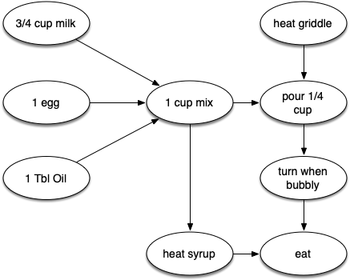
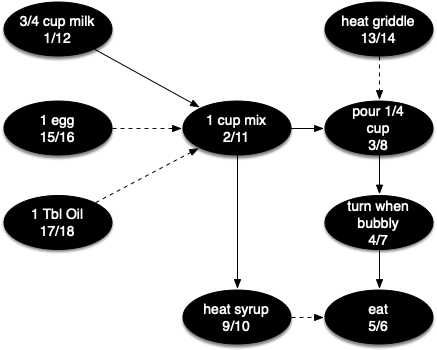
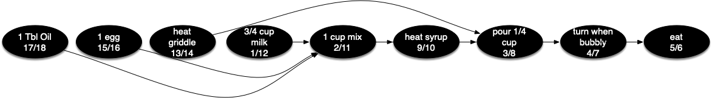

# 7.17. 拓扑排序

**7.17. Topological Sorting**

=== "中文"

    为了展示计算机科学家如何将几乎任何问题转化为图论问题，我们来考虑一个制作煎饼的难题。这个食谱其实非常简单：1 个鸡蛋，1 杯煎饼混合粉，1 汤匙油和 $3 \over 4$ 杯牛奶。制作煎饼的步骤包括加热煎锅、将所有成分混合在一起，并将混合物倒在热煎锅上。当煎饼开始冒泡时，需要将它们翻转，并让它们在底部变成金黄色后再食用。在吃煎饼之前，你还需要加热一些糖浆。`图 27` 以依赖图的形式展示了这一过程。
    
    <figure markdown="span">
        
        <figcaption markdown="span">图 27: 制作煎饼的步骤</figcaption>
    </figure>
    
    制作煎饼的难点在于知道先做什么。从 `图 27` 可以看出，你可能会从加热煎锅开始，或者从将任何成分加入煎饼混合粉开始。为了帮助我们确定完成煎饼所需每一步的准确顺序，我们使用一种称为**拓扑排序**的图算法。
    
    拓扑排序将有向无环图（DAG）转化为所有顶点的线性排序，以确保如果图 $G$ 包含一条边 $(v, w)$，则顶点 $v$ 在排序中出现在顶点 $w$ 之前。有向无环图在许多应用中用于表示事件的优先级。制作煎饼只是一个例子；其他例子包括软件项目的时间表、优化数据库查询的优先级图和矩阵乘法。
    
    拓扑排序是对深度优先搜索的一种简单但有用的改编。拓扑排序算法如下：
    
    1. 对图 ``g`` 调用 ``dfs(g)``。调用深度优先搜索的主要原因是为了计算每个顶点的关闭时间。
    2. 将顶点按关闭时间的降序存储在一个列表中。
    3. 返回排序后的列表作为拓扑排序的结果。
    
    `图 28` 显示了在煎饼制作图上进行 ``dfs`` 时构建的深度优先森林。
    
    <figure markdown="span">
        
        <figcaption markdown="span">图 28: 在煎饼图上进行深度优先搜索的结果</figcaption>
    </figure>
    
    最后，`图 29` 显示了将拓扑排序算法应用于我们的图后的结果。现在所有的模糊性都被消除了，我们准确地知道了完成煎饼制作步骤的顺序。
    
    <figure markdown="span">
        
        <figcaption markdown="span">图 29: 对有向无环图应用拓扑排序的结果</figcaption>
    </figure>
        
=== "英文"

    To demonstrate that computer scientists can turn just about anything into a graph problem, let’s consider the difficult problem of stirring up a batch of pancakes. The recipe is really quite simple: 1 egg, 1 cup of pancake mix, 1 tablespoon oil, and $3 \over 4$ cup of milk. To make pancakes you must heat the griddle, mix all the ingredients together, and spoon the mix onto a hot griddle. When the pancakes start to bubble you turn them over and let them cook until they are golden brown on the bottom. Before you eat your pancakes you are going to want to heat up some syrup. `Figure 27` illustrates this process as a dependency graph.
    
    
    <figure markdown="span">
        
        <figcaption markdown="span">Figure 27: The Steps for Making Pancakes  </figcaption>
    </figure>
    
    The difficult thing about making pancakes is knowing what to do first. As you can see from `Figure 27` you might start by heating the griddle or by adding any of the ingredients to the pancake mix. To help us decide the precise order in which we should do each of the steps required to make our pancakes, we turn to a graph algorithm called the **topological sort**.
    
    A topological sort takes a directed acyclic graph and produces a linear ordering of all its vertices such that if the graph $G$ contains an edge $(v, w)$ then the vertex $v$ comes before the vertex $w$ in the ordering. Directed acyclic graphs are used in many applications to indicate the precedence of events. Making pancakes is just one example; other examples include software project schedules, precedence charts for optimizing database queries, and multiplying matrices.
    
    The topological sort is a simple but useful adaptation of a depth-first search. The algorithm for the topological sort is as follows:
    
    1. Call ``dfs(g)`` for some graph ``g``. The main reason we want to call depth-first search is to compute the closing times for each of the vertices.
    1. Store the vertices in a list in decreasing order of the closing time.
    1. Return the ordered list as the result of the topological sort.
    
    `Figure 28` shows the depth-first forest constructed by ``dfs`` on the pancake-making graph shown in `Figure 26`.
    
    <figure markdown="span">
        
        <figcaption markdown="span">Figure 28: Result of Depth-First Search on the Pancake Graph</figcaption>
    </figure>
    
    Finally, `Figure 29` shows the results of applying the topological sort algorithm to our graph. Now all the ambiguity has been removed and we know exactly the order in which to perform the pancake-making steps.
    
    <figure markdown="span">
        
        <figcaption markdown="span">Figure 29: Result of Topological Sort on Directed Acyclic Graph</figcaption>
    </figure>
    
   
          