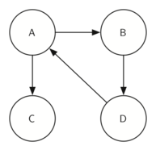
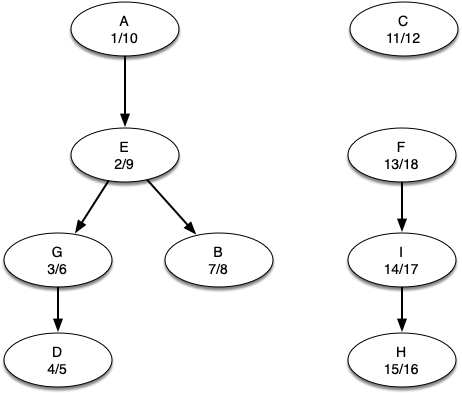

# 7.18. 强连通分量

**7.18. Strongly Connected Components**

=== "中文"

    For the remainder of this chapter we will turn our attention to some extremely large graphs. The graphs we will use to study some additional algorithms are the graphs produced by the connections between hosts on the internet and the links between web pages. We will begin with web pages.
    
    Search engines like Google and Bing exploit the fact that the pages on the web form a very large directed graph. To transform the World Wide Web into a graph, we will treat a page as a vertex, and the hyperlinks on the page as edges connecting one vertex to another. `Figure 30` shows a very small part of the graph produced by following the links from one page to the next, beginning at Luther College’s Computer Science home page. Of course, this graph could be huge, so we have limited it to websites that are no more than 10 links away from the CS home page.
    
    <figure markdown="span">
        
        <figcaption markdown="span">Figure 30: The Graph Produced by Links from the Luther Computer Science Home Page</figcaption>
    </figure>
    
    If you study the graph in `Figure 30` you might make some interesting observations. First you might notice that many of the other websites on the graph are other Luther College websites. Second, you might notice that there are several links to other colleges in Iowa. Third, you might notice that there are several links to other liberal arts colleges. You might conclude from this that there is some underlying structure to the Web that clusters together websites that are similar on some level.
    
    One graph algorithm that can help find clusters of highly interconnected vertices in a graph is called the **strongly connected components** algorithm, or **SCC**. We formally define a strongly connected component, $C$, of a graph $G$, as the largest subset of vertices $C \subset V` such that for every pair of vertices $v, w \in C$ we have a path from $v$ to $w$ and a path from $w$ to $v$. `Figure 27` shows a simple graph with three strongly connected components that are identified by the different shaded areas.
    
    <figure markdown="span">
        
        <figcaption markdown="span">Figure 31: A Directed Graph with Three Strongly Connected Components</figcaption>
    </figure>
    
    Once the strongly connected components have been identified, we can show a simplified view of the graph by combining all the vertices in one strongly connected component into a single larger vertex. The simplified version of the graph in `Figure 31` is shown in `Figure 32`.
    
    <figure markdown="span">
        
        <figcaption markdown="span">Figure 32: The Reduced Graph</figcaption>
    </figure>
    
    
    Once again we will see that we can create a very powerful and efficient algorithm by making use of a depth-first search. Before we tackle the main SCC algorithm we must look at one other definition. The transposition of a graph $G$ is defined as the graph $G^T$ where all the edges in the graph have been reversed. That is, if there is a directed edge from node A to node B in the original graph, then $G^T$ will contain an edge from node B to node A. `Figure 33` and `Figure 34` show a simple graph and its transposition.
    
    <figure markdown="span">
        
        <figcaption markdown="span">Figure 33: A Graph $G$</figcaption>
    </figure>
       
    
    <figure markdown="span">
        
        <figcaption markdown="span">Figure 34: The Transposition of $G$, $G^T$</figcaption>
    </figure>
    
    Look at the figures again. Notice that the graph in `Figure 33` has two strongly connected components. Now look at  `Figure 34`. Notice that it has the same two strongly connected components.
    
    We can now describe the algorithm to compute the strongly connected components for a graph.
    
    1. Call ``dfs`` for the graph $G$ to compute the closing times for each vertex.
    1. Compute $G^T$.
    1. Call ``dfs`` for the graph $G^T$ but in the main loop of DFS explore each vertex in decreasing order of closing time.
    1. Each tree in the forest computed in step 3 is a strongly connected component. Output the vertex IDs for each vertex in each tree in the forest to identify the component.
    
    Let's trace the operation of the steps described above on the example graph in `Figure 31`. `Figure 35` shows the starting and closing times computed for the original graph by the DFS algorithm. `Figure 36` shows the starting and closing times computed by running DFS on the transposed graph.
    
    
    <figure markdown="span">
        
        <figcaption markdown="span">Figure 35: Finishing Times for the Original Graph $G$</figcaption>
    </figure>
    
    <figure markdown="span">
        
        <figcaption markdown="span">Figure 36: Finishing Times for $G^T$</figcaption>
    </figure>
    
    
    Finally, `Figure 37` shows the forest of three trees produced in step 3 of the strongly connected components algorithm. You will notice that we do not provide you with the Python code for the SCC algorithm; we leave writing this program as an exercise.
    
    
    <figure markdown="span">
        
        <figcaption markdown="span">Figure 37: Strongly Connected Components</figcaption>
    </figure>

=== "英文"

    For the remainder of this chapter we will turn our attention to some extremely large graphs. The graphs we will use to study some additional algorithms are the graphs produced by the connections between hosts on the internet and the links between web pages. We will begin with web pages.
    
    Search engines like Google and Bing exploit the fact that the pages on the web form a very large directed graph. To transform the World Wide Web into a graph, we will treat a page as a vertex, and the hyperlinks on the page as edges connecting one vertex to another. `Figure 30` shows a very small part of the graph produced by following the links from one page to the next, beginning at Luther College’s Computer Science home page. Of course, this graph could be huge, so we have limited it to websites that are no more than 10 links away from the CS home page.
    
    <figure markdown="span">
        
        <figcaption markdown="span">Figure 30: The Graph Produced by Links from the Luther Computer Science Home Page</figcaption>
    </figure>
    
    If you study the graph in `Figure 30` you might make some interesting observations. First you might notice that many of the other websites on the graph are other Luther College websites. Second, you might notice that there are several links to other colleges in Iowa. Third, you might notice that there are several links to other liberal arts colleges. You might conclude from this that there is some underlying structure to the Web that clusters together websites that are similar on some level.
    
    One graph algorithm that can help find clusters of highly interconnected vertices in a graph is called the **strongly connected components** algorithm, or **SCC**. We formally define a strongly connected component, $C$, of a graph $G$, as the largest subset of vertices $C \subset V` such that for every pair of vertices $v, w \in C$ we have a path from $v$ to $w$ and a path from $w$ to $v$. `Figure 27` shows a simple graph with three strongly connected components that are identified by the different shaded areas.
    
    <figure markdown="span">
        
        <figcaption markdown="span">Figure 31: A Directed Graph with Three Strongly Connected Components</figcaption>
    </figure>
    
    Once the strongly connected components have been identified, we can show a simplified view of the graph by combining all the vertices in one strongly connected component into a single larger vertex. The simplified version of the graph in `Figure 31` is shown in `Figure 32`.
    
    <figure markdown="span">
        
        <figcaption markdown="span">Figure 32: The Reduced Graph</figcaption>
    </figure>
    
    
    Once again we will see that we can create a very powerful and efficient algorithm by making use of a depth-first search. Before we tackle the main SCC algorithm we must look at one other definition. The transposition of a graph $G$ is defined as the graph $G^T$ where all the edges in the graph have been reversed. That is, if there is a directed edge from node A to node B in the original graph, then $G^T$ will contain an edge from node B to node A. `Figure 33` and `Figure 34` show a simple graph and its transposition.
    
    <figure markdown="span">
        
        <figcaption markdown="span">Figure 33: A Graph $G$</figcaption>
    </figure>
       
    
    <figure markdown="span">
        
        <figcaption markdown="span">Figure 34: The Transposition of $G$, $G^T$</figcaption>
    </figure>
    
    Look at the figures again. Notice that the graph in `Figure 33` has two strongly connected components. Now look at  `Figure 34`. Notice that it has the same two strongly connected components.
    
    We can now describe the algorithm to compute the strongly connected components for a graph.
    
    1. Call ``dfs`` for the graph $G$ to compute the closing times for each vertex.
    1. Compute $G^T$.
    1. Call ``dfs`` for the graph $G^T$ but in the main loop of DFS explore each vertex in decreasing order of closing time.
    1. Each tree in the forest computed in step 3 is a strongly connected component. Output the vertex IDs for each vertex in each tree in the forest to identify the component.
    
    Let's trace the operation of the steps described above on the example graph in `Figure 31`. `Figure 35` shows the starting and closing times computed for the original graph by the DFS algorithm. `Figure 36` shows the starting and closing times computed by running DFS on the transposed graph.
    
    
    <figure markdown="span">
        
        <figcaption markdown="span">Figure 35: Finishing Times for the Original Graph $G$</figcaption>
    </figure>
    
    <figure markdown="span">
        
        <figcaption markdown="span">Figure 36: Finishing Times for $G^T$</figcaption>
    </figure>
    
    
    Finally, `Figure 37` shows the forest of three trees produced in step 3 of the strongly connected components algorithm. You will notice that we do not provide you with the Python code for the SCC algorithm; we leave writing this program as an exercise.
    
    
    <figure markdown="span">
        
        <figcaption markdown="span">Figure 37: Strongly Connected Components</figcaption>
    </figure>