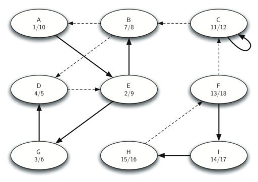

# 7.18. 强连通分量

**7.18. Strongly Connected Components**

=== "中文"

    在本章的剩余部分，我们将关注一些极其庞大的图。我们将使用的图包括互联网上主机之间的连接图和网页之间的链接图。我们将从网页开始。
    
    搜索引擎如 Google 和 Bing 利用网页形成的巨大有向图。为了将万维网转化为图，我们将每个页面视作一个顶点，页面上的超链接视作连接一个顶点到另一个顶点的边。`图 30` 显示了从 Luther College 的计算机科学主页开始，按照链接从一个页面到下一个页面所形成的图的一小部分。当然，这个图可能会非常庞大，因此我们限制在离计算机科学主页不超过 10 个链接的网站上。
    
    <figure markdown="span">
        
        <figcaption markdown="span">图 30: 从 Luther 计算机科学主页生成的图</figcaption>
    </figure>
    
    如果你研究 `图 30`，你可能会发现一些有趣的观察。首先，你可能会注意到图中的许多其他网站都是 Luther College 的网站。其次，你可能会注意到有几个链接指向爱荷华州的其他学院。第三，你可能会发现有几个链接指向其他文理学院。你可能会从中得出结论，网络上存在某种基础结构，将在某些层面上相似的网站聚集在一起。
    
    一个可以帮助找到图中高度互连顶点群的图算法是 **强连通分量** 算法，或称 **SCC**。我们正式定义图 $G$ 的一个强连通分量 $C$ 为顶点的最大子集 $C \subset V$，使得对于每一对顶点 $v, w \in C$，都存在从 $v$ 到 $w$ 的路径以及从 $w$ 到 $v$ 的路径。`图 31` 显示了一个简单图，它有三个强连通分量，这些分量由不同的阴影区域标识。
    
    <figure markdown="span">
        
        <figcaption markdown="span">图 31: 一个具有三个强连通分量的有向图</figcaption>
    </figure>
    
    一旦识别出强连通分量，我们可以通过将一个强连通分量中的所有顶点合并为一个更大的顶点来显示图的简化视图。`图 31` 的简化版本在 `图 32` 中显示。
    
    <figure markdown="span">
        
        <figcaption markdown="span">图 32: 简化后的图</figcaption>
    </figure>
    
    我们将再次看到，通过利用深度优先搜索，我们可以创建一个非常强大且高效的算法。在解决主要的 SCC 算法之前，我们需要查看另一个定义。图 $G$ 的转置定义为图 $G^T$，其中所有边的方向都被反转。也就是说，如果原图中存在从节点 A 到节点 B 的有向边，那么 $G^T$ 将包含从节点 B 到节点 A 的边。`图 33` 和 `图 34` 显示了一个简单图及其转置。
    
    <figure markdown="span">
        
        <figcaption markdown="span">图 33: 图 $G$</figcaption>
    </figure>
        
    <figure markdown="span">
        
        <figcaption markdown="span">图 34: 图 $G$ 的转置 $G^T$</figcaption>
    </figure>
    
    再看看这些图。注意 `图 33` 中的图有两个强连通分量。现在看看 `图 34`。注意它也有相同的两个强连通分量。
    
    我们现在可以描述计算图的强连通分量的算法。
    
    1. 对图 $G$ 调用 ``dfs`` 以计算每个顶点的关闭时间。
    2. 计算 $G^T$。
    3. 对图 $G^T$ 调用 ``dfs``，但在 DFS 的主循环中按关闭时间的降序探索每个顶点。
    4. 步骤 3 中计算出的森林中的每棵树是一个强连通分量。输出森林中每棵树的顶点 ID 以标识该分量。
    
    让我们跟踪上述步骤在 `图 31` 中的操作。`图 35` 显示了原始图中计算出的起始和关闭时间。`图 36` 显示了对转置图运行 DFS 后计算出的起始和关闭时间。
    
    <figure markdown="span">
        
        <figcaption markdown="span">图 35: 原图 $G$ 的关闭时间</figcaption>
    </figure>
    
    <figure markdown="span">
        
        <figcaption markdown="span">图 36: 图 $G^T$ 的关闭时间</figcaption>
    </figure>
    
    最后，`图 37` 显示了强连通分量算法步骤 3 中生成的三棵树的森林。请注意，我们没有提供 SCC 算法的 Python 代码；编写这个程序留给读者作为练习。
    
    <figure markdown="span">
        
        <figcaption markdown="span">图 37: 强连通分量</figcaption>
    </figure>

=== "英文"

    For the remainder of this chapter we will turn our attention to some extremely large graphs. The graphs we will use to study some additional algorithms are the graphs produced by the connections between hosts on the internet and the links between web pages. We will begin with web pages.
    
    Search engines like Google and Bing exploit the fact that the pages on the web form a very large directed graph. To transform the World Wide Web into a graph, we will treat a page as a vertex, and the hyperlinks on the page as edges connecting one vertex to another. `Figure 30` shows a very small part of the graph produced by following the links from one page to the next, beginning at Luther College’s Computer Science home page. Of course, this graph could be huge, so we have limited it to websites that are no more than 10 links away from the CS home page.
    
    <figure markdown="span">
        
        <figcaption markdown="span">Figure 30: The Graph Produced by Links from the Luther Computer Science Home Page</figcaption>
    </figure>
    
    If you study the graph in `Figure 30` you might make some interesting observations. First you might notice that many of the other websites on the graph are other Luther College websites. Second, you might notice that there are several links to other colleges in Iowa. Third, you might notice that there are several links to other liberal arts colleges. You might conclude from this that there is some underlying structure to the Web that clusters together websites that are similar on some level.
    
    One graph algorithm that can help find clusters of highly interconnected vertices in a graph is called the **strongly connected components** algorithm, or **SCC**. We formally define a strongly connected component, $C$, of a graph $G$, as the largest subset of vertices $C \subset V` such that for every pair of vertices $v, w \in C$ we have a path from $v$ to $w$ and a path from $w$ to $v$. `Figure 27` shows a simple graph with three strongly connected components that are identified by the different shaded areas.
    
    <figure markdown="span">
        
        <figcaption markdown="span">Figure 31: A Directed Graph with Three Strongly Connected Components</figcaption>
    </figure>
    
    Once the strongly connected components have been identified, we can show a simplified view of the graph by combining all the vertices in one strongly connected component into a single larger vertex. The simplified version of the graph in `Figure 31` is shown in `Figure 32`.
    
    <figure markdown="span">
        
        <figcaption markdown="span">Figure 32: The Reduced Graph</figcaption>
    </figure>
    
    
    Once again we will see that we can create a very powerful and efficient algorithm by making use of a depth-first search. Before we tackle the main SCC algorithm we must look at one other definition. The transposition of a graph $G$ is defined as the graph $G^T$ where all the edges in the graph have been reversed. That is, if there is a directed edge from node A to node B in the original graph, then $G^T$ will contain an edge from node B to node A. `Figure 33` and `Figure 34` show a simple graph and its transposition.
    
    <figure markdown="span">
        
        <figcaption markdown="span">Figure 33: A Graph $G$</figcaption>
    </figure>
       
    
    <figure markdown="span">
        
        <figcaption markdown="span">Figure 34: The Transposition of $G$, $G^T$</figcaption>
    </figure>
    
    Look at the figures again. Notice that the graph in `Figure 33` has two strongly connected components. Now look at  `Figure 34`. Notice that it has the same two strongly connected components.
    
    We can now describe the algorithm to compute the strongly connected components for a graph.
    
    1. Call ``dfs`` for the graph $G$ to compute the closing times for each vertex.
    1. Compute $G^T$.
    1. Call ``dfs`` for the graph $G^T$ but in the main loop of DFS explore each vertex in decreasing order of closing time.
    1. Each tree in the forest computed in step 3 is a strongly connected component. Output the vertex IDs for each vertex in each tree in the forest to identify the component.
    
    Let's trace the operation of the steps described above on the example graph in `Figure 31`. `Figure 35` shows the starting and closing times computed for the original graph by the DFS algorithm. `Figure 36` shows the starting and closing times computed by running DFS on the transposed graph.
    
    
    <figure markdown="span">
        
        <figcaption markdown="span">Figure 35: Finishing Times for the Original Graph $G$</figcaption>
    </figure>
    
    <figure markdown="span">
        
        <figcaption markdown="span">Figure 36: Finishing Times for $G^T$</figcaption>
    </figure>
    
    
    Finally, `Figure 37` shows the forest of three trees produced in step 3 of the strongly connected components algorithm. You will notice that we do not provide you with the Python code for the SCC algorithm; we leave writing this program as an exercise.
    
    
    <figure markdown="span">
        
        <figcaption markdown="span">Figure 37: Strongly Connected Components</figcaption>
    </figure>