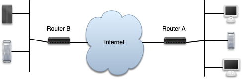
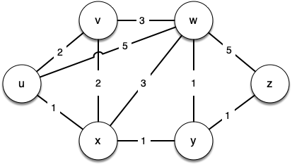

# 7.19. 最短路径问题

**7.19. Shortest Path Problems**

=== "中文"


    当你浏览网页、发送电子邮件，或者从校园内的另一个位置登录实验室计算机时，后台正在进行大量工作，以将你计算机上的信息传输到另一台计算机。深入研究信息如何通过互联网从一台计算机流向另一台计算机，是计算机网络课程的主要主题。然而，我们将简要讨论互联网如何工作，以便理解另一个非常重要的图算法。
    
    <figure markdown="span">
        
        <figcaption markdown="span">图 1: 互联网连接概述</figcaption>
    </figure>
    
    `图 1` 为你展示了互联网通信的高层次概述。当你使用浏览器从服务器请求网页时，请求必须通过你的局域网，并通过路由器传输到互联网。请求在互联网上传输，最终到达服务器所在局域网的路由器。你请求的网页然后通过相同的路由器返回到你的浏览器。在 `图 1` 中标记为“互联网”的云中有额外的路由器。这些路由器的工作是协作将你的信息从一个地方传输到另一个地方。如果你的计算机支持 ``traceroute`` 命令，你可以自己看到许多路由器。下面的文本展示了 ``traceroute`` 命令的输出，说明在 Luther College 的 web 服务器和 University of Minnesota 的邮件服务器之间有 13 个路由器。
    
    互联网中的每个路由器都连接到一个或多个其他路由器。如果你在一天中的不同时间运行 ``traceroute`` 命令，你会发现你的信息流经的路由器可能会有所不同。这是因为每对路由器之间的连接都有一个与流量、时间以及许多其他因素相关的成本。因此，你不会感到惊讶，网络路由器可以用带权重的图来表示。
    
    ```text
    1  192.203.196.1  
    2  hilda.luther.edu (216.159.75.1)  
    3  ICN-Luther-Ether.icn.state.ia.us (207.165.237.137)
    4  ICN-ISP-1.icn.state.ia.us (209.56.255.1)  
    5  p3-0.hsa1.chi1.bbnplanet.net (4.24.202.13)
    6  ae-1-54.bbr2.Chicago1.Level3.net (4.68.101.97)
    7  so-3-0-0.mpls2.Minneapolis1.Level3.net (64.159.4.214)
    8  ge-3-0.hsa2.Minneapolis1.Level3.net (4.68.112.18) 
    9  p1-0.minnesota.bbnplanet.net (4.24.226.74)
    10  TelecomB-BR-01-V4002.ggnet.umn.edu (192.42.152.37)
    11  TelecomB-BN-01-Vlan-3000.ggnet.umn.edu (128.101.58.1)
    12  TelecomB-CN-01-Vlan-710.ggnet.umn.edu (128.101.80.158)
    13  baldrick.cs.umn.edu (128.101.80.129)(N!)  88.631 ms (N!)
    
    从一个主机到下一个主机的互联网路由器
    ```
    
    `图 2` 显示了一个小的带权重图，表示互联网中路由器的相互连接。我们要解决的问题是找到 **最短路径**，即沿着该路径的总权重最小的路径，用于路由任何给定的消息。这个问题应该听起来很熟悉，因为它类似于我们使用广度优先搜索解决的问题，只不过在这里我们关心的是路径的总权重，而不是路径中的跳数。值得注意的是，如果所有权重相等，问题就是一样的。
    
    <figure markdown="span">
        
        <figcaption markdown="span">图 2: 互联网中路由器之间的连接和权重</figcaption>
    </figure>
    

=== "英文"


    When you surf the web, send an email, or log in to a laboratory computer from another location on campus, a lot of work is going on behind the scenes to get the information on your computer transferred to another computer. The in-depth study of how information flows from one computer to another over the internet is the primary topic for a class in computer networking. However, we will talk about how the internet works just enough to understand another very important graph algorithm.
    
    <figure markdown="span">
        
        <figcaption markdown="span">Figure 1: Overview of Connectivity in the Internet</figcaption>
    </figure>
    
    `Figure 1` shows you a high-level overview of how communication on the internet works. When you use your browser to request a web page from a server, the request must travel over your local area network and out onto the internet through a router. The request travels over the internet and eventually arrives at a router for the local area network where the server is located. The web page you requested then travels back through the same routers to get to your browser. Inside the cloud labeled “Internet” in `Figure 1` are additional routers. The job of all of these routers is to work together to get your information from place to place. You can see there are many routers for yourself if your computer supports the ``traceroute`` command. The text below shows the output of the ``traceroute`` command, which illustrates that there are 13 routers between the web server at Luther College and the mail server at the University of Minnesota.
    
    Each router on the internet is connected to one or more other routers. If you run the ``traceroute`` command at different times of the day, you are likely to see that your information flows through different routers at different times. This is because there is a cost associated with each connection between a pair of routers that depends on the volume of traffic, the time of day, and many other factors. By this time it will not surprise you to learn that we can represent the network of routers as a graph with weighted edges.
    
    ```text
    1  192.203.196.1  
    2  hilda.luther.edu (216.159.75.1)  
    3  ICN-Luther-Ether.icn.state.ia.us (207.165.237.137)
    4  ICN-ISP-1.icn.state.ia.us (209.56.255.1)  
    5  p3-0.hsa1.chi1.bbnplanet.net (4.24.202.13)
    6  ae-1-54.bbr2.Chicago1.Level3.net (4.68.101.97)
    7  so-3-0-0.mpls2.Minneapolis1.Level3.net (64.159.4.214)
    8  ge-3-0.hsa2.Minneapolis1.Level3.net (4.68.112.18) 
    9  p1-0.minnesota.bbnplanet.net (4.24.226.74)
    10  TelecomB-BR-01-V4002.ggnet.umn.edu (192.42.152.37)
    11  TelecomB-BN-01-Vlan-3000.ggnet.umn.edu (128.101.58.1)
    12  TelecomB-CN-01-Vlan-710.ggnet.umn.edu (128.101.80.158)
    13  baldrick.cs.umn.edu (128.101.80.129)(N!)  88.631 ms (N!)
    
    
    Routers from One Host to the Next over the Internet      
    ```
    
    `Figure 2` shows a small example of a weighted graph that represents the interconnection of routers in the internet. The problem that we want to solve is to find the **shortest path**, one with the smallest total weight along which to route any given message. This problem should sound familiar because it is similar to the problem we solved using a breadth-first search, except that here we are concerned with the total weight of the path rather than the number of hops in the path. It should be noted that if all the weights are equal, the problem is the same.
    
    <figure markdown="span">
        
        <figcaption markdown="span">Figure 2: Connections and Weights between Routers in the Internet</figcaption>
    </figure>
    