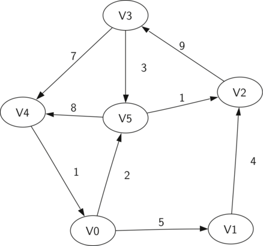

# 7.2. 词汇和定义

**7.2. Vocabulary and Definitions**

=== "中文"
    
    现在我们已经了解了图的概念，我们将更正式地定义图及其组成部分。我们从树的讨论中已经知道一些这些术语。
    
    **顶点**  
       : **顶点**（也称为 *节点*）是图的一个基本部分。它可以有一个名称，我们称之为 *键*。顶点还可以有附加的信息。我们将这些附加信息称为 *值* 或 *负载*。
    
    **边**  
       : **边**（也称为 *弧*）是图的另一个基本部分。边连接两个顶点以显示它们之间的关系。边可以是单向的或双向的。如果图中的边都是单向的，我们称该图为 **有向图** 或 **有向图（digraph）**。上面展示的课程先决条件图显然是一个有向图，因为你必须在其他课程之前修一些课程。
    
    **权重**  
       : 边可以是 **加权的**，以显示从一个顶点到另一个顶点的成本，我们称之为 **边成本**。例如，在连接一个城市到另一个城市的道路图中，边上的权重可能表示两个城市之间的距离。
    
    有了这些定义，我们可以正式定义一个图。一个图可以用 $G$ 表示，其中 $G =(V,E)$。对于图 $G$，$V$ 是一个顶点的集合，而 $E$ 是一个边的集合。每个边是一个元组 $(v, w)$，其中 $v, w \in V$。我们可以在边元组中添加一个第三个组件来表示权重。一个子图 $s$ 是一个边集合 $e$ 和顶点集合 $v$，使得 $e \subset E$ 且 $v \subset V$。
    
    `图 2` 展示了一个简单的加权有向图的另一个示例。我们可以将这个图正式表示为六个顶点的集合：
    
    $V = \left\{ v_0, v_1, v_2, v_3, v_4, v_5 \right\}$
    
    以及九个边的集合：
    
    $\begin{align} E = \left\{ \begin{array}{l}(v_0, v_1, 5), (v_1, v_2, 4), (v_2, v_3, 9), \\ (v_3, v_4, 7), (v_4, v_0, 1), (v_0, v_5, 2), \\ (v_5, v_4, 8), (v_3, v_5, 3), (v_5, v_2, 1) \end{array} \right\} \end{align}$
    
    <figure markdown="span">
    { width="300" }
    <figcaption markdown="span">图 2: 一个简单的有向图示例</figcaption>
    </figure>
    
    `图 2` 的示例图帮助说明了另外两个关键的图术语：
    
    **路径**  
       : 图中的 **路径** 是一系列通过边连接的顶点。正式地，我们定义路径为 $w_1, w_2, ..., w_n$，使得对于所有 $1 \le i \le n-1$，$(w_i, w_{i+1}) \in E$。未加权路径长度是路径中边的数量，具体为 $n-1$。加权路径长度是路径中所有边的权重之和。例如，在 `图 2` 中，从 $v_3$ 到 $v_1$ 的路径是顶点序列 $(v_3, v_4, v_0, v_1)$。这些边是 $\left\{(v_3, v_4, 7), (v_4, v_0, 1), (v_0, v_1, 5) \right\}$。
    
    **环**  
       : 在有向图中，**环** 是一个以相同顶点开始和结束的路径。例如，在 `图 2` 中，路径 $(v_5, v_2, v_3, v_5)$ 是一个环。没有环的图称为 **无环图**。没有环的有向图称为 **有向无环图** 或 **DAG**。我们将看到，如果问题可以表示为 DAG，我们可以解决几个重要的问题。

=== "英文"

    Now that we have looked at an graph, we will more formally define a graph and its components. We already know some of these terms from our discussion of trees.
    
    Vertex
       : A **vertex** (also called a *node*) is a fundamental part of a graph. It can have a name, which we will call the *key*. A vertex may also have additional information. We will call this additional information the *value* or the *payload*.
    
    Edge
       : An **edge** (also called an *arc*) is another fundamental part of a graph. An edge connects two vertices to show that there is a relationship between them. Edges may be one-way or two-way. If the edges in a graph are all one-way, we say that the graph is a **directed graph**, or a **digraph**. The class prerequisites graph shown above is clearly a digraph since you must take some classes before others.
    
    Weight
       : Edges may be **weighted** to show that there is a cost to go from one vertex to another, which we call **edge cost**. For example, in a graph of roads that connect one city to another, the weight on the edge might represent the distance between the two cities.
    
    With those definitions in hand, we can formally define a graph. A graph can be represented by $G$ where $G =(V,E)$. For the graph $G$, $V$ is a set of vertices and $E$ is a set of edges. Each edge is a tuple $(v, w)$ where $v, w \in V$. We can add a third component to the edge tuple to represent a weight. A subgraph $s` is a set of edges $e$ and vertices $v$ such that $e \subset E$ and $v \subset V$.
    
    `Figure  2` shows another example of a simple weighted digraph. Formally we can represent this graph as the set of six vertices:
    
    $V = \left\{ v_0, v_1, v_2, v_3, v_4, v_5 \right\}$
    
    and the set of nine edges:
    
    $\begin{align} E = \left\{ \begin{array}{l}(v_0, v_1, 5), (v_1, v_2, 4), (v_2, v_3, 9), \\ (v_3, v_4, 7), (v_4, v_0, 1), (v_0, v_5, 2), \\ (v_5, v_4, 8), (v_3, v_5, 3), (v_5, v_2, 1) \end{array} \right\} \end{align}$
    
    
    <figure markdown="span">
    { width="300" }
    <figcaption markdown="span">Figure 2: A Simple Example of a Directed Graph</figcaption>
    </figure>
    
    The example graph in `Figure 2` helps illustrate two other key graph terms:
    
    Path
       : A **path** in a graph is a sequence of vertices that are connected by edges. Formally we would define a path as $w_1, w_2, ..., w_n$ such that $(w_i, w_{i+1}) \in E$ for all $1 \le i \le n-1$. The unweighted path length is the number of edges in the path, specifically $n-1$. The weighted path length is the sum of the weights of all the edges in the path. For example in `Figure 2` the path from $v_3$ to $v_1$ is the sequence of vertices $(v_3, v_4, v_0, v_1)$. The edges are $\left\{(v_3, v_4, 7), (v_4, v_0, 1), (v_0, v_1, 5) \right\}$.
    
    Cycle
       : A **cycle** in a directed graph is a path that starts and ends at the same vertex. For example, in `Figure 2` the path $(v_5, v_2, v_3, v_5)$ is a cycle. A graph with no cycles is called an **acyclic graph**. A directed graph with no cycles is called a **directed acyclic graph** or a **DAG**. We will see that we can solve several important problems if the problem can be represented as a DAG.