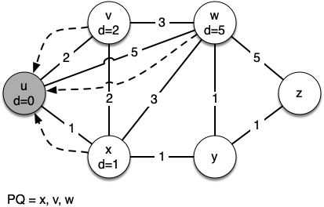
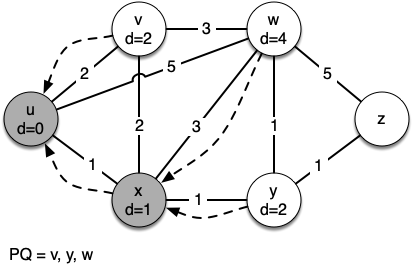
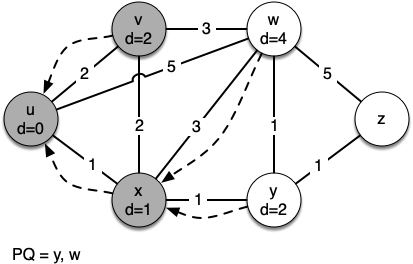
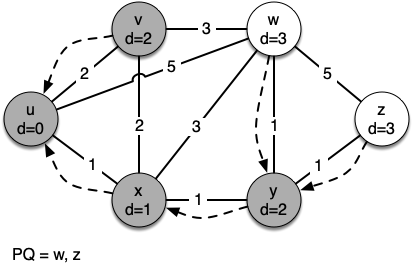
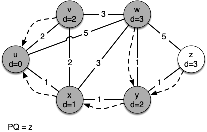
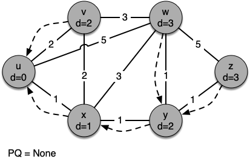

# 7.20. Dijkstra算法

**7.20. Dijkstra’s Algorithm**

=== "中文"

    我们将使用的算法来确定最短路径被称为 Dijkstra 算法。Dijkstra 算法是一个迭代算法，能够为我们提供从一个特定起始节点到图中所有其他节点的最短路径。这与广度优先搜索的结果类似。
    
    为了跟踪从起始节点到每个目标的总成本，我们将利用 ``Vertex`` 类中的 ``distance`` 实例变量。``distance`` 实例变量将包含从起始节点到目标节点的最小权重路径的当前总权重。算法会对图中的每个节点迭代一次；然而，它迭代节点的顺序由优先队列控制。用于确定优先队列中对象顺序的值是 ``distance``。当一个节点首次创建时，``distance`` 被设置为一个非常大的数字。理论上你会将 ``distance`` 设置为无穷大，但在实际中，我们将其设置为比我们在问题中实际存在的任何距离都大的一个数字。
    
    Dijkstra 算法的代码如下所示。算法完成后，距离和图中每个节点的前驱链接都会正确设置。
    
    ```python title="Listing 1"
    from pythonds3.graphs import PriorityQueue
    
    def dijkstra(graph, start):
        pq = PriorityQueue()
        start.distance = 0
        pq.heapify([(v.distance, v) for v in graph])
        while pq:
            distance, current_v = pq.delete()
            for next_v in current_v.get_neighbors():
                new_distance = current_v.distance + current_v.get_neighbor(next_v)
                if new_distance < next_v.distance:
                    next_v.distance = new_distance
                    next_v.previous = current_v
                    pq.change_priority(next_v, new_distance)
    ```
    
    Dijkstra 算法使用了优先队列。你可能还记得优先队列是基于我们在第六章中实现的堆。然后，这里有几个与我们为 Dijkstra 算法使用的实现之间的区别。首先，``PriorityQueue`` 类存储的是 (priority, key) 对的元组。这一点很重要，因为 Dijkstra 算法要求优先队列中的 key 与图中节点的 key 匹配。优先级用于决定 key 在优先队列中的位置。在这个实现中，我们使用到达节点的距离作为优先级，因为正如我们将看到的，在探索下一个节点时，我们总是希望先探索距离最小的节点。第二个区别是 ``change_priority`` 方法的添加。正如你在第 17 行看到的，当队列中已经存在的节点的距离减少时，就会使用这个方法，从而将节点移动到队列的前面。
    
    让我们通过以下一系列图来逐个节点地跟踪 Dijkstra 算法的应用。我们从节点 $u$ 开始。与 $u$ 相邻的三个节点是 $v$、$w$ 和 $x$。由于 $v$、$w$ 和 $x$ 的初始距离都被初始化为 ``sys.maxsize``, 通过起始节点到达它们的新成本都是它们的直接成本。因此，我们更新这三个节点的成本。我们还将每个节点的前驱设置为 $u$，并将每个节点添加到优先队列中。我们使用距离作为优先队列的 key。算法的状态显示在 `图 3` 中。
    
    在 ``while`` 循环的下一次迭代中，我们检查与 $x$ 相邻的节点。节点 $x$ 是下一个，因为它的总体成本最低，因此它排在了优先队列的前面。在 $x$ 处，我们查看它的邻居 $u$、$v$、$w$ 和 $y$。对于每个邻接的节点，我们检查通过 $x$ 到达该节点的距离是否小于之前已知的距离。显然，对于 $y$ 来说，这是正确的，因为它的距离是 ``sys.maxsize``。对于 $u$ 或 $v$ 来说则不是这样，因为它们的距离分别是 0 和 2。然而，我们现在发现，通过 $x$ 到达 $w$ 的距离比直接从 $u$ 到 $w$ 的距离要小。既然如此，我们用新的距离更新 $w$，并将 $w$ 的前驱从 $u$ 改为 $x$。有关所有节点的状态，请参见 `图 4`。
    
    下一步是查看与 $v$ 相邻的节点（见 `图 5`）。这一步不会对图进行任何更改，因此我们转到节点 $y$。在节点 $y$ 处（见 `图 6`），我们发现到达 $w$ 和 $z$ 更便宜，因此我们相应地调整了距离和前驱链接。最后，我们检查节点 $w$ 和 $z$（见 `图 6` 和 `图 8`）。然而，没有发现其他更改，因此优先队列为空，Dijkstra 算法退出。
    
    <figure markdown="span">
        
        <figcaption markdown="span">图 3: Dijkstra 算法的追踪</figcaption>
    </figure>
    
    <figure markdown="span">
        
        <figcaption markdown="span">图 4: Dijkstra 算法的追踪</figcaption>
    </figure>
    
    <figure markdown="span">
        
        <figcaption markdown="span">图 5: Dijkstra 算法的追踪</figcaption>
    </figure>
    
    <figure markdown="span">
        
        <figcaption markdown="span">图 6: Dijkstra 算法的追踪</figcaption>
    </figure>
    
    <figure markdown="span">
        
        <figcaption markdown="span">图 7: Dijkstra 算法的追踪</figcaption>
    </figure>
    
    <figure markdown="span">
        
        <figcaption markdown="span">图 8: Dijkstra 算法的追踪</figcaption>
    </figure>
    
    重要的是要注意，Dijkstra 算法仅在所有权重都是正数时有效。你应该确信，如果你在 `图 2` 中的某条边上引入了负权重，算法将永远不会退出。
    
    我们需要注意的是，为了通过互联网路由消息，使用了其他算法来寻找最短路径。在互联网中使用 Dijkstra 算法的一个问题是，必须有图的完整表示才能运行该算法。这意味着每个路由器必须拥有互联网中所有路由器的完整地图。在实际中情况并非如此，其他算法变种允许每个路由器在运行过程中逐步发现图形。你可能想了解的一种算法是 *距离向量* 路由算法。

=== "英文"

    The algorithm we are going to use to determine the shortest path is called Dijkstra’s algorithm. Dijkstra’s algorithm is an iterative algorithm that provides us with the shortest path from one particular starting node to all other nodes in the graph. Again this is similar to the results of a breadth-first search.
    
    To keep track of the total cost from the start node to each destination, we will make use of the ``distance`` instance variable in the ``Vertex`` class. The ``distance`` instance variable will contain the current total weight of the smallest weight path from the start to the vertex in question. The algorithm iterates once for every vertex in the graph; however, the order that it iterates over the vertices is controlled by a priority queue. The value that is used to determine the order of the objects in the priority queue is ``distance``. When a vertex is first created, ``distance`` is set to a very large number. Theoretically you would set ``distance`` to infinity, but in practice we just set it to a number that is larger than any real distance we would have in the problem we are trying to solve.
    
    The code for Dijkstra’s algorithm is shown in `Listing 1`. When the algorithm finishes, the distances are set correctly as are the predecessor links for each vertex in the graph.
    
    ```python title="Listing 1"
    from pythonds3.graphs import PriorityQueue
    
    def dijkstra(graph, start):
        pq = PriorityQueue()
        start.distance = 0
        pq.heapify([(v.distance, v) for v in graph])
        while pq:
            distance, current_v = pq.delete()
            for next_v in current_v.get_neighbors():
                new_distance = current_v.distance + current_v.get_neighbor(next_v)
                if new_distance < next_v.distance:
                    next_v.distance = new_distance
                    next_v.previous = current_v
                    pq.change_priority(next_v, new_distance)
    ```
    
    Dijkstra’s algorithm uses a priority queue. You may recall that a priority queue is based on the heap that we implemented in Chapter 6.  There are a couple of differences between that simple implementation and the implementation we use for Dijkstra’s algorithm, however. First, the ``PriorityQueue`` class stores tuples of (priority, key) pairs. This is an important point, because Dijkstra's algorithm requires the key in the priority queue to match the key of the vertex in the graph. The priority is used for deciding the position of the key in the priority queue. In this implementation we use the distance to the vertex as the priority because as we will see when we are exploring the next vertex, we always want to explore the vertex that has the smallest distance. The second difference is the addition of the ``change_priority`` method. As you can see in line 17, this method is used when the distance to a vertex that is already in the queue is reduced, and thus the vertex is moved toward the front of the queue.
    
    
    
    Let’s walk through an application of Dijkstra’s algorithm one vertex at a time using the following sequence of figures as our guide. We begin with the vertex $u$. The three vertices adjacent to $u$ are $v, w,$ and $x$. Since the initial distances to $v, w,$ and $x$ are all initialized to ``sys.maxsize``, the new costs to get to them through the start node are all their direct costs. So we update the costs to each of these three nodes. We also set the predecessor for each node to $u$ and we add each node to the priority queue. We use the distance as the key for the priority queue. The state of the algorithm is shown in `Figure 3`.
    
    In the next iteration of the ``while`` loop we examine the vertices that are adjacent to $x$. The vertex $x$ is next because it has the lowest overall cost and therefore bubbled its way to the beginning of the priority queue. At $x$ we look at its neighbors $u, v, w,$ and $y$. For each neighboring vertex we check to see if the distance to that vertex through $x$ is smaller than the previously known distance. Obviously this is the case for $y$ since its distance was ``sys.maxsize``. It is not the case for $u$ or $v$ since their distances are 0 and 2 respectively. However, we now learn that the distance to $w$ is smaller if we go through $x$ than from $u$ directly to $w$. Since that is the case we update $w$ with a new distance and change the predecessor for $w$ from $u$ to $x$. See `Figure 4` for the state of all the vertices.
    
    The next step is to look at the vertices neighboring $v$ (see `Figure 5`). This step results in no changes to the graph, so we move on to node $y$. At node $y$ (see `Figure 6`) we discover that it is cheaper to get to both $w$ and $z$, so we adjust the distances and predecessor links accordingly. Finally we check nodes $w$ and $z$ (see `Figure 6` and `Figure 8`). However, no additional changes are found and so the priority queue is empty and Dijkstra’s algorithm exits.
    
    <figure markdown="span">
        
        <figcaption markdown="span">Figure 3: Tracing Dijkstra’s Algorithm</figcaption>
    </figure>
    
    <figure markdown="span">
        
        <figcaption markdown="span">Figure 4: Tracing Dijkstra’s Algorithm</figcaption>
    </figure>
    
    <figure markdown="span">
        
        <figcaption markdown="span">Figure 5: Tracing Dijkstra’s Algorithm</figcaption>
    </figure>
    
    <figure markdown="span">
        
        <figcaption markdown="span">Figure 6: Tracing Dijkstra’s Algorithm</figcaption>
    </figure>
    
    <figure markdown="span">
        
        <figcaption markdown="span">Figure 7: Tracing Dijkstra’s Algorithm</figcaption>
    </figure>
    
    <figure markdown="span">
        
        <figcaption markdown="span">Figure 8: Tracing Dijkstra’s Algorithm</figcaption>
    </figure>
    
    It is important to note that Dijkstra’s algorithm works only when the weights are all positive. You should convince yourself that if you introduced a negative weight on one of the edges of the graph in `Figure 2`, the algorithm would never exit.
    
    We will note that to route messages through the internet, other algorithms are used for finding the shortest path. One of the problems with using Dijkstra’s algorithm on the internet is that you must have a complete representation of the graph in order for the algorithm to run. The implication of this is that every router has a complete map of all the routers in the internet. In practice this is not the case and other variations of the algorithm allow each router to discover the graph as they go. One such algorithm that you may want to read about is called the *distance vector* routing algorithm.