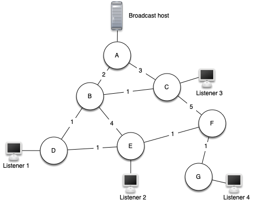
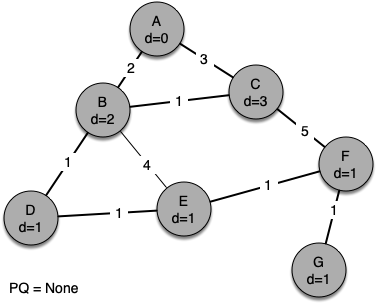

# 7.22. Prim生成树算法

**7.22. Prim’s Spanning Tree Algorithm**

=== "中文"

    对于我们的最后一个图算法，让我们考虑一个在线游戏设计师和互联网广播提供商面临的问题。问题是他们想要高效地将信息传递给可能正在收听的每个人。在游戏中，这很重要，以便所有玩家都知道其他玩家的最新位置。在互联网广播中，这很重要，以确保所有调谐的听众都能获得重建他们所听歌曲所需的所有数据。`Figure 9` 说明了广播问题。
    
    <figure markdown="span">
        
        <figcaption markdown="span">Figure 9: The Broadcast Problem</figcaption>
    </figure>
    
    我们首先来看一些暴力解决方案，以帮助更好地理解广播问题。这也将帮助你更好地理解我们在结束时提出的解决方案。首先，广播主机有一些信息需要发送给所有的听众。最简单的解决方案是广播主机维护一个所有听众的列表，并向每个听众发送单独的消息。在 `Figure 9` 中，我们展示了一个小型网络，其中包含一个广播器和一些听众。使用这种方法，每条消息都会发送四次副本。假设使用最少成本路径，让我们看看每个路由器处理相同消息的次数。
    
    所有来自广播主机的消息都经过路由器 A，因此 A 会看到每条消息的四个副本。路由器 C 只会看到其听众的每条消息的一个副本。然而，路由器 B 和 D 会看到每条消息的三个副本，因为路由器 B 和 D 是听众 1、2 和 4 的最短路径。考虑到广播主机必须每秒发送数百条消息用于广播，这将带来大量额外的流量。
    
    一种暴力解决方案是广播主机发送一条广播消息的单个副本，然后让路由器自行处理。在这种情况下，最简单的解决方案是一种称为 **无控制泛洪** 的策略。泛洪策略如下：每条消息开始时都有一个生存时间（``TTL``）值，该值设置为大于或等于广播主机和最远听众之间的边数的某个数字。每个路由器都获取消息的副本，并将消息传递给 *所有* 邻近的路由器。当消息被传递时，``TTL`` 值会减少。由于每个路由器会继续将消息传递给所有邻居，直到 ``TTL`` 值变为 0，因此无控制泛洪会生成比我们第一种策略更多的不必要的消息。
    
    解决这个问题的办法是构建一个最小权重 **生成树**。正式地，我们将图 $G = (V,E)$ 的最小生成树 $T$ 定义如下：$T$ 是 $E$ 的一个无环子集，它连接图中所有的顶点 $V$，且 $T$ 中边的权重之和最小。
    
    `Figure 10` 显示了广播图的简化版本，并突出显示了构成该图最小生成树的边。现在，为了解决我们的广播问题，广播主机只需将一条广播消息的单个副本发送到网络中。每个路由器将消息转发给生成树中的任何邻居，但不包括刚刚将消息发送给它的邻居。在这个示例中，A 将消息转发给 B。B 将消息转发给 D 和 C。D 将消息转发给 E，E 将消息转发给 F，F 将消息转发给 G。没有路由器看到多于一条副本的消息，并且所有感兴趣的听众都能看到消息的副本。
    
    <figure markdown="span">
        
        <figcaption markdown="span">Figure 10: Minimum Spanning Tree for the Broadcast Graph </figcaption>
    </figure>
    
    我们将使用的算法称为 Prim 算法。Prim 算法属于一种称为 *贪心算法* 的算法家族，因为它在每一步都会选择成本最低的下一步。在这种情况下，成本最低的下一步是选择权重最小的边。
    
    为了开发 Prim 算法，让我们首先检查构建生成树的基本思路如下：
    
    ```python
    While T is not yet a spanning tree
        Find an edge that is safe to add to the tree
        Add the new edge to T
    ```
    
    关键在于“找到一条安全的边”这一步。我们将安全边定义为任何将生成树中的一个顶点与不在生成树中的一个顶点连接起来的边。这确保了树始终保持为树，因此没有环。
    
    实现 Prim 算法的 Python 代码见 `Listing 2`。Prim 算法类似于 Dijkstra 算法，因为它们都使用优先队列来选择下一个要添加到生成图中的顶点。
    
    ```python title="Listing 2"
    import sys
    from pythonds3.graphs import PriorityQueue
    
    
    def prim(graph, start):
        pq = PriorityQueue()
        for vertex in graph:
            vertex.distance = sys.maxsize
            vertex.previous = None
        start.distance = 0
        pq.heapify([(vertex.distance, vertex) for vertex in graph])
        while not pq.is_empty():
            distance, current_v = pq.delete()
            for next_v in current_v.get_neighbors():
                new_distance = current_v.get_neighbor(next_v)
                if next_v in pq and new_distance < next_v.distance:
                    next_v.previous = current_v
                    next_v.distance = new_distance
                    pq.change_priority(next_v, new_distance)
    ```
    
    以下一系列图（`Figure 11` 到 `Figure 17`）展示了算法在我们示例树上的操作。我们从起始顶点 A 开始。所有其他顶点的距离初始化为无穷大。查看 A 的邻居，我们可以更新两个额外顶点 B 和 C 的距离，因为通过 A 到 B 和 C 的距离小于无穷大。这将 B 和 C 移到优先队列的前面。通过将 B 和 C 的前驱链接设置为 A 来更新它们的前驱。重要的是要注意，我们尚未正式将 B 或 C 添加到生成树中。一个节点只有在从优先队列中移除后才被认为是生成树的一部分。
    
    <figure markdown="span">
        
        <figcaption markdown="span">Figure 11: Tracing Prim’s Algorithm</figcaption>
    </figure>
    
    <figure markdown="span">
        
        <figcaption markdown="span">Figure 12: Tracing Prim’s Algorithm</figcaption>
    </figure>
    
    <figure markdown="span">
        
        <figcaption markdown="span">Figure 13: Tracing Prim’s Algorithm</figcaption>
    </figure>
    
    <figure markdown="span">
        
        <figcaption markdown="span">Figure 14: Tracing Prim’s Algorithm</figcaption>
    </figure>
    
    <figure markdown="span">
        
        <figcaption markdown="span">Figure 15: Tracing Prim’s Algorithm</figcaption>
    </figure>
    
    <figure markdown="span">
        
        <figcaption markdown="span">Figure 16: Tracing Prim’s Algorithm</figcaption>
    </figure>
    
    <figure markdown="span">
        
        <figcaption markdown="span">Figure 17: Tracing Prim’s Algorithm</figcaption>
    </figure>
    
    由于 B 的距离最小，我们接下来查看 B。检查 B 的邻居，我们发现可以更新 D 和 E。D 和 E 都获得了新的距离值，其前驱链接也得到了更新。接下来，优先队列中的下一个节点是 C。C 唯一的邻居是 F，因此我们可以更新 F 的距离，并调整 F 在优先队列中的位置。
    
    现在我们检查与节点 D 相邻的顶点。我们发现可以更新 E，将 E 的距离从 6 减少到 4。当我们这样做时，我们将 E 的前驱链接更改为指向 D，从而将其准备好以不同的位置接
    
    入生成树。算法的其余部分按预期进行，将每个新节点添加到树中。

=== "英文"


    For our last graph algorithm let’s consider a problem that online game designers and internet radio providers face. The problem is that they want to efficiently transfer a piece of information to anyone and everyone who may be listening. This is important in gaming so that all the players know the very latest position of every other player. This is important for internet radio so that all the listeners that are tuned in are getting all the data they need to reconstruct the song they are listening to. `Figure 9` illustrates the broadcast problem.
    
    <figure markdown="span">
        
        <figcaption markdown="span">Figure 9: The Broadcast Problem</figcaption>
    </figure>
    
    There are some brute force solutions to this problem, so let’s look at them first to help understand the broadcast problem better. This will also help you appreciate the solution that we will propose when we are done. To begin, the broadcast host has some information that the listeners all need to receive. The simplest solution is for the broadcasting host to keep a list of all of the listeners and send individual messages to each. In `Figure 9` we show a small network with a broadcaster and some listeners. Using this first approach, four copies of every message would be sent. Assuming that the least cost path is used, let’s see how many times each router would handle the same message.
    
    All messages from the broadcaster go through router A, so A sees all four copies of every message. Router C sees only one copy of each message for its listener. However, routers B and D would see three copies of every message since routers B and D are on the cheapest path for listeners 1, 2, and 4. When you consider that the broadcast host must send hundreds of messages each second for a radio broadcast, that is a lot of extra traffic.
    
    A brute force solution is for the broadcast host to send a single copy of the broadcast message and let the routers sort things out. In this case, the easiest solution is a strategy called **uncontrolled flooding**. The flooding strategy works as follows. Each message starts with a time to live (``TTL``) value set to some number greater than or equal to the number of edges between the broadcast host and its most distant listener. Each router gets a copy of the message and passes the message on to *all* of its neighboring routers. When the message is passed on the ``TTL`` is decreased. Because each router continues to send copies of the message to all its neighbors until the ``TTL`` value reaches 0, it is easy to convince yourself that uncontrolled flooding generates many more unnecessary messages than our first strategy.
    
    The solution to this problem lies in the construction of a minimum weight **spanning tree**. Formally we define the minimum spanning tree $T$ for a graph $G = (V,E)$ as follows. $T$ is an acyclic subset of $E$ that connects all the vertices in $V$. The sum of the weights of the edges in T is minimized.
    
    `Figure 10` shows a simplified version of the broadcast graph and highlights the edges that form a minimum spanning tree for the graph. Now to solve our broadcast problem, the broadcast host simply sends a single copy of the broadcast message into the network. Each router forwards the message to any neighbor that is part of the spanning tree, excluding the neighbor that just sent it the message. In this example A forwards the message to B. B forwards the message to D and C. D forwards the message to E, which forwards it to F, which forwards it to G. No router sees more than one copy of any message, and all the listeners that are interested see a copy of the message.
    
    <figure markdown="span">
        
        <figcaption markdown="span">Figure 10: Minimum Spanning Tree for the Broadcast Graph </figcaption>
    </figure>
    
    The algorithm we will use to solve this problem is called Prim’s algorithm. Prim’s algorithm belongs to a family of algorithms called the *greedy algorithms* because at each step it will choose the cheapest next step. In this case the cheapest next step is to follow the edge with the lowest weight.
    
    To develop Prim's algorithm, let’s first examine the basic idea in constructing a spanning tree as follows:
    
    ```python
    While T is not yet a spanning tree
        Find an edge that is safe to add to the tree
        Add the new edge to T
    ```
    
    The trick is in the step that directs us to “find an edge that is safe.” We define a safe edge as any edge that connects a vertex that is in the spanning tree to a vertex that is not in the spanning tree. This ensures that the tree will always remain a tree and therefore have no cycles.
    
    The Python code to implement Prim’s algorithm is shown in `Listing 2`. Prim’s algorithm is similar to Dijkstra’s algorithm in that they both use a priority queue to select the next vertex to add to the growing graph.
    
    ```python title="Listing 2"
    import sys
    from pythonds3.graphs import PriorityQueue
    
    
    def prim(graph, start):
        pq = PriorityQueue()
        for vertex in graph:
            vertex.distance = sys.maxsize
            vertex.previous = None
        start.distance = 0
        pq.heapify([(vertex.distance, vertex) for vertex in graph])
        while not pq.is_empty():
            distance, current_v = pq.delete()
            for next_v in current_v.get_neighbors():
                new_distance = current_v.get_neighbor(next_v)
                if next_v in pq and new_distance < next_v.distance:
                    next_v.previous = current_v
                    next_v.distance = new_distance
                    pq.change_priority(next_v, new_distance)
    ```
    
    The following sequence of figures (`Figure 11`  through `Figure 17`) shows the algorithm in operation on our sample tree. We begin with the starting vertex as A. The distances to all the other vertices are initialized to infinity. Looking at the neighbors of A we can update distances to two of the additional vertices, B and C, because the distances to B and C through A are less than infinite. This moves B and C to the front of the priority queue. Update the predecessor links for B and C by setting them to point to A. It is important to note that we have not formally added B or C to the spanning tree yet. A node is not considered to be part of the spanning tree until it is removed from the priority queue.
    
    <figure markdown="span">
        
        <figcaption markdown="span">Figure 11: Tracing Prim’s Algorithm</figcaption>
    </figure>
    
    <figure markdown="span">
        
        <figcaption markdown="span">Figure 12: Tracing Prim’s Algorithm</figcaption>
    </figure>
    
    <figure markdown="span">
        
        <figcaption markdown="span">Figure 13: Tracing Prim’s Algorithm</figcaption>
    </figure>
    
    <figure markdown="span">
        
        <figcaption markdown="span">Figure 14: Tracing Prim’s Algorithm</figcaption>
    </figure>
    
    <figure markdown="span">
        
        <figcaption markdown="span">Figure 15: Tracing Prim’s Algorithm</figcaption>
    </figure>
    
    <figure markdown="span">
        
        <figcaption markdown="span">Figure 16: Tracing Prim’s Algorithm</figcaption>
    </figure>
    
    <figure markdown="span">
        
        <figcaption markdown="span">Figure 17: Tracing Prim’s Algorithm</figcaption>
    </figure>
    
    Since B has the smallest distance we look at B next. Examining B’s neighbors we see that D and E can be updated. Both D and E get new distance values and their predecessor links are updated. Moving on to the next node in the priority queue we find C. The only node that C is adjacent to that is still in the priority queue is F; thus we can update the distance to F and adjust F’s position in the priority queue.
    
    Now we examine the vertices adjacent to node D. We find that we can update E and reduce the distance to E from 6 to 4. When we do this we change the predecessor link on E to point back to D, thus preparing it to be grafted into the spanning tree but in a different location. The rest of the algorithm proceeds as you would expect, adding each new node to the tree.