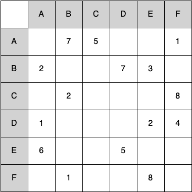

# 7.25. 练习 

**7.25. Exercises**

=== "中文"
    
    1. 画出以下邻接矩阵对应的图。

        <figure markdown="span">
            
        </figure>

    2. 画出以下边列表对应的图。

        | from | to  | cost |
        | ---- | --- | ---- |
        | 1    | 2   | 10   |
        | 1    | 3   | 15   |
        | 1    | 6   | 5    |
        | 2    | 3   | 7    |
        | 3    | 4   | 7    |
        | 3    | 6   | 10   |
        | 4    | 5   | 7    |
        | 6    | 4   | 5    |
        | 5    | 6   | 13   |

    3. 忽略权重，对问题 1 或 2 中绘制的图执行广度优先搜索。

        - 答案 a: O(n)
        - 答案 b: O(n2)
        - 答案 c: O(1)
        - 答案 d: O(n3)

        正确答案: b

        - 反馈 a: O(n) 表示没有嵌套。实际上有几个嵌套的 for 循环。
        - 反馈 b: 正确。两个连续嵌套的 for 循环使得时间复杂度为 O(n2)。
        - 反馈 c: O(1) 表示函数运行时间是常量。由于有多个交织的 for 循环，这不是常量时间。
        - 反馈 d: O(n3) 表示有三个连续嵌套的 for 循环。实际上只有两个嵌套循环。

    4. ``build_graph`` 函数的时间复杂度是多少？

        短答: BigO

    5. 推导拓扑排序算法的时间复杂度。

        短答: BigOTwo

    6. 推导强连通分量算法的时间复杂度。

    7. 展示应用 Dijkstra 算法到问题 1 或 2 中绘制的图的每一步。

    8. 使用 Prim 算法找到问题 1 或 2 中绘制图的最小权重生成树。

    9. 绘制一个依赖图，展示发送电子邮件所需的步骤。对你的图进行拓扑排序。

    10. 将分支因子 $k$ 表示为棋盘大小 $n$ 的函数。

    11. 推导表达骑士巡游问题运行时间的指数基数的表达式。

        短答: DFS

    12. 解释为什么通用 DFS 算法不适合解决骑士巡游问题。

        - 答案 a: O(1)
        - 答案 b: O(n3)
        - 答案 c: O(n)
        - 答案 d: O(n2)

        正确答案: d

        - 反馈 a: O(1) 意味着算法在常量时间内运行。这不正确，因为算法中有多个比较操作。
        - 反馈 b: O(n3) 表示有三个连续的嵌套循环。实际例子中并没有三个嵌套的循环。
        - 反馈 c: O(n) 是线性时间。这个程序运行的时间不会线性增长。
        - 反馈 d: 正确。由于不仅需要比较分支的权重，还需要检查分支是否已经连接，因此算法的时间复杂度是 O(n2)。

    13. Prim 算法的最小生成树的时间复杂度是多少？

    14. 修改深度优先搜索函数以生成拓扑排序。

    15. 修改深度优先搜索以生成强连通分量。

    16. 为 ``Graph`` 类编写 ``transpose`` 方法。

    17. 使用广度优先搜索编写一个算法，确定从每个顶点到所有其他顶点的最短路径。这被称为“所有对最短路径问题”。

    18. 使用广度优先搜索修改第 4 章（递归）的迷宫程序，以找到迷宫的最短路径。

    19. 编写一个程序解决以下问题：你有两个水壶，一个 4 加仑，一个 3 加仑。两个水壶上没有标记。一个泵可以用来装水。你如何在 4 加仑的水壶中得到正好 2 加仑的水？

    20. 将上述问题进行概括，使得解决方案的参数包括每个水壶的大小和要在大水壶中留下的最终水量。

    21. 编写一个程序解决以下问题：三名传教士和三名食人族来到一条河边，发现一只可以容纳两人的小船。每个人都必须过河才能继续旅程。然而，如果食人族在任何一岸上的数量超过传教士，传教士将被吃掉。找出一系列过河的步骤，使得每个人安全到达河的另一边。

=== "英文"
    
    1. Draw the graph corresponding to the following adjacency matrix.
        
        <figure markdown="span">
            
        </figure>
    
    2. Draw the graph corresponding to the following list of edges.
    
               
        | from | to  | cost |
        | ---- | --- | ---- |
        | 1    | 2   | 10   |
        | 1    | 3   | 15   |
        | 1    | 6   | 5    |
        | 2    | 3   | 7    |
        | 3    | 4   | 7    |
        | 3    | 6   | 10   |
        | 4    | 5   | 7    |
        | 6    | 4   | 5    |
        | 5    | 6   | 13   |
    
    3. Ignoring the weights, perform a breadth-first search on the graph drawn for question 1 or 2.
    
    
        - answer a: O(n)
        - answer b: O(n2)
        - answer c: O(1)
        - answer d: O(n3)
        
        correct: b
        
        - feedback a: O(n) would suggest that there is no nesting. There are several nested for loops.
        - feedback b: Correct. The two consecutively nested for loops would dictate that this is in the realm of O(n2).
        - feedback c: O(1) would suggest that the function is constant. Since there are multiple for loops intertwined, it is not in constant time.
        - feedback d: O(n3) would suggest that there are three consecutively nested for loops. There are only two.
       
    4. What is the Big-O running time of the ``build_graph`` function?
    
        shortanswer:: BigO
    
    5. Derive the Big-O running time for the topological sort algorithm.
    
        shortanswer:: BigOTwo
    
    6. Derive the Big-O running time for the strongly connected components algorithm.
    7. Show each step in applying Dijkstra’s algorithm to the graph drawn for question 1 or 2.
    8. Using Prim’s algorithm, find the minimum weight spanning tree for the graph drawn for question 1 or 2.
    9. Draw a dependency graph illustrating the steps needed to send an email. Perform a topological sort on your graph.
    10. Express branching factor $k$ as a function of the board size $n$.
    11. Derive an expression for the base of the exponent used in expressing the  running time of the knights tour.
        
        shortanswer:: DFS
    
    12. Explain why the general DFS algorithm is not suitable for solving  the knight's tour problem.
    
        - answer a: O(1)
        - answer b: O(n3) 
        - answer c: O(n)
        - answer d: O(n2)

        correct: d

        - feedback a: O(1) would mean that the algorithm runs in constant time. This isn't true because there are several comparisons happening in the algorithm.
        - feedback b: O(n3) suggests that there are three consecutively nested loops. If you look at the example algorithm, it is obvious that there are not three nested loops.
        - feedback c: O(n) is linear time. The time it takes for this program to run doesn't grow linearly.
        - feedback d: Correct. Since you are not only comparing the weight of a branch but also if the branch has already been connected to, this would make the Big-O of the algorithm O(n2)
    
    13. What is the Big-O running time for Prim’s minimum  spanning tree algorithm?
    14. Modify the depth-first search function to produce a topological sort.
    15. Modify the depth-first search to produce strongly connected components.
    16. Write the ``transpose`` method for the ``Graph`` class.
    17. Using breadth-first search write an algorithm that can determine the shortest path from each vertex to every other vertex. This is called the “all pairs shortest path problem.”
    18. Using breadth-first search revise the maze program from the Chapter 4 (Recursion) to find the shortest path out of a maze.
    19. Write a program to solve the following problem: you have two jugs, a 4-gallon and a 3-gallon. Neither of the jugs has any markings. There is a pump that can be used to fill the jugs with water. How can you get exactly two gallons of water in the 4-gallon jug?
    20. Generalize the problem above so that the parameters to your solution include the size of each jug and the final amount of water to be left in the larger jug.
    21. Write a program that solves the following problem: three missionaries and three cannibals come to a river and find a boat that holds two people. Everyone must get across the river to continue on the journey. However, if the cannibals ever outnumber the missionaries on either bank, the missionaries will be eaten. Find a series of crossings that will get everyone safely to the other side of the river.