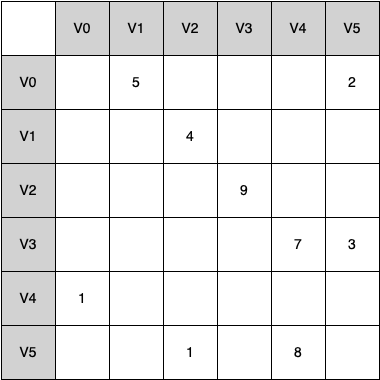

# 7.4. 邻接矩阵

**7.4. An Adjacency Matrix**

=== "中文"

    One of the easiest ways to implement a graph is to use a two-dimensional matrix. In this matrix implementation, each of the rows and columns represents a vertex in the graph. The value that is stored in the cell at the intersection of row $v$ and column $w$ indicates if there is an edge from vertex $v$ to vertex $w$. When two vertices are connected by an edge, we say that they are **adjacent**. `Figure 3` illustrates the adjacency matrix for the graph in `Figure 2`. The value in each cell represents the weight of the edge from vertex $v$ to vertex $w$.
        
        
    <figure markdown="span">
        { width="300" }
        <figcaption markdown="span">Figure 3: An Adjacency Matrix Representation for a Graph </figcaption>
    </figure>
    
    The advantage of the adjacency matrix is that it is simple, and for small graphs it is easy to see which nodes are connected to other nodes. However, otice that most of the cells in the matrix are empty; we can say that this matrix is *sparse*. A matrix is not a very efficient way to store sparse data. In fact, in Python you must go out of your way to even create a matrix structure like the one in `Figure 3`.
    
    The adjacency matrix is a good implementation for a graph when the number of edges is large. But what do we mean by large? How many edges would be needed to fill the matrix? Since there is one row and one column for every vertex in the graph, the number of edges required to fill the matrix is $|V|^2$. A matrix is full when every vertex is connected to every other vertex. There are few real problems that approach this sort of connectivity. The problems we will look at in this chapter all involve graphs that are sparsely connected.

=== "英文"

    One of the easiest ways to implement a graph is to use a two-dimensional matrix. In this matrix implementation, each of the rows and columns represents a vertex in the graph. The value that is stored in the cell at the intersection of row $v$ and column $w$ indicates if there is an edge from vertex $v$ to vertex $w$. When two vertices are connected by an edge, we say that they are **adjacent**. `Figure 3` illustrates the adjacency matrix for the graph in `Figure 2`. The value in each cell represents the weight of the edge from vertex $v$ to vertex $w$.
        
        
    <figure markdown="span">
        { width="300" }
        <figcaption markdown="span">Figure 3: An Adjacency Matrix Representation for a Graph </figcaption>
    </figure>
    
    The advantage of the adjacency matrix is that it is simple, and for small graphs it is easy to see which nodes are connected to other nodes. However, otice that most of the cells in the matrix are empty; we can say that this matrix is *sparse*. A matrix is not a very efficient way to store sparse data. In fact, in Python you must go out of your way to even create a matrix structure like the one in `Figure 3`.
    
    The adjacency matrix is a good implementation for a graph when the number of edges is large. But what do we mean by large? How many edges would be needed to fill the matrix? Since there is one row and one column for every vertex in the graph, the number of edges required to fill the matrix is $|V|^2$. A matrix is full when every vertex is connected to every other vertex. There are few real problems that approach this sort of connectivity. The problems we will look at in this chapter all involve graphs that are sparsely connected.